Sifumim Shrine (**Proving Grounds: Flow**) in Zelda: Tears of the Kingdom is a shrine located in the East Necluda region and is one of 152 shrines in TOTK (see all shrine locations). This page contains a guide for how to locate and enter the shrine, a walkthrough for the shrine itself, and puzzle solutions as well as treasure chest locations for the TotK Sifumim Shrine. 

### Treasure and Rewards

  * Captain III Reaper

## Sifumim Shrine Location

Sifumim Shrine (Proving Grounds: Flow) is located on the edge of the hill overlooking the ruined village, Lurelin Village. It’s west of Mount Dunsel and to the northeast of Tuft Mountain. 

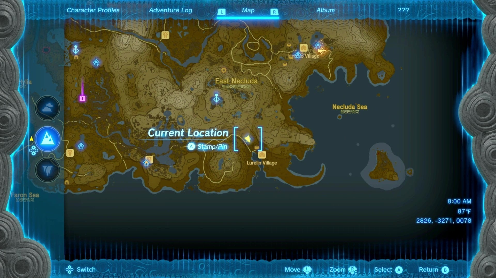

  * Coordinates: 2826, -3271, 0078

## Sifumim Shrine Walkthrough

Sifumim Shrine is a combat shrine. It’s a shrine that tests your ability to eliminate enemies on various different platforms through different techniques. 

Upon entering the shrine, your outside items and gear will be stripped from you and you’ll pick up an old wooden shield, a long stick, and a wooden stick. 

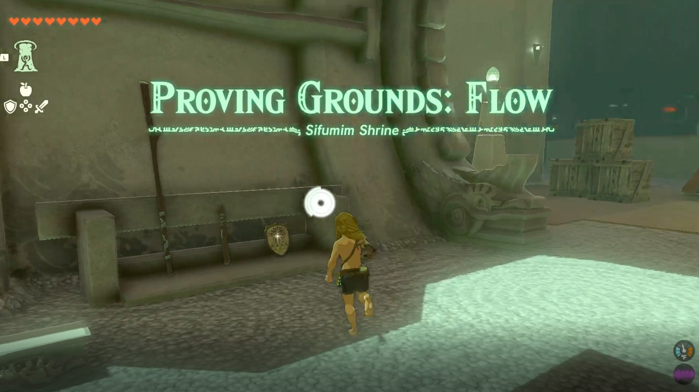

The shrine is flooded with water with a few Constructs floating around on makeshift rafts. You can hop onto the rafts and Ascend to their platforms and whack them with your stick. The Constructs will drop an old wooden bow, arrows, Soldier Construct Horns, and shock fruit. 

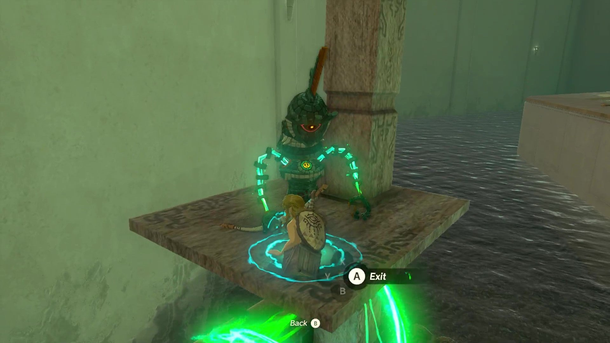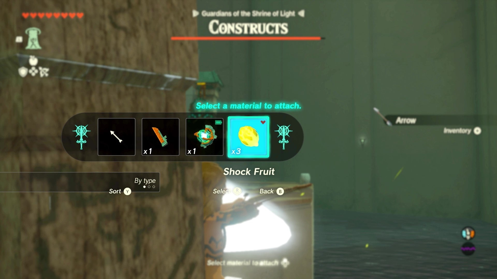

You can fuse the Soldier Construct Horn to your sticks and use that as a weapon. 

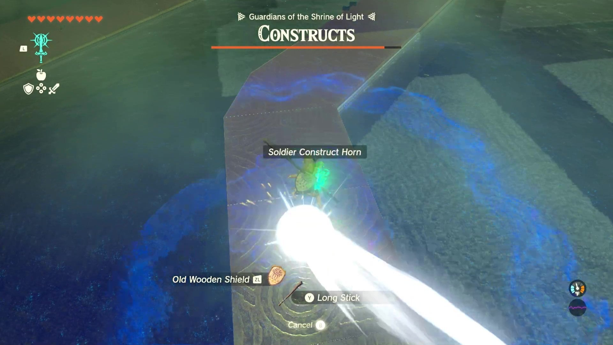

You can dive into the water and swim to the side of the main platform and shoot the Constructs there with your bow and arrows fused with the shock fruit. 

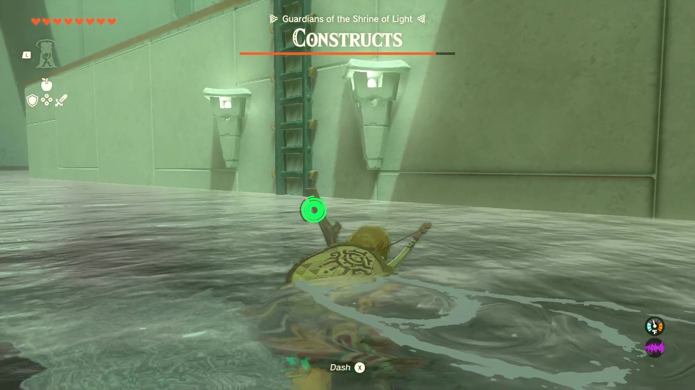

If you knock the Constructs into the water, they’ll immediately be defeated. There are four Constructs on different rafts in the water surrounding the platform then two more on the upper and lower parts of the middle platform grounds. 

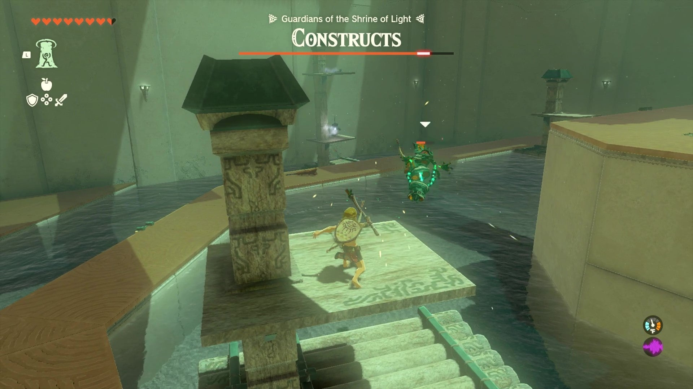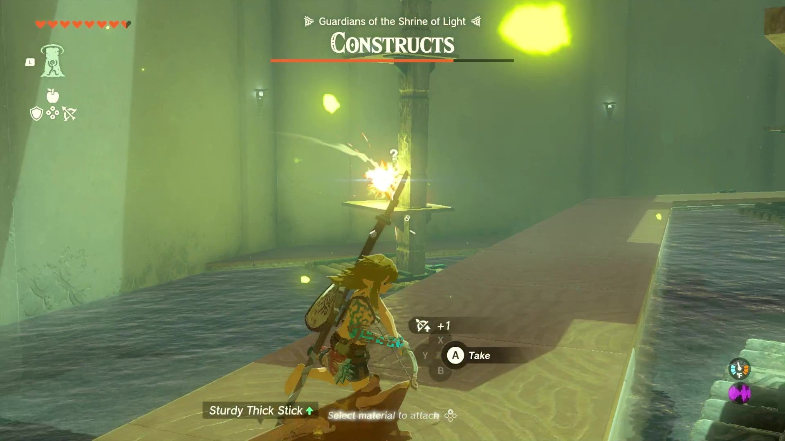

Use the ladder on the side of the platform to knock the Construct onto the lower ground, or just defeat it, and once you beat the last two on the solid platform, you’ll have completed the shrine. 

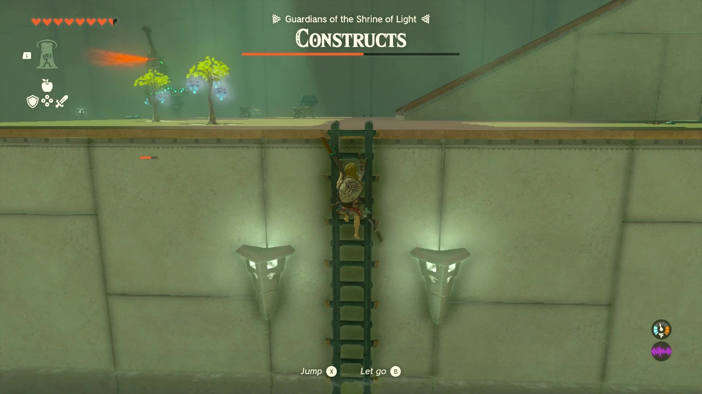

There are plenty of items to fuse your sticks with in this shrine, including wooden spikes and a giant spiked ball on the ramp leading up to the end of the shrine, so use whatever you feel comfortable with. 

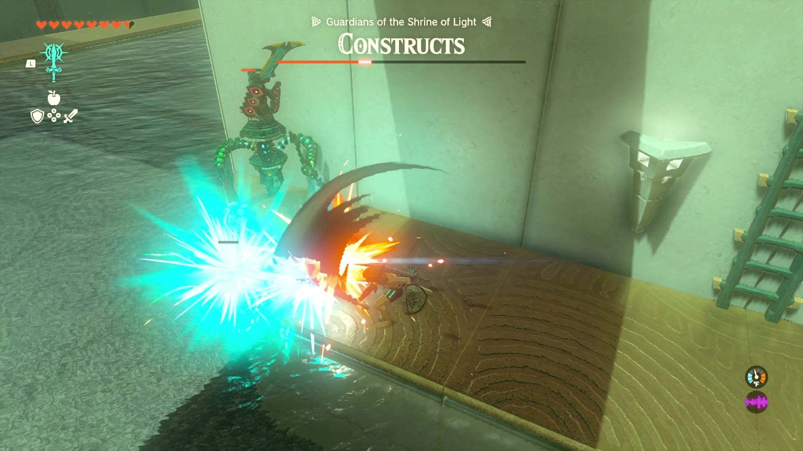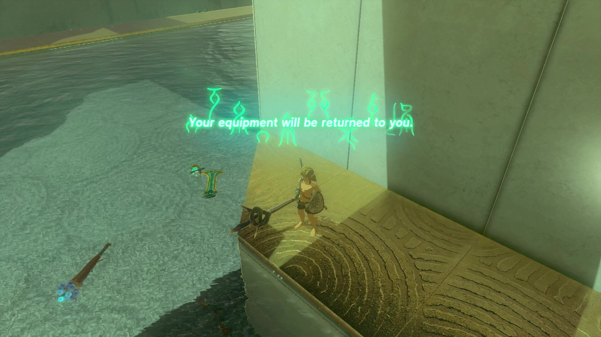

We used what was immediately available. Once you defeat the final construct, the shrine will give you your equipment back and you can run up the ramp to the open gate. The treasure chest will reward you a Captain III Reaper with an attack score of 37 and you can move forward to get your Light of Blessing and complete the shrine. 

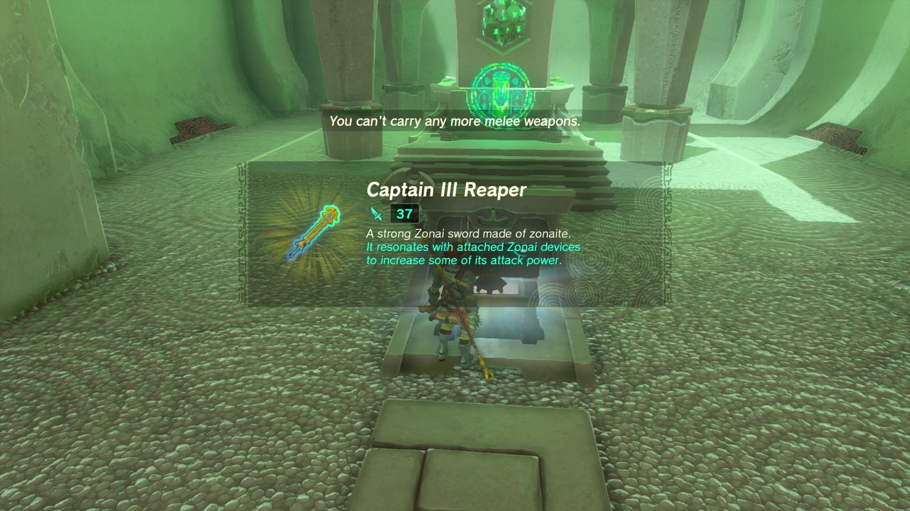

Sifumim Shrine

Congrats on solving the shrine and earning a Light of Blessing! Click or tap here to return to the rest of the Shrine Guides. You can also check out which shrines are nearby with our shrine map filter on our complete map of Hyrule.

### Up Next: Walkthrough

Previous

About IGN's Zelda TotK Guide Writers

Next

Walkthrough

### Top Guide Sections

  * Walkthrough
  * Zelda: Tears of The Kingdom Switch 2 Edition Guide
  * Zelda Notes Voice Memories
  * List of Side Quests and Side Adventures

### Was this guide helpful?

Leave feedback

Go to comments