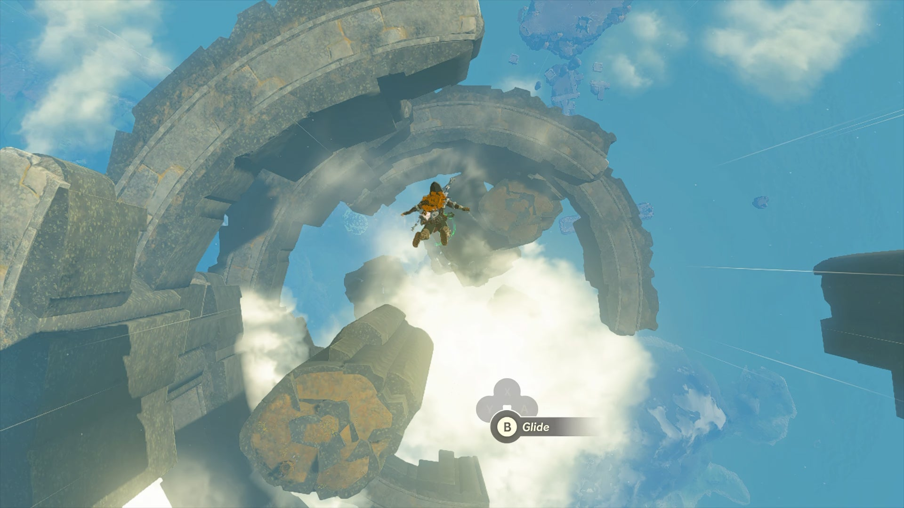
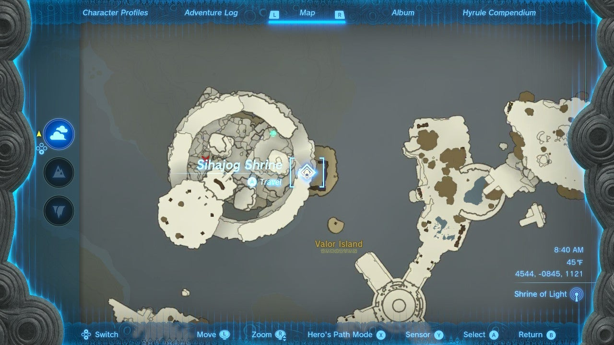
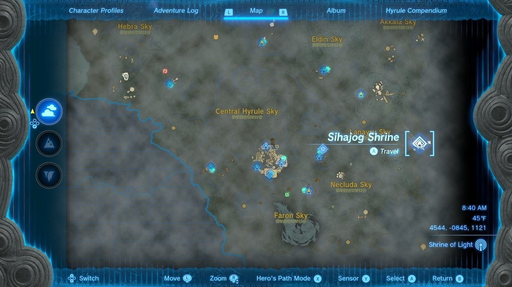
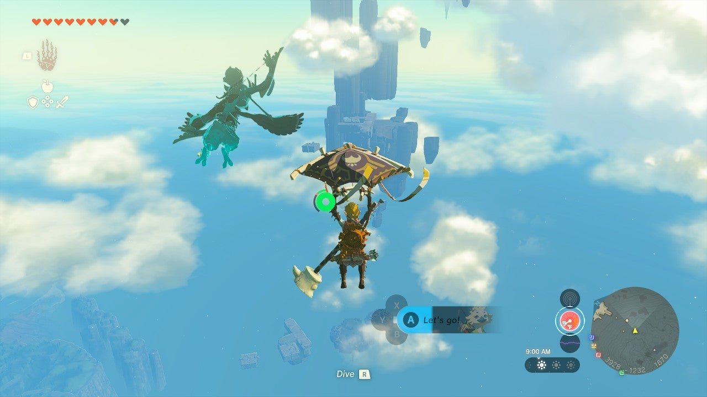
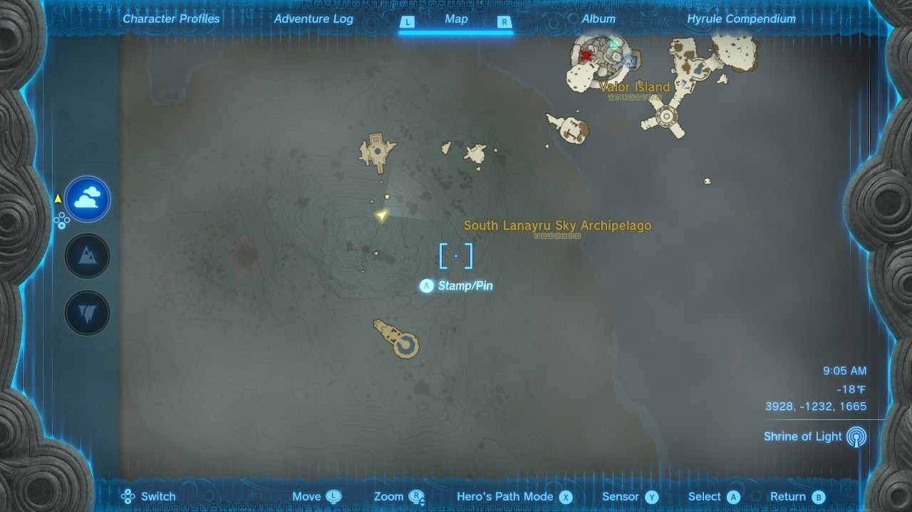
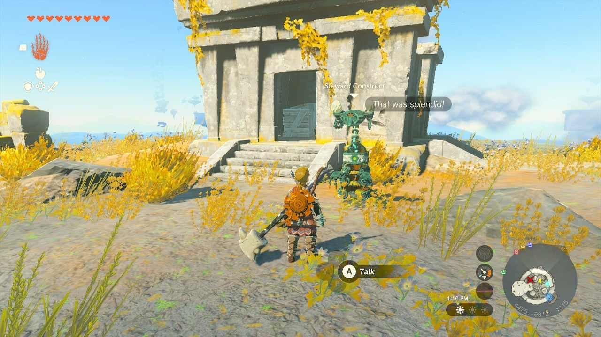
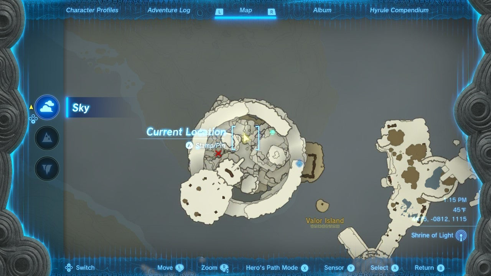
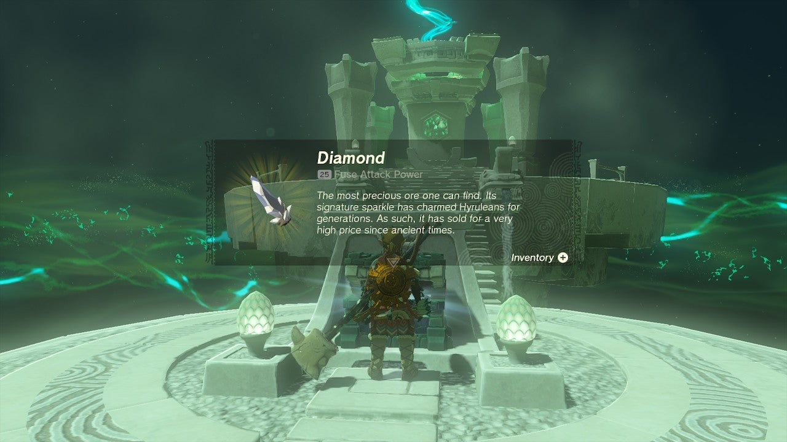

Sihajog Shrine (**Rauru’s Blessing**) in Zelda: Tears of the Kingdom is a shrine located in the Lanayru Sky in the South Lanayru Sky Archipelago and is one of 152 shrines in TOTK (see all shrine locations). Sihajog Shrine can only be accessed after completing the initial **Dive Ceremony challenge**. 

### Treasure and Rewards

  * Diamond

## Sihajog Shrine Location

From the Mount Lanayru Skyview Tower, you can paraglide straight northeast to the bottom of a very tall stack of islands – at the bottom is the island with the Sihajog Shrine is Valor Island. However, you won’t be able to see the Shrine yet. 

  * Coordinates: 4544, -0845, 1121

## The Dive Ceremony Challenge

Approach the **Steward Construct on Valor Island**. It's sitting by a pool. Talk to it and it will send you to the top of the Valor Island chain. Activate the green disk here. 

This activates the green ring challenge on the edge of the top island. You can glide and dodge your way down to the pool below to open the Dive Ceremony challenge here. This creates the nearby Sihajog Shrine. Walk inside to get your Diamond. 

Sihajog Shrine

Note that the Dive Ceremony unlocks a piece of the **Glider Suit**. 

Congrats on solving the shrine and earning a Light of Blessing! Click or tap here to return to the rest of the Shrine Guides. You can also check out which shrines are nearby with our shrine map filter on our complete map of Hyrule.

### Up Next: Walkthrough

Previous

About IGN's Zelda TotK Guide Writers

Next

Walkthrough

### Top Guide Sections

  * Walkthrough
  * Zelda: Tears of The Kingdom Switch 2 Edition Guide
  * Zelda Notes Voice Memories
  * List of Side Quests and Side Adventures

### Was this guide helpful?

Leave feedback

Go to comments