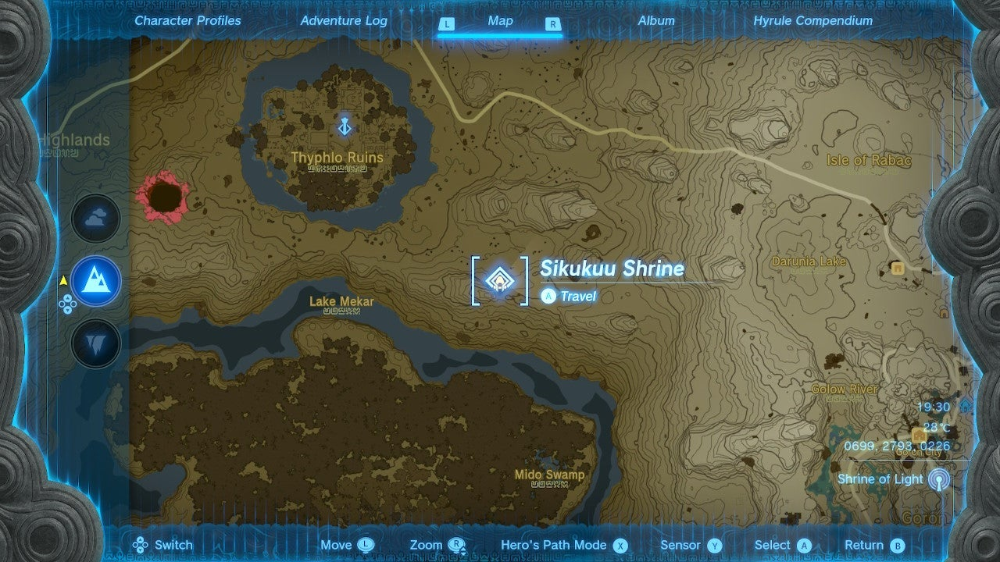
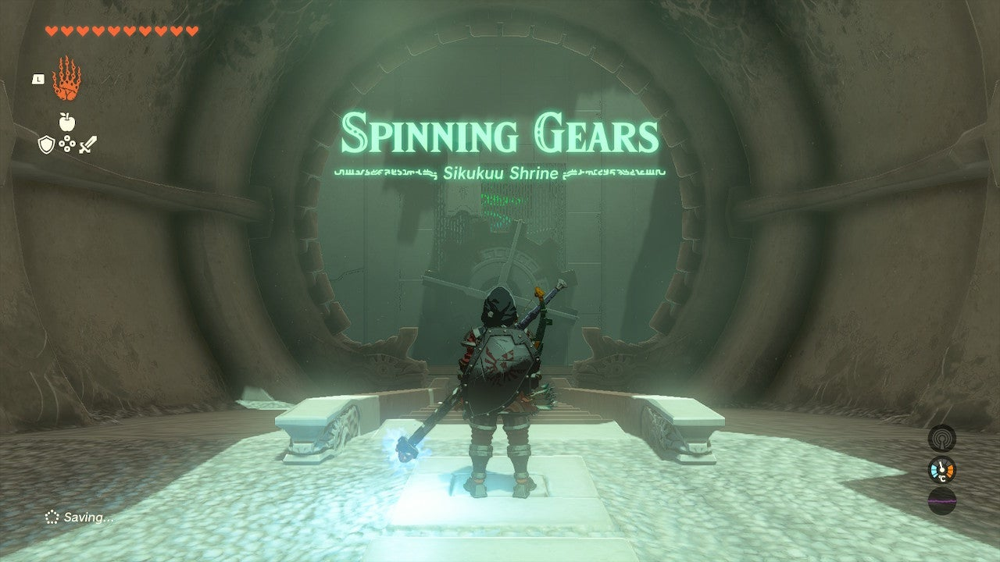
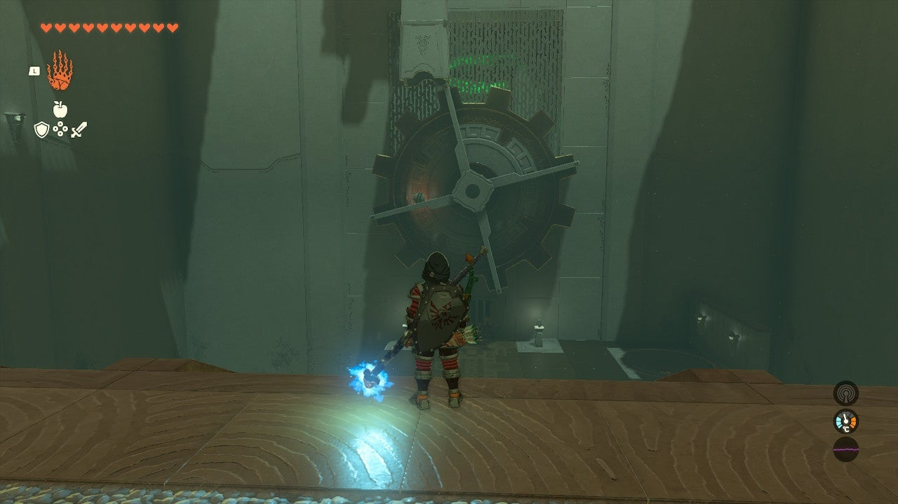
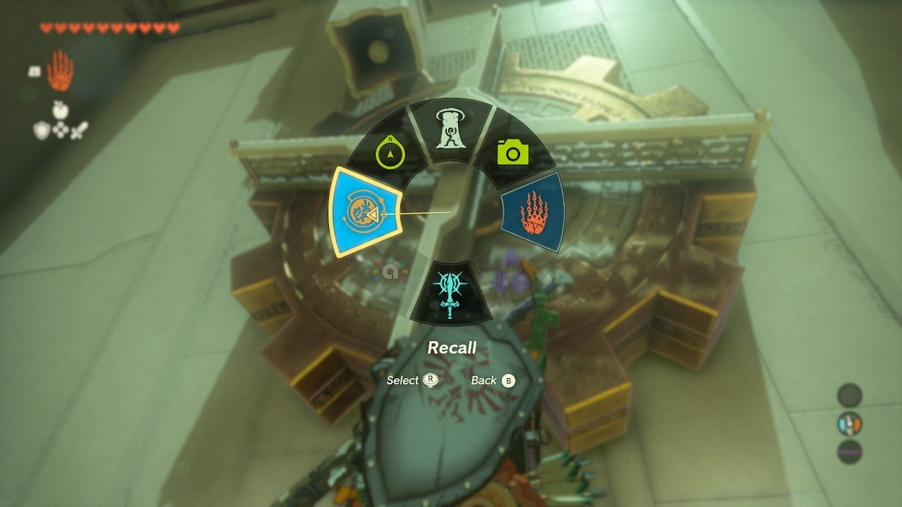
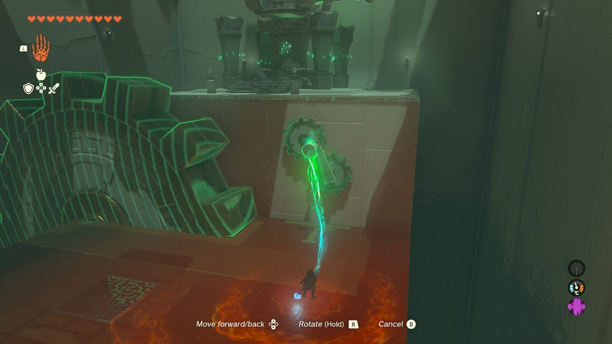
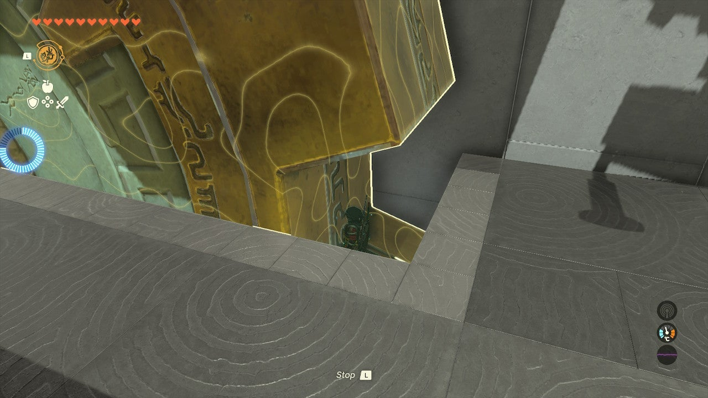
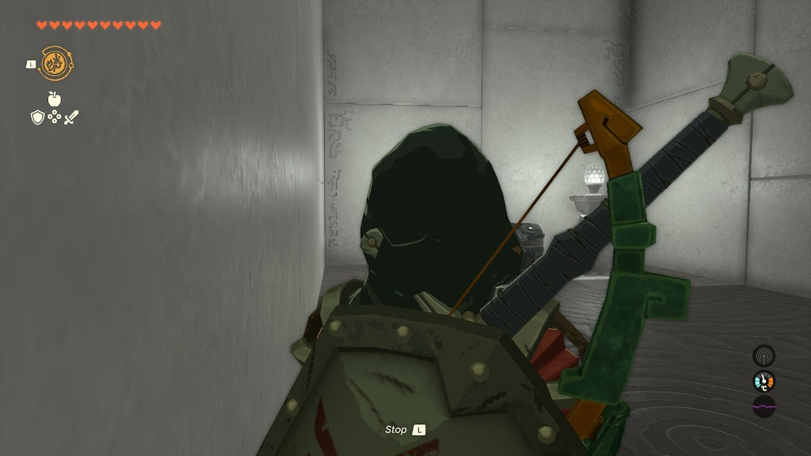
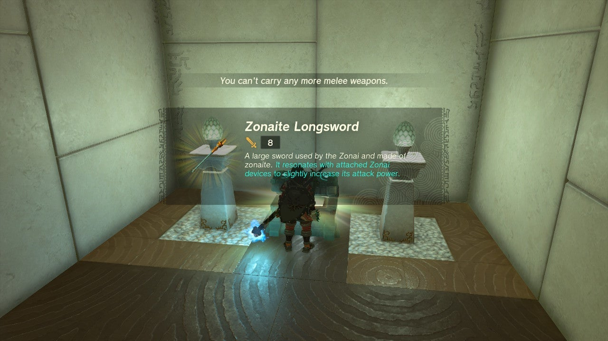
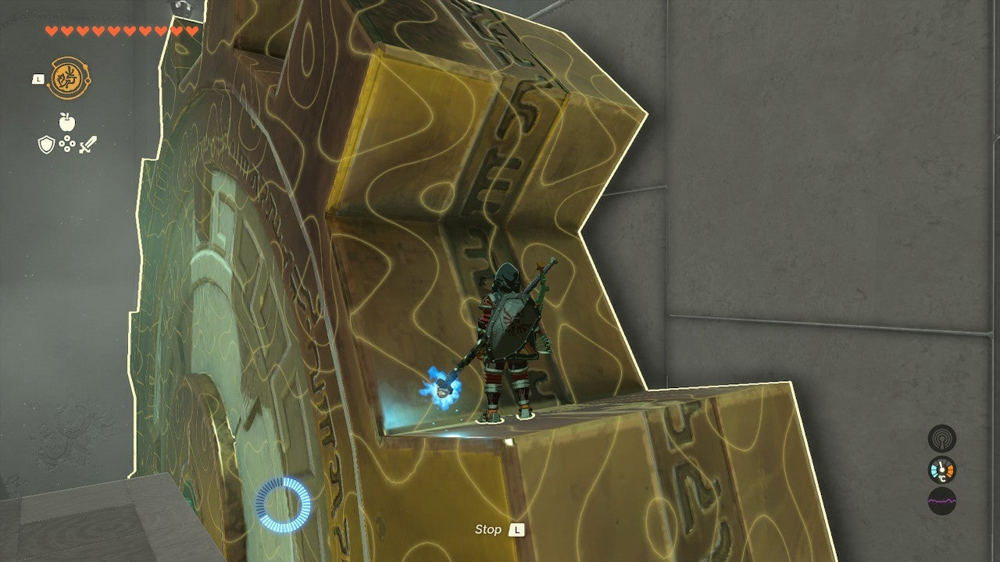
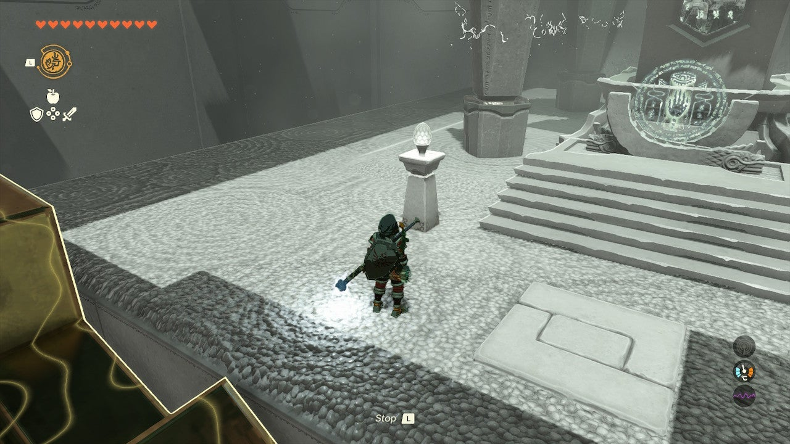

Sikukuu Shrine (**Spinning Gears**) in The Legend of Zelda: Tears of the Kingdom is a shrine located in the Central Hyrule Region and is one of 152 shrines in TOTK (see all shrine locations). This page contains a guide for how to locate and enter the shrine, a walkthrough for the shrine itself, and puzzle solutions as well as treasure chest locations for the TotK Sikukuu shrine. 

### Treasure and Rewards

  * **Zonaite Longsword**

##  Sikukuu Shrine Location

Sikukuu Shrine is north of the Great Hyrule Forest which you will have to circumvent to reach the shrine. It’s just southeast of the Thyphlo Ruins and in plain sight from the ruins. 

  * **Coordinates:** 0699, 2793, 0226

## Sikukuu Shrine Walkthrough

The first area of the Sikukuu Shrine has a large wheel rotating clockwise with a single ball dropping on the left side. 

A target is on the right side. Simply equip Recall from the L menu and use it on the wheel. This will cause it to rotate counter-clockwise and deposit the ball in the hole. 

In the next room the exit is just above the ledge, and a wheel and a crank are in plain sight. What’s not in plain sight is a Treasure Chest, which is below the floor. 

## Treasure Chest Location

Use your Ultrahand to turn the crank counter-clockwise. Tune it three full turns. Then, use Recall on the wheel, and this will send it moving back in the other direction. Step on the right side and ride it down to the chest, which contains a **Zonaite Longsword**. 

Now, Ascend to the surface. 

To solve the wheel puzzle and reach the exit, you need to rotate the wheel clockwise with the crank, using Ultrahand. This will allow you to use Recall to reverse the motion you just applied – three or four full turns will do. 

Ride the teeth of the wheel to the exit. 

Sikukuu Shrine

Congrats on solving the shrine and earning a Light of Blessing! Click or tap here to return to the rest of the Shrine Guides. You can also check out which shrines are nearby with our shrine map filter on our complete map of Hyrule.

### Up Next: Walkthrough

Previous

About IGN's Zelda TotK Guide Writers

Next

Walkthrough

### Top Guide Sections

  * Walkthrough
  * Zelda: Tears of The Kingdom Switch 2 Edition Guide
  * Zelda Notes Voice Memories
  * List of Side Quests and Side Adventures

### Was this guide helpful?

Leave feedback

Go to comments