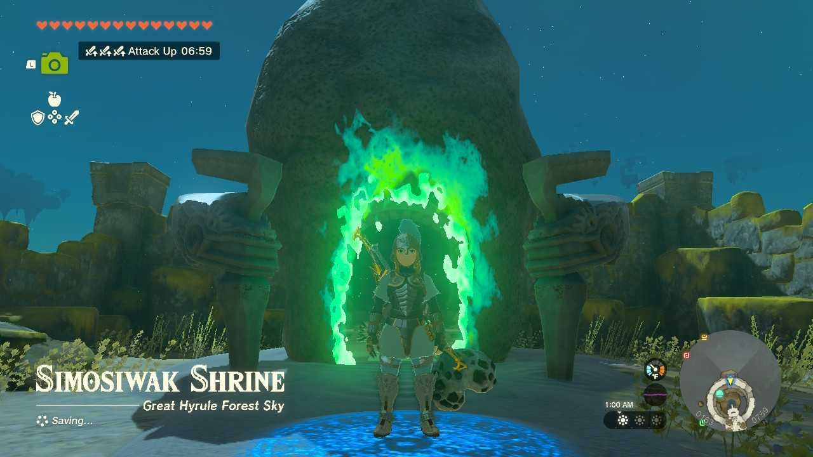
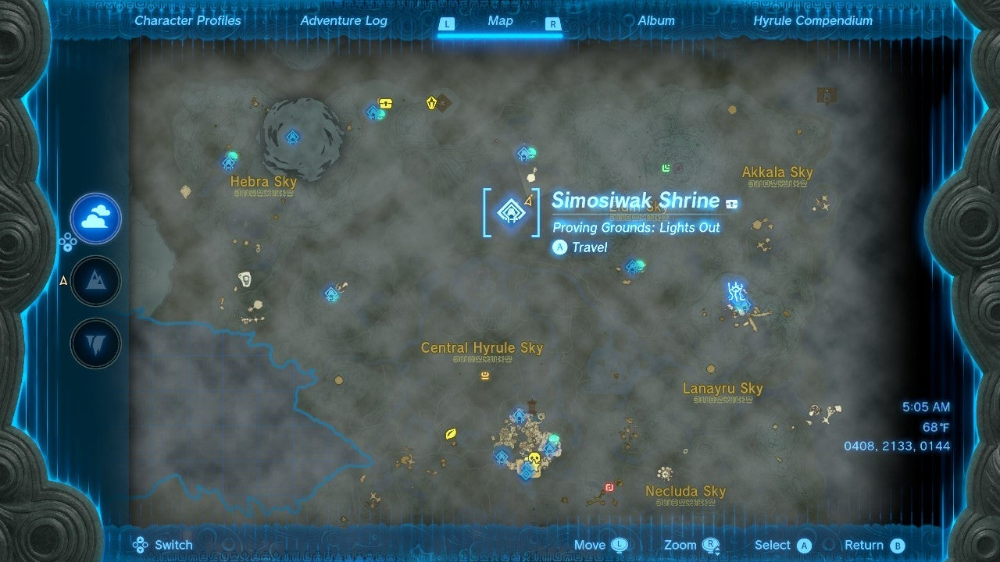
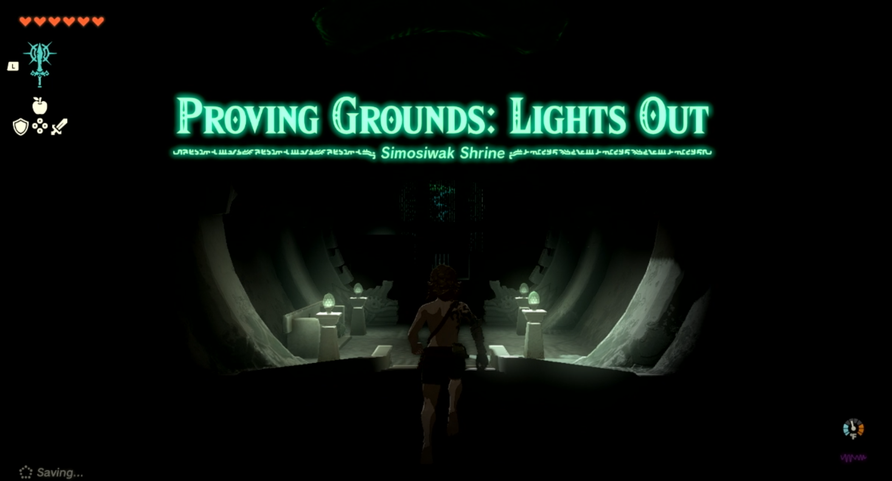
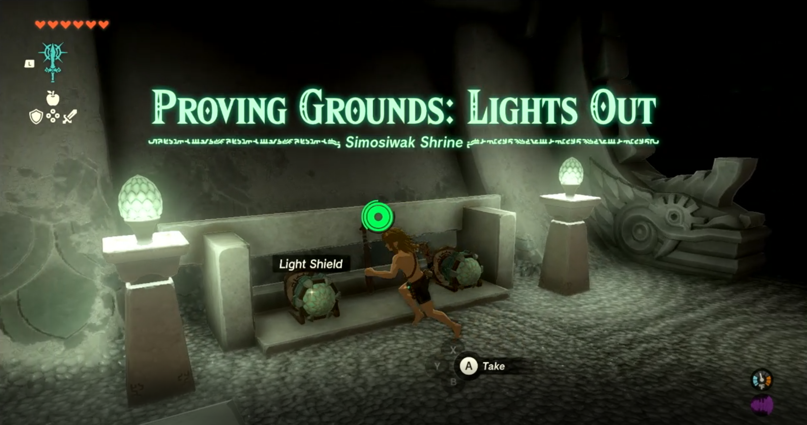
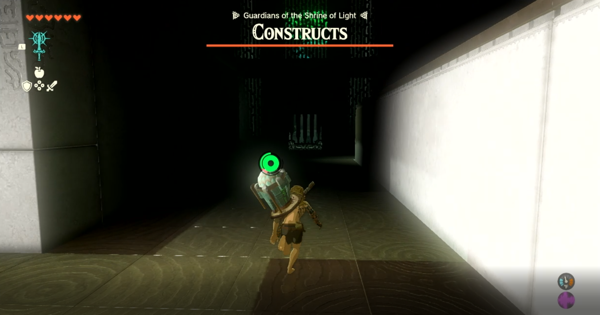
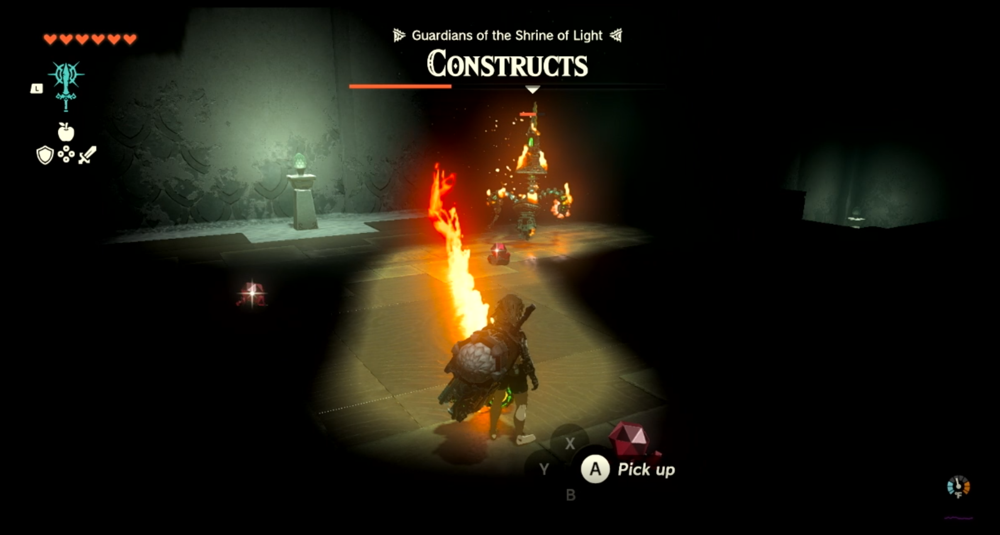
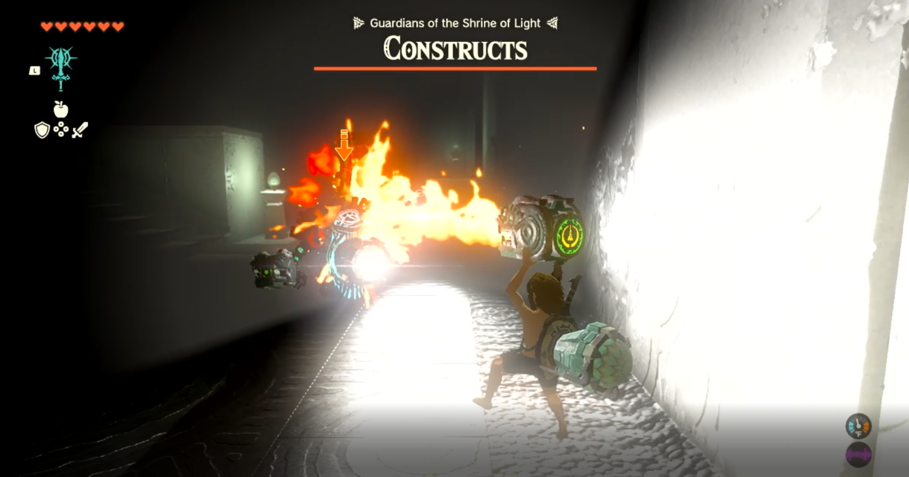
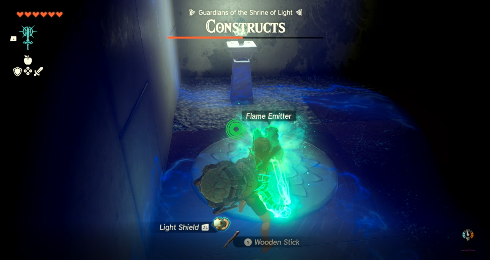
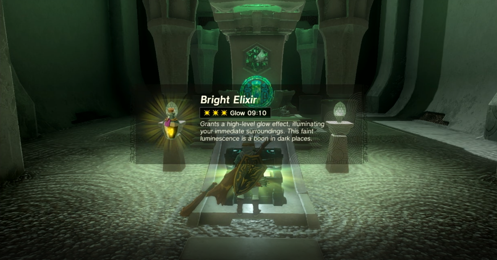
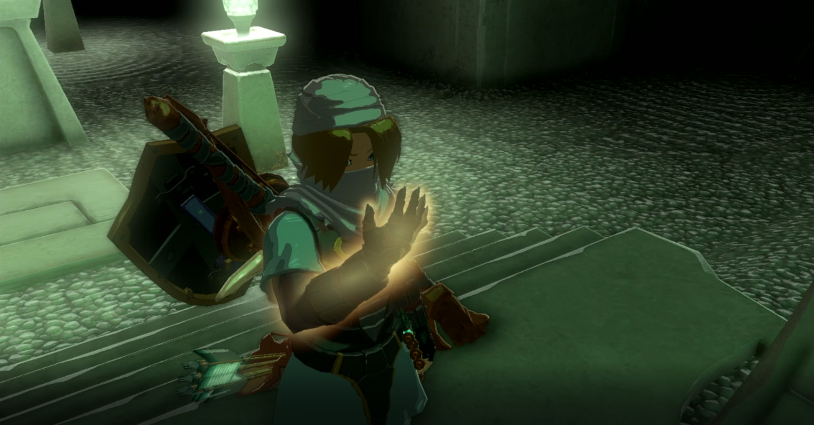

Simosiwak (Proving Ground: Lights Out) in The Legend of Zelda: Tears of the Kingdom is a shrine located**** atop an island in the sky above the Great Hyrule Forest, in the North Hyrule Sky Archipelago. This page contains a guide for how to locate and enter the shrine, a walkthrough for the shrine itself, and puzzle solutions as well as treasure chest locations for the TotK Simosiwak shrine. 

### Treasures and Rewards

  * **Bright Elixir**

##  Location/How to Reach

To unlock the shrine you will need to reach Bravery Island in the Great Hyrule Forest Sky and talk with a construct who will challenge you to dive through a series of rings while falling through the sky. Simply pass through all the rings for the Simosiwak Shrine to appear. It’s Coordinates are **0163,1972,0759.**

If you have unlocked the Mayam Shrine you can use that to easily reach Bravery Island by spinning the launcher until it faces southwest towards Bravery Island. You will know which one it is as it sits directly below a group of semi circular islands. See our Mayam Shrine Guide for how to find and unlock that one. 

**(Bravery Island is also a great place to harvest Dazzlefruits if you need them)**

##  Walkthrough and Puzzle Solutions

The Simosiwak Shrine is a proving grounds trial so it will remove all your items requiring you to use only what you can find in the Shrine. Beyond the entrance of the shrine it is dark so you will need to make use of the two light shields the shrine provides you to find your way while you fight your way through a small room with 3 aggressive constructs.****

We recommend heading straight down the path at the start until you can turn right, in the corner their should be a Flame emitter, either attach it to one of your weapons or simply hit it and carry it around as it won’t reduce your battery and gives you better range for attacking constructs then the other weapons in the shrine. You may have also drawn the attention of the other constructs, if they have started to chase you take them out first then continue up the staircase to the rubies and the construct. 

Near where you got the Flame emitter there should be staircase follow it up to some rubies on the ground as well as a construct with a flame rod, defeat the construct and pick up the rubies. 

Next head back down the stair case you came up, it should be on the side near the the altar. Head to the opposite end of the room you should see a patrolling construct with a light shield and a flame emitter of its own. 

Take it down and pick up its weapon and shield to replace any light shields that may have been destroyed by this point. There should also be a spare flame emitter to attach to your stick. 

If you haven't taken out all three targets, head back towards the entrance and turn right, there should be an L shaped wall and in the corner of that wall will be another Long stick and shield should you need them. 

There should also be one more construct patrolling on the opposite side of this wall take it down to drain the remaining life bar and unlock the door to a chest containing a Bright Elixir and the altar for your Light of Blessing. 

Simosiwak Shrine

Congrats on solving the shrine and earning a Light of Blessing! Click or tap here to return to the rest of the Shrine Guides.

### Up Next: Walkthrough

Previous

About IGN's Zelda TotK Guide Writers

Next

Walkthrough

### Top Guide Sections

  * Walkthrough
  * Zelda: Tears of The Kingdom Switch 2 Edition Guide
  * Zelda Notes Voice Memories
  * List of Side Quests and Side Adventures

### Was this guide helpful?

Leave feedback

Go to comments