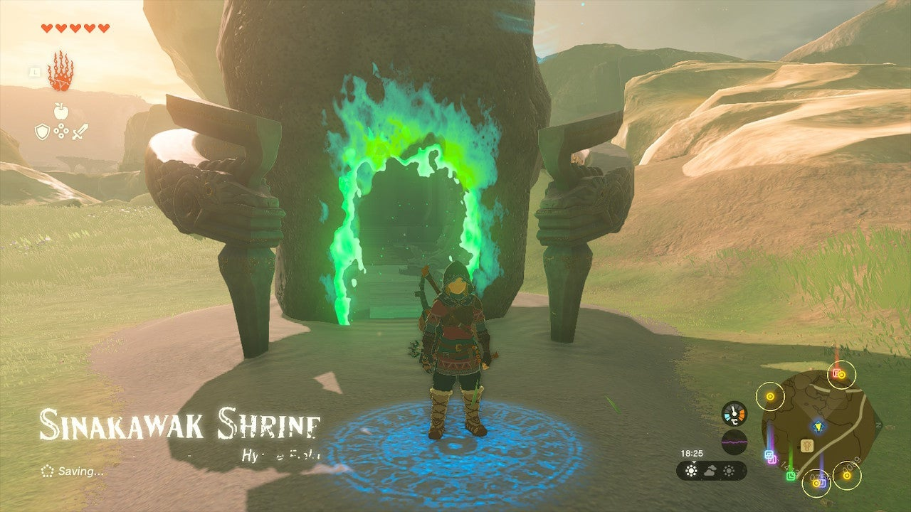

  
Sinakawak Shrine (An Uplifting Device) in The Legend of Zelda: Tears of the Kingdom is a shrine located in the Central Hyrule Region. This page contains a guide for how to locate and enter the shrine, a walkthrough for the shrine itself, and puzzle solutions as well as treasure chest locations for the Sinakawak shrine. 

### Treasure and Rewards

  * **Opal**

##  Location/How to Reach

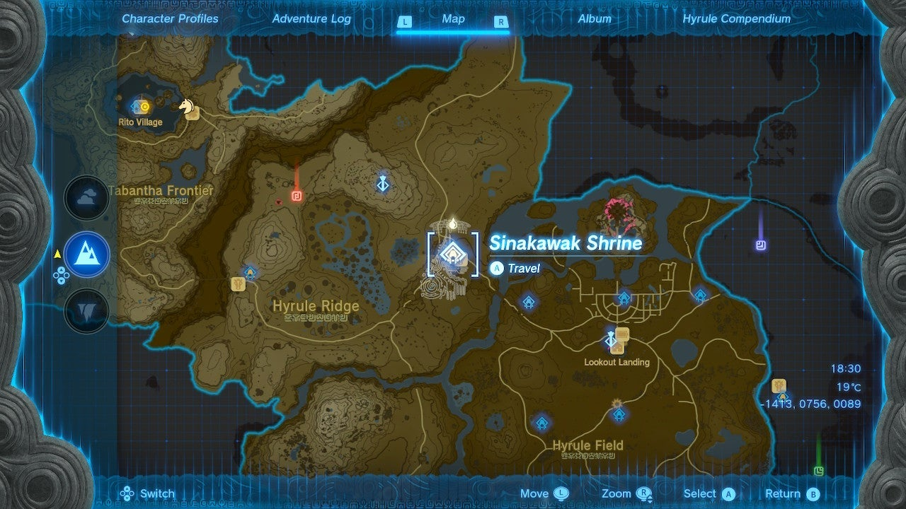

Sinakawak Shrine is located in the Central Hyrule Region near New Serrene Stable and serves as the warp point for the stable. It is southeast of Lindor’s Brow Skyview Tower and northeast of Lookout Landing. 

  * Coordinates: -1372, 0749, 0086

## Walkthrough and Puzzle Solutions

In the first room of Sinawak shrine you will find a few balloons, torches, and boards. Try not to let the lit torches go out, if you do, you can relight one from another using the hand held torch on the ground to the right. You need to build a hot air balloon! 

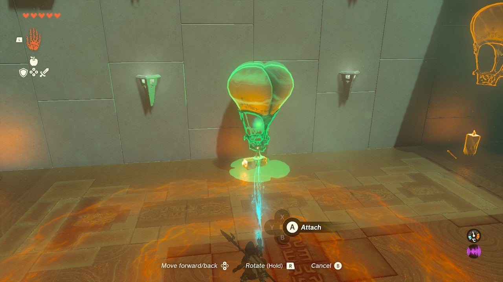

Grab a square board from the left side and set it against the tall back wall. Now, attach a balloon to the center of it. 

Stand on the board next to the balloon and use Ultrahand to move a torch, in its upright position towards your balloon and platform combo. While standing on it, either attach or just hold the torch in place next to the balloon. 

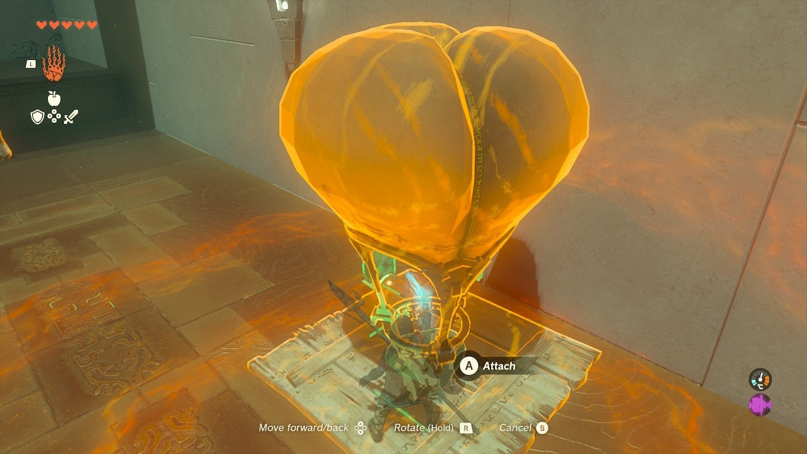

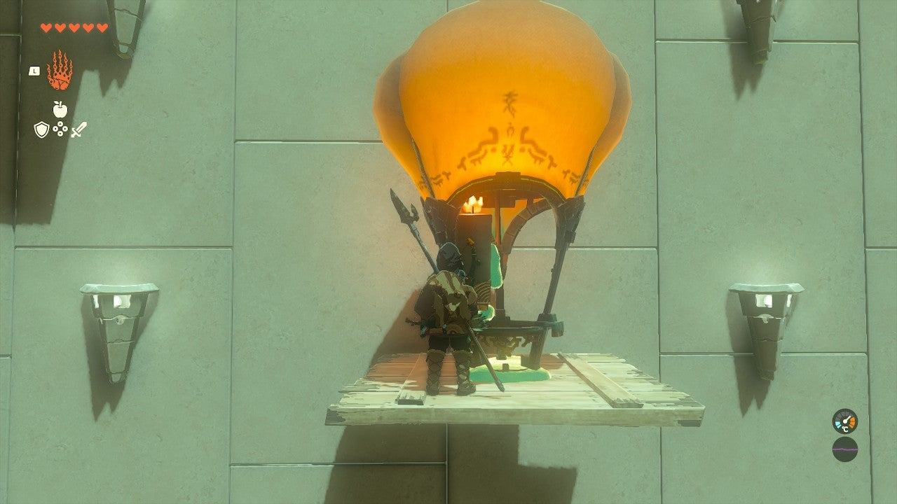

Drop or attach the torch and jump off when you reach the ceiling. Now, grab the torch and drop it below. If you do this right it will stay lit, but if not you can use a Fire Fruit or flint and wood and a torch to relight it, among other things. 

The locked gate ahead can only be opened via a pressure switch above it, on the overhang. It’s orange and glowing. 

Move a balloon in front of the door. Place a lit torch inside of it and attach it. This will float up and hit the switch. 

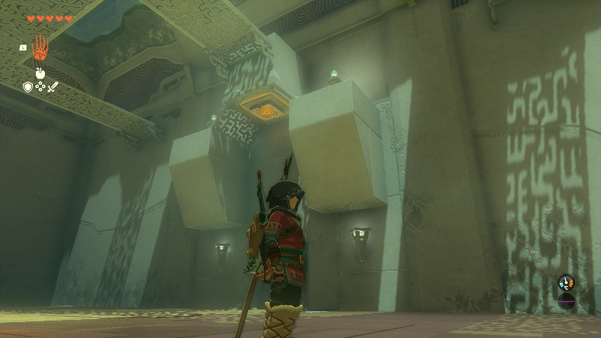

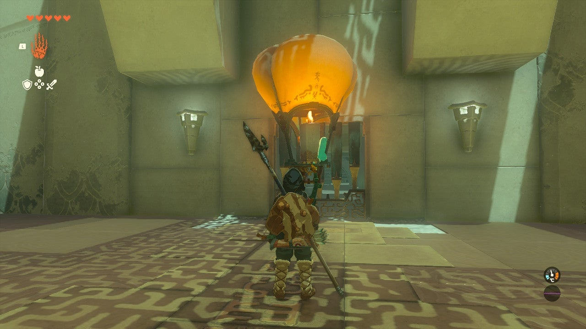

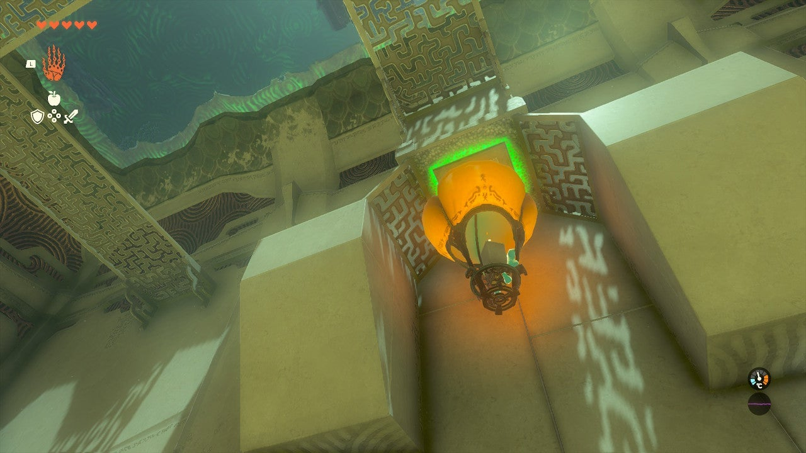

  
The next massive room has the closed gate leading to the exit, two spheres in a pit below, and lots of hot air balloons. Note that from the lower area with the spheres you can freely use Ascend to travel up to the exit platform. 

Your goal is to get the small sphere into the divot/impression outside of the exit door. To do this, follow these steps: 

Attach a balloon to the small sphere. DO NOT MOVE THE SPHERE from its resting place. If you do, move it back. Attach a balloon directly to the sphere.Move a candle into the balloon and attach it. 

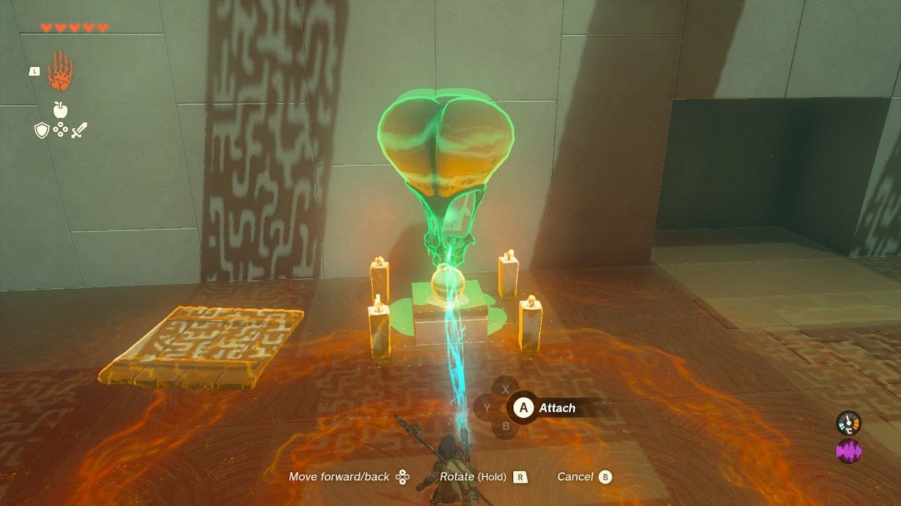

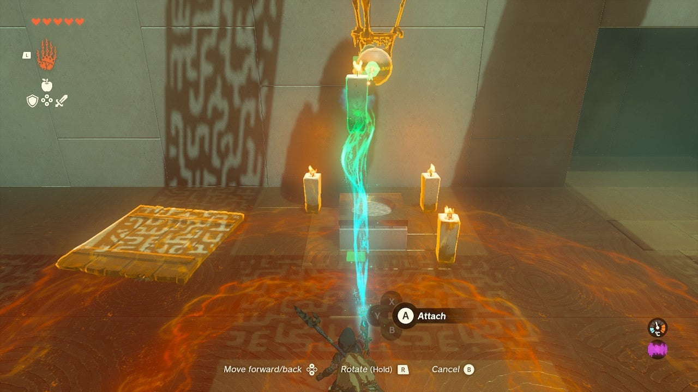

  
Ascend above, the balloon should be caught on the metal catwalk above. Grab the balloon and move it over the divot/impression and wiggle the stick to remove it from the contraption. When it rolls into the hole, the door will open. 

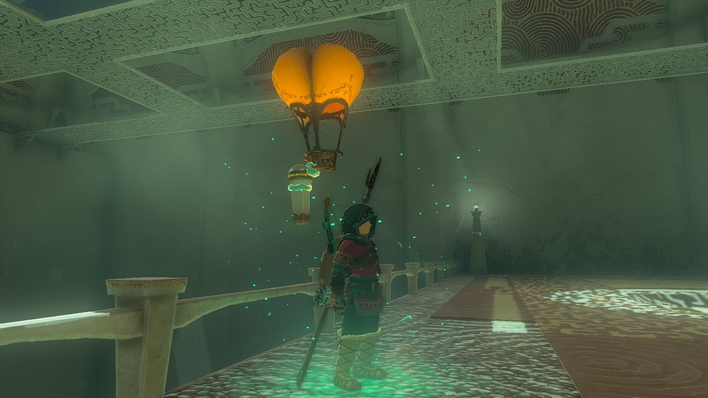

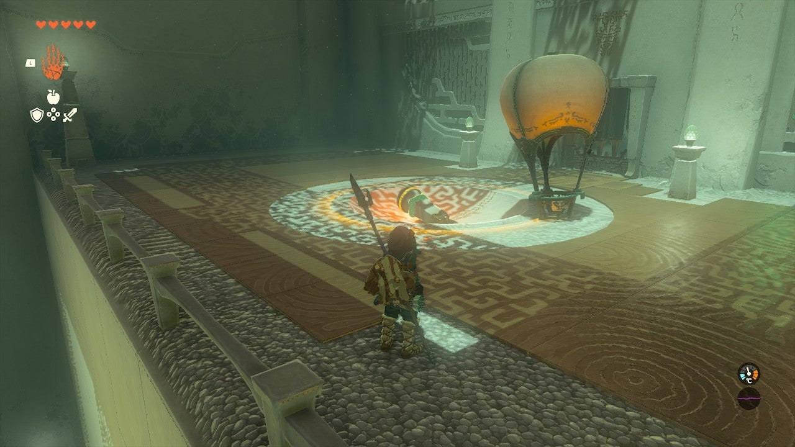

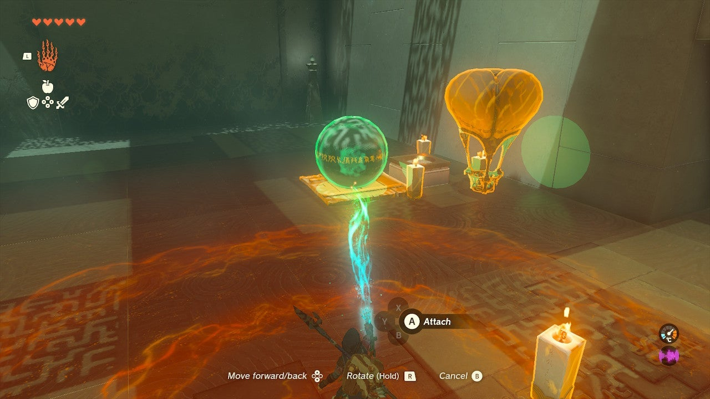

Do not leave yet! 

## Treasure Location

The treasure chest is behind a second gate that can be opened by getting the larger sphere up to the divot/impression next to it. To do this: 

  * Attach the large sphere to the square wood platform. Do this right next to the big wall leading up to your goal.
  * Attach at least two balloons to the platform and/or sphere.
  * Move candles inside each balloon.
  * It’s slow going with two balloons but it works!
  * Ascend up to the top platform by the divot/impression.
  * When the sphere arrives, grab it with Ultrahand and detach it, dropping it in the hole.

Claim your ‘’’Opal’’’ in the treasure chest! 

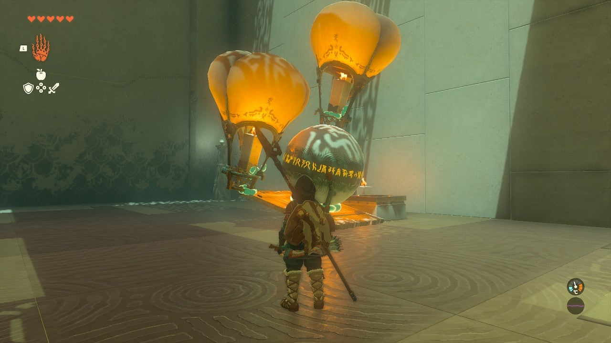

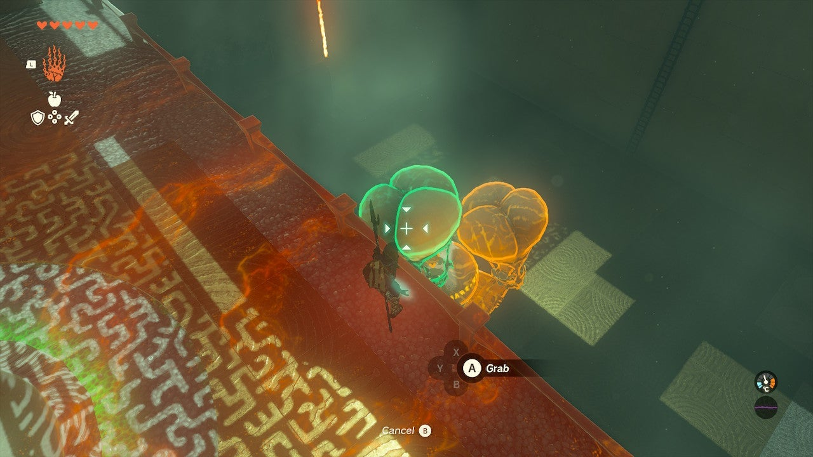

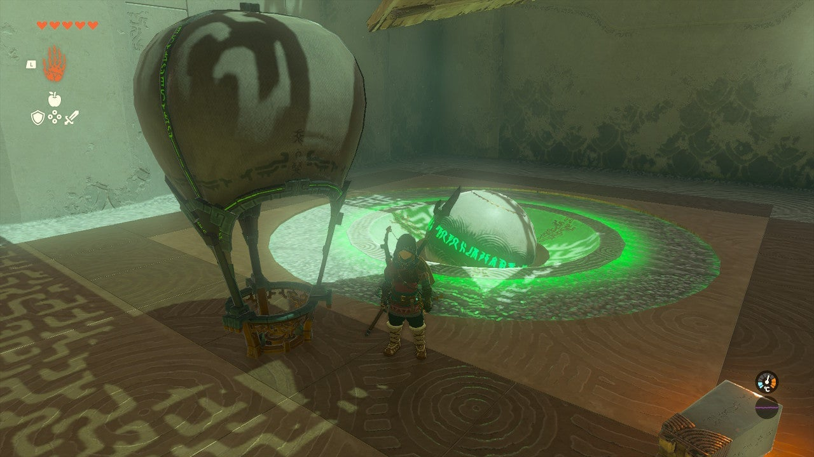

Exit the shrine. 

Sinakawak Shrine

Congrats on solving the shrine and earning a Light of Blessing! Click or tap here to return to the rest of the Shrine Guides.

### Up Next: Walkthrough

Previous

About IGN's Zelda TotK Guide Writers

Next

Walkthrough

### Top Guide Sections

  * Walkthrough
  * Zelda: Tears of The Kingdom Switch 2 Edition Guide
  * Zelda Notes Voice Memories
  * List of Side Quests and Side Adventures

### Was this guide helpful?

Leave feedback

Go to comments