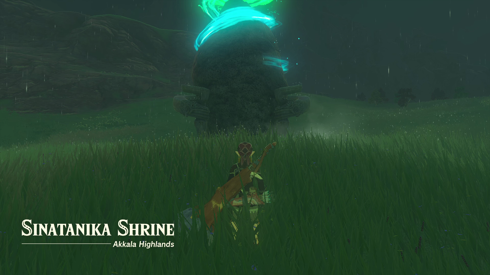
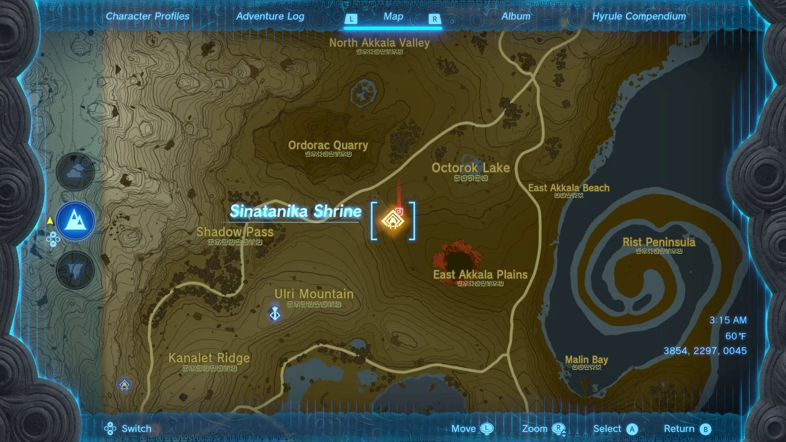
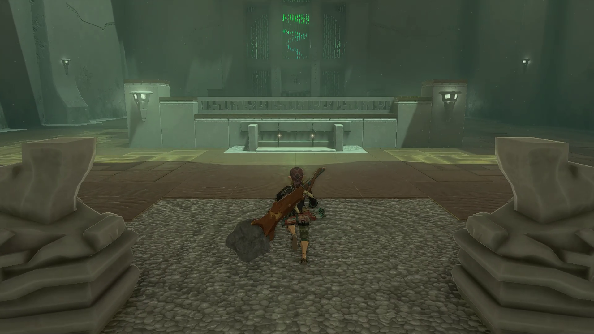
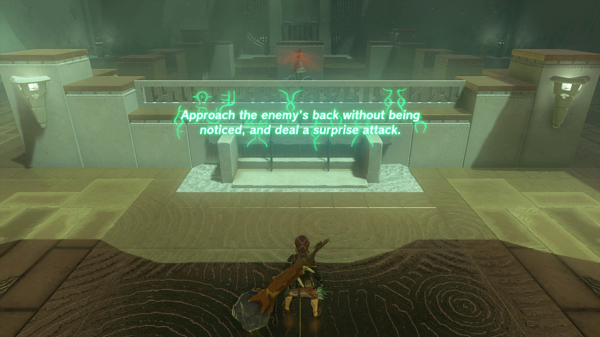
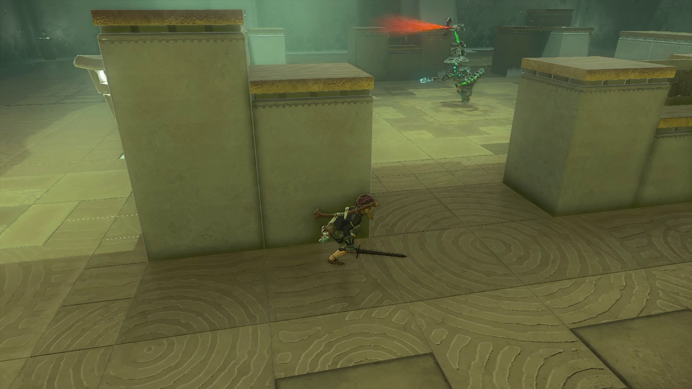
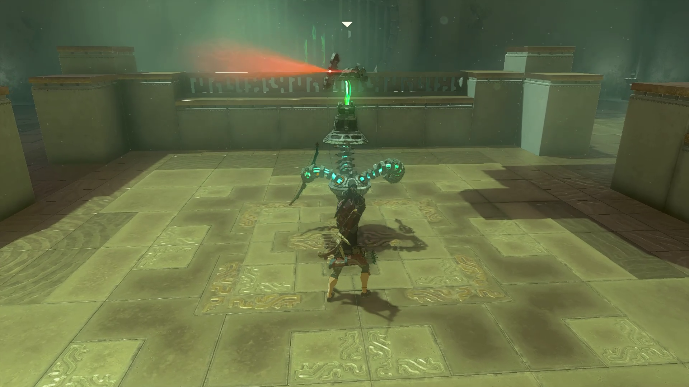
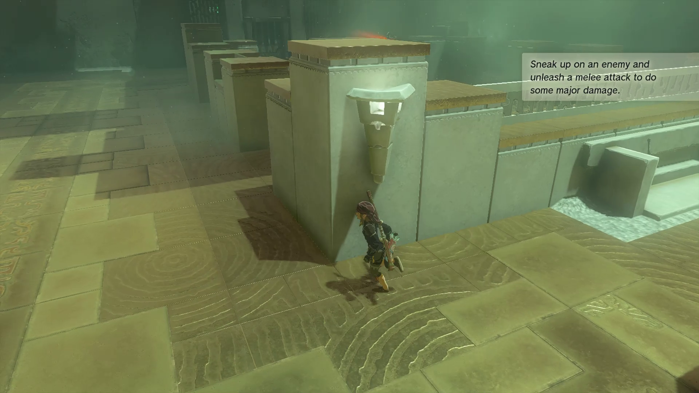
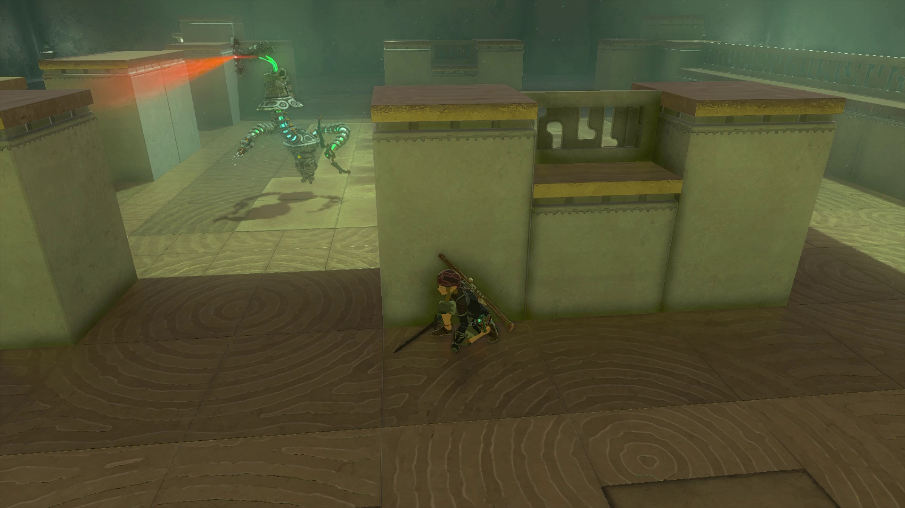
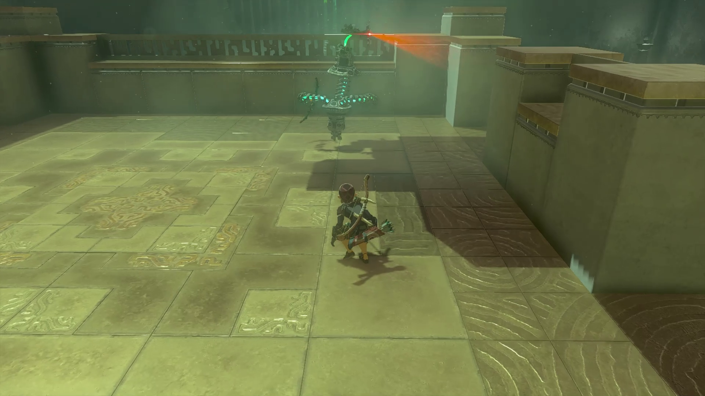
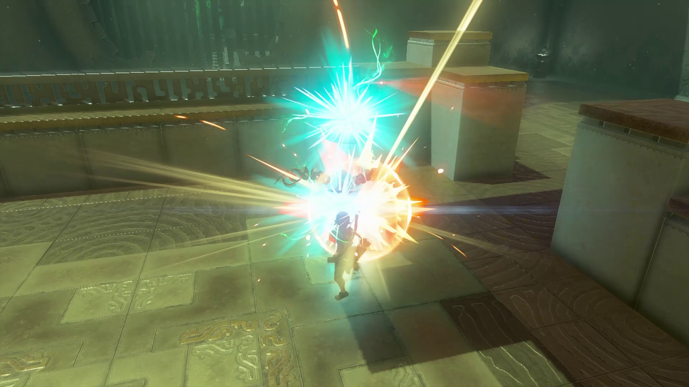

Sinatanika Shrine (Combat Training: Sneakstrike) in The Legend of Zelda: Tears of the Kingdom is in the Deep Akkala region, east of Death Mountain, and is one of 152 shrines in TOTK (see all shrine locations). This page contains a guide for how to locate and enter the shrine, a walkthrough for the shrine itself, and puzzle solutions as well as treasure chest locations for the TotK Sinatanika shrine. 

## Sinatanika Shrine Treasure and Rewards

  * Sneaky Elixer

## Sinatanika Shrine Location/How to Reach

The Sinatanika Shrine (Combat Training: Sneakstrike) is in the Akkala Highlands, east of Death Mountain. It's right in the middle between Ordorac Quarry, Octorok Lake, East Akkala Plains, and Ulri Mountain. 

  * Coordinates: 3854, 2297, 0045

## Sinatanika Shrine Walkthrough and Puzzle Solutions

Sinatanika Shrine is a combat shrine. Specifically, it’s a shrine that teaches you how to attack from stealth. 

Upon entering the shrine, you’ll get a message telling you that you need to sneakstrike the construct. Grab a weapon from the rack if you don’t have one, click in the left stick to crouch, and sneak around to the right side. 

The construct will stay stationary but will turn its head left and right. Wait until it turns away from you and then sneak past the first gap. 

Repeat the same with the second gap and circle around to the back of the square. Slowly creep up to the construct, still crouched, and attack when the button prompt appears. Take note that the construct can still hear you so don’t move too quickly. 

You’ll be sent back to the start of the shrine to repeat the process, but this time the construct will be moving. Click in the left stick and go to the left this time, crossing the first gap when the construct turns its head. 

Enter the second gap after the construct patrols past where you’re standing and sneak up for another sneakstrike. 

That’s the end of the shrine! Pick up anything the construct dropped and then head through the door to collect your Sneaky Elixer (man, that would have helped before this shrine) and your Light of Blessing. 

Sinatanika Shrine

Congrats on solving the shrine and earning a Light of Blessing! Click or tap here to return to the rest of the Shrine Guides. You can also check out which shrines are nearby with our shrine map filter on our complete map of Hyrule.

### Up Next: Walkthrough

Previous

About IGN's Zelda TotK Guide Writers

Next

Walkthrough

### Top Guide Sections

  * Walkthrough
  * Zelda: Tears of The Kingdom Switch 2 Edition Guide
  * Zelda Notes Voice Memories
  * List of Side Quests and Side Adventures

### Was this guide helpful?

Leave feedback

### In This Guide

The Legend of Zelda: Tears of the KingdomNintendo EPD

Initial Release: May 12, 2023

Learn more

Go to comments