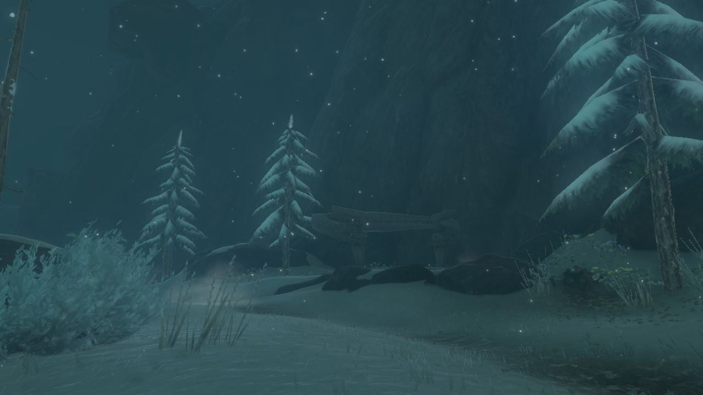
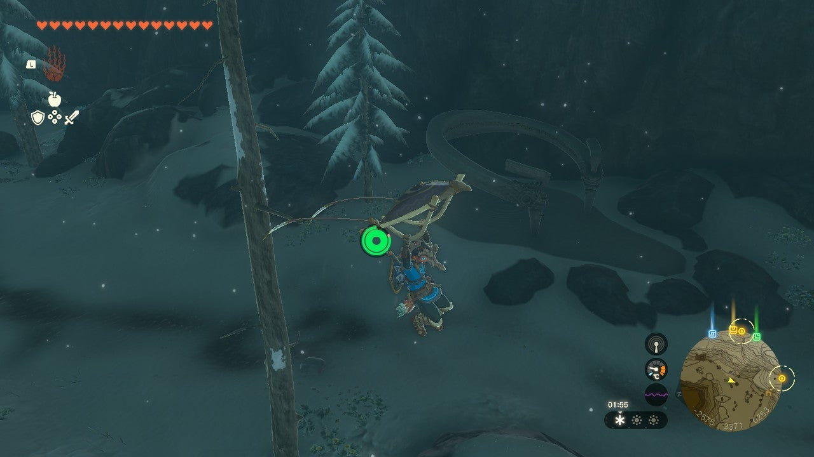
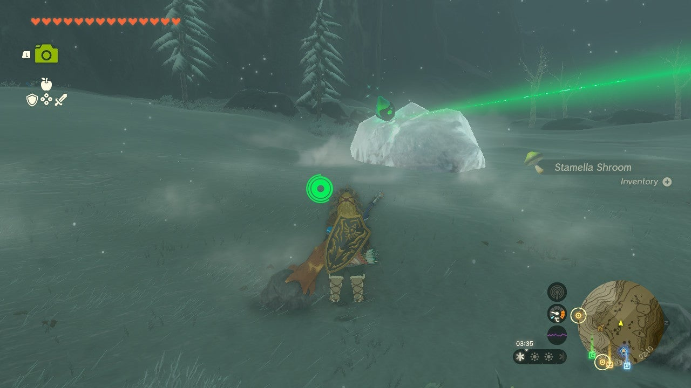
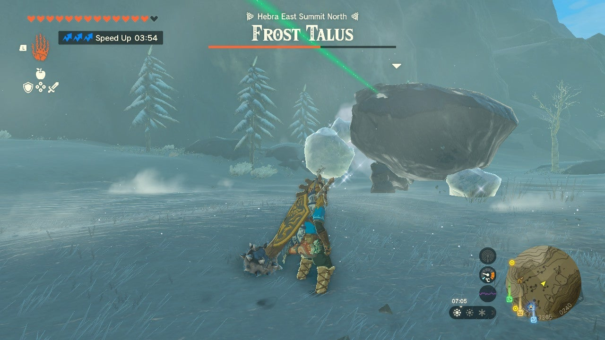
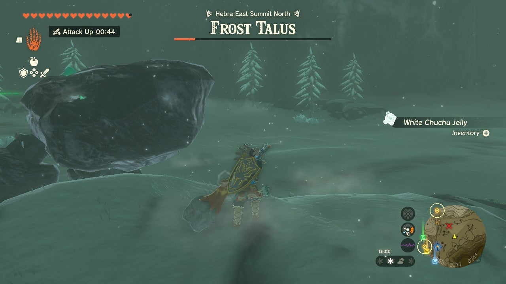
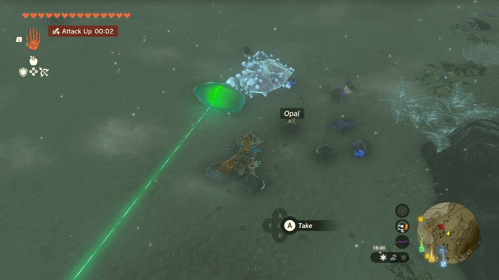
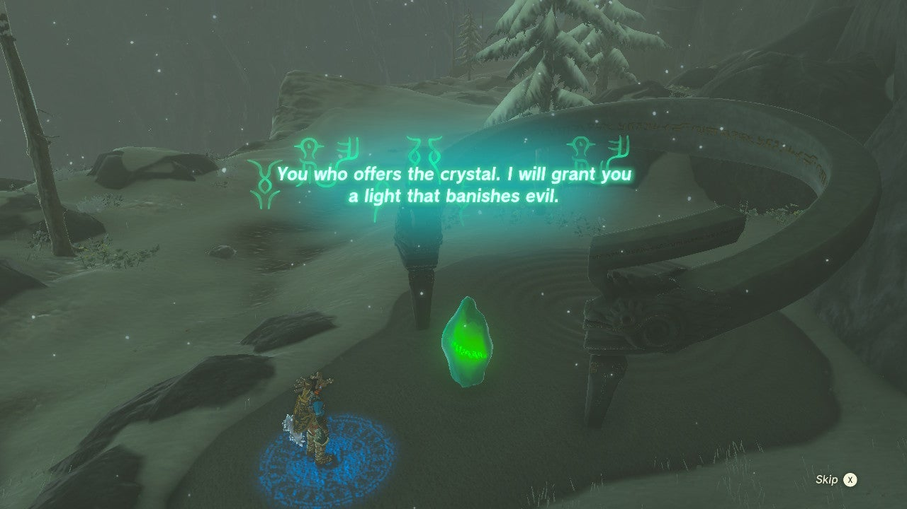

Sisuran Shrine (Rauru's Blessing) in The Legend of Zelda: Tears of the Kingdom is a shrine located in the Hebra Region and requires you to complete a crystal shrine quest in order to enter the structure. 

This page contains a guide for how to locate and enter the shrine, a walkthrough for the shrine itself, and puzzle solutions as well as treasure chest locations for the TotK Sisuran shrine. 

### Treasure and Rewards

  * Sapphire
  * Ore
  * Frost Talus Heart

## Location/How to Reach

The Sisuran shrine base is along the north Hebra mountains, northwest and over the mountains from the Pikida Stonegrove Skyview Tower. 

  * Coordinates: -2560, 3353, 0425

## The North Hebra Mountains Crystal Shrine Quest

Upon approaching Sisuran shrine, you're tasked with retrieving a shrine crystal that's suspiciously close. That can only mean certain danger. 

We'd recommend having plenty of fire fruit, something to boost your speed and attack, healing items, bomb plants, and heavy, rock-damaging weapons ready.**Ensure you have at least one weapon available for fusion, too!** Approach the crystal when you're ready. 

Unfortunately the crystal won't budge from the ice, and even worse, it moves! It's on a Frost Talus. 

In order to get this shrine crystal, you'll need to defeat the Frost Talus. Here are some tips on how to slay it: 

  * Use fire attacks to melt the ice from it, which will force it to fall forward. Use this as an opportunity to hop on and hit the crystal point.

  * Use bomb arrows on the crystal while it's walking to stun it briefly and do tons of damage.
  * The short rock pile-like hill nearby acts as a good spot to dodge ice thrown by the Frost Talus.

Once the Frost Talus is down, take the spoils (don't forget to fuse the Talus Heart to a weapon! It cannot be put in your inventory) and use Ultrahand on the shrine crystal. Take it back to the shrine to complete the shrine quest. 

The North Hebra Mountains Crystal

### Inside Sisuran Shrine

Rauru's Blessing awaits. Inside the shrine all you'll get a sapphire from the treasure chest and the customary Light of Blessing. 

Sisuran Shrine

Congrats on solving the shrine and earning a Light of Blessing! Click or tap here to return to the rest of the Shrine Guides.

### Up Next: Walkthrough

Previous

About IGN's Zelda TotK Guide Writers

Next

Walkthrough

### Top Guide Sections

  * Walkthrough
  * Zelda: Tears of The Kingdom Switch 2 Edition Guide
  * Zelda Notes Voice Memories
  * List of Side Quests and Side Adventures

### Was this guide helpful?

Leave feedback

Go to comments