Sitsum Shrine (**A Controlling Device**) in The Legend of Zelda: Tears of the Kingdom is a shrine located on Death Mountain and is one of 152 shrines in TOTK (see all shrine locations). This page contains a guide for how to locate and enter the shrine, a walkthrough for the shrine itself, and puzzle solutions as well as treasure chest locations for the TotK Sitsum shrine. 

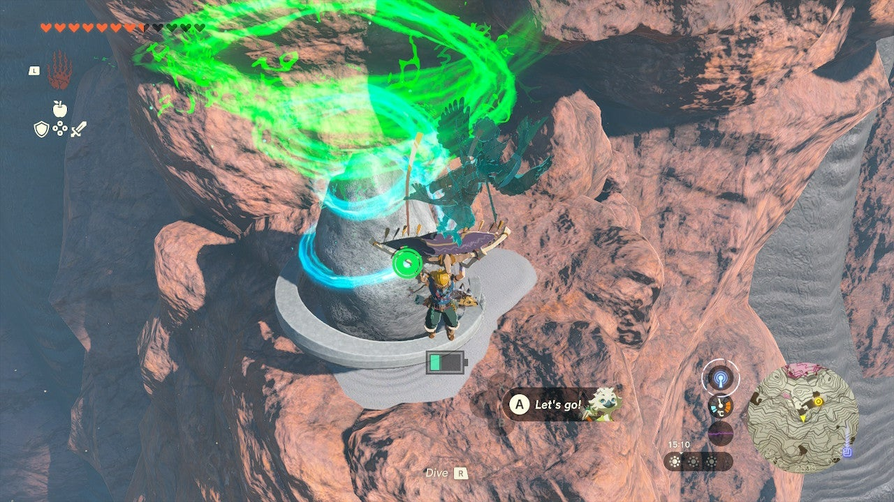

### Treasure and Rewards

  * **Mighty Construct Bow**

##  Sitsum Shrine Location

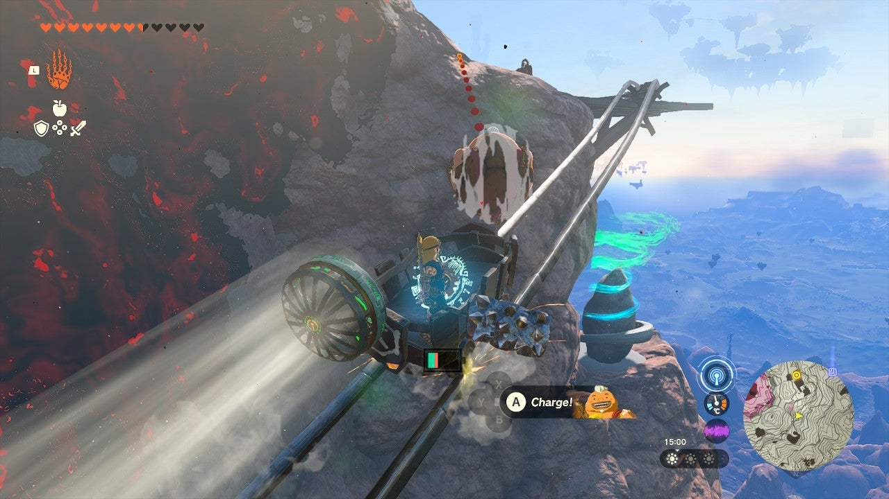

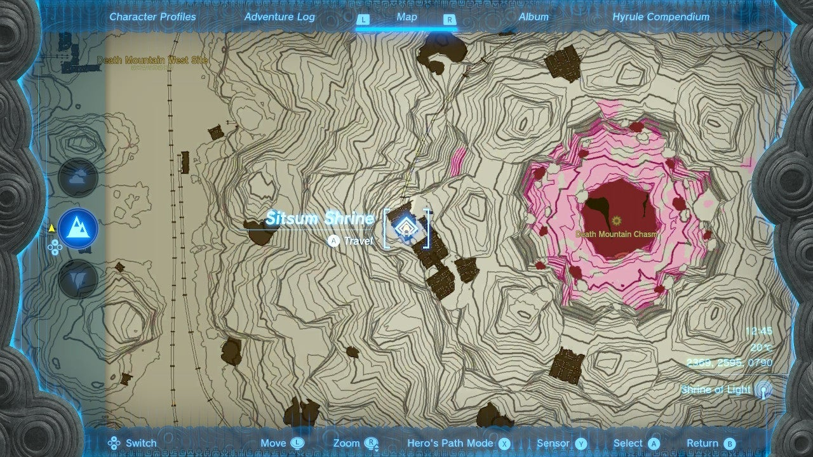

Sitsum Shrine is perched high up on the east side of Death Mountain’s peak. You can climb to it directly which is difficult, but a mine cart track that leads up right to it starts on the west side of the ringed cart track – take the left track to get up to this area. 

  * **Coordinates:** 2369, 2595, 0790

## Sitsum Shrine Walkthrough and Puzzle Solutions

This is a fairly straightforward shrine – your goal is to drive the provided vehicle across the lava. It controls quite easily if you climb aboard and interact with the control stick. 

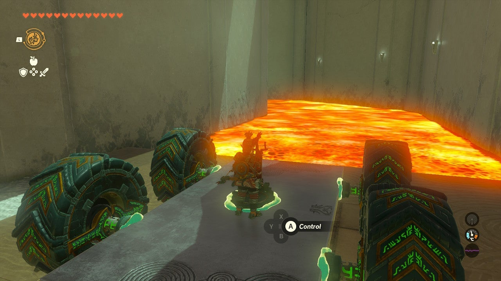

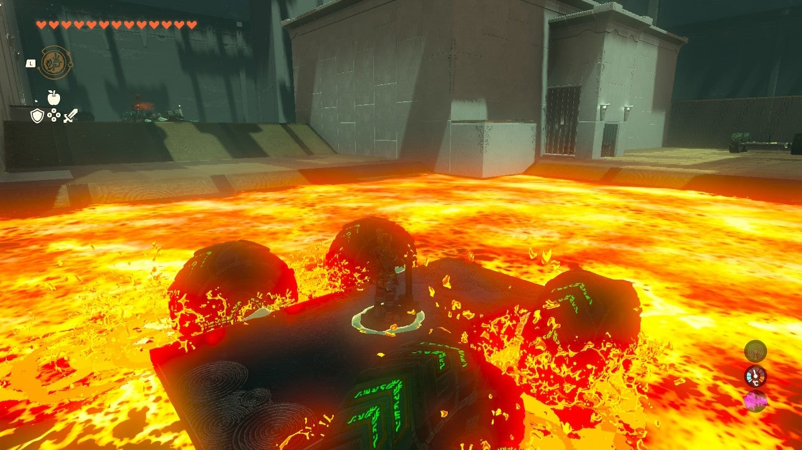

Cross the lava pool on the car and, at the first landing, note the orange target circle – this is related to the Shrine’s treasure chest. 

## Treasure Chest Location

Facing the first landing and the orange target circle, turn right in your vehicle to go down the narrow lava passage and find a sphere on a platform. 

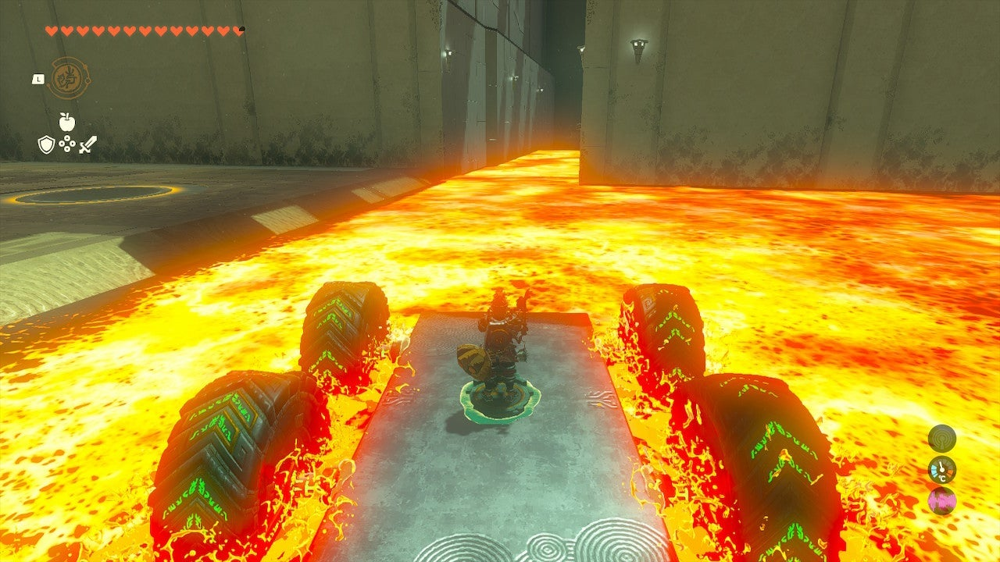

Stop the vehicle and grab the sphere with Ultrahand and attach it to the vehicle for safety. 

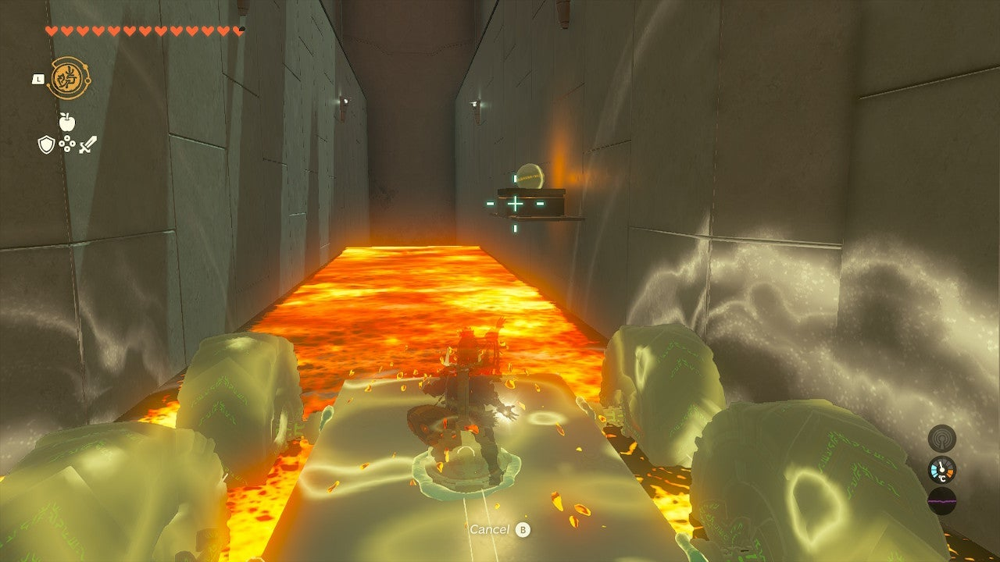

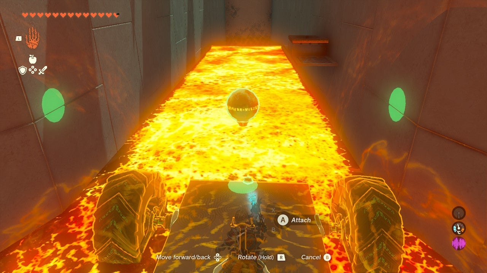

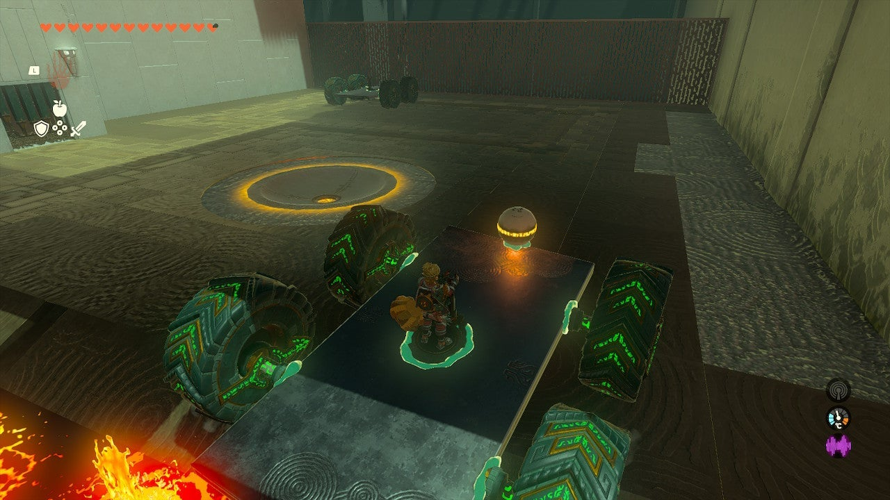

Now, you can actually back out once you activate the vehicle again, just hold DOWN on the joystick to do so. 

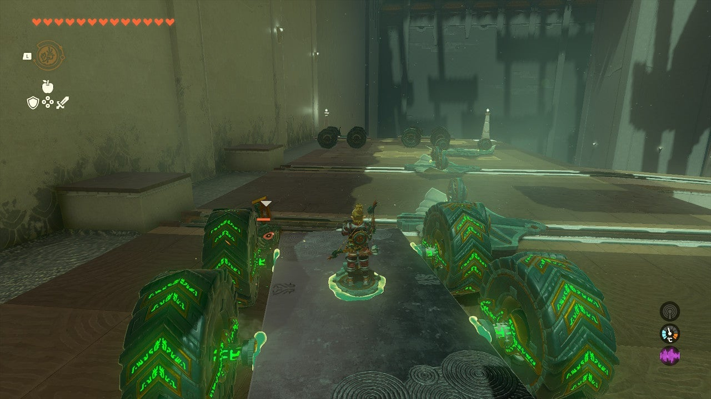

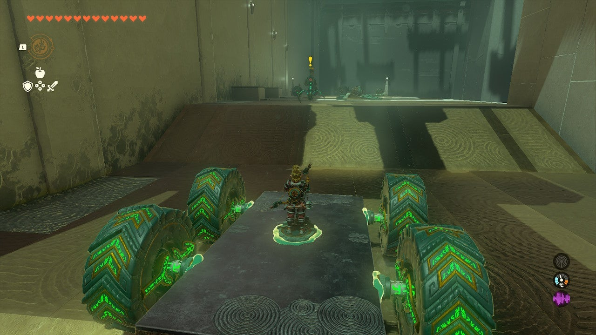

Park on the platform by the target, detach the sphere, and drop it in the hole with Ultrahand. This will open the locked chest room and allow you to access the **Mighty Construct Bow** within. 

Now, return to your vehicle and go the other route, up a few ramps. You can run right over the Construct here and then finish it off. 

Grab one of the flying devices with Ultrahand and face it towards the exit on a track – you can remove the controller from the vehicle if you’d like and add it to these to make them control just like the car-like vehicle, but in the air! 

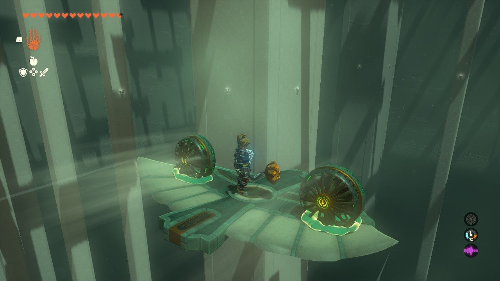

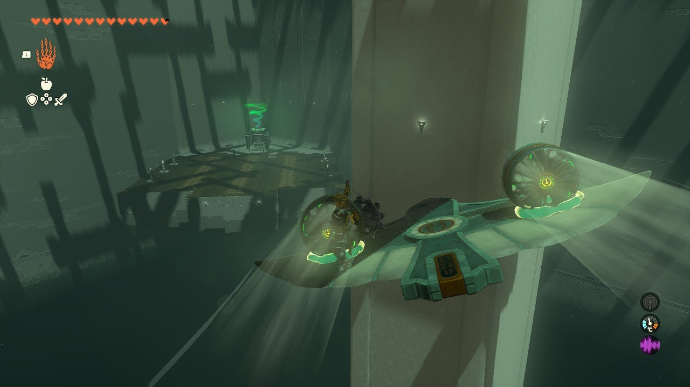

But this is not necessary – you can also simply activate the fans and ride the flying wing, controlling it by walking on one side or the other to weigh it down. 

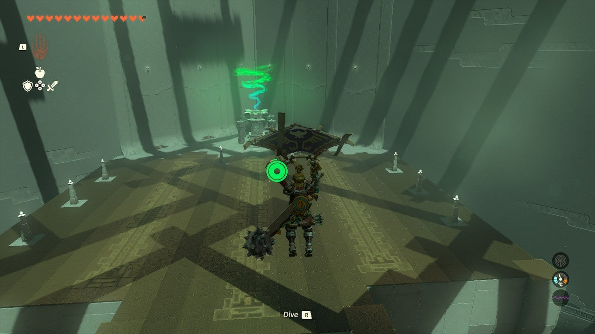

Pilot your way to the exit. 

Sitsum Shrine

Congrats on solving the shrine and earning a Light of Blessing! Click or tap here to return to the rest of the Shrine Guides. You can also check out which shrines are nearby with our shrine map filter on our complete map of Hyrule.

### Up Next: Walkthrough

Previous

About IGN's Zelda TotK Guide Writers

Next

Walkthrough

### Top Guide Sections

  * Walkthrough
  * Zelda: Tears of The Kingdom Switch 2 Edition Guide
  * Zelda Notes Voice Memories
  * List of Side Quests and Side Adventures

### Was this guide helpful?

Leave feedback

### In This Guide

The Legend of Zelda: Tears of the KingdomNintendo EPD

Initial Release: May 12, 2023

Learn more

Go to comments