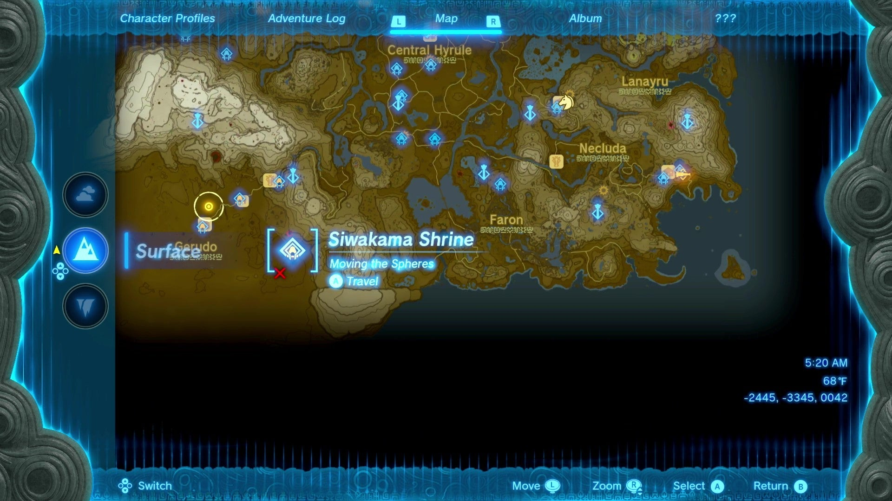
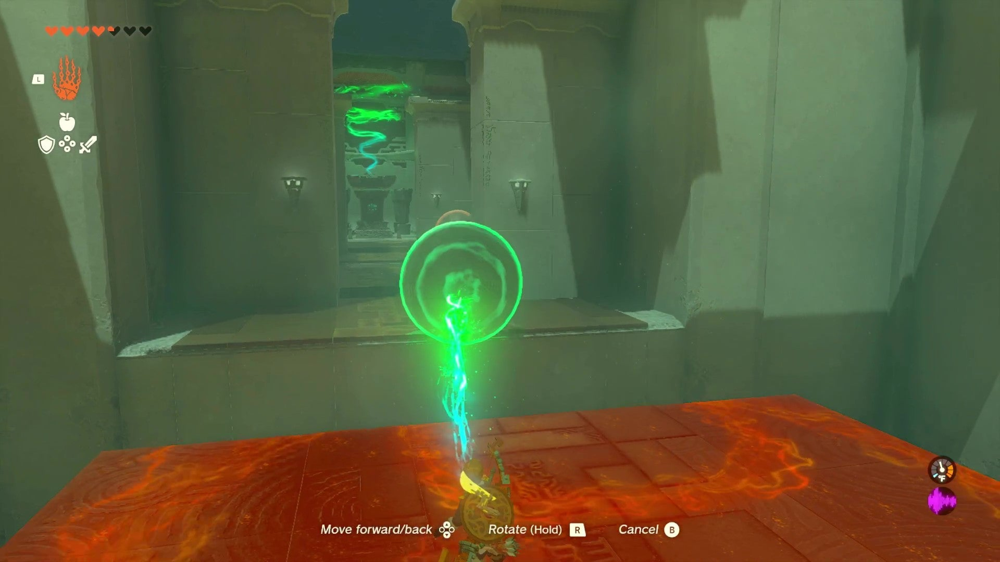
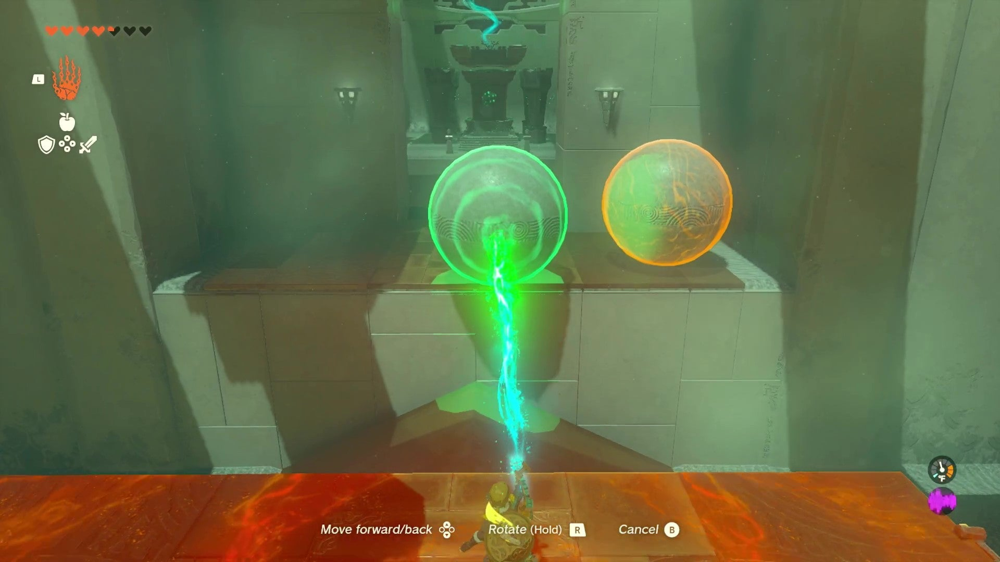
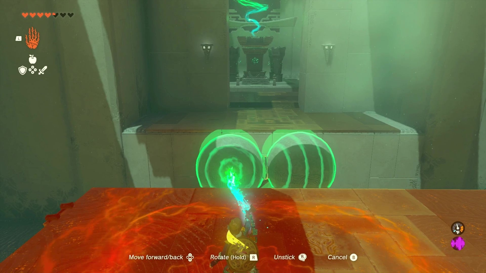
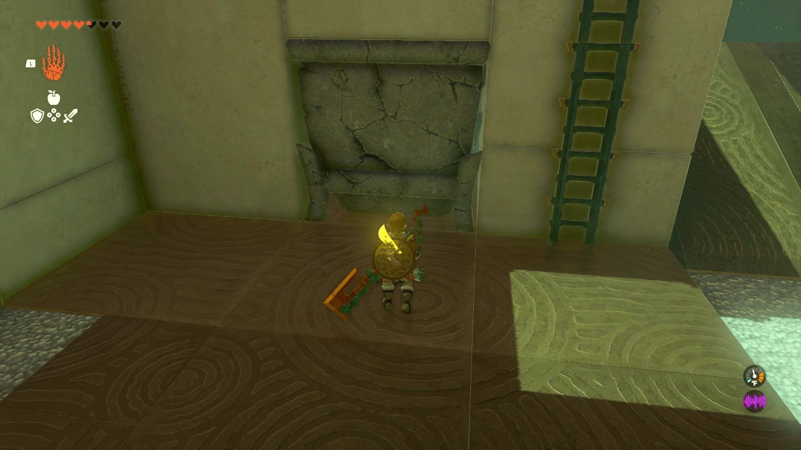
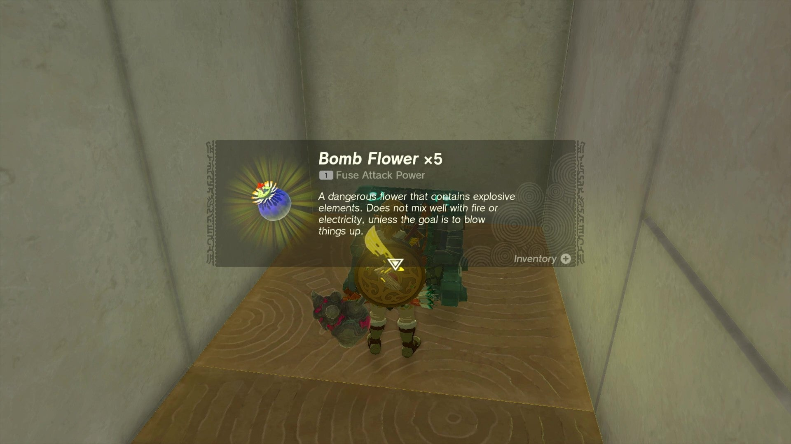
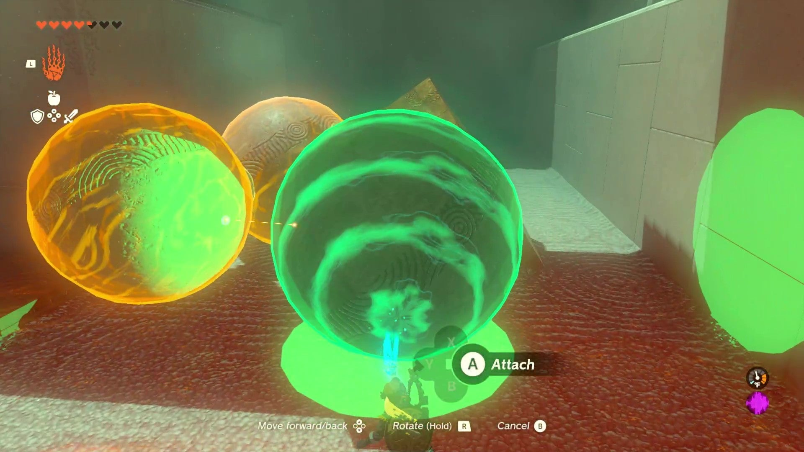
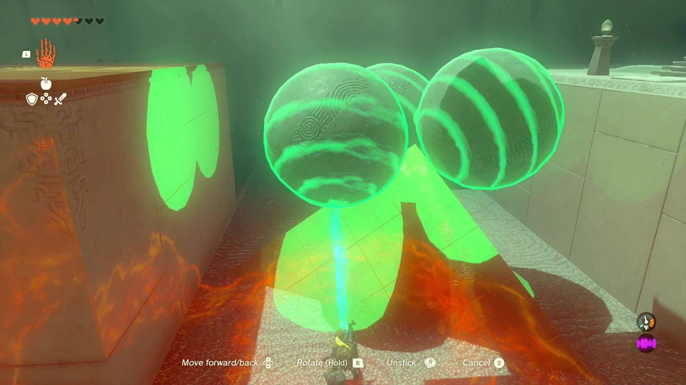
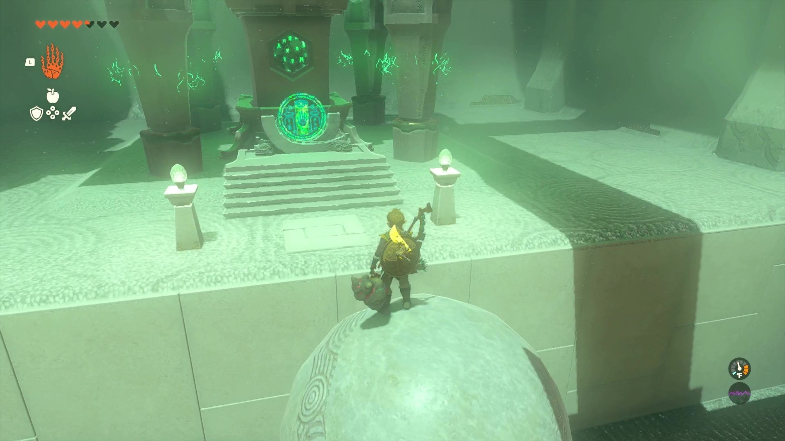

Siwakama Shrine (Moving the Spheres) in Zelda: Tears of the Kingdom is a shrine located in the Gerudo Desert region. This page contains a guide for how to locate and enter the shrine, a walkthrough for the shrine itself, and puzzle solutions as well as treasure chest locations for the TotK Siwakama shrine. 

### Siwakama Treasure and Rewards

  * Bomb Flower x5

## Siwakama Location/How to Reach

The Siwakama Shrine (Moving the Spheres) is in the Gerudo Desert, south of the Gerudo Canyon Skyview Tower. It is just north above the East Barrens and west of the Champion’s Gate. 

  * Coordinates: -2445, -3345, 0042

## Siwakama Walkthrough and Puzzle Solutions

Siwakama Shrine is a puzzle shrine. Specifically, it revolves around you angling spheres to get across each platform in the Shrine. 

Upon entering the shrine, you’ll be faced with your first platform and a spherical ball resting on the other side. Use the Ultrahand to pick up the ball and place it on the ground between the platforms. Jump to it, use your glider if you have to, and you’ll make it to the other side. 

Using Ultrahand, take that sphere with you and attach it to the next sphere across the second platform. You’ll need this fusion since the ground between the second platform is in a triangle shape and slanted. Place the dual spheres on the ground, balancing the fusion on the top of the triangle so it’s balanced. 

Before jumping across to the other platform, jump down to the right of your current platform and you’ll find a broken stone block in the wall. Bash that with a weapon or a bomb flower and you’ll find a treasure chest. Once you open it, you’ll be rewarded with 5 bomb flowers. Climb back up to the platform with the ladder on the side and jump to the spheres and climb over to the other side. 

Activate Ultrahand to pick up the two balls you used to get across and bring them to the next puzzle area leading to the end of the shrine. The floor here will have a small pyramid. Drop down to the ground and use ultrahand to grab the third sphere here and attach it to the two other spheres in a triangle fashion. 

Pick up the three balls with Ultrahand and place it on the tip of the pyramid on the ground. 

Climb back up via the ladder on the side of the platform and jump onto the spheres and climb over to the end of the shrine and collect your Light of Blessing. 

Siwakama Shrine

Congrats on solving the shrine and earning a Light of Blessing! Click or tap here to return to the rest of the Shrine Guides. You can also check out which shrines are nearby with our shrine map filter on our complete map of Hyrule.

### Up Next: Walkthrough

Previous

About IGN's Zelda TotK Guide Writers

Next

Walkthrough

### Top Guide Sections

  * Walkthrough
  * Zelda: Tears of The Kingdom Switch 2 Edition Guide
  * Zelda Notes Voice Memories
  * List of Side Quests and Side Adventures

### Was this guide helpful?

Leave feedback

Go to comments