Siyamotsus Shrine (Rauru’s Blessing) in Zelda: Tears of the Kingdom is a shrine located in the Gerudo Sky region and is in the **South Lomei Castle Top Floor** sky labyrinth. This page contains a guide for how to locate and enter the shrine, a walkthrough for the shrine itself, and puzzle solutions as well as treasure chest locations for the TotK Siyamotsus shrine. Check out more TOTK shrine locations here. 

### Treasure and Rewards

  * Strong Construct Bow

## Location/How to Reach

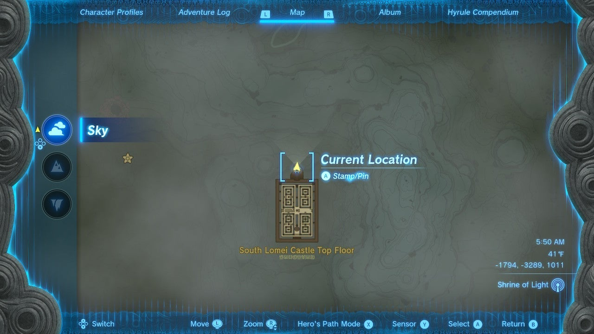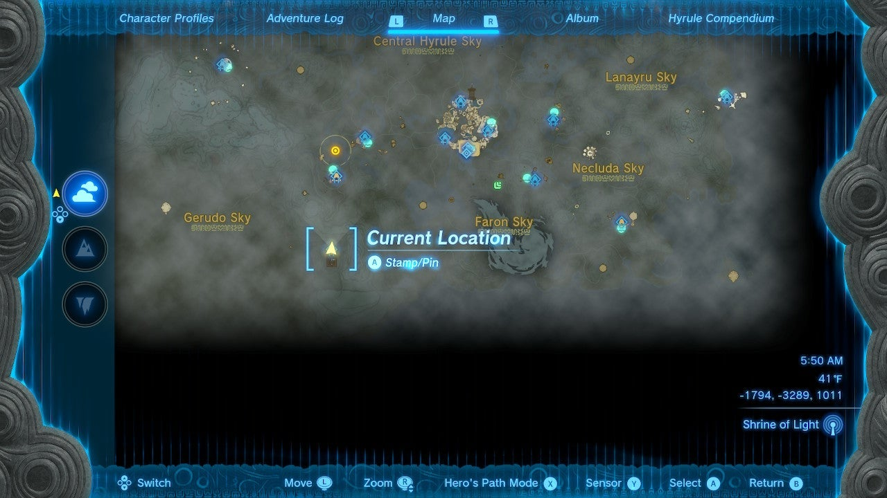

The journey to Siyamotsus Shrine is a bit of a long one, and you will need either Zonai devices (a Fan or Rockets) and/or Stamina-increasing food (lots of **Stambulbs** are found on the East Gerudo Sky Archipelago to help) to reach it (unless you have 3 or more rings of Stamina). Siyamotsus Shrine is located on the north side of the labyrinth called South Lomei Castle in the southwest corner of Hyrule. 

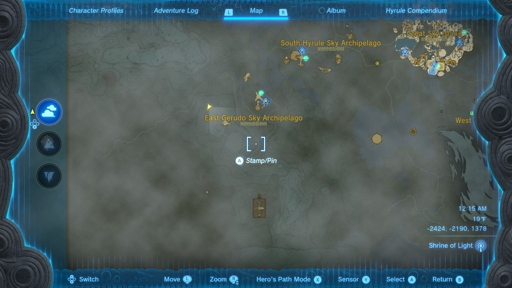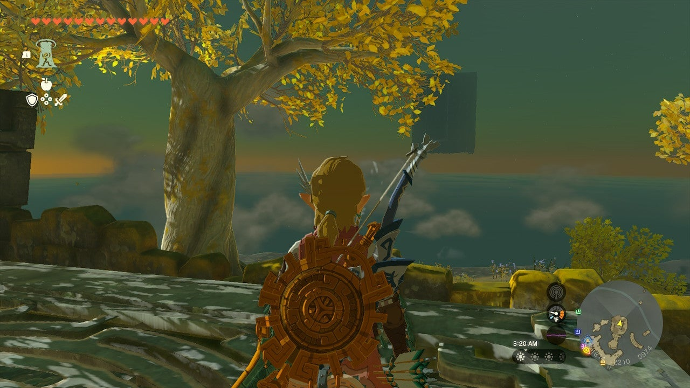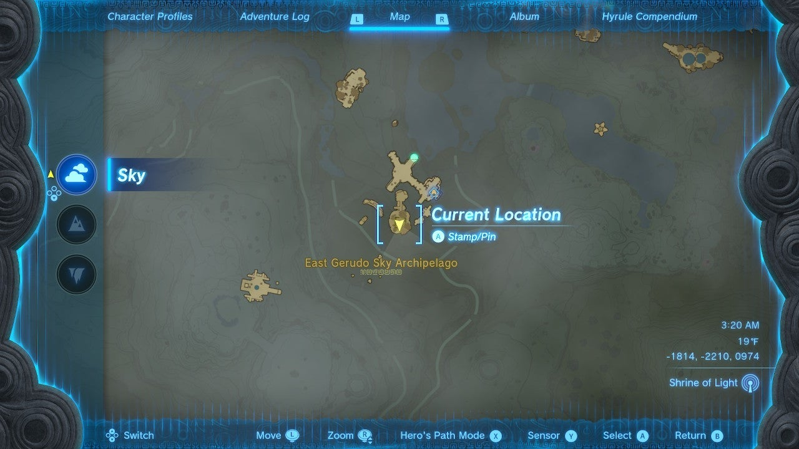

It’s easiest to start this journey from **Rakoshog Shrine** (see the **Rakoshog Shrine** guide for how to get here) on the East Gerudo Sky Archipelago, or from the Gerudo Canyon Skyview Tower. You want to get to the island in the south of this chain, below the Rakoshog Shrine. 

Here you will find several Zonai floating platforms. These are advantageous as they don’t lose altitude like a Wing, and one in particular has two rockets already on it. SAVE YOUR GAME. 

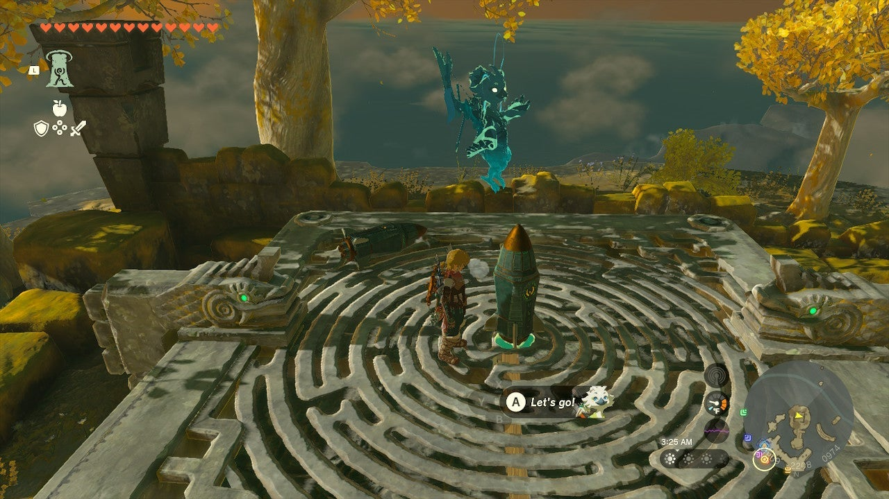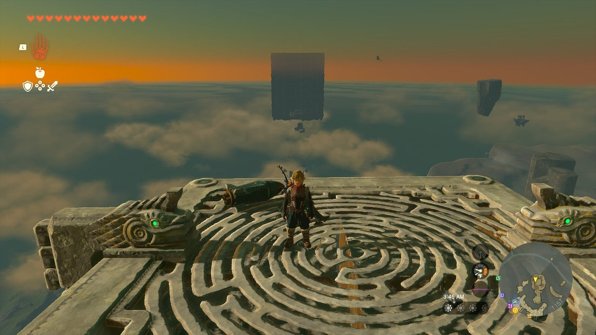

Leave one rocket and smack the attached one to lift high into the air. Use the other rocket to pull your platform closer to the large cube in the distance where the shrine is located. Attach it at a 45 degree angle pulling you up and towards the cube. 

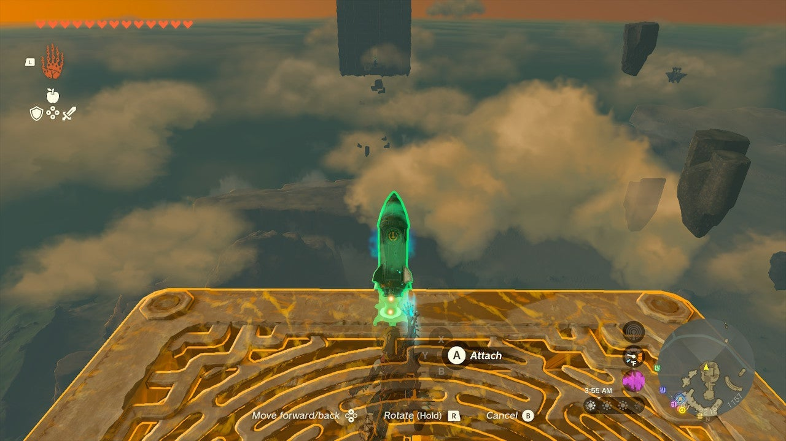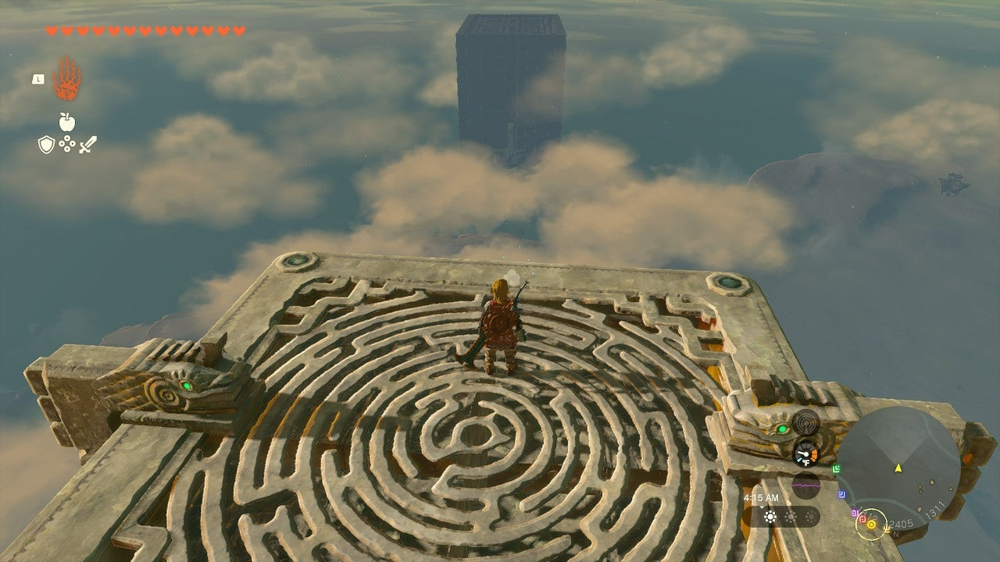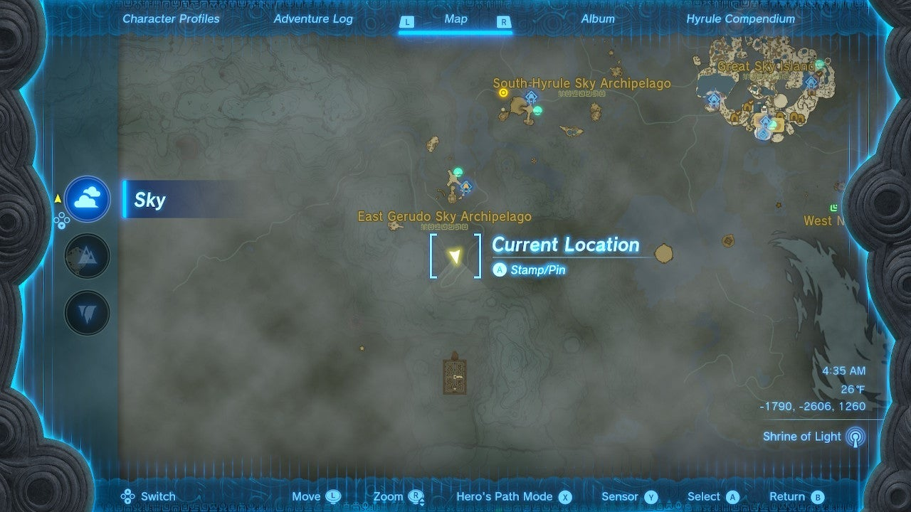

Now, from your lofty perch, you can either attach a fan or a rocket to get closer from your inventory, or paraglide to the shrine using stamina and stamina-increasing food to extend your glide. 

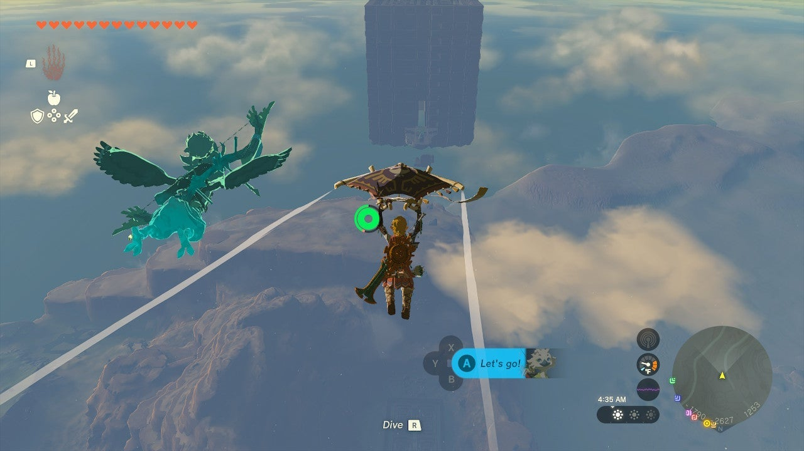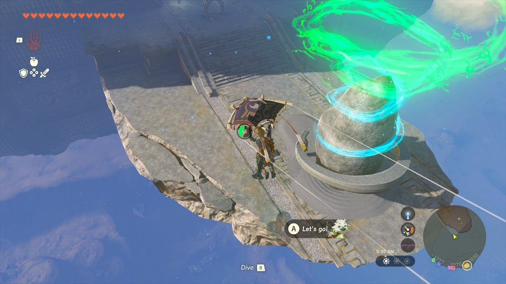

  * Coordinates: -1795, -3291, 1011

## Walkthrough and Puzzle Solutions

It takes a lot to reach Siyamotsus Shrine, but for the difficult journey you won’t have to solve any puzzles, simply walk in and claim your Strong Construct Bow. Just kidding… 

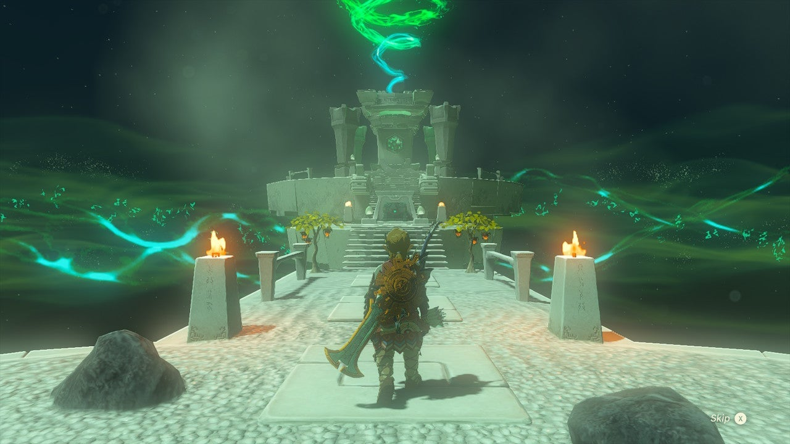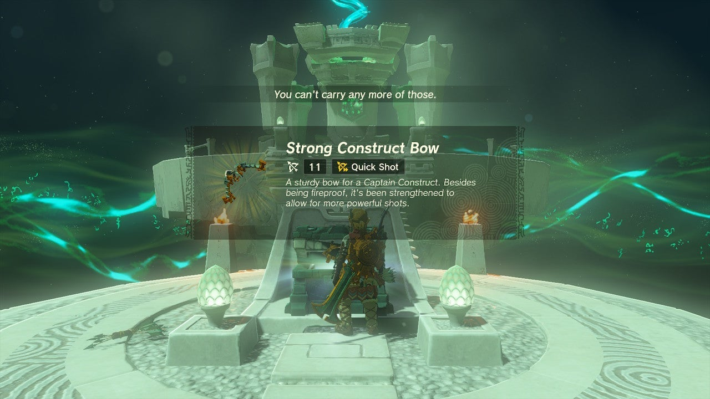

The floor drops out from under the shrine exit, and you can’t climb the wall it becomes. 

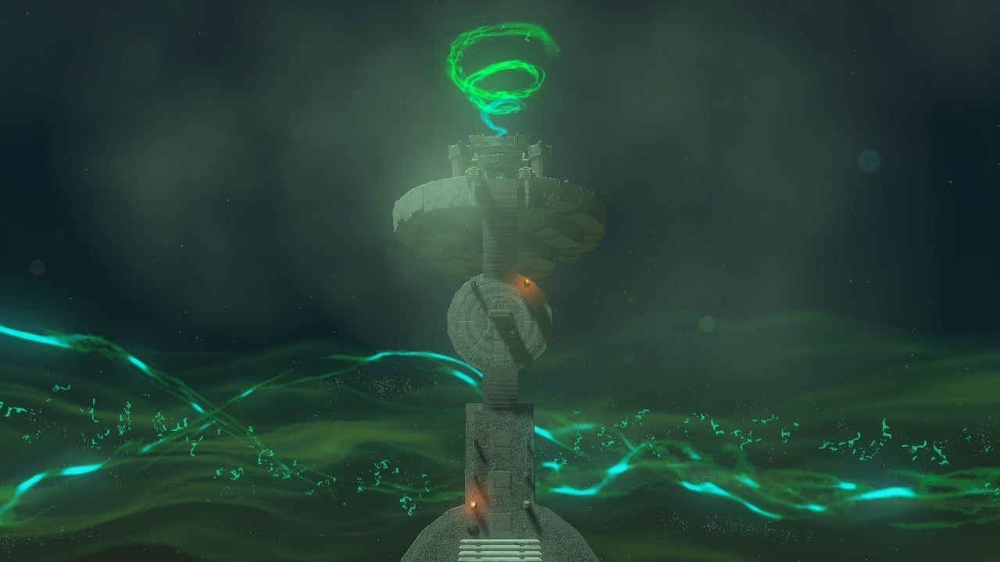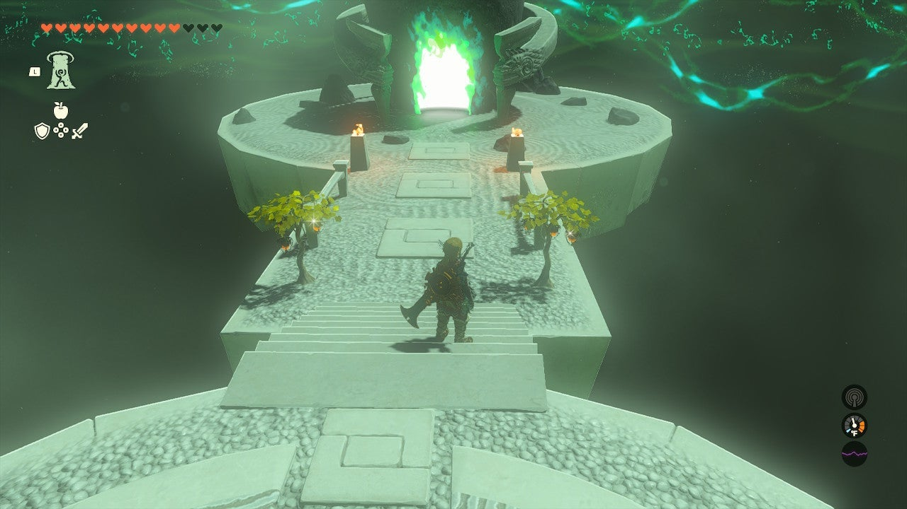

Instead, walk back to the entrance and look on the ground for arrows, and in two trees for Fire Fruit. This is a clue: On the wall in the distance there are two unlit torches. 

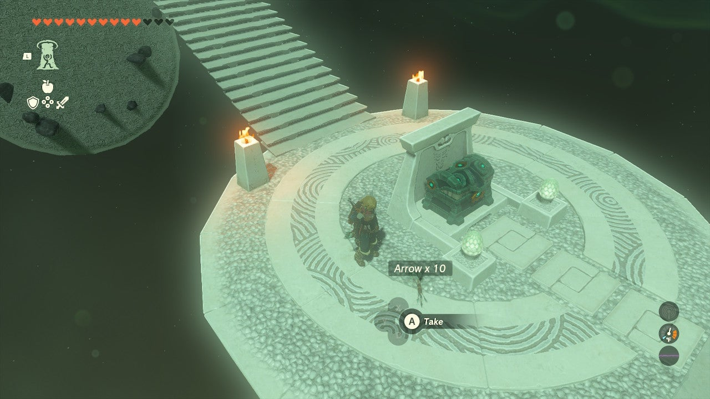

Equip a bow and aim an arrow. Attach a Fire Fruit and shoot just above the lower torch to light it. 

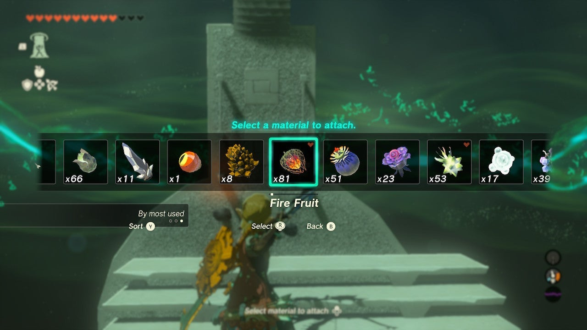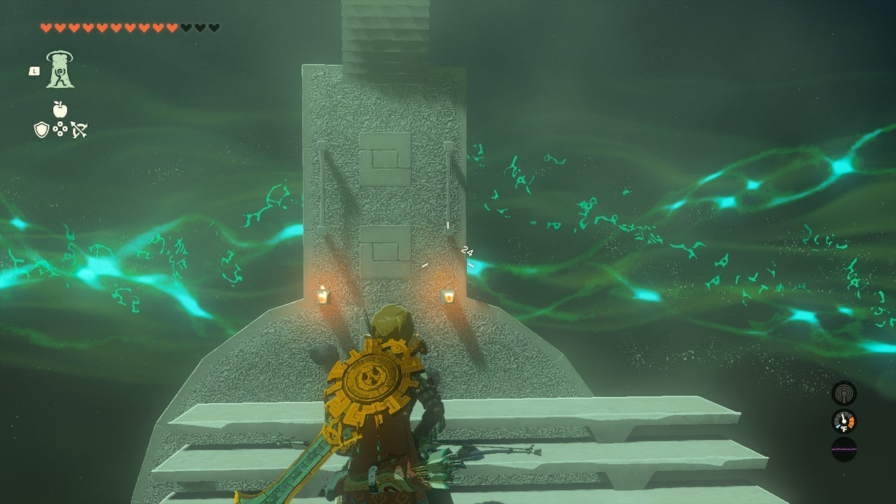

Do the same for the top torch and this will reveal a launcher by the chest. Use this to launch up and paraglide over to the chest. 

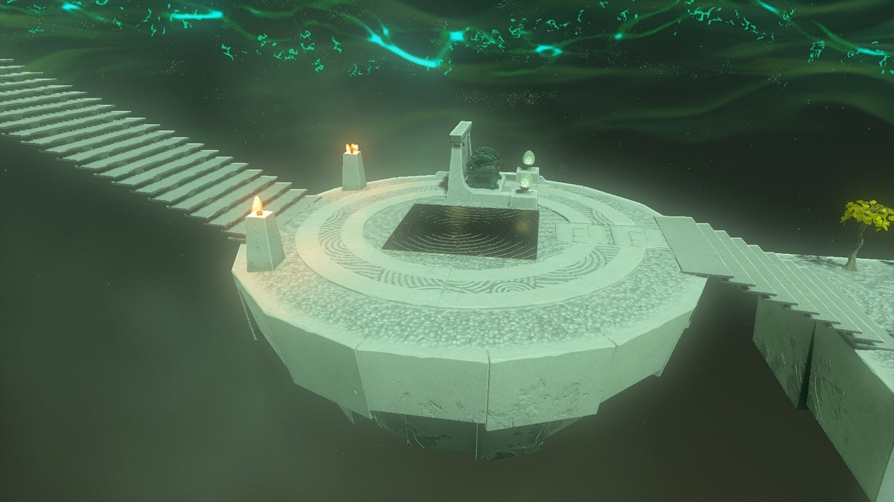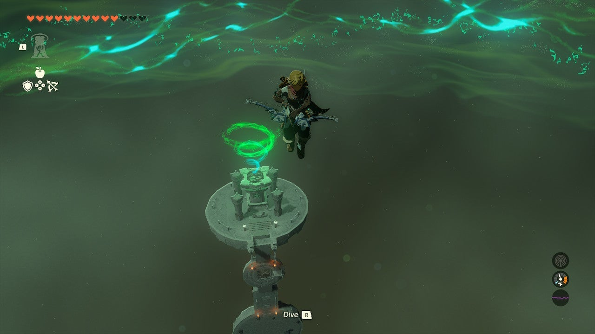

Siyamotsus Shrine

Congrats on solving the shrine and earning a Light of Blessing! Click or tap here to return to the rest of the Shrine Guides. You can also check out which shrines are nearby with our shrine map filter on our complete map of Hyrule.

### Up Next: Walkthrough

Previous

About IGN's Zelda TotK Guide Writers

Next

Walkthrough

### Top Guide Sections

  * Walkthrough
  * Zelda: Tears of The Kingdom Switch 2 Edition Guide
  * Zelda Notes Voice Memories
  * List of Side Quests and Side Adventures

### Was this guide helpful?

Leave feedback

Go to comments