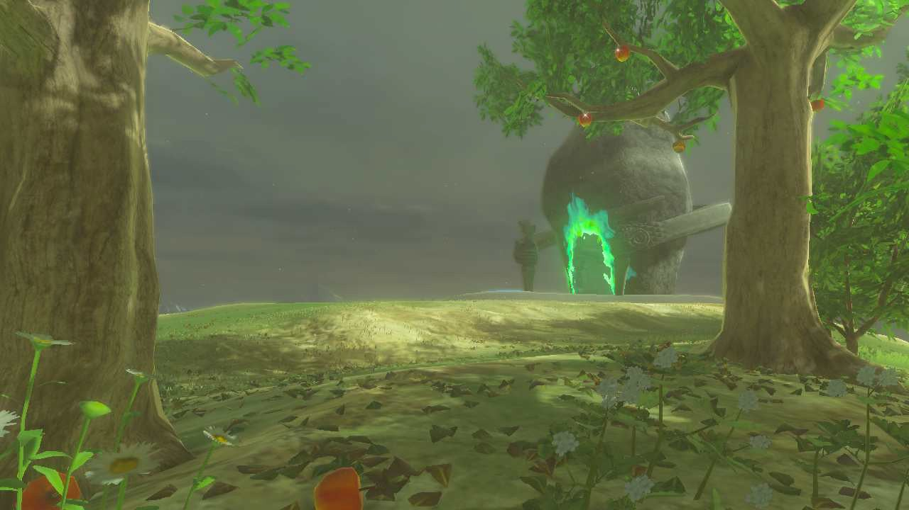
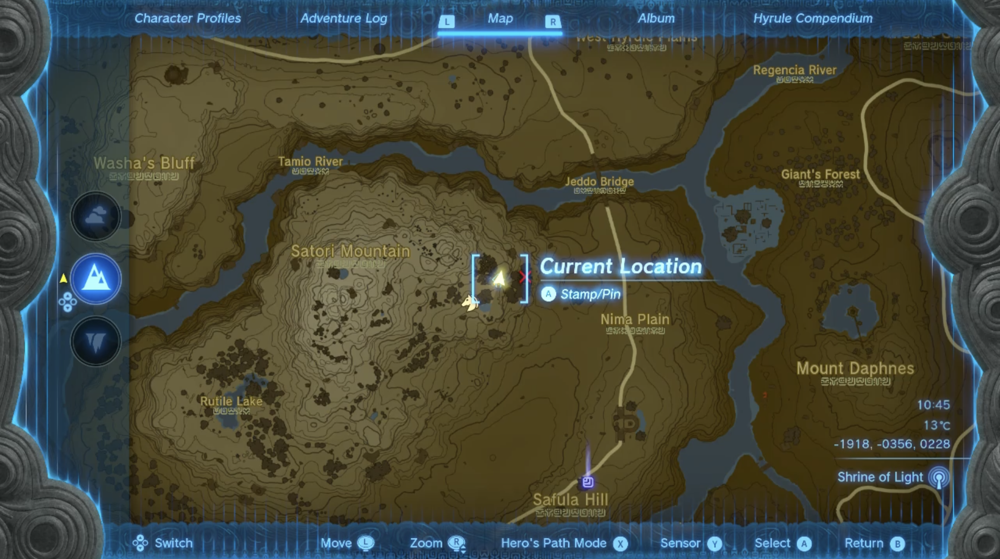
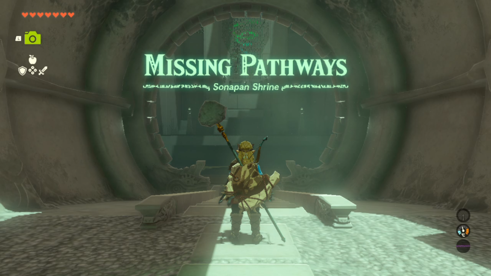
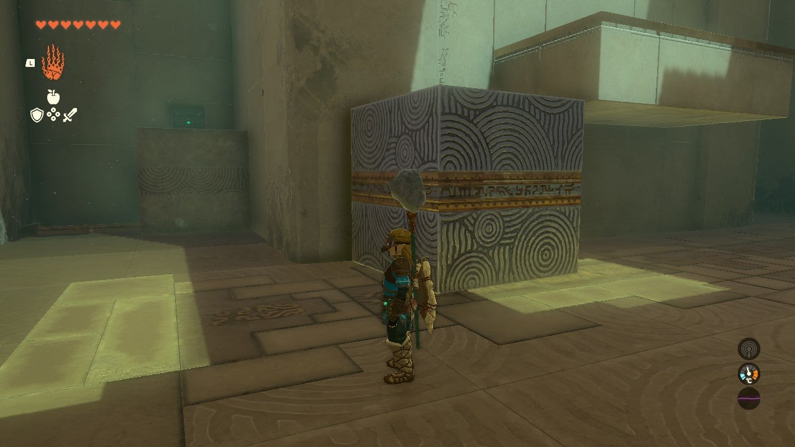
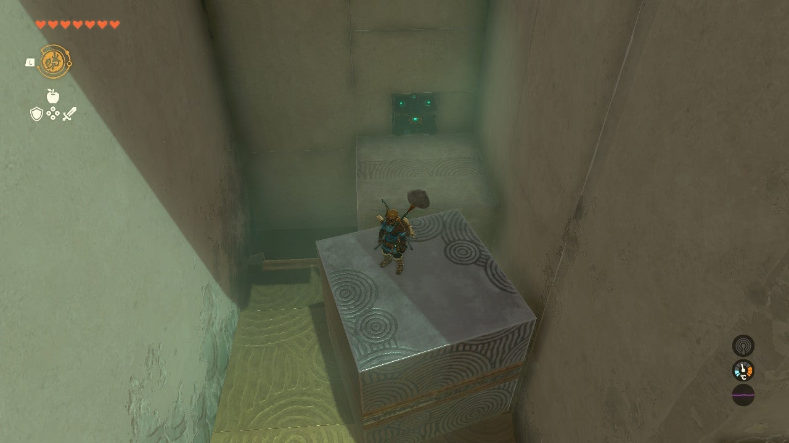
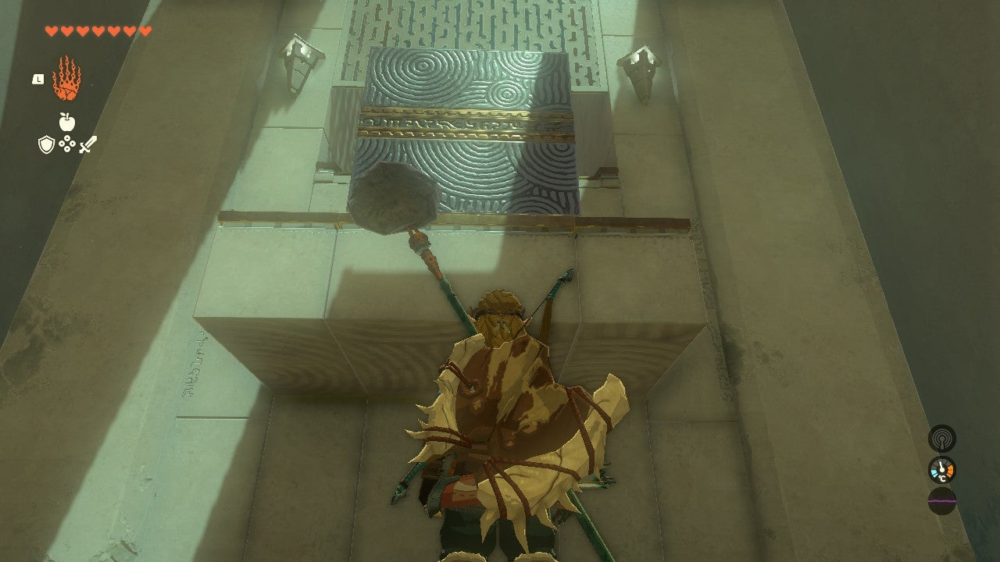
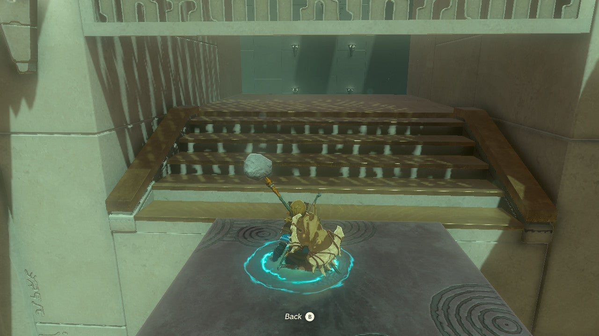
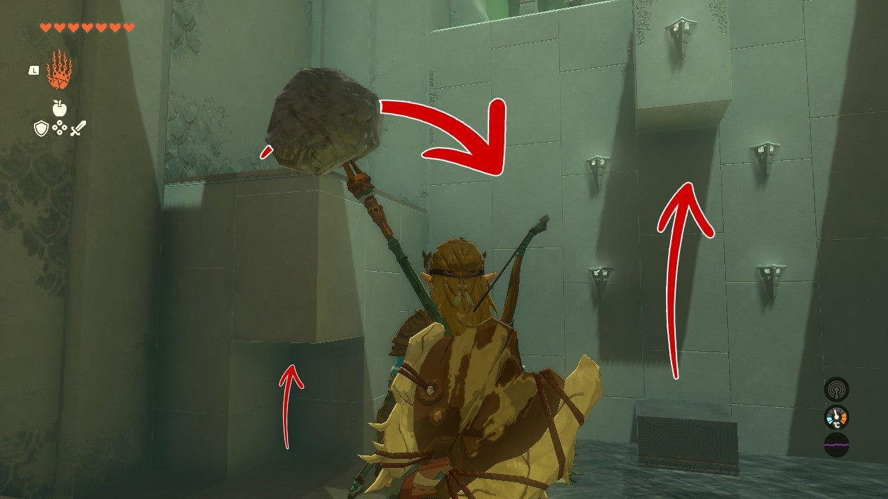
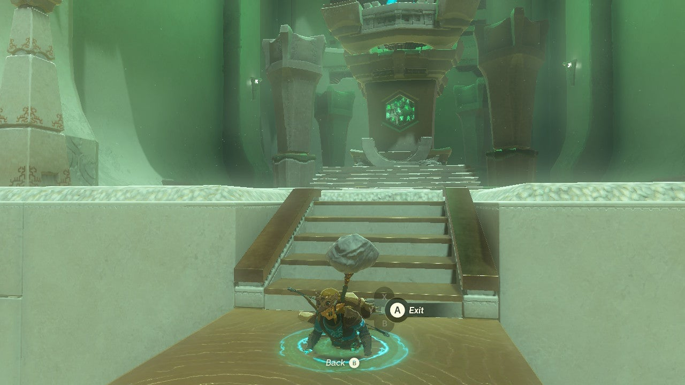

Sonapan Shrine (**Missing Pathways**) in The Legend of Zelda: Tears of the Kingdom is a shrine located in the Hyrule Ridge Region and is one of 152 shrines in TOTK (see all shrine locations). This page contains a guide for how to locate and enter the shrine, a walkthrough for the shrine itself, and puzzle solutions as well as treasure chest locations for the TotK Sonapan shrine. 

### Treasure and Rewards

  * 5x Arrows

## Sonapan Shrine Location

You'll find this shrine in an apple grove on the side of Satori Mountain. 

  * Coordinates: -1921, -0361, 0228

## Sonapan Shrine Walkthrough

Missing pathways? No problem. Walk up to the first ledge and Ascend through the overhang. 

Next, use Ultrahand to grab the metal cube to the right of the next platform. Use Ultrahand to drag it to the left side of the platform so that Link can drop on top of it. Don't go up just yet, though. 

### How to Get the Sonapan Shrine Treasure Chest

To the left of the platform is the shrine's treasure chest embedded in the wall with a moveable block to the left of it. Use Ultrahand to put the block in front of the treasure chest. Then do the following: 

  * Use Ultrahand to move the free-moving metal block next to the block that leads to the treasure chest.
  * Move the block **back to the spot where Link can jump down to it** from the higher platform.
  * Ascend to the higher platform and hop down onto the block you moved back.
  * While standing on the block, **use Recall** and stop it once the block is next to the block in front of the treasure chest
  * Open the treasure chest to get 5x Arrows. Not all that exciting, but at least they're free.

To move on, use Ultrahand to stack the movable metal block on top of the high platform so that it's right in front of the door. Ascend through the platform and the metal block by positioning yourself right below the door and you can proceed. 

In the next room, move the metal cube in the cubby on the left to the center of the water, flush with the wall. It should be directly between the sconces. Then Ascend to the top of the platform on the left by using the cubby the metal cube once called home. 

Now that you're high up, glide down to the metal cube. You can now use Ascend to get to the shrine's highest platform that leads to the exit. 

Sonapan Shrine

Congrats on solving the shrine and earning a Light of Blessing! Click or tap here to return to the rest of the Shrine Guides. You can also check out which shrines are nearby with our shrine map filter on our complete map of Hyrule.

### Up Next: Walkthrough

Previous

About IGN's Zelda TotK Guide Writers

Next

Walkthrough

### Top Guide Sections

  * Walkthrough
  * Zelda: Tears of The Kingdom Switch 2 Edition Guide
  * Zelda Notes Voice Memories
  * List of Side Quests and Side Adventures

### Was this guide helpful?

Leave feedback

Go to comments