Soryotanog Shrine (Buried Light) in The Legend of Zelda: Tears of the Kingdom is in the Gerudo Desert and one of 152 shrines in TOTK (see all shrine locations). Uncover the Soryotanog Shrine's treasures and solve the fan puzzles with the help of this complete guide. 

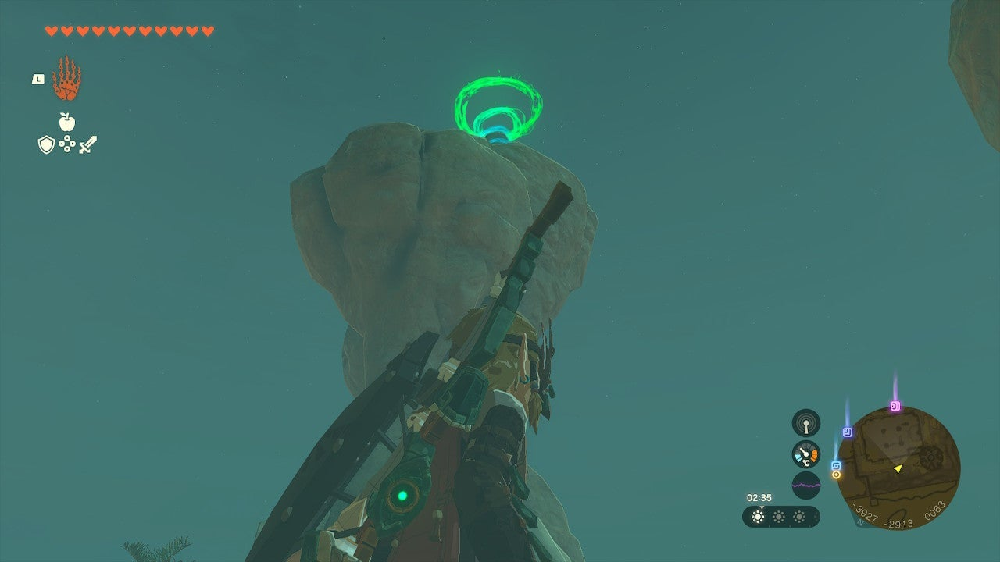

### Soryotanog Shrine Treasure and Rewards

  * ****10x Arrows****

##  Soryotanog Shrine Location/How to Reach

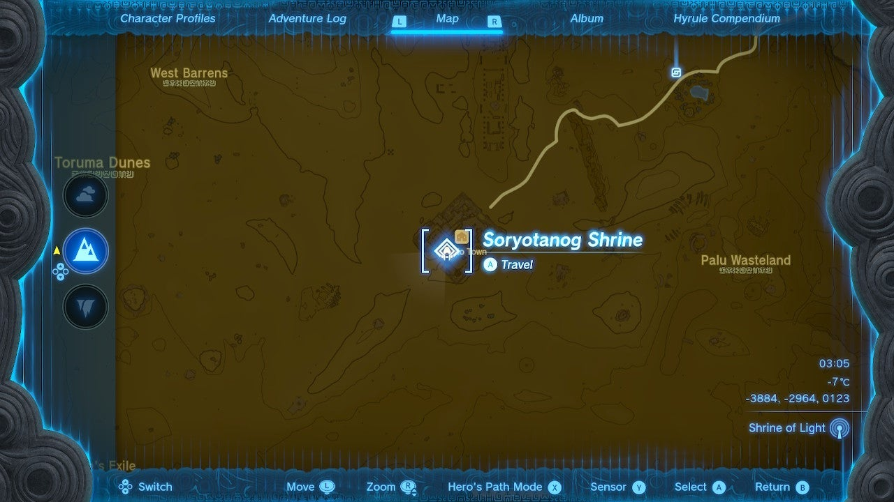

If you don’t approach the Soryotanog Shrine completely from the Sky, then you will need cooling gear, food, or elixirs. Soryotanog Shrine is on a high perch above Gerudo Town, you can simply climb the walls of Gerudo Town, overrun with enemies, and use Ascend to reach it. 

Getting to Gerudo Town is another story, and you can either follow the main quests there or skip all of that and paraglide in from the Gerudo Canyon Skyview Tower. You will need some extra stamina and perhaps some **Tulin of Rito** bursts to get there in the air. 

  * **Coordinates:** -3884, -2964, 0123

## Soryotanog Shrine Walkthrough and Puzzle Solutions

In the first room, you’ll find piles of sand and a lone fan. Grab the fan with Ultrahand, set it down, hit it with a weapon to turn it on, and just pick it up with your hands. 

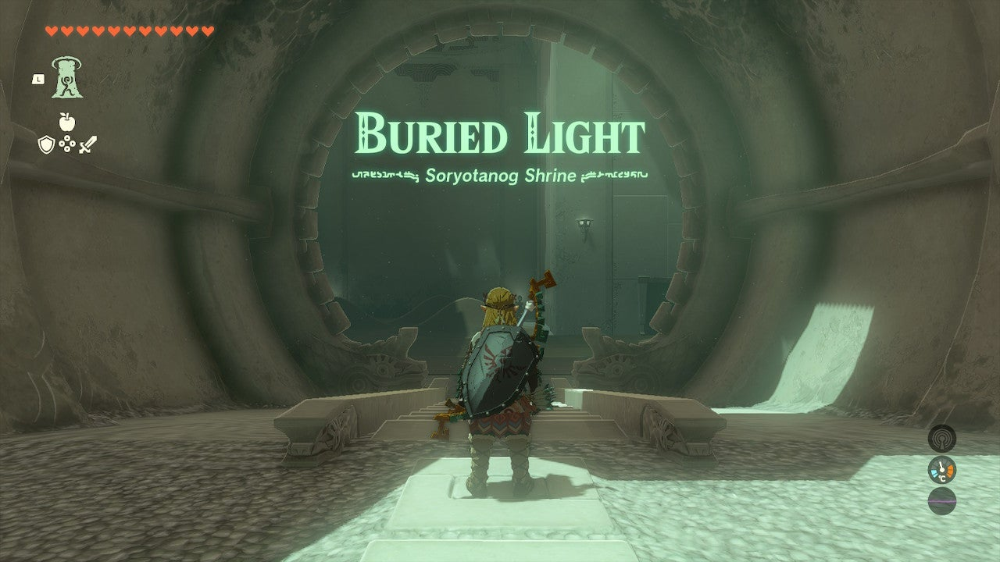

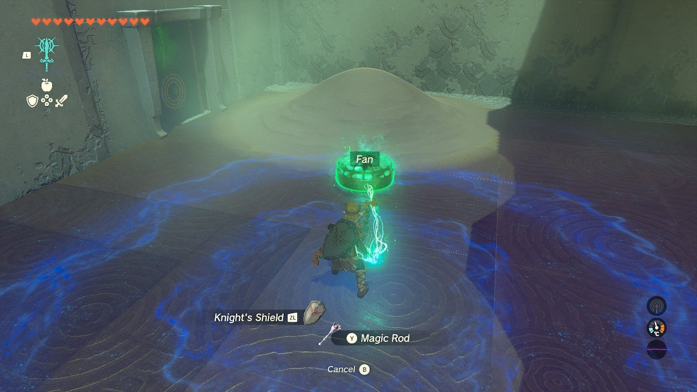

Aim it at the piles of sand and set it down at their base to uncover what’s underneath – under is a chest with a ****Small Key****. Use it on the green door to enter the next chamber. 

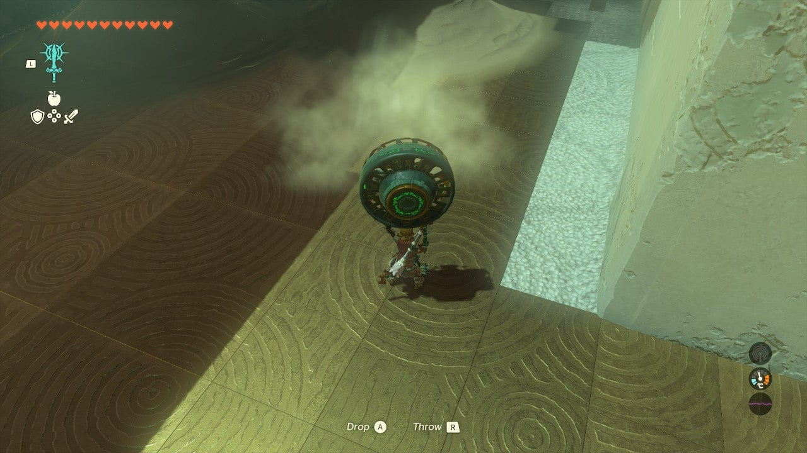

Bring your fan with you. Drop it and kill the lone Construct in the room. Use the fan to clear all sand, revealing a reflector and a low passage to another chamber in the south. 

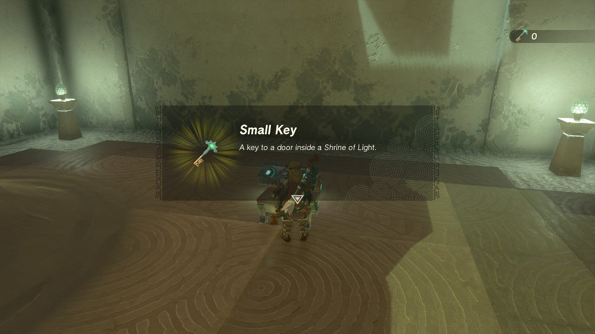

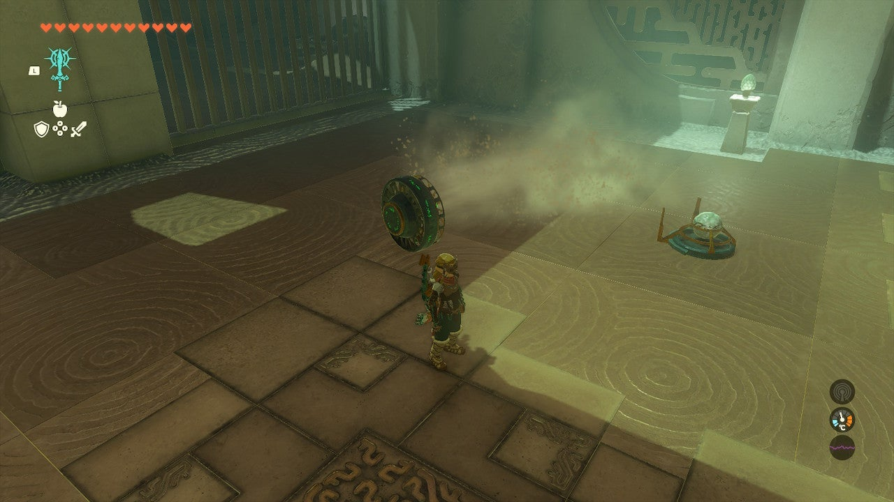

Grab the fan here with Ultrahand and blow away all the sand piles. Under one is a Construct with a **Fan Blaster**. Kill it and take the Fan Blaster. 

## Treasure Chest Location

Now, keep your fan on and use Ultrahand to set it on its back on the ground in front of the ledge. Jump and use your paraglider to fly up the ledge. A pile of sand blocks the gear here. 

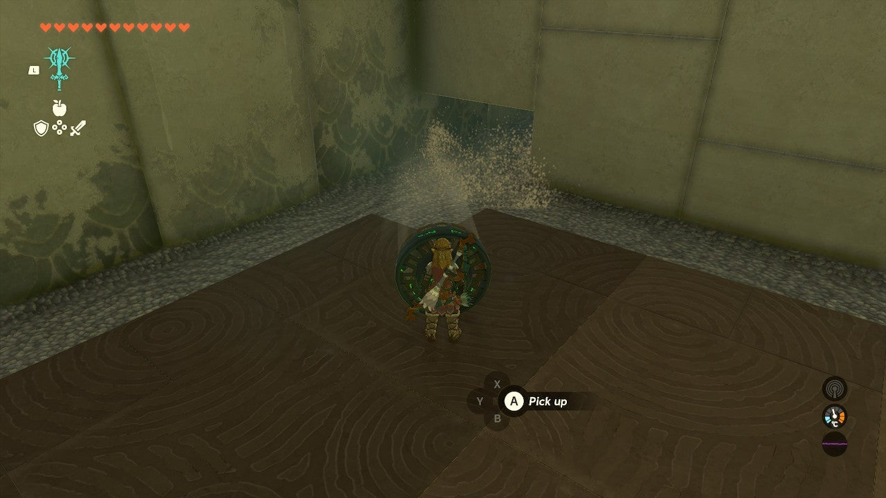

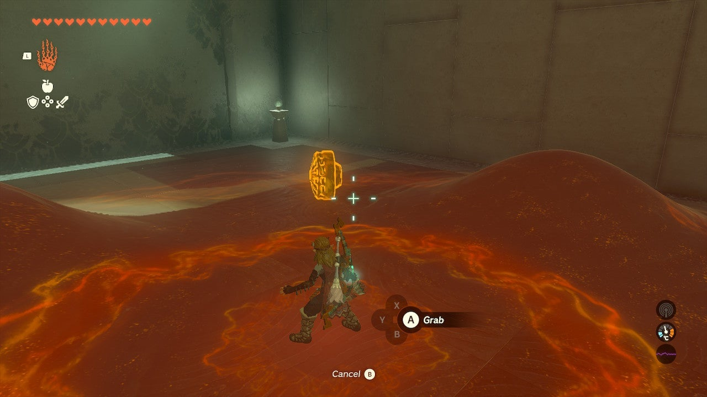

Hit the sand a few times with your Fan Blaster to free the gear and get to the chest with ****10x Arrows**** in it. 

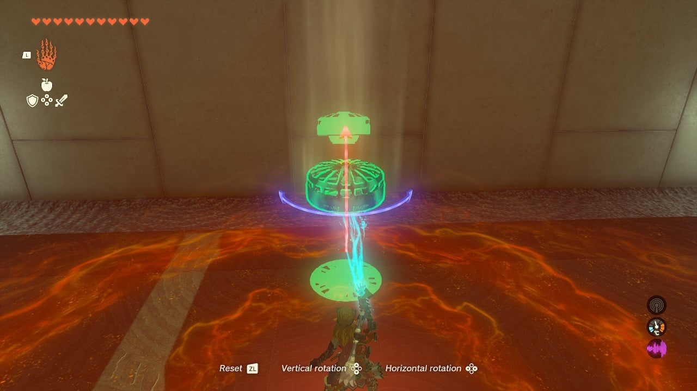

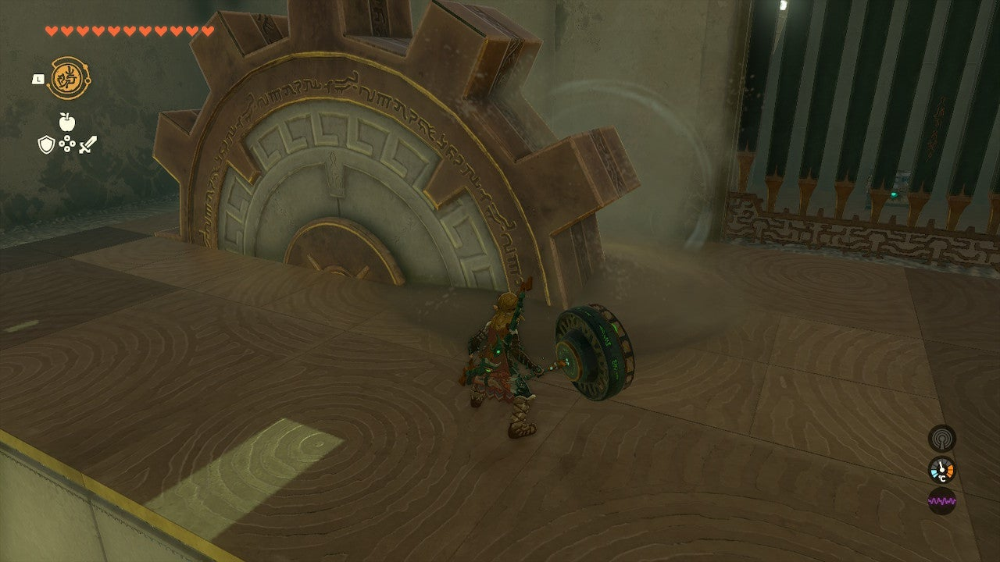

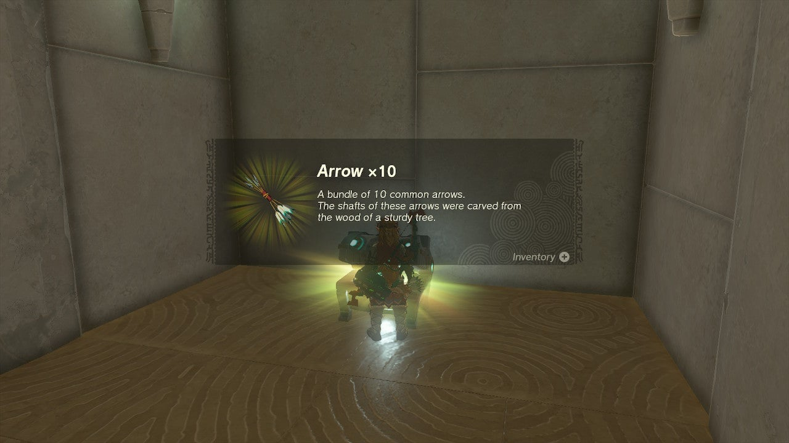

Return to the chamber outside the exit. You can ascend in the corner here to reach the area behind the bars with more sand piles and a Construct archer. 

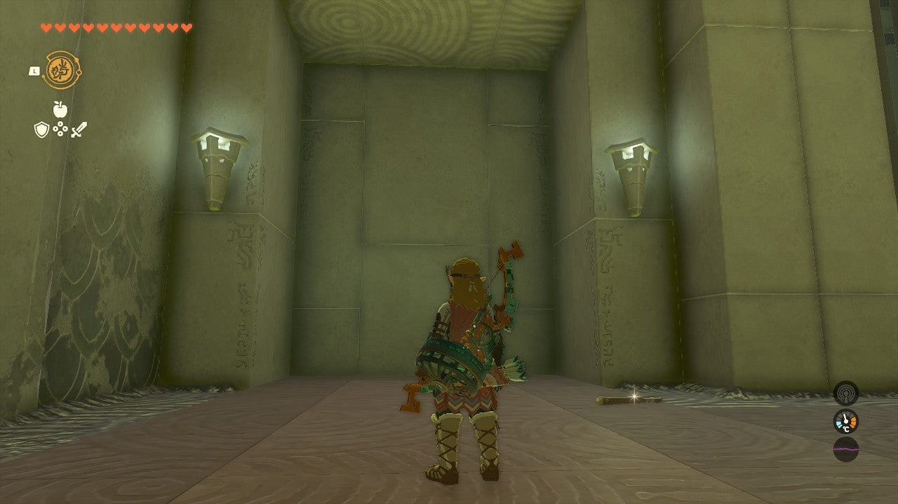

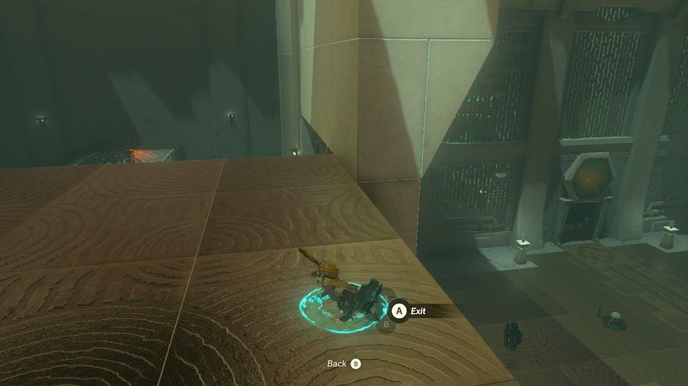

Do so and paraglide over to the archer to kill it. Now, uncover all of the sand in the room. Under one pile of sand is a beam of light. 

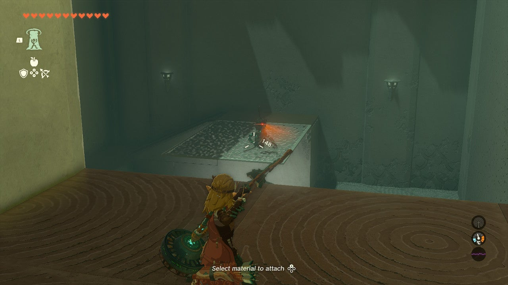

Under another pile is a reflector. Pick it up and run to the platform where the archer Construct was where the beam of light shines through the floor. 

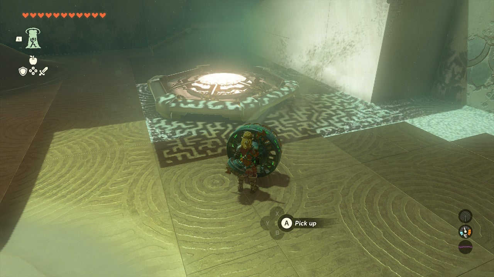

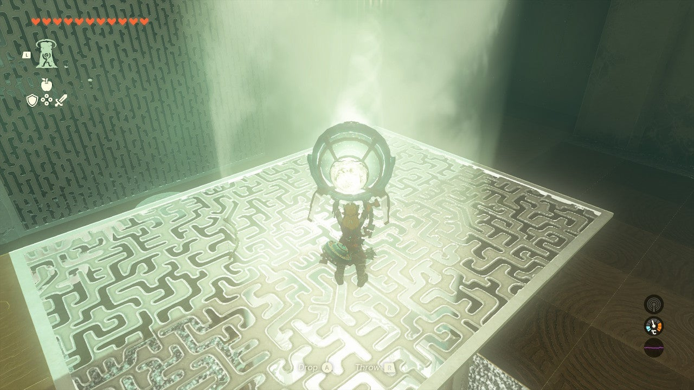

Mount the reflector so the beam aims back into the chamber just outside the exit, through the bars. 

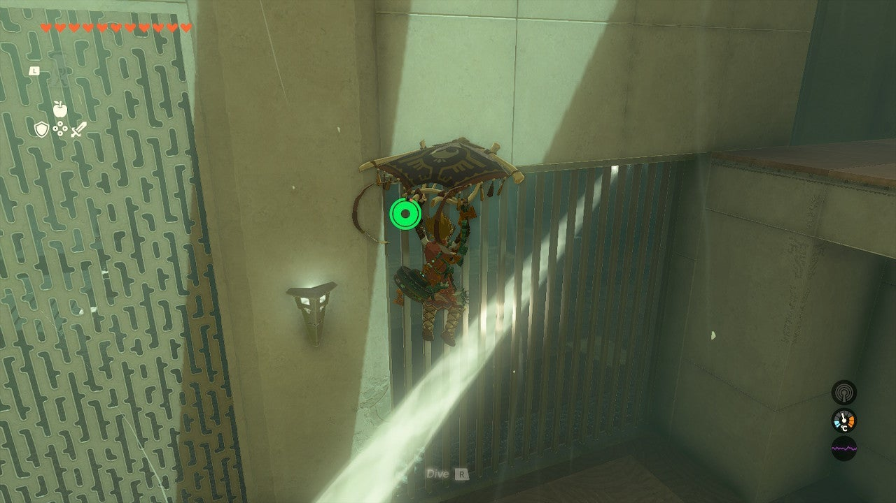

Now, Ascend back into the previous chamber by using the ledge where you entered this room. 

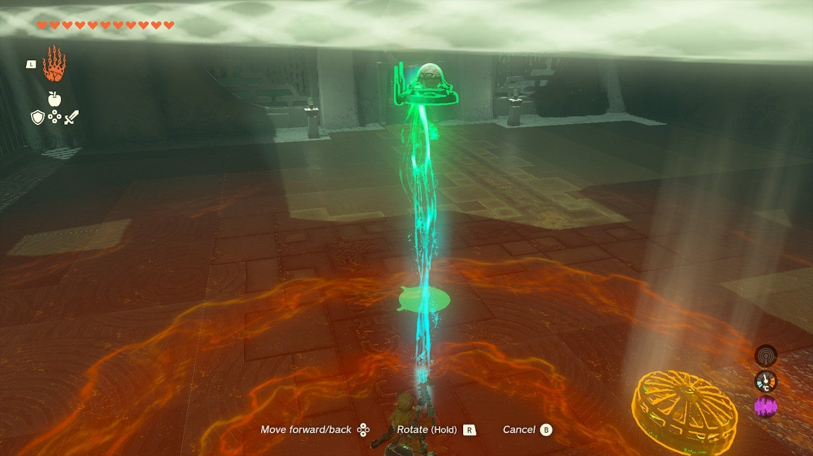

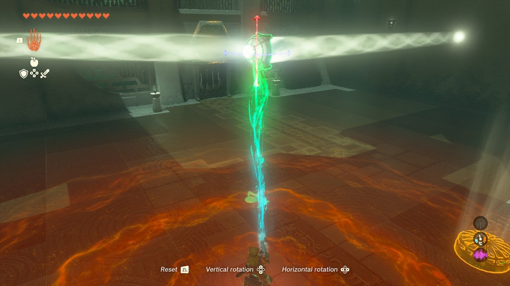

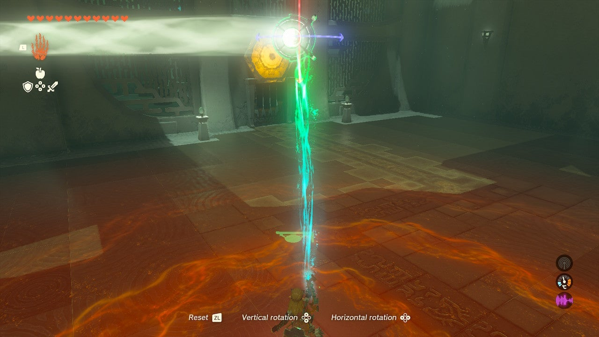

Your goal now is to reflect the beam a second time, using the first reflector you uncovered. Pick it up with the Ultra hand and point the orb side towards the exit door –a target here in orange is what you need to hit. 

You can put the reflector in the beam and turn the reflector just so and, if you keep the light on the target for a few seconds, the door will open.

Soryotanog Shrine

Congrats on solving the shrine and earning a Light of Blessing! Click or tap here to return to the rest of the Shrine Guides. You can also check out which shrines are nearby with our shrine map filter on our complete map of Hyrule.

### Up Next: Walkthrough

Previous

About IGN's Zelda TotK Guide Writers

Next

Walkthrough

### Top Guide Sections

  * Walkthrough
  * Zelda: Tears of The Kingdom Switch 2 Edition Guide
  * Zelda Notes Voice Memories
  * List of Side Quests and Side Adventures

### Was this guide helpful?

Leave feedback

Go to comments