Suariwak Shrine (Rauru’s Blessing) in Zelda: Tears of the Kingdom is a shrine located in the Gerudo Highlands region. This page contains a guide for how to locate and enter the shrine, a walkthrough for the shrine itself, and puzzle solutions as well as treasure chest locations for the TotK Suariwak shrine. 

### Treasure and Rewards

  * Big Battery

## Location/How to Reach

The Suariwak Shrine is on the northwestern edge of the Gerudo Canyon. The Shrine itself is locked behind a Side Adventure that you’ll need to complete to get access to it. This Shrine also requires you to have the full set of Yiga Armor, as it involves going undercover and infiltrating a Yiga Clan hideout. 

  * Coordinates: -2429, -1821, 0147

## Walkthrough and Puzzle Solutions

First things first, to even begin to get this Shrine, you’ll need to have collected all three pieces of the Yiga Armor Set. If you don’t have it yet, our full guide and video can help you quickly collect the pieces. If you do have it, then be sure to equip it before heading to the Yiga hideout. 

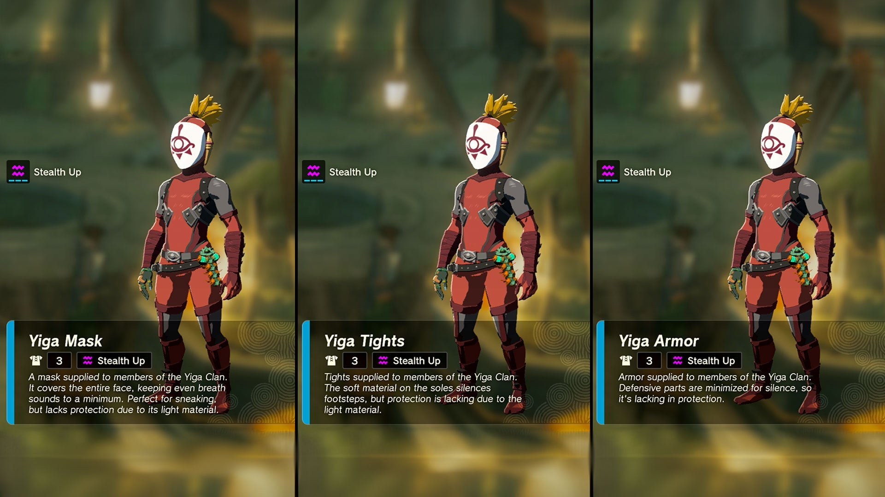

Once you’re suited up and ready to go, head to this spot on your map. 

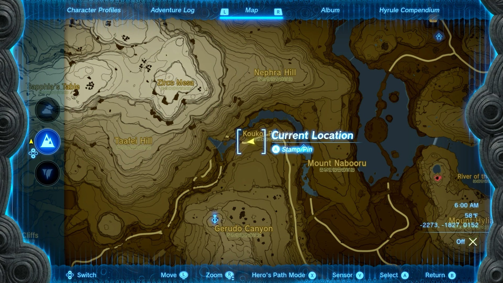

### Infiltrating the Yiga Hideout

Alongside the cliffside side, you’ll see a door with two Yiga statues out front. Knock on the door, and because Link is fully decked out in his Yiga gear, they’ll let you walk right in. 

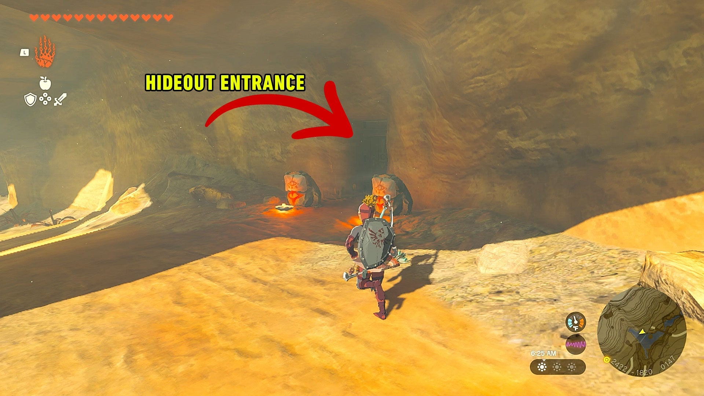

Once inside, run straight down the hallway and speak to the Yiga Blademaster. He’ll give you the Side Adventure The Yiga Clan Exam, which asks you to place five Mighty Bananas as an offering to five different nearby frog statues. He’ll even show you on the map exactly where each one is. 

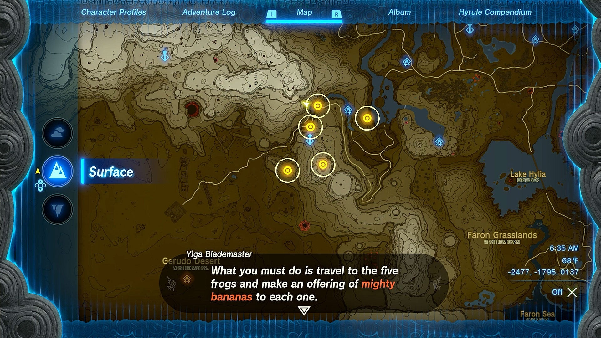

### Frog Altar #1

Once you’ve accepted the quest, run outside and face east, to the left of the waterfall. 

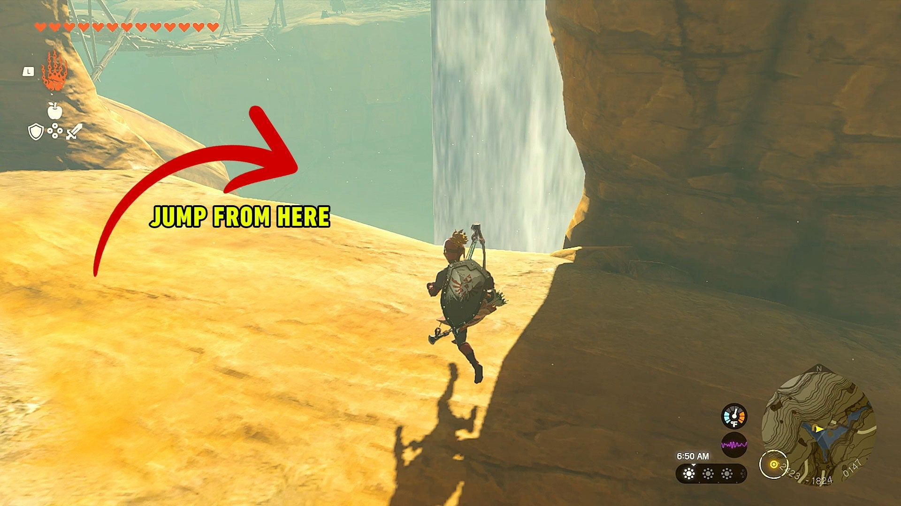

Jump off the edge and paraglide north right below you. You’ll instantly see the first frog status paired with two torches. Run up to it, open your inventory and select to hold the bananas, as if you were cooking, and drop them on the altar. That’s the first one complete! 

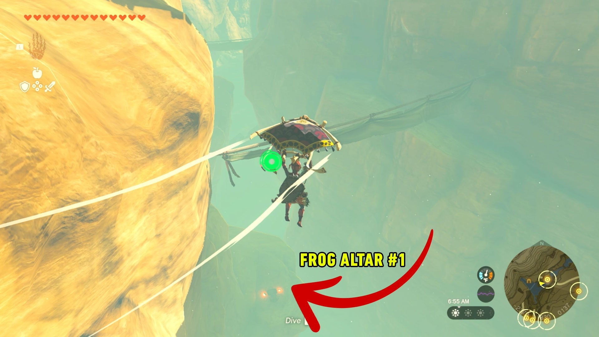

### Frog Altar #2

To get the second one, fast-travel to the nearby Gerudo Canyon Skyview Tower (you’ll be doing this a few times throughout this quest). Once there, run straight north to the next yellow dot on your minimap. Jump off the ledge again and start paragliding until your player marker is over the dot, then start dropping, occasionally pulling your paraglider out for guidance. 

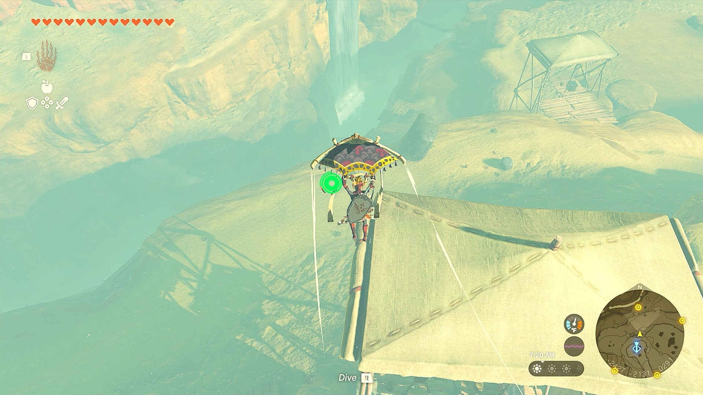

You’ll see some wood bridges up against the cliff. 

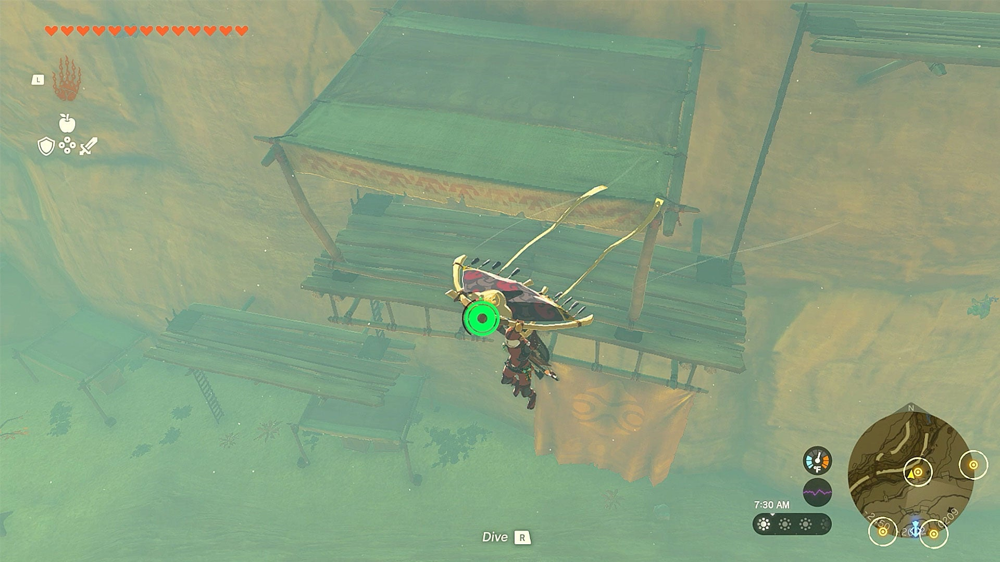

Keep falling past those until you’re near the very bottom of the canyon. Once you’re near the bottom, you’ll once again see the frog altar with the torches tucked under one of the bridges, up against the wall. Drop your bananas, and then fast-travel back to Gerudo Canyon Skyview Tower. 

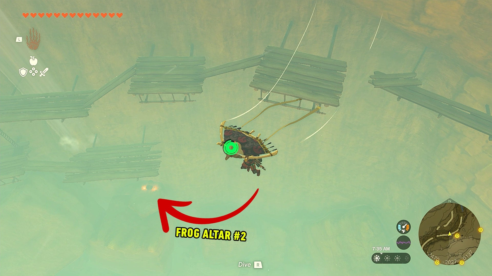

### Frog Altar #3

You’re now going to go for the most southern yellow marker. Start running south, and when you’re at the edge of the Skyview tower platform, jump and activate your paraglider, this time floating south/southeast towards the blinking marker. 

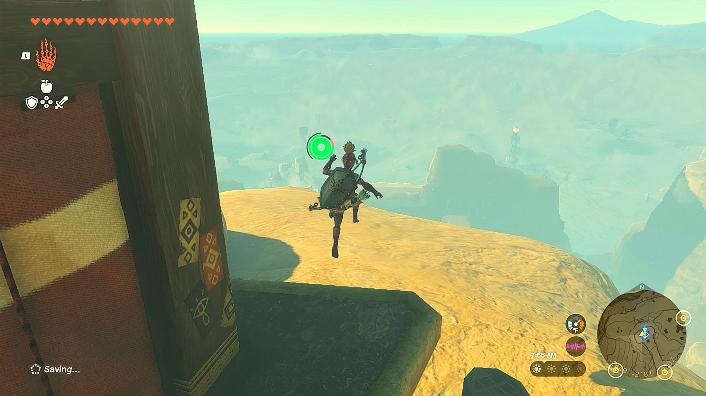

Keep gliding (occasionally dropping altitude) until you see the dot on your minimap coming towards you. If you’ve dropped low enough, you’ll see a giant wall. Keep dropping until you see a door in the wall near the bottom, which leads to the Gerudo Canyon Mine. 

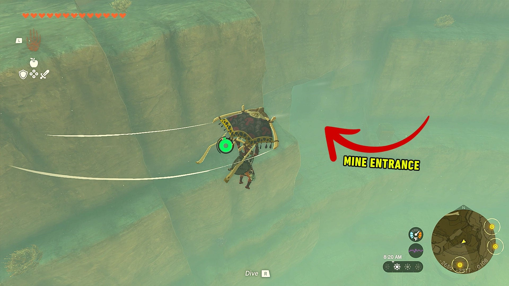

Run in, and when you enter the big room, take a quick right. You’ll want to jump the small gap and then use Ascend to get to the level above you. 

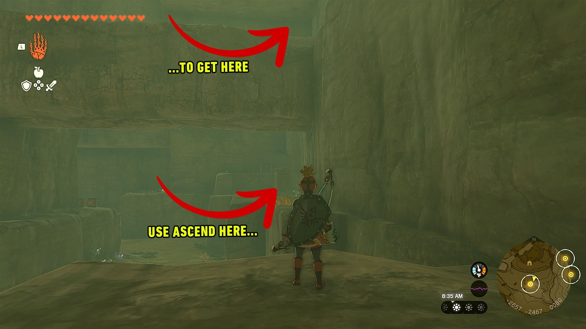

Once up there, immediately face north to spot the third altar. Drop your mighty bananas, and teleport back to Gerudo Canyon Skyview Tower. 

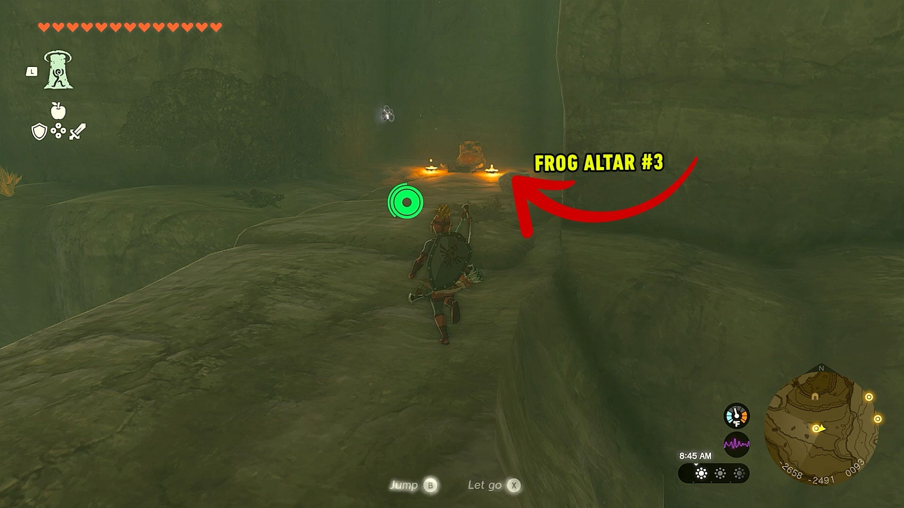

### Frog Altar #4

You’re now going to head toward the map marker in the southeast. For the first time in this quest, run into the Skyview Tower and use it to blast Link into the sky. Once you’re able to, activated your paraglider and start gliding towards the southeast map marker. 

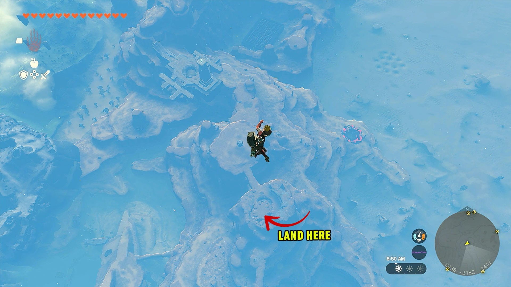

Just ride the paraglider until you’re right above the map marker and then drop down. You’ll spot the frog altar on a small rock plain in the middle of a small creek. Place your bananas, but this time do not teleport back to the skyview tower. 

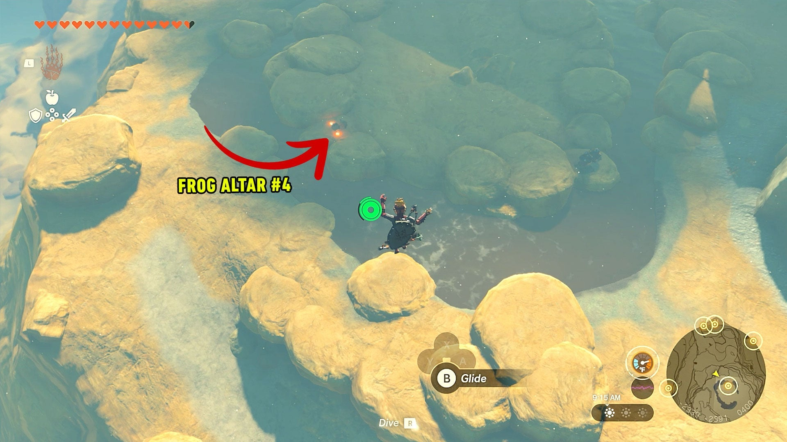

### Frog Altar #5

Now that you only have one map marker left, you’re going to just run to it from Frog Altar #4. Start running north/northeast towards the marker, and when you run out of ground, jump and activate your paraglider to start floating to the marker. 

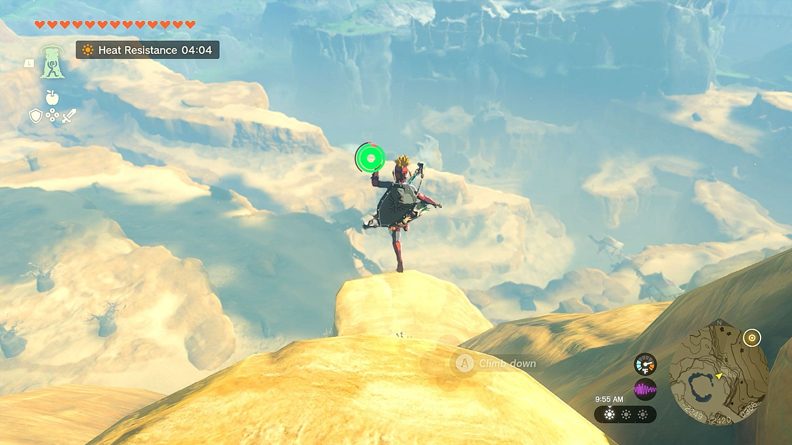

Once you’re standing on the map marker, you’ll need to go slightly east and jump off the cliff and paraglide to find the cave that the frog altar is in. You’ll see some wood bridges – land on one of them and start making you’re way down to the cave, which is at the top of the waterfall. 

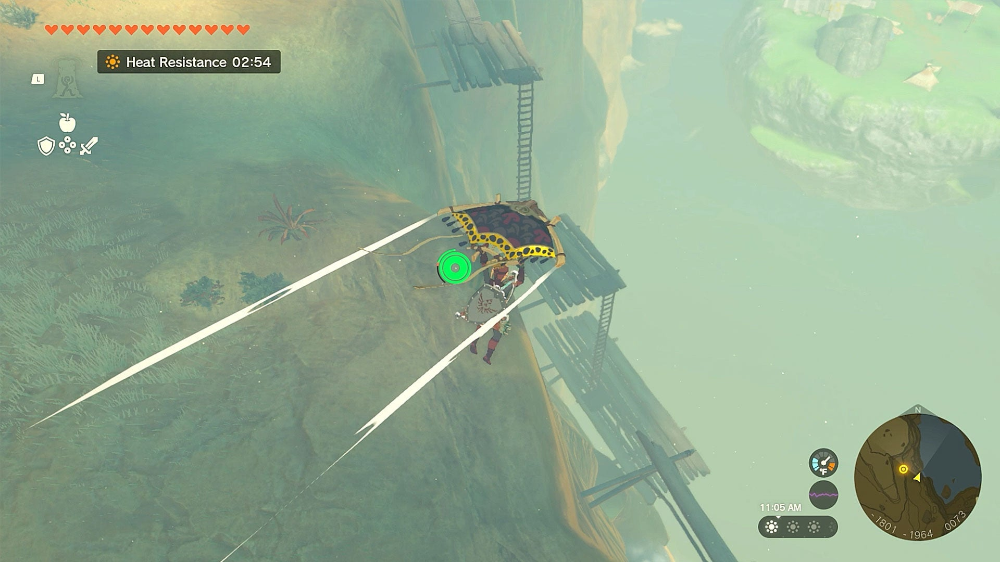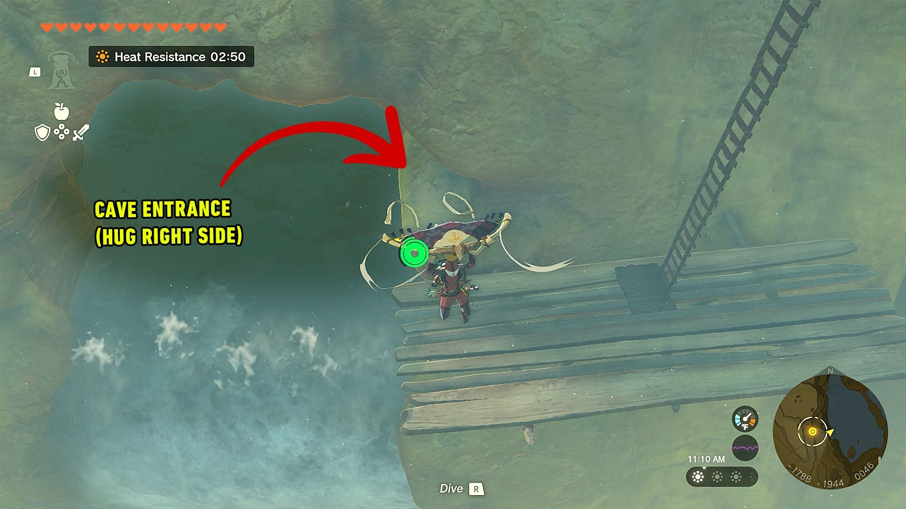

Hug the right edge, and follow the path to the right when it opens up. You’ll instantly see the frog alter and torches. Congrats! Now time to head back to the hideout. 

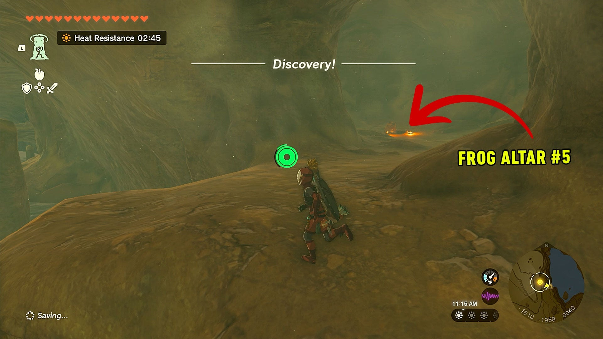

### Return to the Yiga Hideout

For the final time, teleport back to the Gerudo Canyon Skyview Tower, and head back north to the hideout, which will be indicated on your map with a final map marker. Once inside, notify the Yiga Blademaster of your success. He’ll give you some spiel about another Yiga hideout. Once that conversion is done, run through the door behind him, and the Suariwak Shrine will be waiting for you on the other side. 

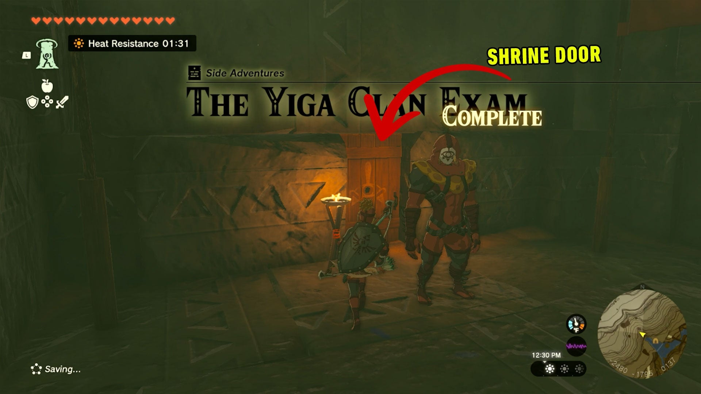

This is a Ruru’s Blessing shrine, meaning there’s no puzzle to solve! Run up the stairs to the chest to collect your Big Battery, then continue up to get your Light of Blessing! 

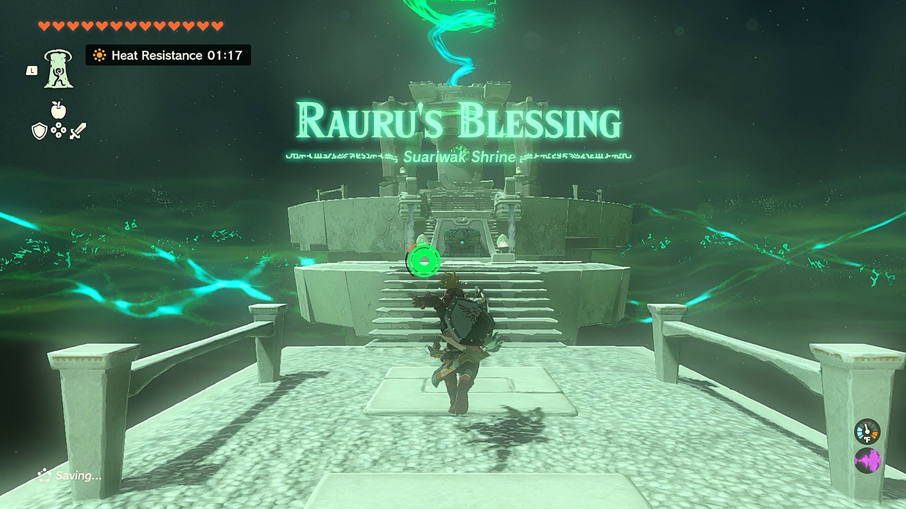

Suariwak Shrine

Congrats on solving the shrine and earning a Light of Blessing! Click or tap here to return to the rest of the Shrine Guides. You can also check out which shrines are nearby with our shrine map filter on our complete map of Hyrule.

### Up Next: Walkthrough

Previous

About IGN's Zelda TotK Guide Writers

Next

Walkthrough

### Top Guide Sections

  * Walkthrough
  * Zelda: Tears of The Kingdom Switch 2 Edition Guide
  * Zelda Notes Voice Memories
  * List of Side Quests and Side Adventures

### Was this guide helpful?

Leave feedback

Go to comments