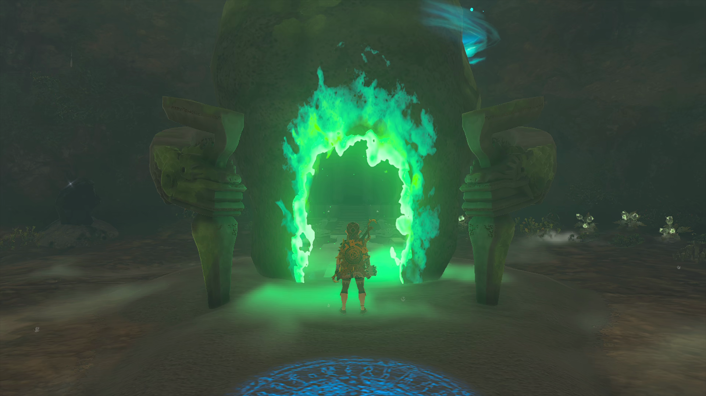
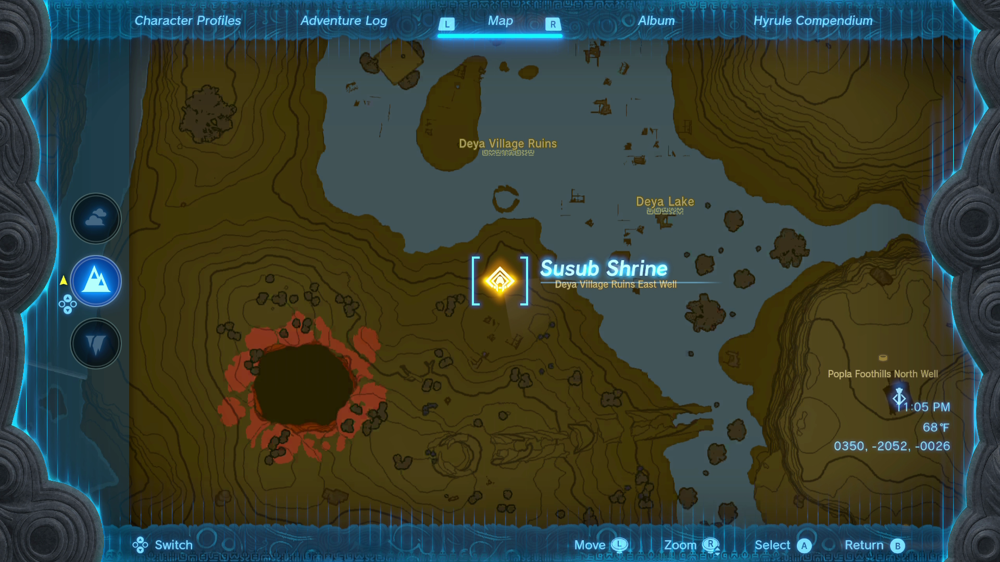
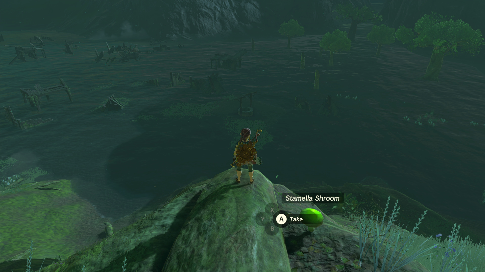
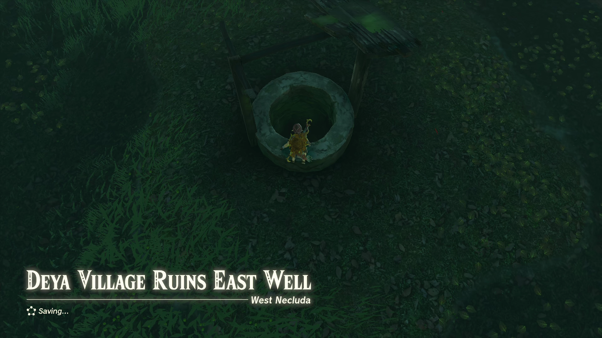
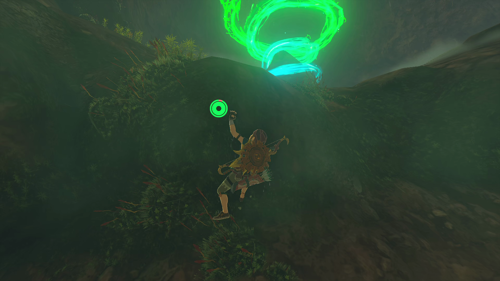

Susub Shrine (**Rauru's Blessing**) in The Legend of Zelda: Tears of the Kingdom is a shrine located in the West Necluda Region hidden inside the Deya Village Ruins East Well. It also is one of 152 shrines in TOTK (see all shrine locations). This page contains a guide for how to locate and enter the shrine, a walkthrough for the shrine itself, and puzzle solutions as well as treasure chest locations for the Susub Shrine. 

### Treasure and Rewards

  * Magic Staff

## Susub Shrine Location

The Susub Shrine is inside the Deya Village Ruins East Well. 

The Deya Village Ruins are just northwest of the **Popla Hills Skyview Tower**. 

Once you find the well, you’ll need to unseal the entrance with something like a bomb flower, and then you can hop inside. 

Once inside, hook around to the left and climb the ledge to find the Susub Shrine. 

  * Coordinates: 0350, -2052, -0026

### Inside Susub Shrine

Since this is a Rauru’s Blessing shrine, all you need to do is open the treasure chest (a Magic Staff) and collect your Light of Blessing. 

Susub Shrine

Congrats on solving the shrine and earning a Light of Blessing! Click or tap here to return to the rest of the Shrine Guides. You can also check out which shrines are nearby with our shrine map filter on our complete map of Hyrule.

### Up Next: Walkthrough

Previous

About IGN's Zelda TotK Guide Writers

Next

Walkthrough

### Top Guide Sections

  * Walkthrough
  * Zelda: Tears of The Kingdom Switch 2 Edition Guide
  * Zelda Notes Voice Memories
  * List of Side Quests and Side Adventures

### Was this guide helpful?

Leave feedback

Go to comments