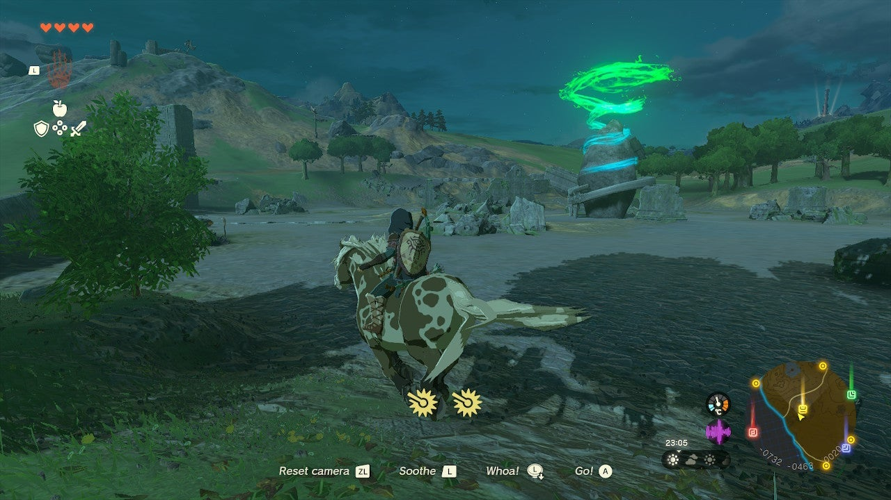
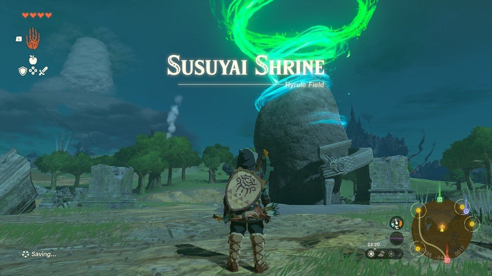
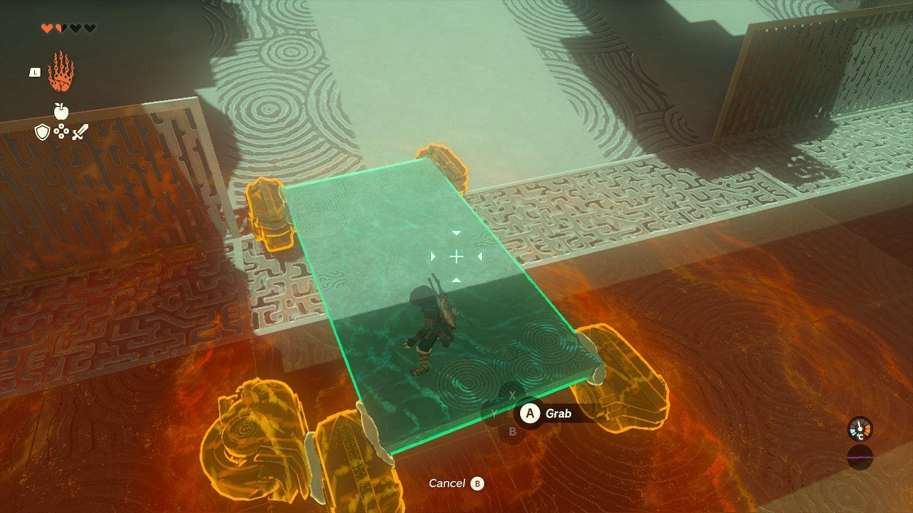
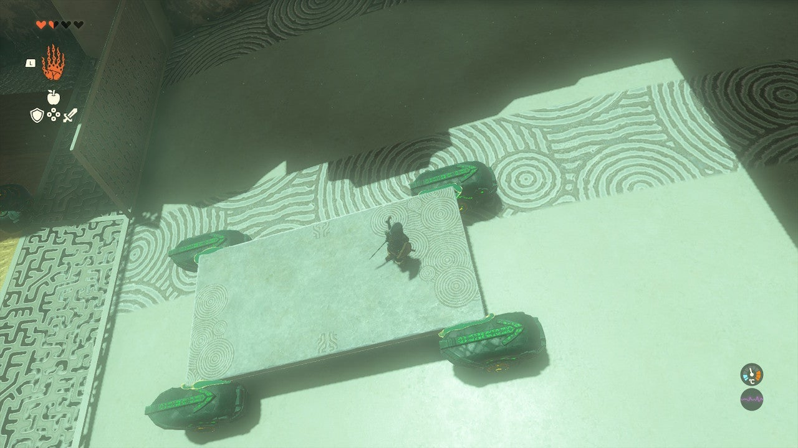
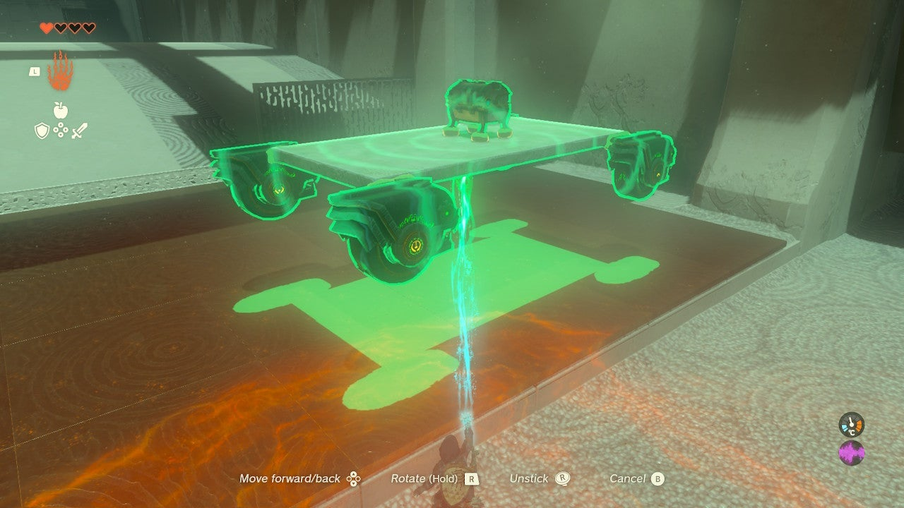
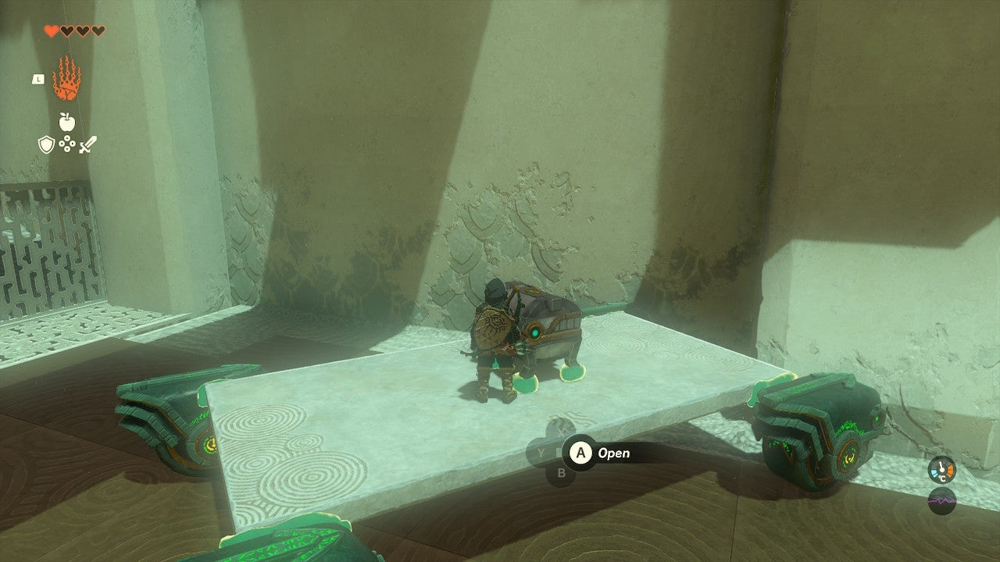
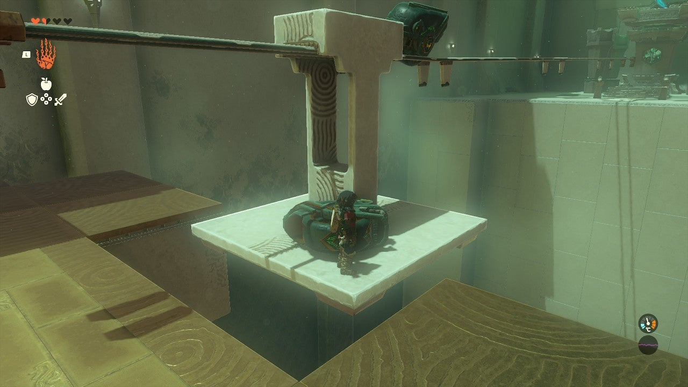

Susuyai Shrine (A Spinning Device) in The Legend of Zelda: Tears of the Kingdom is a shrine located in the Central Hyrule Region and is one of 152 shrines in TOTK (see all shrine locations). This page contains a guide for how to locate and enter the shrine, a walkthrough for the shrine itself, and puzzle solutions as well as treasure chest locations for the TotK Susuyai shrine. 

## Susuyai Shrine Treasure and Rewards

  * **Arrow****x5**

##  Susuyai Shrine Location/How to Reach

Susuyai Shrine can be found on the ground in plain sight in the Passeri Greenbelt in Central Hyrule, southwest of Lookout Landing and the Lookout Landing Skyview Tower. 

  * **Coordinates:** -0785, -0434, 0018

## Susuyai Shrine Walkthrough and Puzzle Solutions

This shrine has a basic “highway” with three lanes of high-speed traffic – like real cars, these can hurt you! Beware! Cross the highway carefully. 

## Treasure Chest Location

Take out your Ultrahand and grab the car in the middle lane, this has the treasure chest. Aim it so it drives against the wall, then you can safely climb atop and open the chest for ****Arrows******x5**. 

Your task is to get a car over the next rotating floor. To do so, you can grab one from the highway, and place it on the rotating floor, but it may get away from you before you can get on it. Try this: Take a car that’s moving, and drop it against a wall. Now you can turn off the “tires” by whacking one with your weapon. You can also fuse the car to another object on the ground to stop it. 

Place the stopped car on the rotating floor. Go in front of the car and whack a single wheel to turn on all for and hop aboard. 

Ride the car up and over. 

Here you’ll find a closed gate and a spinning wooden device. The device opens the door, but only when pressure is applied. 

Place a car in front of it, activate the car, and let the car run into the device to open the door. 

In the next area is a long track, two wheels, and a hanging platform – it’s hard to see, but the platform is already free-hanging on the track and can be moved quite easily. To move it, with you on it, grab a wheel (don’t worry, they respawn if you drop them) and attach it to the front of the top of the hanging device so it attaches to the platform and the wheel touches the track. Hop on the platform and aim an arrow up at the wheel to turn it on and get it moving. You should have arrows from that chest, earlier! 

Exit the shrine. 

Susuyai Shrine

Congrats on solving the shrine and earning a Light of Blessing! Click or tap here to return to the rest of the Shrine Guides. You can also check out which shrines are nearby with our shrine map filter on our complete map of Hyrule.

### Up Next: Walkthrough

Previous

About IGN's Zelda TotK Guide Writers

Next

Walkthrough

### Top Guide Sections

  * Walkthrough
  * Zelda: Tears of The Kingdom Switch 2 Edition Guide
  * Zelda Notes Voice Memories
  * List of Side Quests and Side Adventures

### Was this guide helpful?

Leave feedback

Go to comments