Tadarok Shrine (**Fire and Water**) in The Legend of Zelda: Tears of the Kingdom is a shrine located in the Central Hyrule Region's Great Plateau and is one of 152 shrines in TOTK (see all shrine locations). This page contains a guide for how to locate and enter the shrine, a walkthrough for the shrine itself, and puzzle solutions as well as treasure chest locations for the TotK Tadarok shrine. 

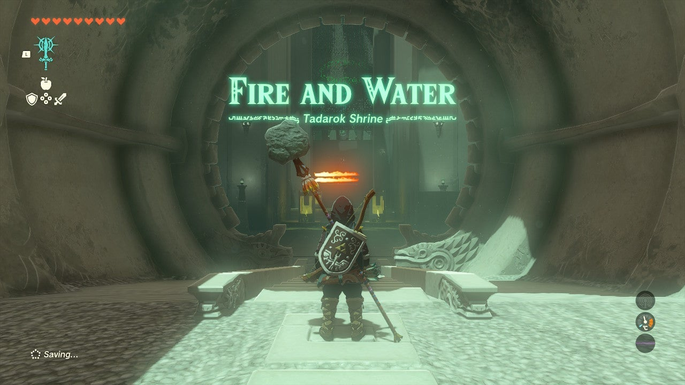

### Treasure and Rewards

  * **Mighty Zonaite Shield**

##  Tadarok Shrine Location

To get to this shrine, you'll need to find a cave under Mount Hylia. Its entrance is by the waterfall at the start of the River of the Dead. If you approach the area from the Temple of Time Ruins, look just to the west of the waterfall, and you should see a Blupee. Cross to it (we recommend climbing up to the east side of the waterfall and gliding over to dodge enemies and skip trying to cross the water). Follow the Blupee, and it'll disappear not long after you spotted it. Follow the path behind the waterfall, and you'll get the notification that you've discovered the**River of the Dead Waterfall Cave**. 

After you get the message, look up. You should see a Bubbulfrog hiding in the stalactites. Shoot it down with an arrow. 

Continue into the cave, and you'll come across a plain Like Like guarding the path forward. Electricity is an effective way to get it to show its weakness. Once its tongue is out, shoot it with an arrow and pelt it with attacks. Repeat until it's down, but be careful not to get too close if it's not stunned. Just beyond is the shrine. 

  * **Coordinates:** -1079, -2185, 0129

## Tadarok Shrine Puzzle Walkthrough

Upon entering the Tadarok shrine, you will encounter a pool with two electrical devices pumping electricity on chains into the water, making it deadly. Equip Ultrahand from your L menu and use it to lift the spheres out of the pool and set them on the far surface. 

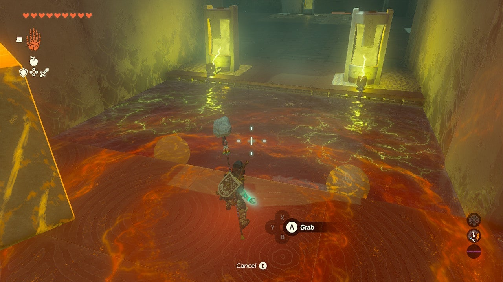

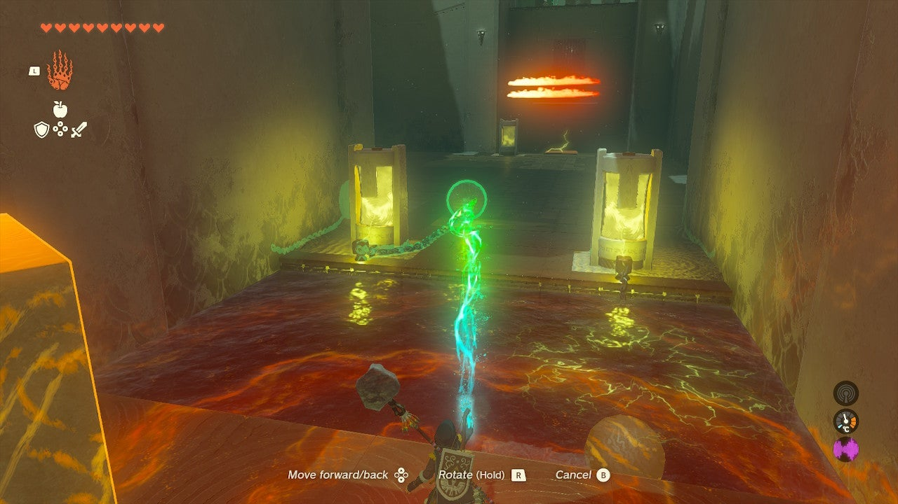

This will make the water safe to cross. Before doing so, pass the stone cube from the entrance room across the water. 

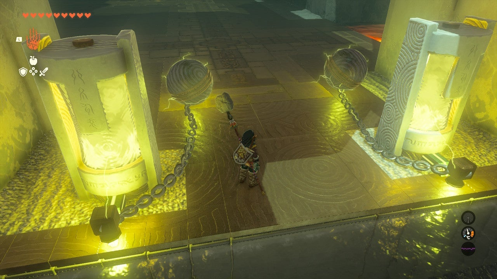

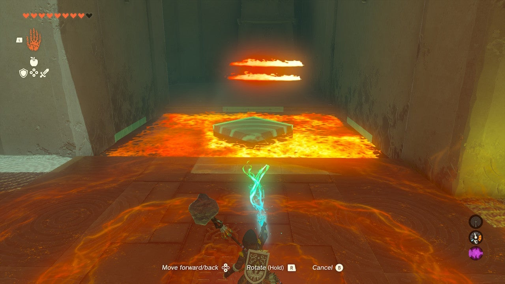

## Treasure Chest Location

To your left in the next chamber is a treasure chest. Look to your left and you will find an ice cube being deposited repeatedly into, and melted by, three flames. PLace the stone cube in front of these flames to protect the ice cube. 

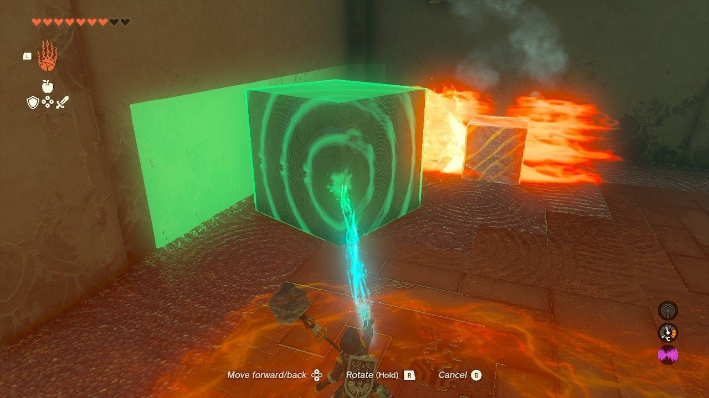

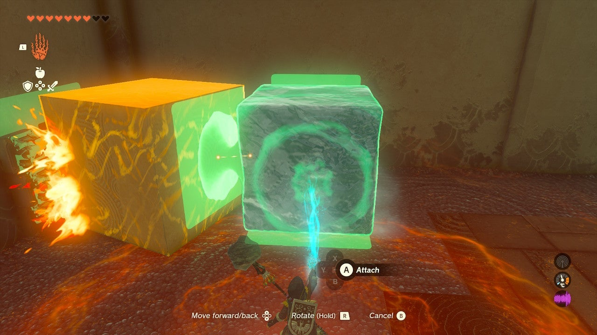

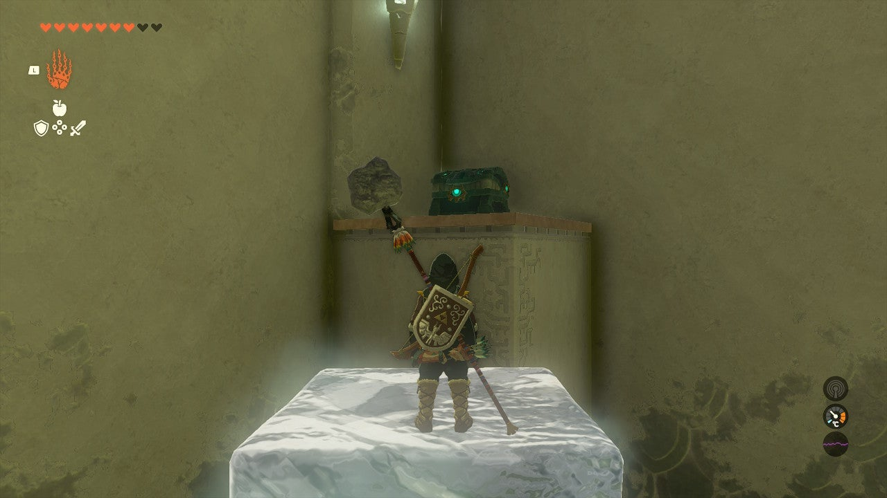

You want the ice cube to maintain its full size, so if it shrinks, let it be destroyed so it drops a full one anew. Move the ice cube with Ultra Hand to the chest and climb it to obtain your **Mighty Zonaite Shield**. 

Now, look for another electrified pool of water and a lava pool. Remove the sphere from the electrified pool to make it safe. Remove the second stone cube inside this pool. 

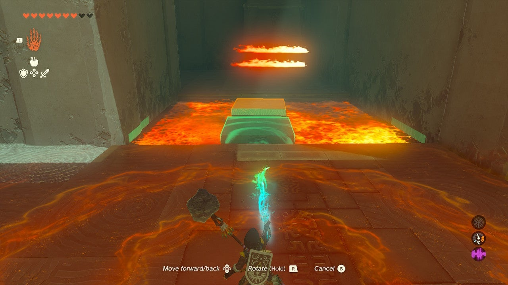

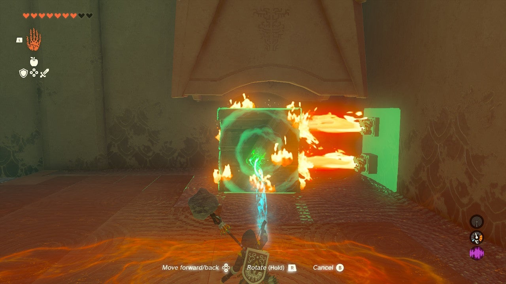

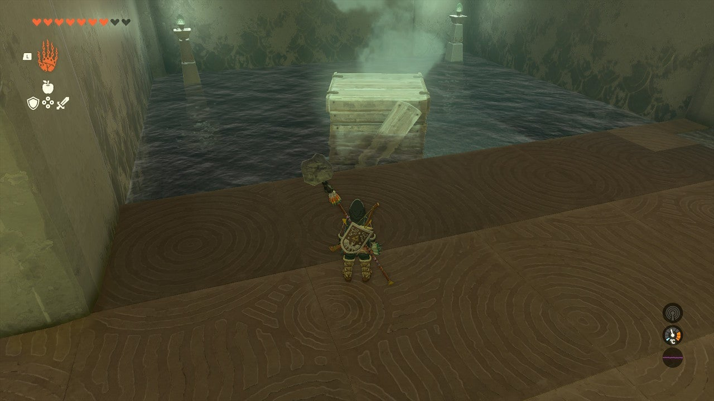

Using your Ultra Hand, move both stone cubes, the one from the pool and the one from the entrance room, into the lava pool to create a path across. 

Here, you can save the wood crate from being burned as soon as it drops with Ultrahand and douse it in the pool nearby to preserve it. 

Move this cube across the lava into the central room. 

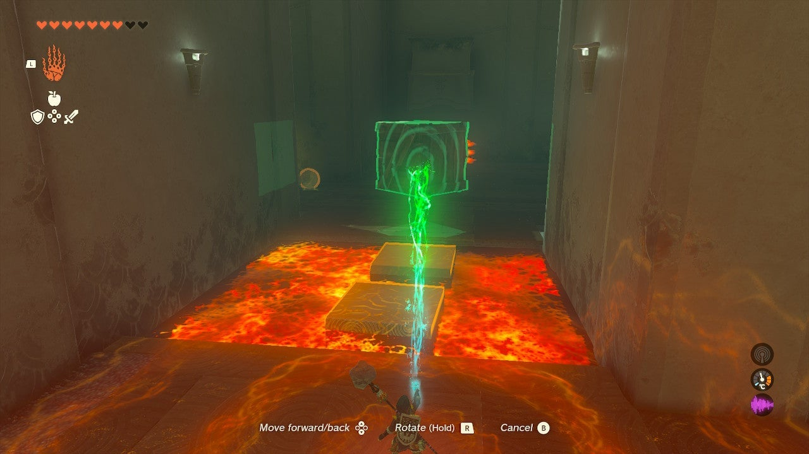

The two stone cubes, one wooden cube, and one ice cube now must be used, PLUS ASCEND, to reach the high ledge with the exit. This is a really difficult puzzle! 

Use Ultrahand to attach the two stone cubes vertically. Attach the wooden cube to the top of the stack, but on the side, halfway peaking up and over, creating a step on the top, but up and to the side. 

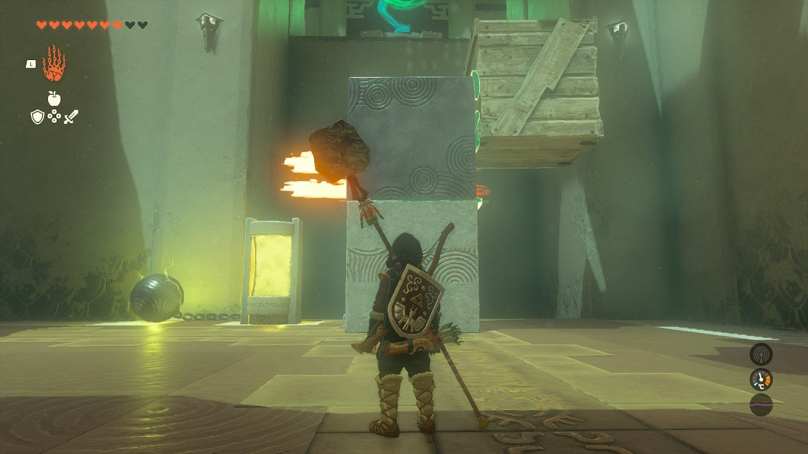

Lift the bottom of this stack with Ultrahand to the platform with the fire but be careful not to expose the wood, the two stone cubes will be safe. 

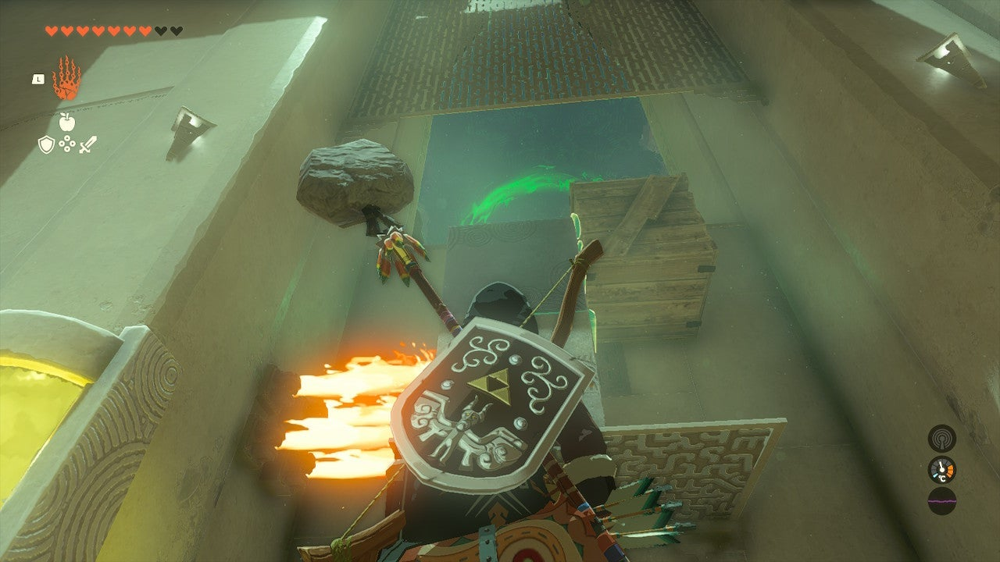

Block the flames with the stone cubes, and the wood cube will be just high enough to reach the platform above, it will be about half a cube down. 

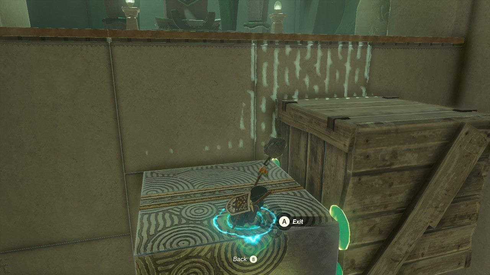

You can pass through the stone cubes with Ascension, but you need to get under them. 

Place the ice cube under the stone cubes and activate Ascend to go through the two stone cubes, emerge atop, and then hop onto the wood cube and up to exit. 

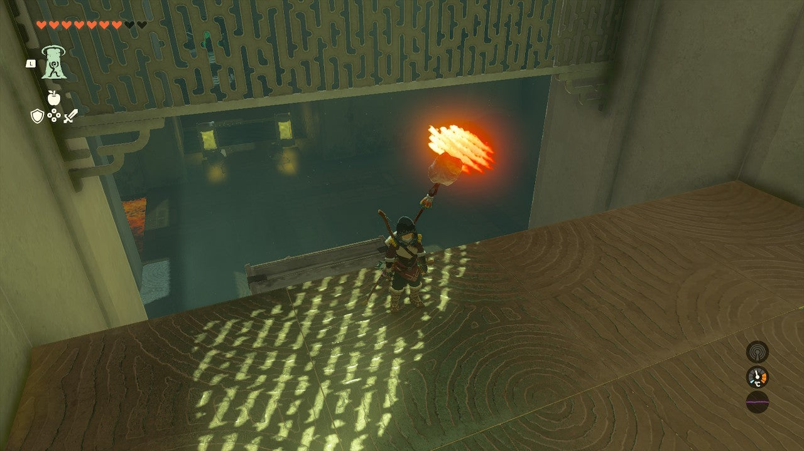

Tadarok Shrine

Congrats on solving the shrine and earning a Light of Blessing! Click or tap here to return to the rest of the Shrine Guides. You can also check out which shrines are nearby with our shrine map filter on our complete map of Hyrule.

### Up Next: Walkthrough

Previous

About IGN's Zelda TotK Guide Writers

Next

Walkthrough

### Top Guide Sections

  * Walkthrough
  * Zelda: Tears of The Kingdom Switch 2 Edition Guide
  * Zelda Notes Voice Memories
  * List of Side Quests and Side Adventures

### Was this guide helpful?

Leave feedback

Go to comments