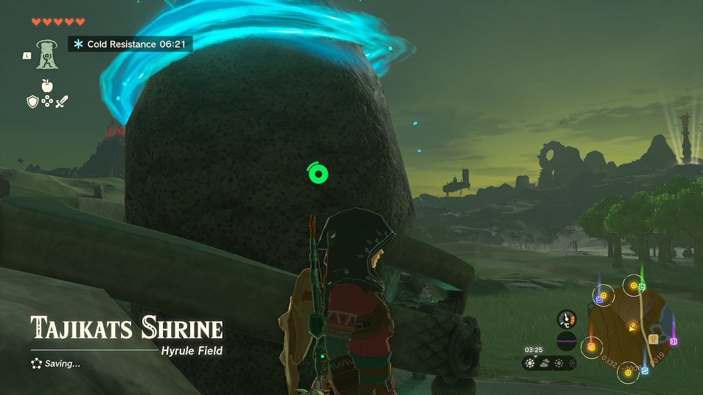

Tajikats Shrine (Building With Logs) in The Legend of Zelda: Tears of the Kingdom is a shrine located in the Central Hyrule Region. This page contains a guide for how to locate and enter the shrine, a walkthrough for the shrine itself, and puzzle solutions as well as treasure chest locations for the TotK Tajikats shrine. 

### Treasure and Rewards

  * ****Spiky Shield****

##  Location/How to Reach

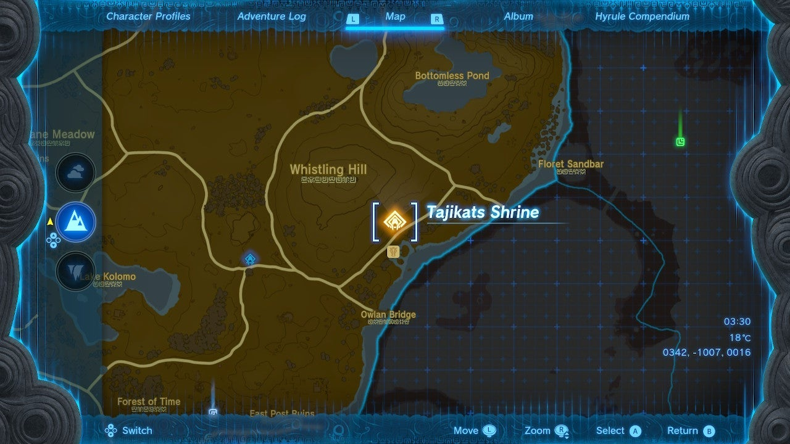

Tajikats Shrine is on the surface of the bank of the Hylia River in Central Hyrule. It is south and a bit east of Lookout Landing and is near the Riverside Stable, serving as the warp point for the stable. 

  * **Coordinates:** 0352, -0999, 0016

## Walkthrough and Puzzle Solutions

In the first room you’ll find a log and a ledge. Press L and select Ultrahand, then press L again and aim at the log to pick it up. Now, while holding the log aloft, hold R. Rotate the log so its facing away from you and look for a green shadow – you want this shadow to be on the upper part of the ledge. Drop the log to create a slanted walkway upward. 

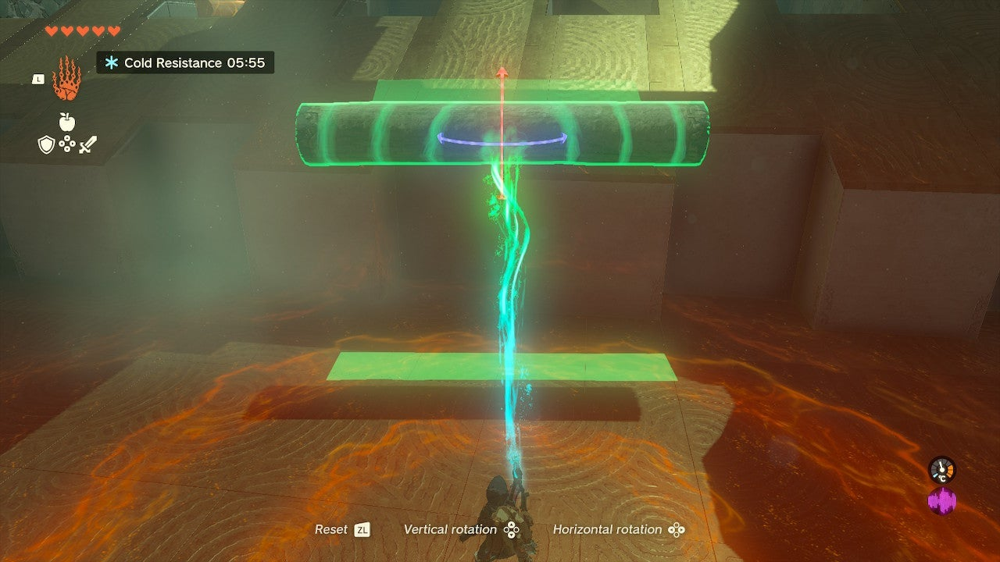

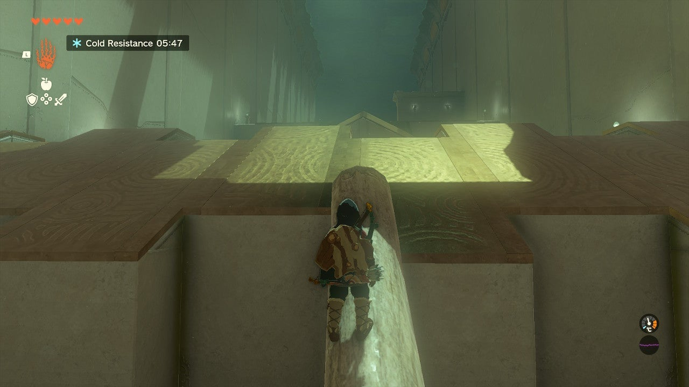

In the second room is a large pool, two logs, and a pyramid-like structure with a gap. For this, you will need two logs stock together. Use Ultrahand on one log and lay it right beside the other, and bind them together with A. 

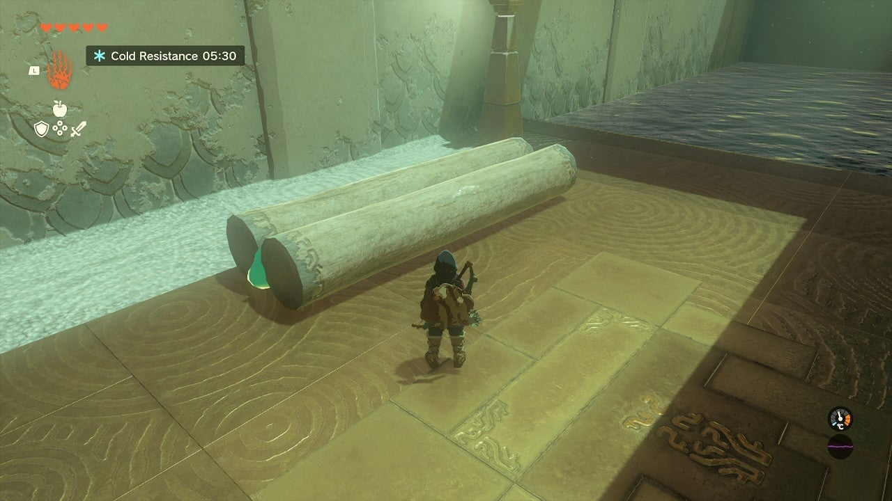

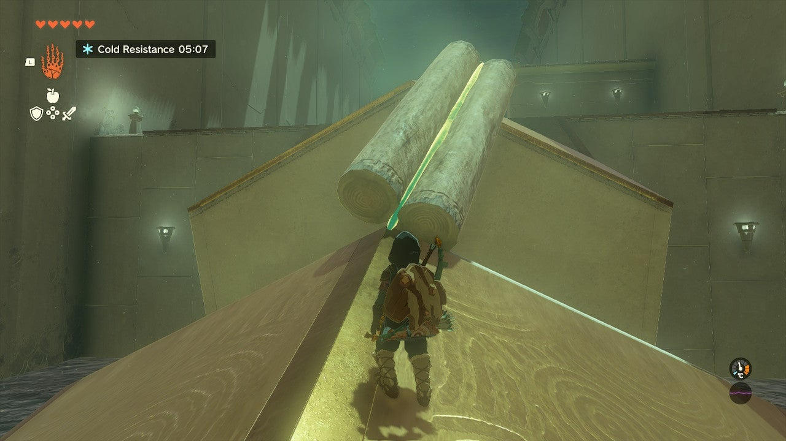

Pick up these two logs and create a bridge right at the point of the structure to cross it – remember to use those green shadows to line up just where they will land, as you can drop them from a height or rotate them to a more accommodating angle. 

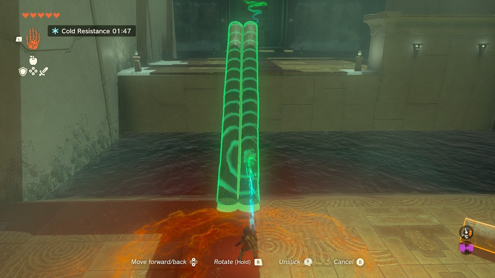

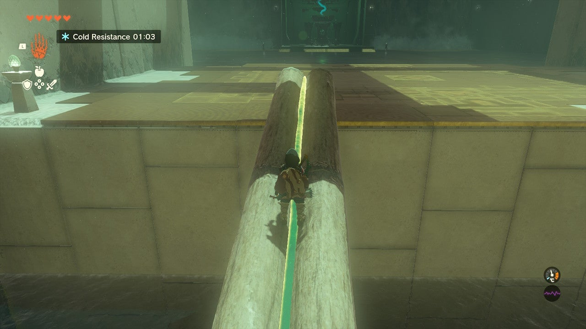

The next area features a watery gap and a ledge. This time there is a strong current in the water, pushing you back! For this you will need the previous two logs. Carry them to the new area and create three pairs of logs like you did before. Now, attach each pair end-to-end. This will give you a three-log-long bridge made of three pairs, so six logs total. Drop it over the gap and run across. 

The exit, and a treasure chest, lies across a vast pool – for this you will need to make a boat out of fans and logs. 

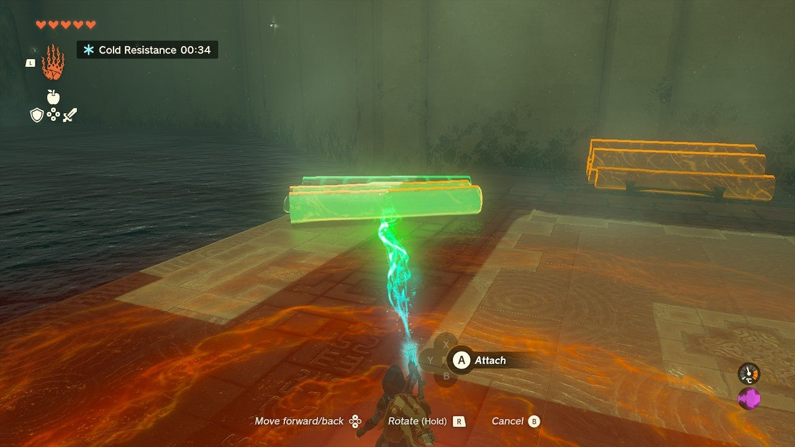

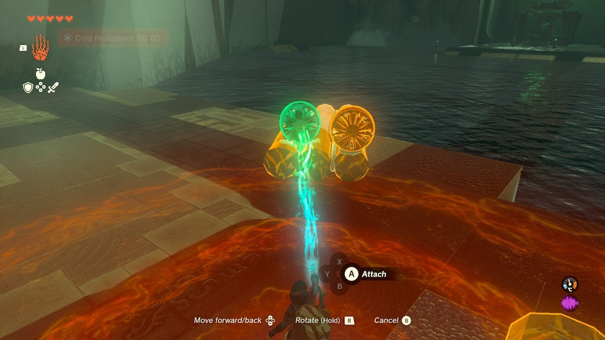

Take three logs and connect them side-by-side to form a raft. Mount the two fans on either side of the rear, as pictured, make sure they are evenly spaced so they don’t push the boat in a circle. Aim the fans so the blades are backwards and the air pushes away from the front of the boat. 

## Treasure Chest Location

Don’t set out straight for the exit – there’s a chest on a small island to the left! Facing the exit, turn left and look for a boat landing ramp against the wall. Put in here, aiming your vessel towards the left wall so it rides it all the way to the chest island. Get on the boat and smack the fans with a weapon to turn them on. This should propel you to the island, where you’ll find a ****Spiky Shield****. 

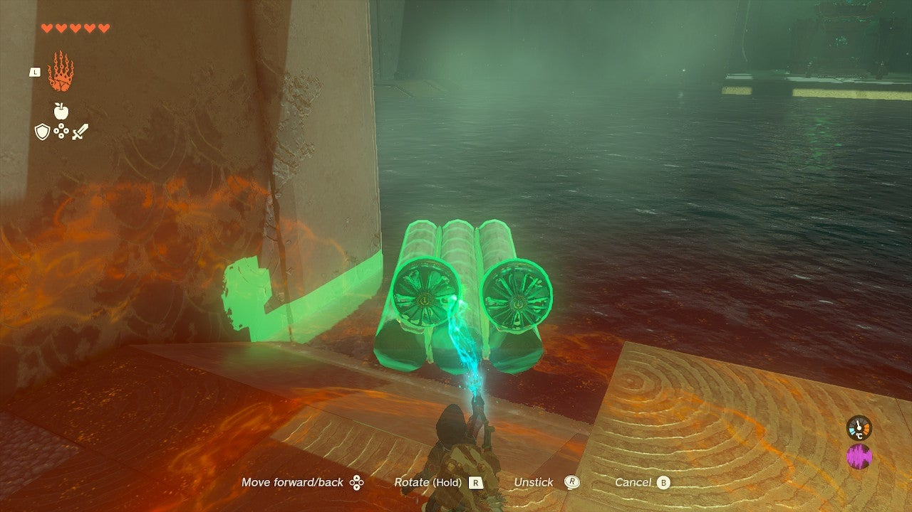

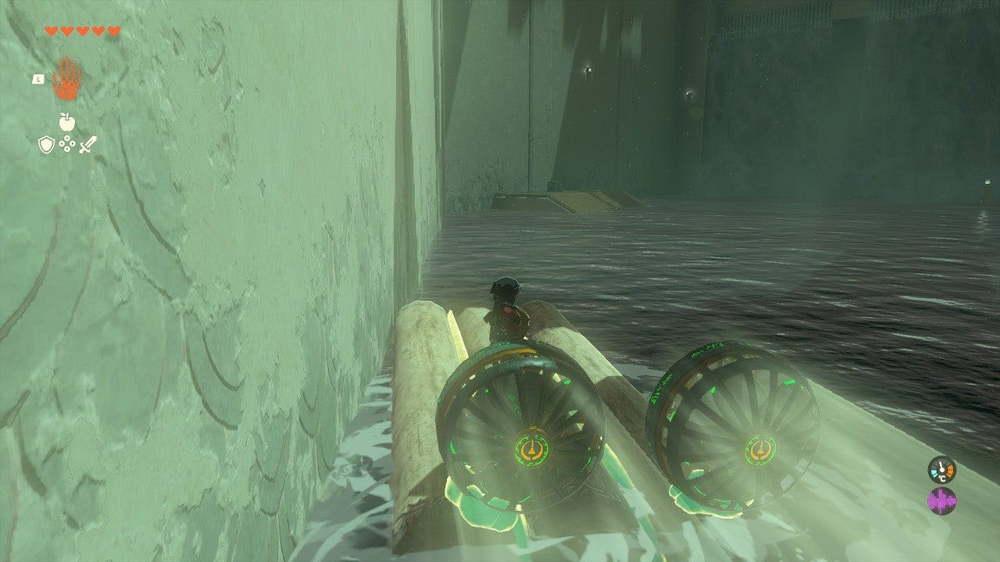

You can swim directly to the exit here, dashing to overcome the current. If you can’t make it then you can go back to your boat and try again – it will be pushed back to the landing. But trust us, you can make this swim with your starting stamina level! 

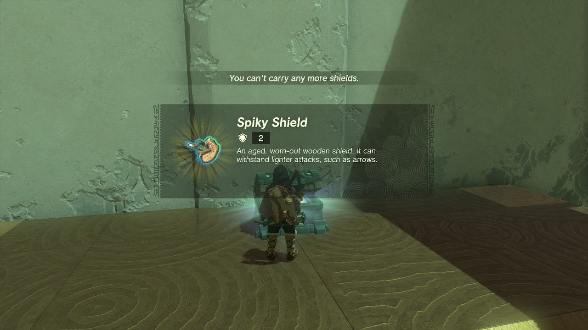

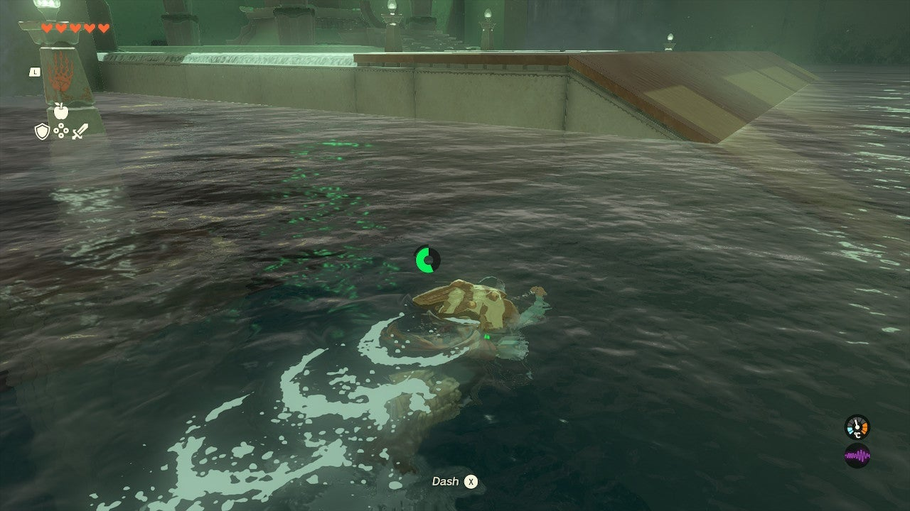

Tajikats Shrine

Congrats on solving the shrine and earning a Light of Blessing! Click or tap here to return to the rest of the Shrine Guides.

### Up Next: Walkthrough

Previous

About IGN's Zelda TotK Guide Writers

Next

Walkthrough

### Top Guide Sections

  * Walkthrough
  * Zelda: Tears of The Kingdom Switch 2 Edition Guide
  * Zelda Notes Voice Memories
  * List of Side Quests and Side Adventures

### Was this guide helpful?

Leave feedback

Go to comments