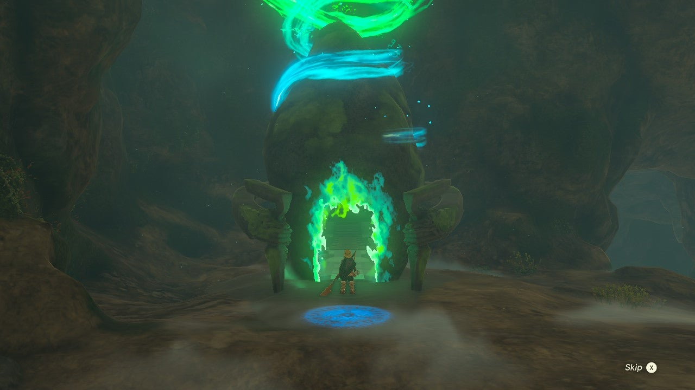
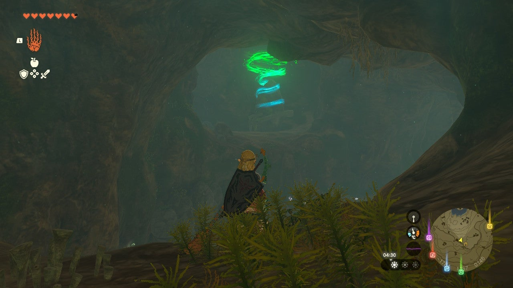
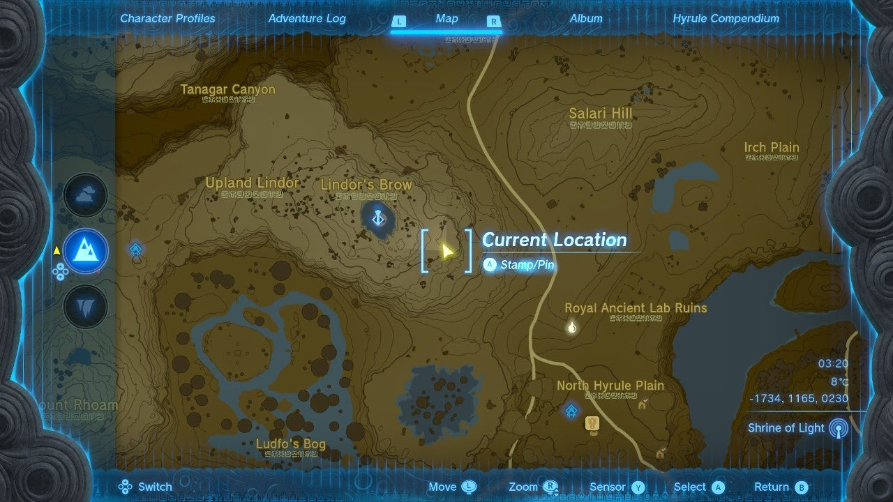
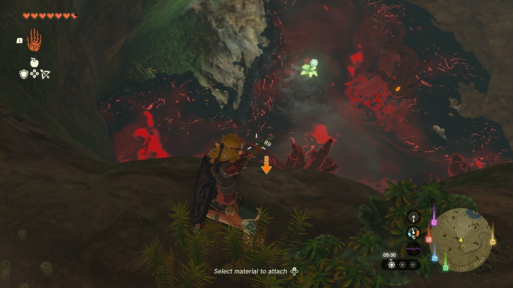
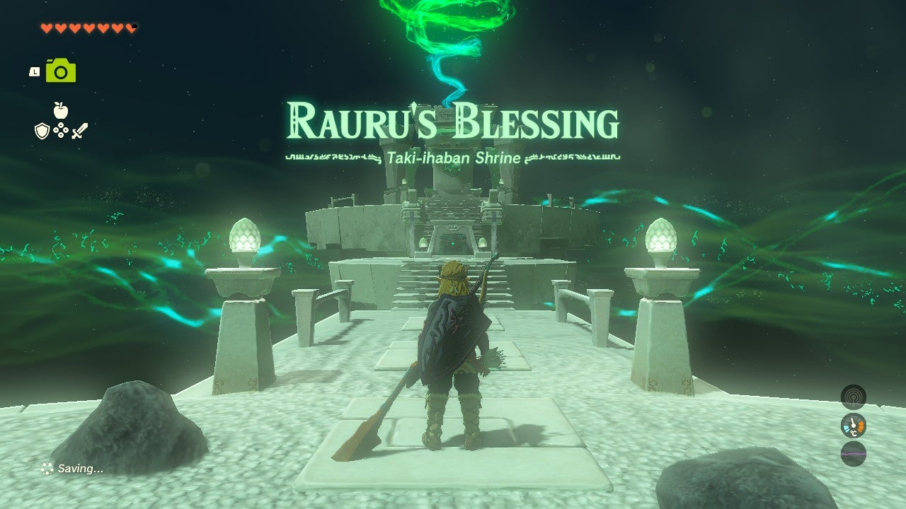

Taki-ihaban Shrine (Rauru's Blessing) in The Legend of Zelda: Tears of the Kingdom is a shrine located in the **Hyrule Ridge** Region near the Lindor's Brow Skyview Tower. This page contains a guide for how to locate and enter the shrine, a walkthrough for the shrine itself, and puzzle solutions as well as treasure chest locations for the TotK Taki-ihaban shrine. 

### Treasure and Rewards

  * Large Zonai Charge

## Location/How to Reach

You can only find the Taki-ihaban Shrine by entering through the Lindor's Brow Cave. 

Upon entering you'll descend down a long tunnel into water. Swim out and walk along the path to see the shrine deeper into the cave. Before you get there, though, you'll need to cross a large lower area. 

Unfortunately **a swarm of Gloom Hands is also roaming there**. 

It's advised that you have a way to cross quickly (like the reward for completing the Rito storyline) or have a way to destroy them. Either way, take care dodging those deadly enemies. 

  * Coordinates: -1830, 1193, 0147

## Walkthrough and Puzzle Solutions

As a Rauru's Blessing shrine you won't face any puzzles or challenges here. Simply collect the treasure (Large Zonai Charge) and the Light of Blessing. 

Taki-ihaban Shrine

Congrats on solving the shrine and earning a Light of Blessing! Click or tap here to return to the rest of the Shrine Guides.

### Up Next: Walkthrough

Previous

About IGN's Zelda TotK Guide Writers

Next

Walkthrough

### Top Guide Sections

  * Walkthrough
  * Zelda: Tears of The Kingdom Switch 2 Edition Guide
  * Zelda Notes Voice Memories
  * List of Side Quests and Side Adventures

### Was this guide helpful?

Leave feedback

### In This Guide

The Legend of Zelda: Tears of the KingdomNintendo EPD

Initial Release: May 12, 2023

Learn more

Go to comments