Taninoud Shrine (Rauru’s Blessing) in The Legend of Zelda: Tears of the Kingdom is a shrine located in the Hebra Sky. This page contains a guide for how to locate and enter the shrine, a walkthrough for the shrine itself, and puzzle solutions as well as treasure chest locations for the Taninoud shrine, which is associated with the The East Hebra Sky Crystal Shrine Quest, can be started by reaching and activating the Shrine pad. 

### Treasure and Rewards

  * Topaz

## Location/How to Reach

From Pikida Stonegrove Skyview Tower, launch into the air and look down and east – a chain of islands leads away from the Tower. 

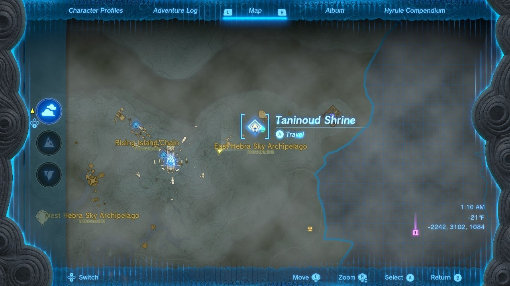

Land on a nearby one and look for a moving platform – any one with an enemy firing rockets indicates that there are free rockets nearby, so try one of the ones along the long stone walkway. 

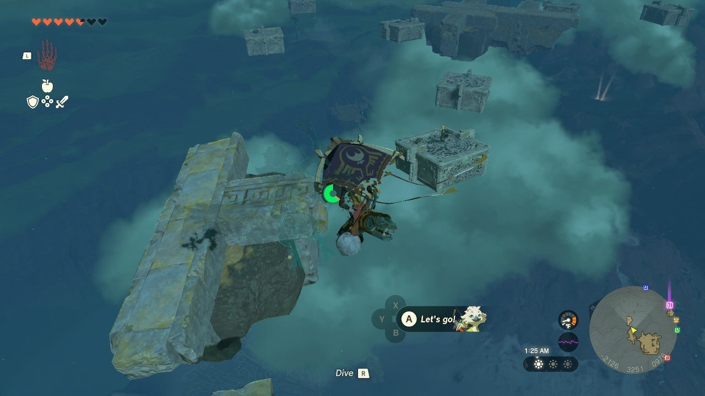

Attach the rockets to the platform and either use both to get maximum height or use at least one for height and one to pull you towards the eastern islands. 

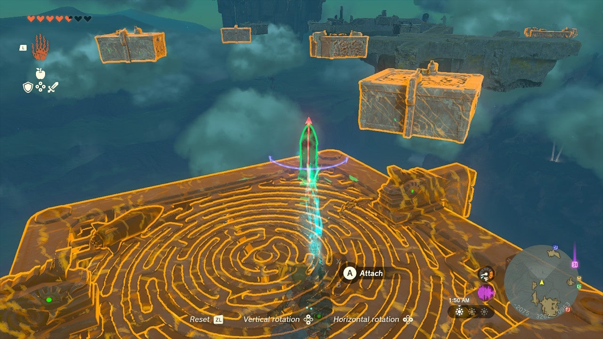

From here you should be able to land on Taninoud Shrine’s island, the one with the stone launcher and rotating wheel. Interact with it to start The East Hebra Sky Crystal Shrine Quest. 

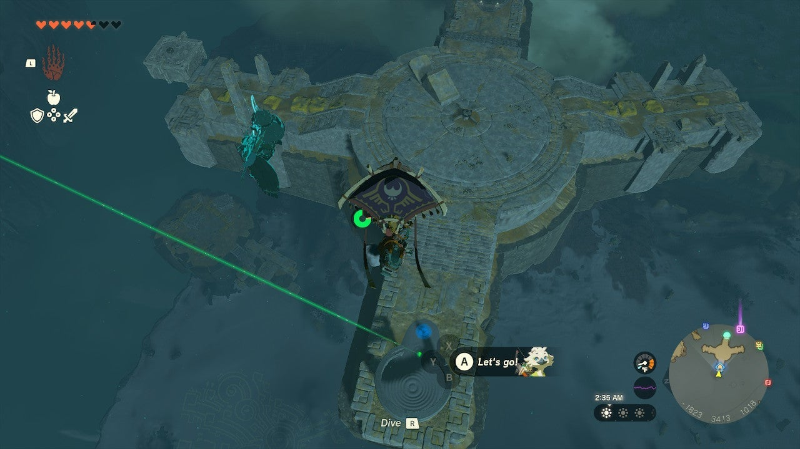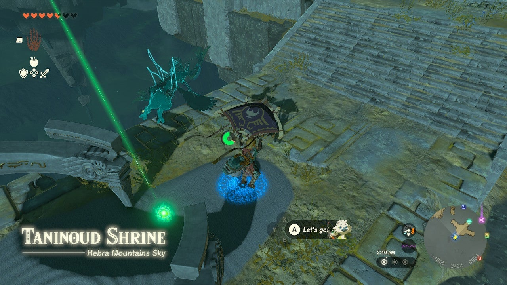

  * Coordinates: -1805, 3403, 0948

## The East Hebra Sky Crystal Walkthrough

This shrine points a green laser beam at a nearby island. It looks like it goes straight into a rock wall. Start by approaching the big wooden wheel in the middle of the Shrine’s island and pointing the launcher at the big island the green laser points at to the north. Make sure you have a sharp weapon before you launch – plenty are on the ground nearby. 

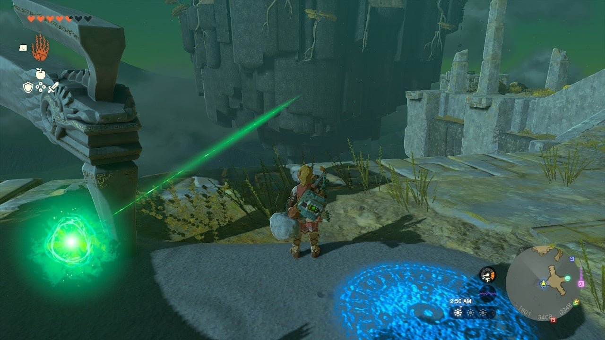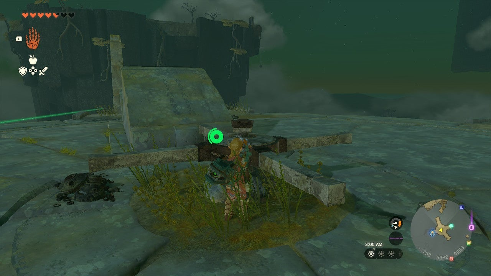

Use it and your paraglider to get up above the island. Now, cross to the northeast side and drop down to a ledge in front of a wall of vines below. Use a sharp weapon to cut the walls of vines to reach the green crystal in the back of the cave. 

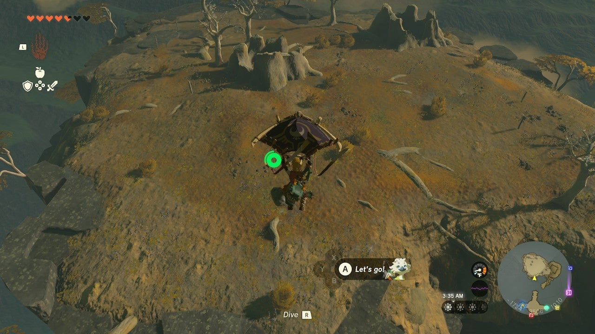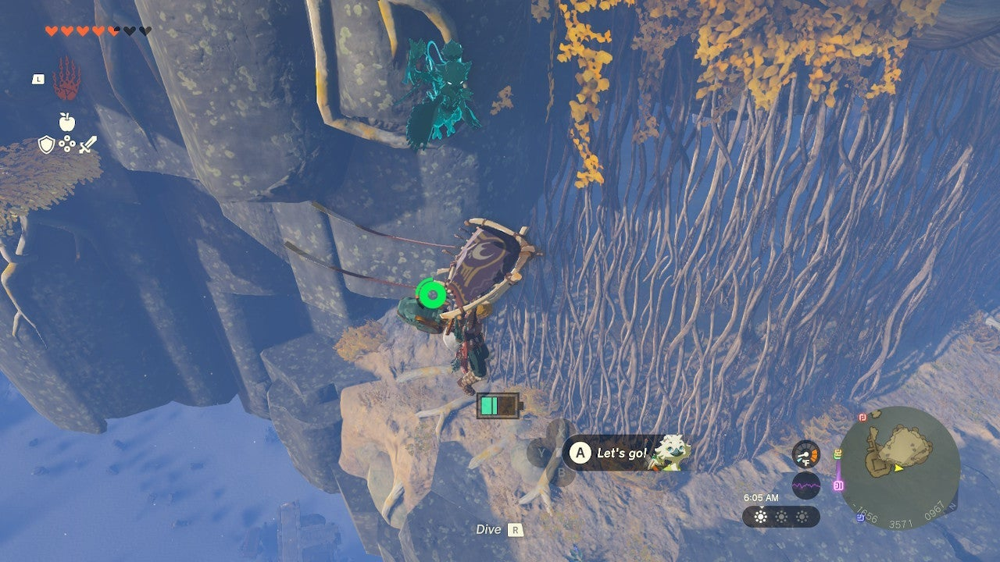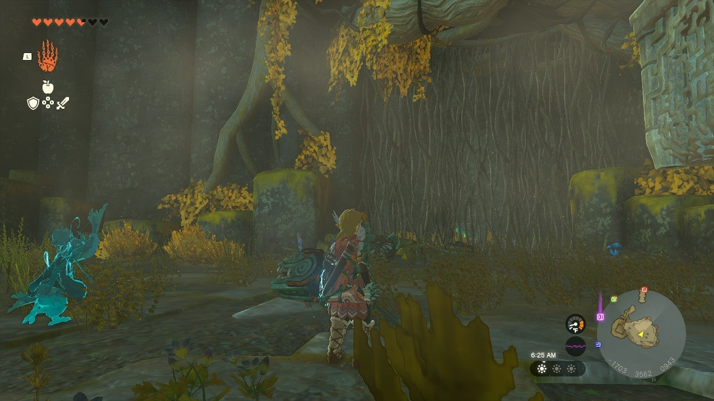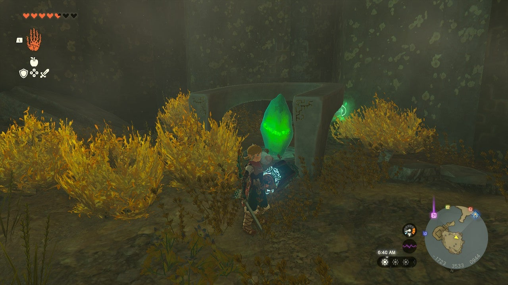

Now, attach the green crystal with your Ultrahand to the platform inside the cave. 

Use the parts on the ground to attach two fans to the lower “rear” of the platform, and the control stick to the “front.” Attach the batteries to the fans. 

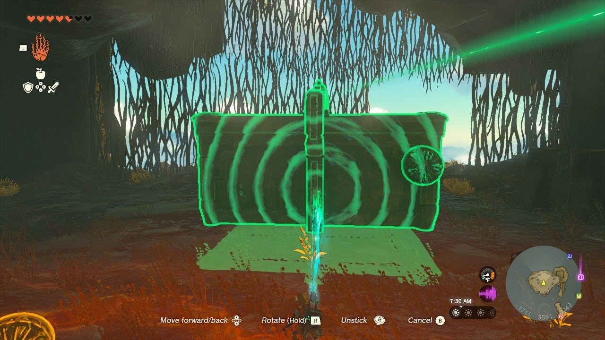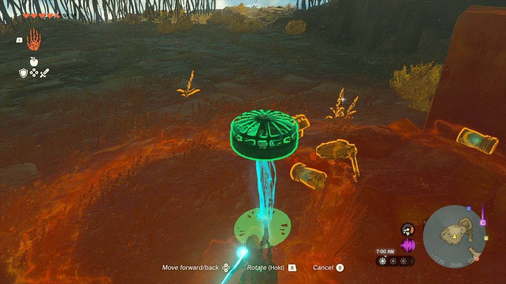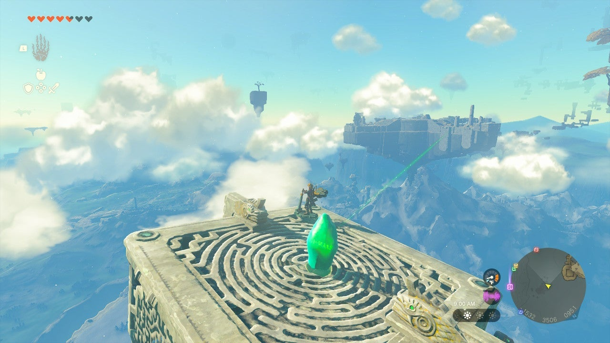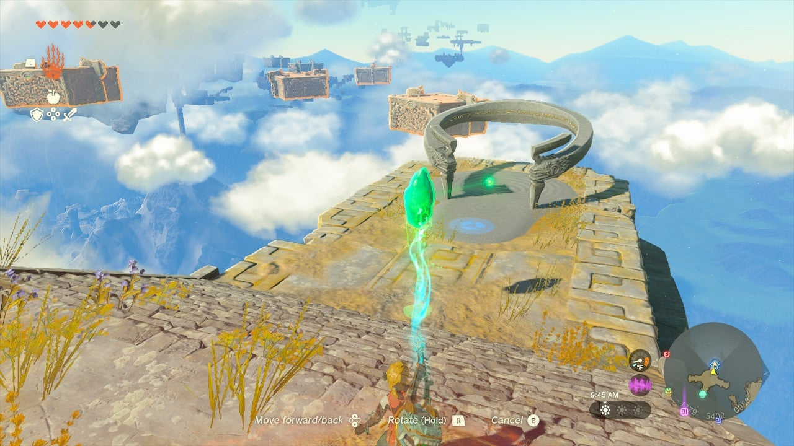

This makeshift plane will get you back to the Shrine platform. Control it by getting aboard the device and activating the control stick. Note you can press DOWN to move upwards. 

Ride the device over and park it by leaving the controls or hitting the side of the Shrine island. Remove the crystal with Ultrahand and walk it to the Shrine. 

The East Hebra Sky Crystal

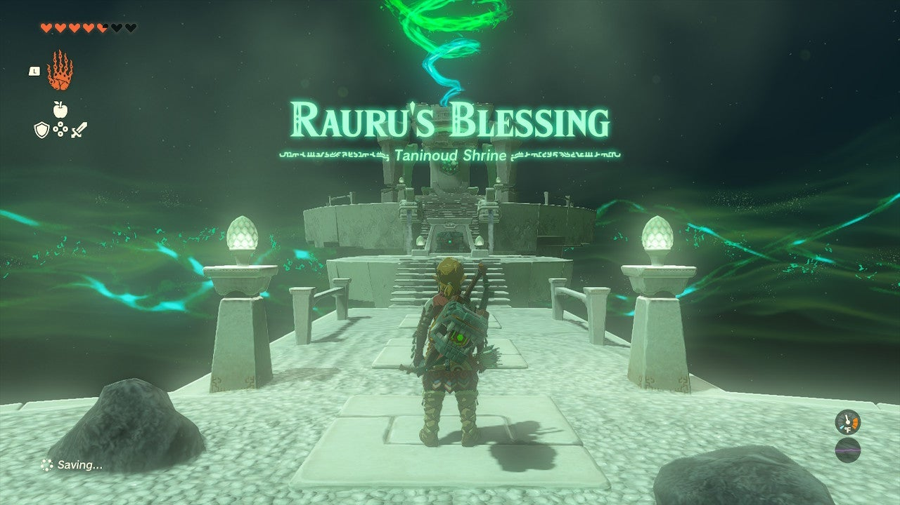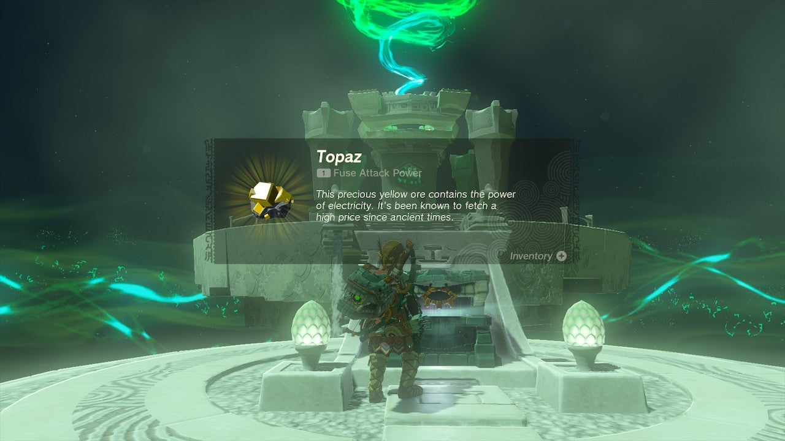

Inside is a Topaz in the chest. 

Taninoud Shrine

Congrats on solving the shrine and earning a Light of Blessing! Click or tap here to return to the rest of the Shrine Guides. You can also check out which shrines are nearby with our shrine map filter on our complete map of Hyrule.

### Up Next: Walkthrough

Previous

About IGN's Zelda TotK Guide Writers

Next

Walkthrough

### Top Guide Sections

  * Walkthrough
  * Zelda: Tears of The Kingdom Switch 2 Edition Guide
  * Zelda Notes Voice Memories
  * List of Side Quests and Side Adventures

### Was this guide helpful?

Leave feedback

Go to comments