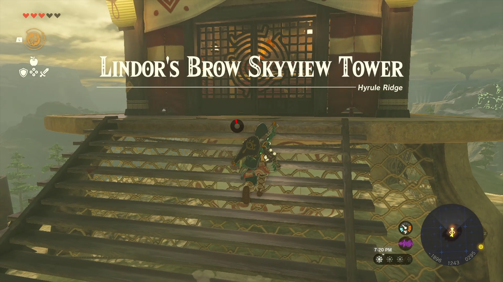
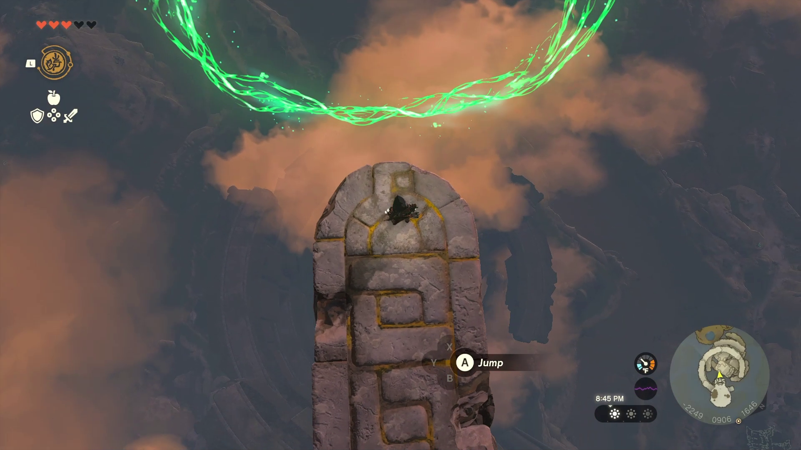
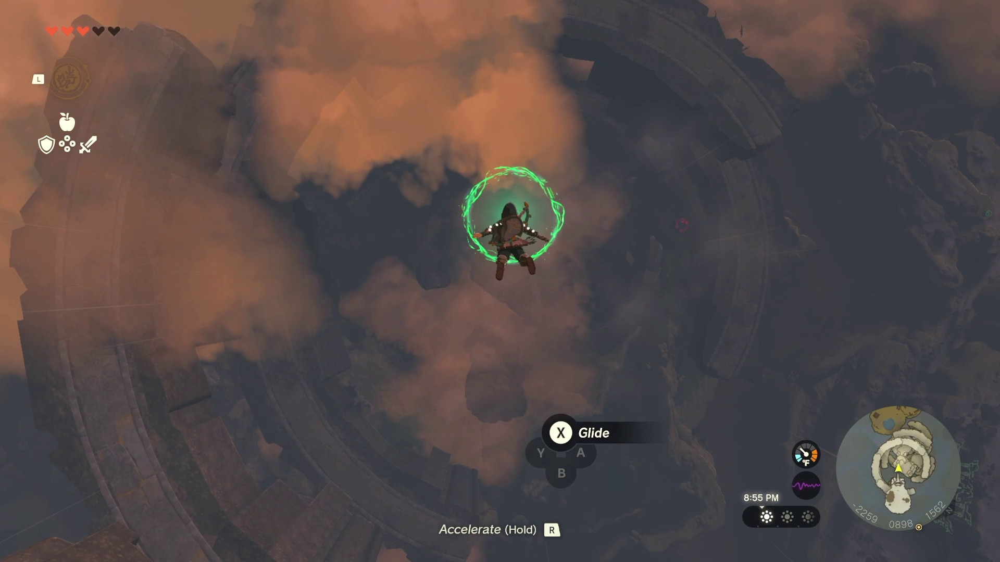
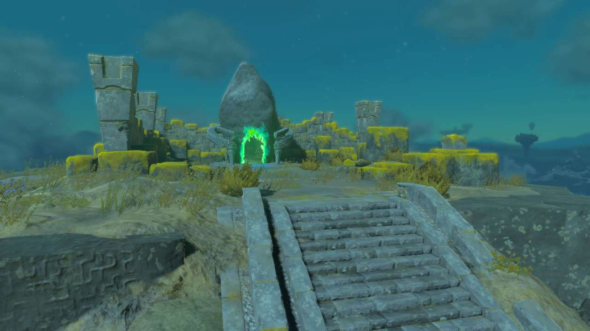
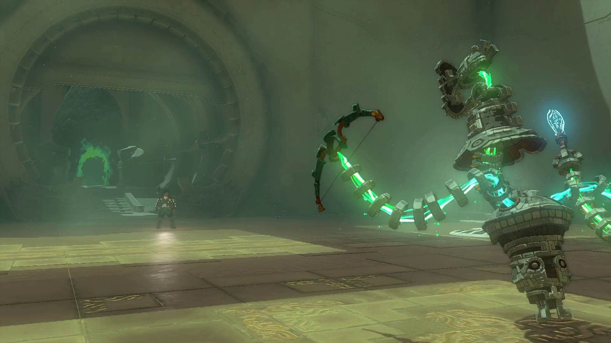
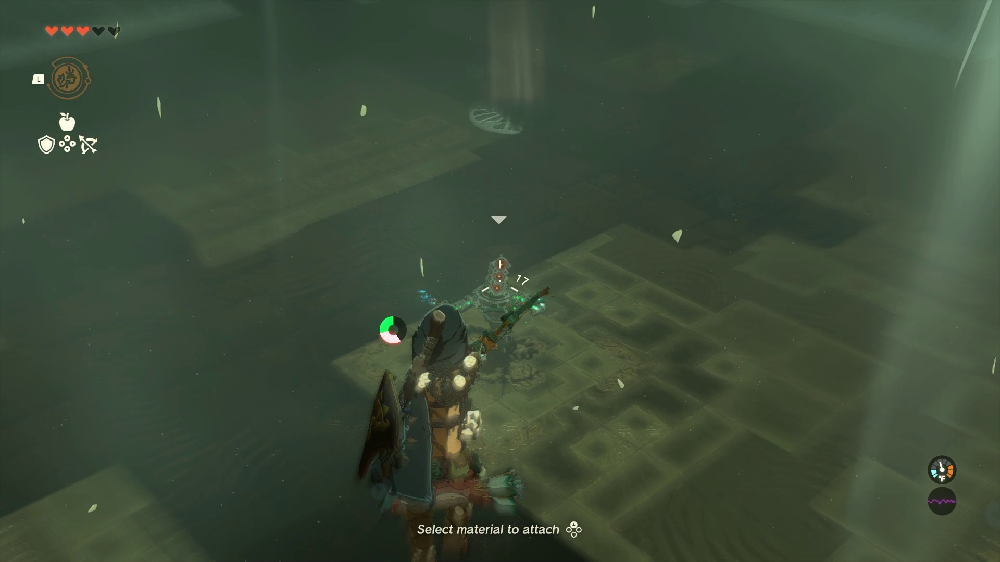
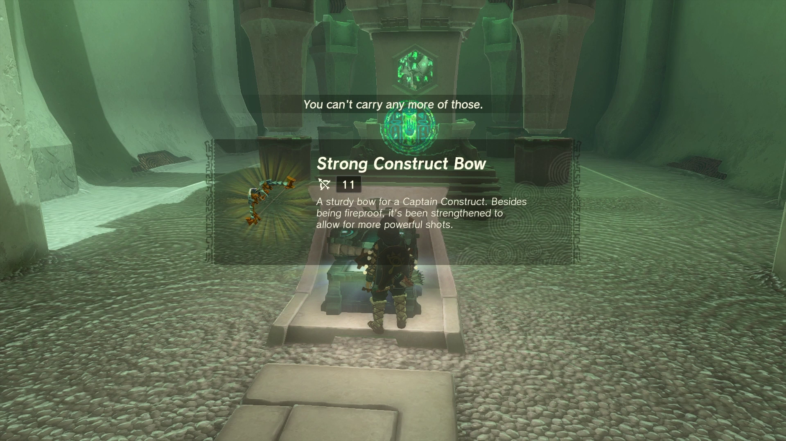

Taunhiy Shrine (Combat Training: Archery) in The Legend of Zelda: Tears of the Kingdom is a shrine located in the **Central Hyrule Sky**. This page contains a guide for how to locate and enter the shrine, a walkthrough for the shrine itself, and puzzle solutions as well as treasure chest locations for the TotK Tanhiy shrine. 

### Treasure and Rewards

  * Strong Construct Bow

## Location/How to Reach

Taunhiy Shrine is located on a Sky Island in Central Hyrule Sky. From Lindor’s Brow Skyview Tower, launch into the air and pull out your paraglider.**Float to the large island with a ring portal on it.** Here you can touch a green hand field and activate the a falling rings puzzle. 

Approach the edge of the island and leap off using the button prompt. Guide link through all the rings. If you miss one, land in the water below, or on the island with the water, and talk to the Zonai construct and it will warp you back to the top for another chance. 

If you complete the rings, the Shrine will appear on the sky island near the construct. 

  * Coordinates: -2400, 0824, 0615

## Walkthrough and Puzzle Solutions

In this combat trial you are instructed on **how to use archery from the air.** Jump onto an updraft of air with Y and quickly hit Y again to pull out your glide and move upwards on the draft. Pull the RIGHT TRIGGER to aim your bow and you will go into a slow motion mode that drains stamina. Aim at the construct and fire. Hit it once and you will be offered a second challenge. 

This time, use the updraft the same way and aim at all three robots, in sequence. The slow down will really help – and if you are using motion controls you can fine-tune your shots a bit as well. 

Hit **all three** and the challenge will conclude. 

## Treasure Chest Location

This treasure chest is located near the exit, don’t forget to claim your Strong Construct Bow. 

Before leaving be sure to collect Zonite and other loot dropped from the three constructs. 

Taunhiy Shrine

Congrats on solving the shrine and earning a Light of Blessing! Click or tap here to return to the rest of the Shrine Guides.

### Up Next: Walkthrough

Previous

About IGN's Zelda TotK Guide Writers

Next

Walkthrough

### Top Guide Sections

  * Walkthrough
  * Zelda: Tears of The Kingdom Switch 2 Edition Guide
  * Zelda Notes Voice Memories
  * List of Side Quests and Side Adventures

### Was this guide helpful?

Leave feedback

Go to comments