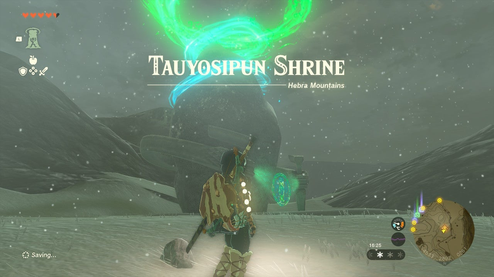

Tauyosipun Shrine (Forward or Backward?) in The Legend of Zelda: Tears of the Kingdom is a shrine located in the Hebra Region and is one of 152 shrines in TOTK (see all shrine locations. This page contains a guide for how to locate and enter the shrine, a walkthrough for the shrine itself, and puzzle solutions as well as treasure chest locations for the TotK Tauyosipun Shrine. 

## Tauyosipun Shrine Treasure and Rewards

  * Strong Construct Bow

## Tauyosipun Shrine Location/How to Reach

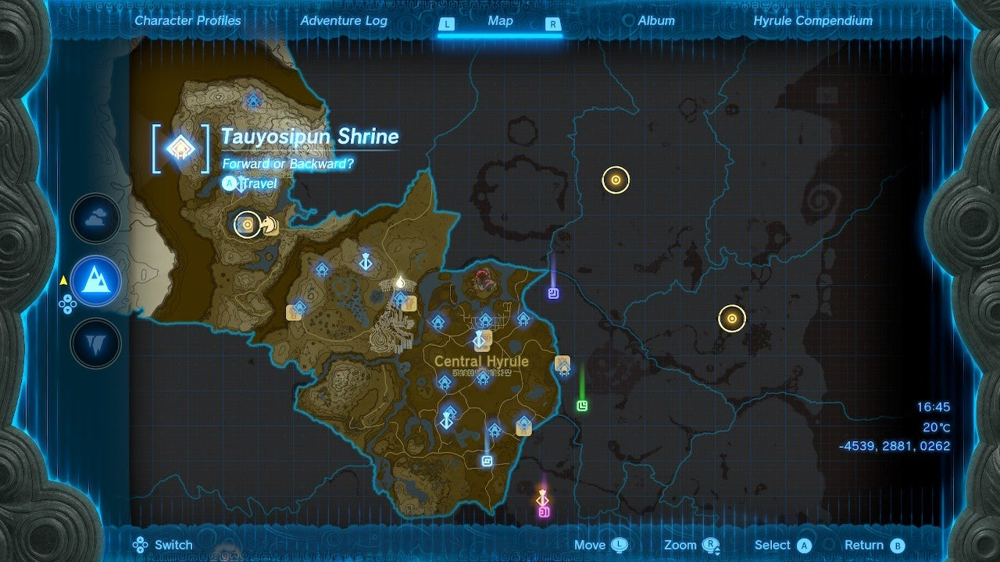

The Tauyosipun Shrine is located on the surface to the northwest of Rospro Pass Skyview Tower on the western side of Hebra West Summit. You can see it from the West Hebra Sky Archipelago if the clouds are right, but if you just float on your paraglider northwest from the tower, you should find it just over the peak. 

  * **Coordinates** : -4535, 2878, 0262

## Tauyosipun Shrine Walkthrough and Puzzle Solutions

This shrine is all about reversing time. Equip Recall by pressing the R button and selecting it. 

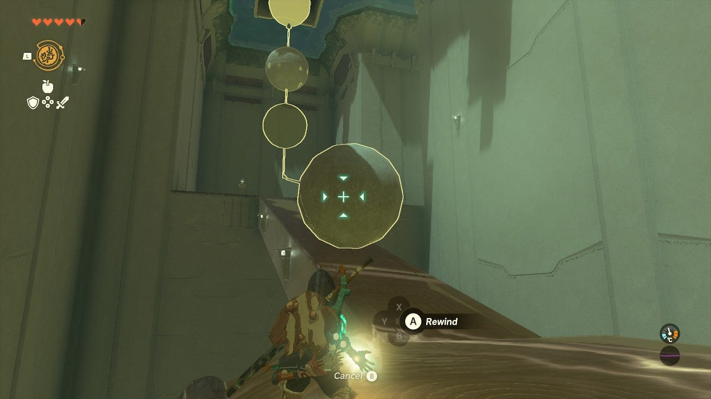

Select a sphere rolling down the ramp at the start of the shrine and activate Recall. This will allow you to follow the reversed spheres upwards. 

## Treasure Chest Location

At the top of the first ramp, look at the wheel turning with a chest falling on it repeatedly. As soon as a chest falls, activate Recall on the wheel. This will bring the chest to you. A ’’’Strong Construct Bow’’’ is inside. 

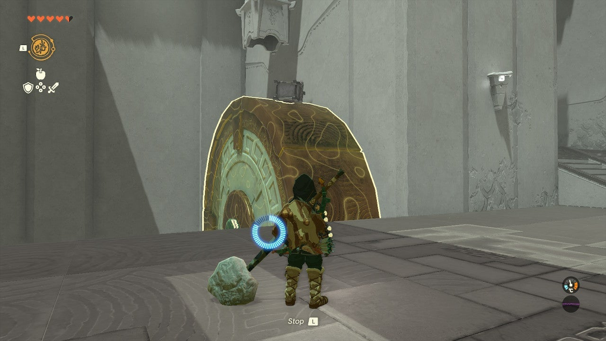

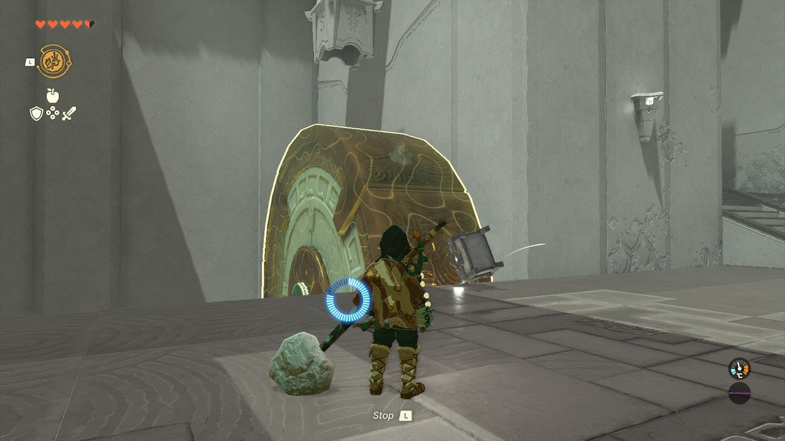

In the next chamber there are two spheres, one next to a large button and one rolling down a chute. A target lies in the distance beyond the chute. 

Stand on the switch to stop the rolling sphere at the gate. Once it is in place, grab the sphere near you using Ultrahand (hold R to select it) and, standing on the switch to close the gate, move it into place right ahead of the stopped rolling sphere up the chute.Now, switch back to Recall and activate the bottom, first Sphere that rolled into place. NOT the one you grabbed with the Ultrahand. Reversing it will push the second sphere up the chute and into the target. 

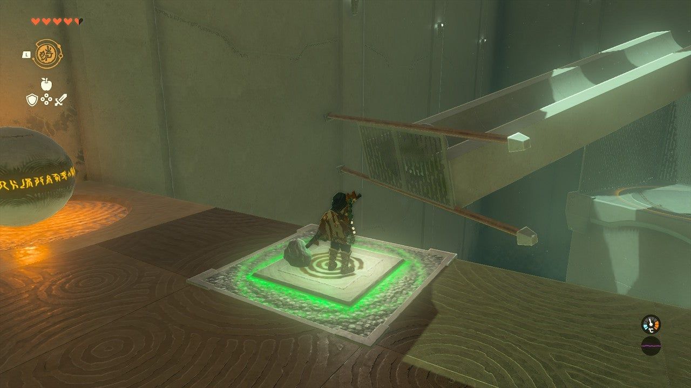

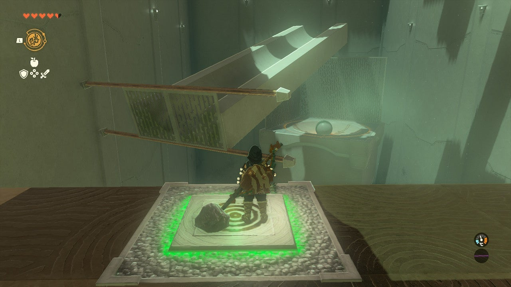

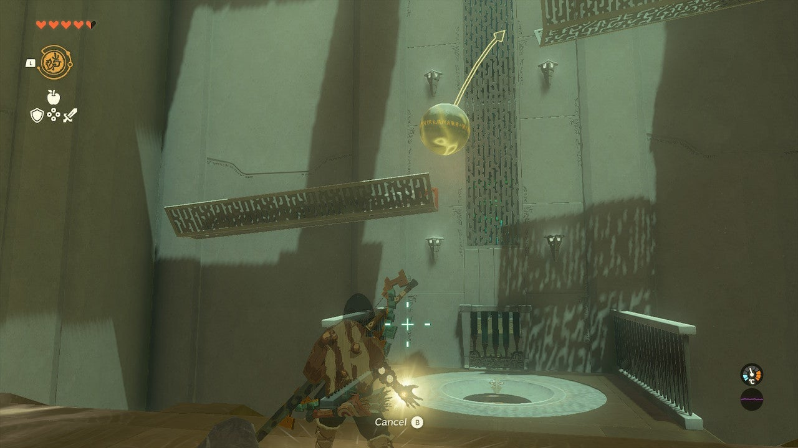

Go through the door into the final chamber. Here you will find a sphere rolling down two troughs/chutes with a gap over a target. You need to sap the momentum from this sphere, between the troughs using your Recall. 

From the door where you entered, face the troughs and rolling sphere. When the sphere has reached the second trough, tap Recall and then select the sphere. When it starts reversing across the gap, tap Recall again to cancel recall. 

The sphere will fall into the target. 

You can now exit past the sphere to the final chamber. Here a moving platform with a “cup” moves above a target. 

Switch to Ultrahand and place the sphere in the cup platform. Switch to Recall. 

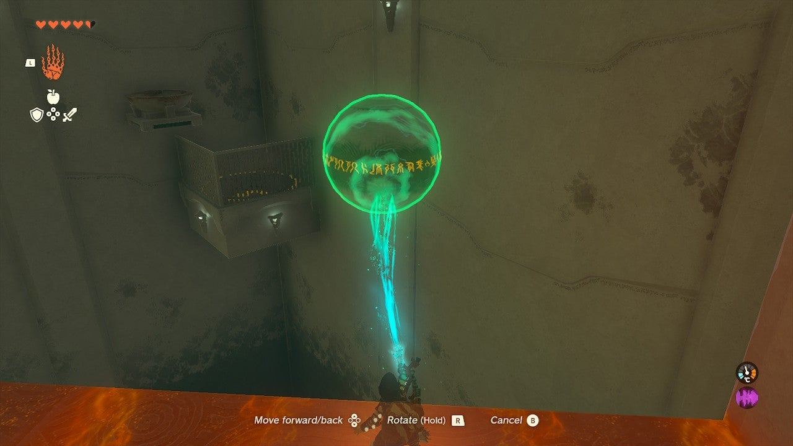

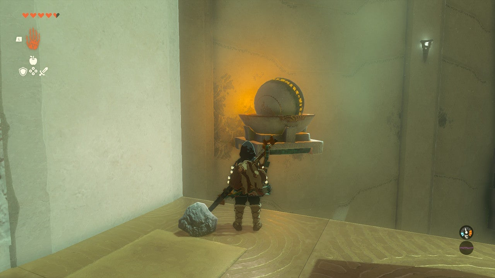

Wait for the sphere to cross the target. At this moment, tap Recall and select the sphere. The sphere will roll opposite the movement of the platform. Cancel recall immediately, and it will fall into the target. 

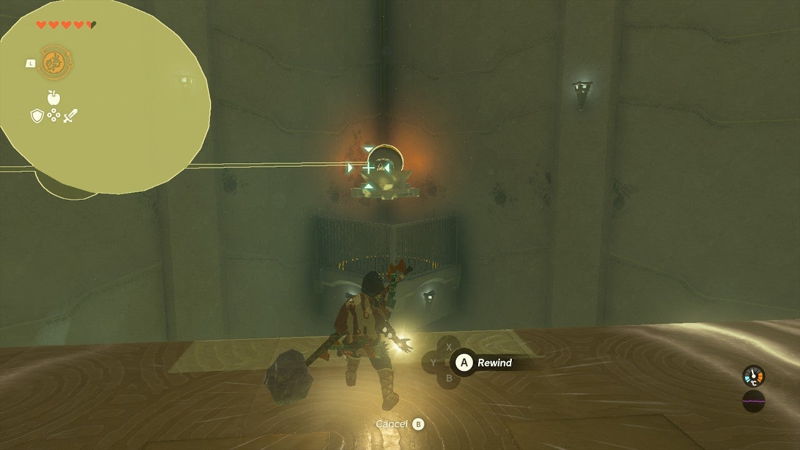

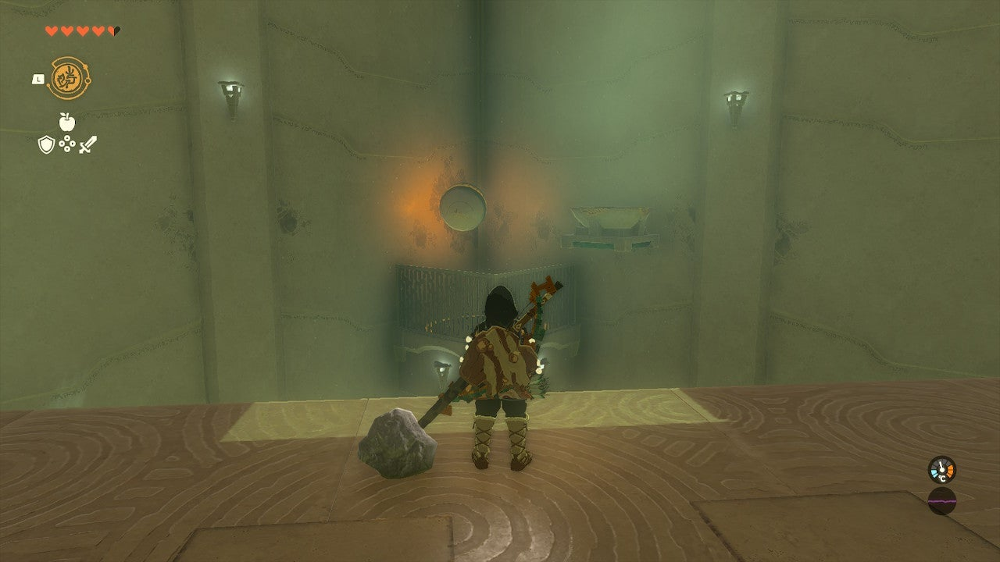

You may now exit the shrine. 

Tauyosipun Shrine

Congrats on solving the shrine and earning a Light of Blessing! Click or tap here to return to the rest of the Shrine Guides. You can also check out which shrines are nearby with our shrine map filter on our complete map of Hyrule.

### Up Next: Walkthrough

Previous

About IGN's Zelda TotK Guide Writers

Next

Walkthrough

### Top Guide Sections

  * Walkthrough
  * Zelda: Tears of The Kingdom Switch 2 Edition Guide
  * Zelda Notes Voice Memories
  * List of Side Quests and Side Adventures

### Was this guide helpful?

Leave feedback

Go to comments