Tenbez Shrine (Gravity and Velocity) in Zelda: Tears of the Kingdom is a shrine located in the Hebra Sky region. This page contains a guide for how to locate and enter the shrine, a walkthrough for the shrine itself, and puzzle solutions as well as treasure chest locations for the TotK Tenbez shrine. The Tenbez Shrine is located on the edge of the **North Lomei Castle Top Floor** , a Labyrinth in the Hebra region. Check out more TOTK shrine locations here. 

### Treasure and Rewards

  * Large Zonai Charge

## Location/How to Reach

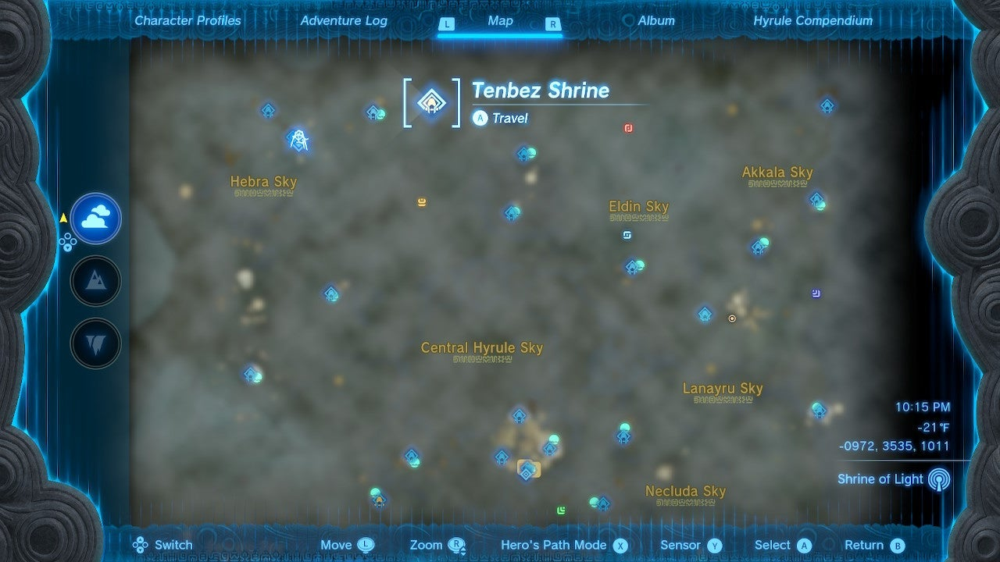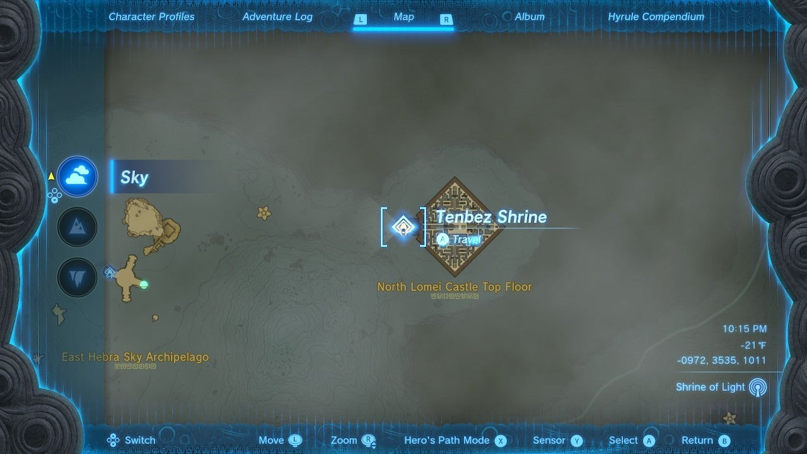

The Tenbez Shrine is in the far north sky of Hyrule, you will need two parts of warming armor or a warming food or elixir to get there without losing health. 

You can get there easiest from the Taninoud Shrine, which you can get to using the Taninoud Shrine Guide. 

From the Shrine, use the stone launcher to launch onto the northern island. Here, on the eastern edge, you’ll find a floating Zonai platform with a single fan sitting on it. 

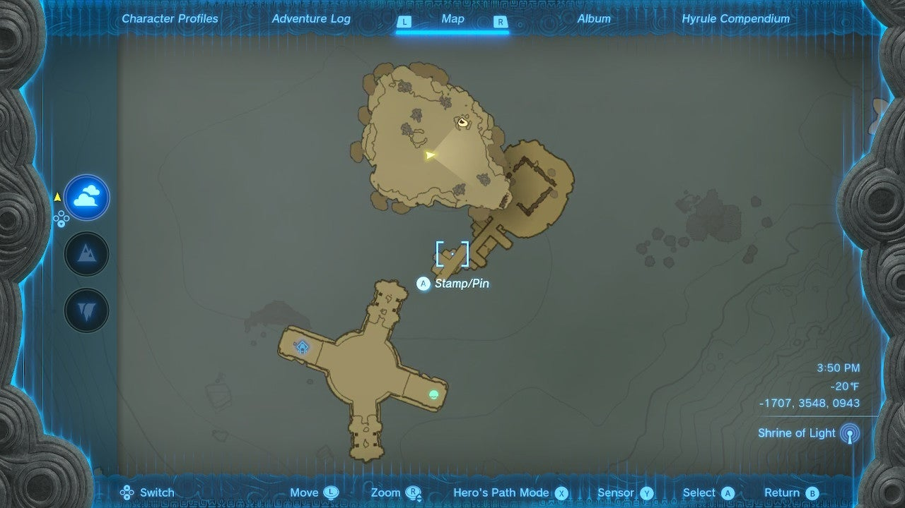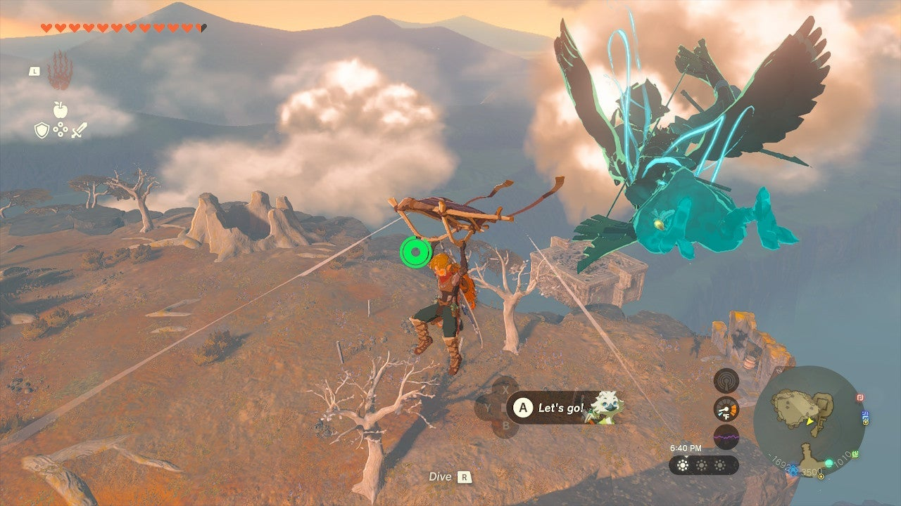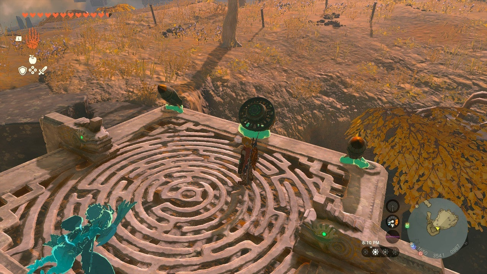

Attach the fan at a 45 degree angle pointing down and away from the large cube in the distance, this is where the Shrine is – due east. 

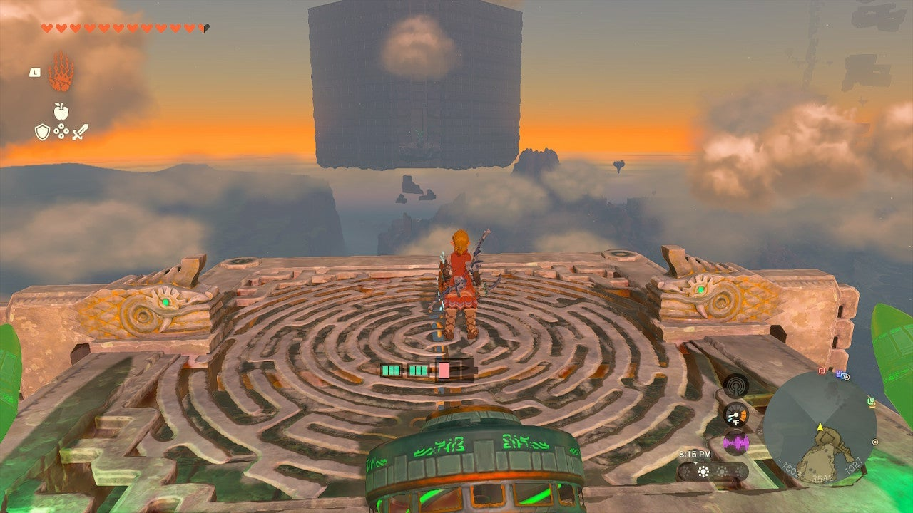

If you have rockets, you can attach them to make this journey faster. But the fan will get you there, you just need to stop and recharge a few times. 

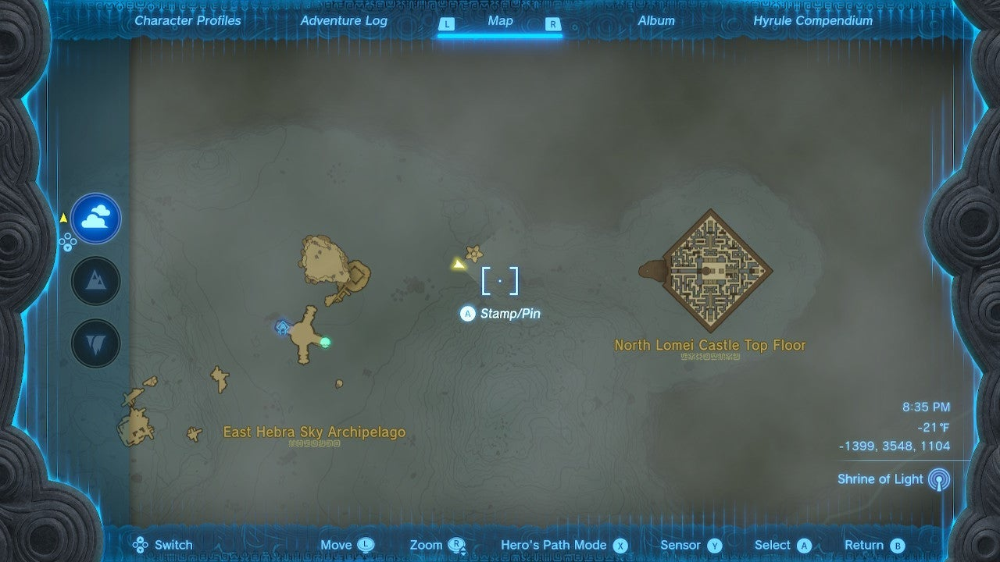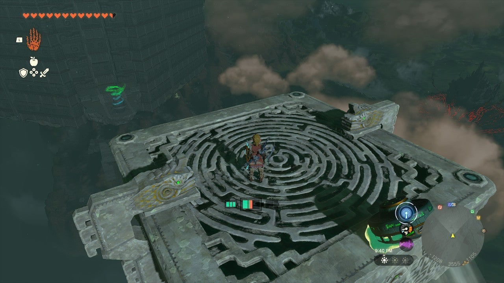

Once high enough above the Shrine and a bit closer, you can paraglide down to it. 

  * Coordinates: -0972, 3535, 1011

## Walkthrough and Puzzle Solutions

Make your way into the Tenbez shrine and you’ll see a strange, glowing yellow device in front of two launchers juggling a sphere. This is a gravity controller. 

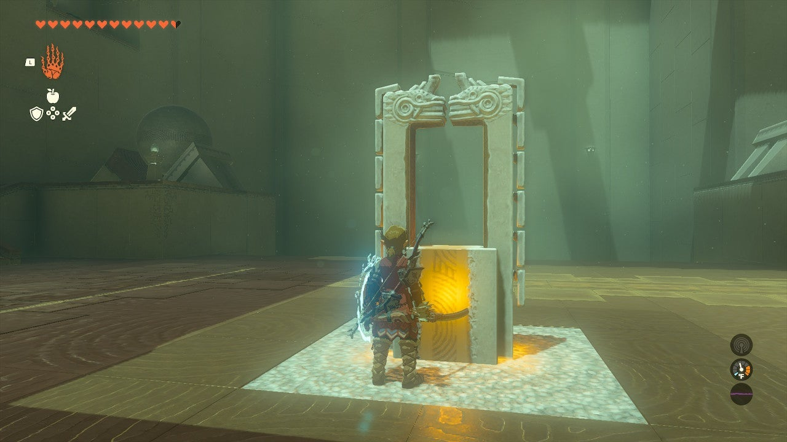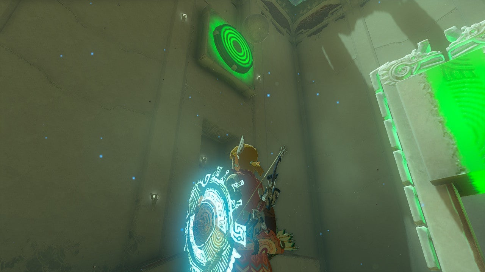

Hit the glowing yellow switch with a weapon when the ball is on the right side. It will launch up and into a target. 

## Treasure Chest Location

There is a chest to the left side of the juggling area, under the target. Climb on the right launcher with the gravity turned low (green) and let it blast you into the target – paraglide below to the chest with a Large Zonai Charge inside. 

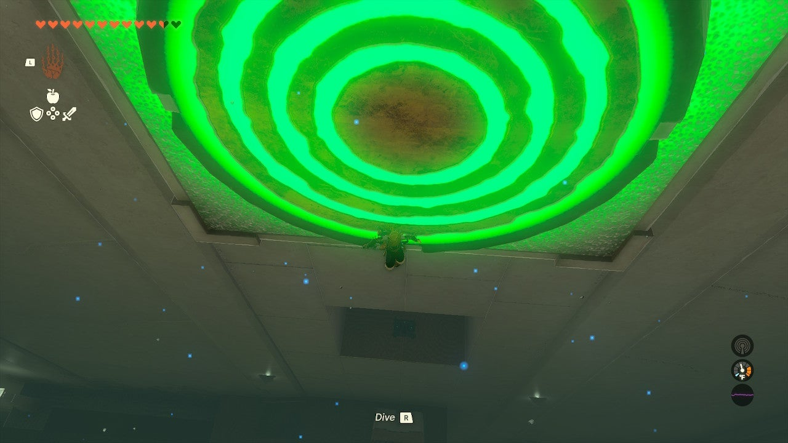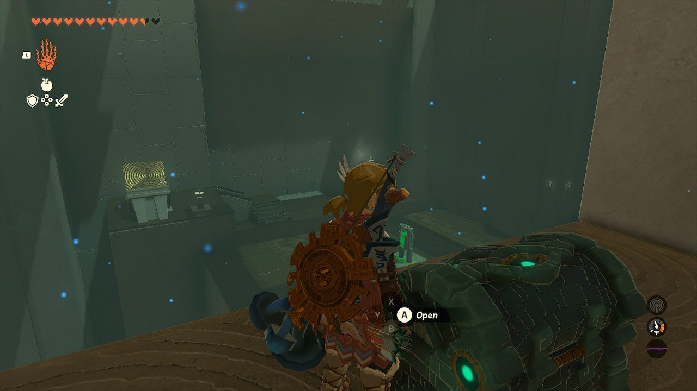

Now, climb onto the left launcher – carefully. You can jump too far and off the edge! 

It will launch you into the final area. 

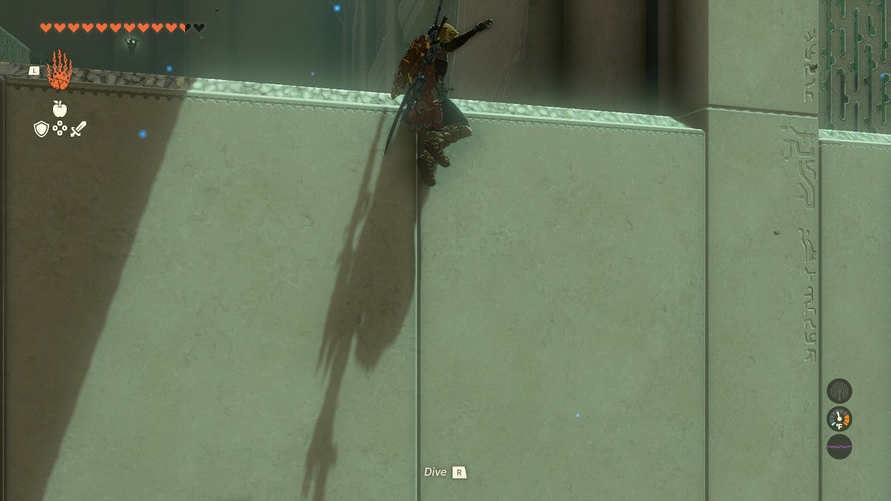

Here, turn gravity to low (green) and wait for a sphere to launch up and into the depression at the far end of the room. 

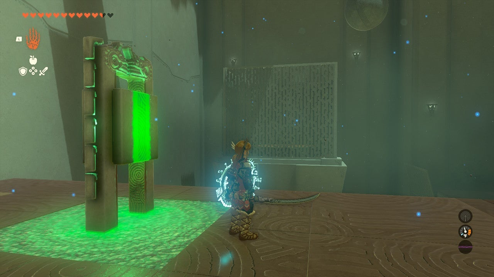

Let it launch the ball up and over the cage to the left, but at the apex of its height, over the metal basket, hit the gravity switch. This will pull it down into the metal cage and onto the target. 

Exit the shrine. 

Tenbez Shrine

Congrats on solving the shrine and earning a Light of Blessing! Click or tap here to return to the rest of the Shrine Guides. You can also check out which shrines are nearby with our shrine map filter on our complete map of Hyrule.

### Up Next: Walkthrough

Previous

About IGN's Zelda TotK Guide Writers

Next

Walkthrough

### Top Guide Sections

  * Walkthrough
  * Zelda: Tears of The Kingdom Switch 2 Edition Guide
  * Zelda Notes Voice Memories
  * List of Side Quests and Side Adventures

### Was this guide helpful?

Leave feedback

Go to comments