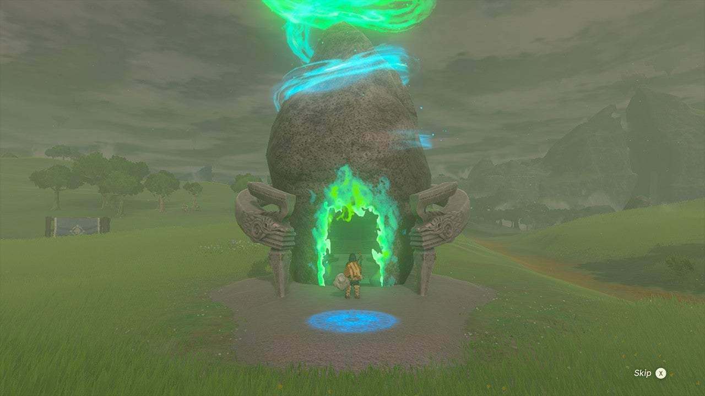
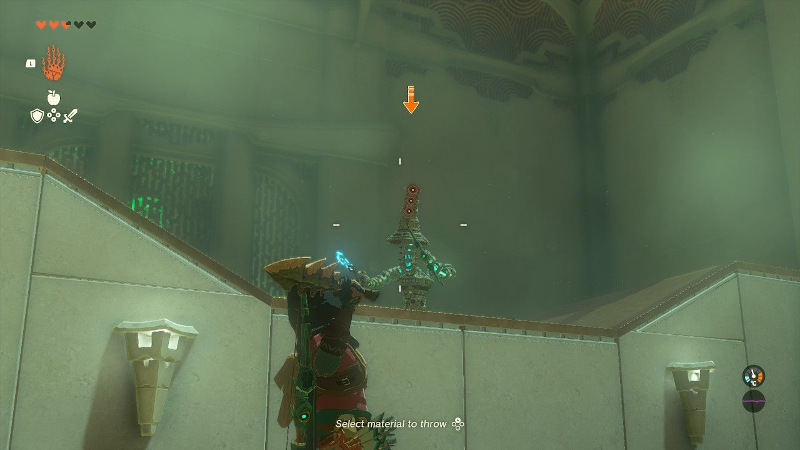
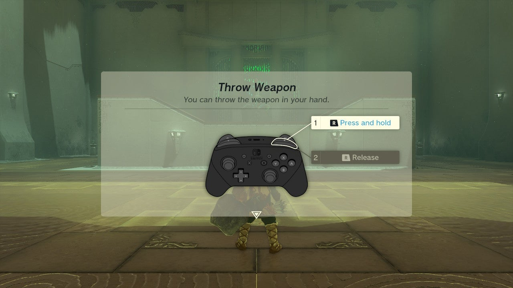
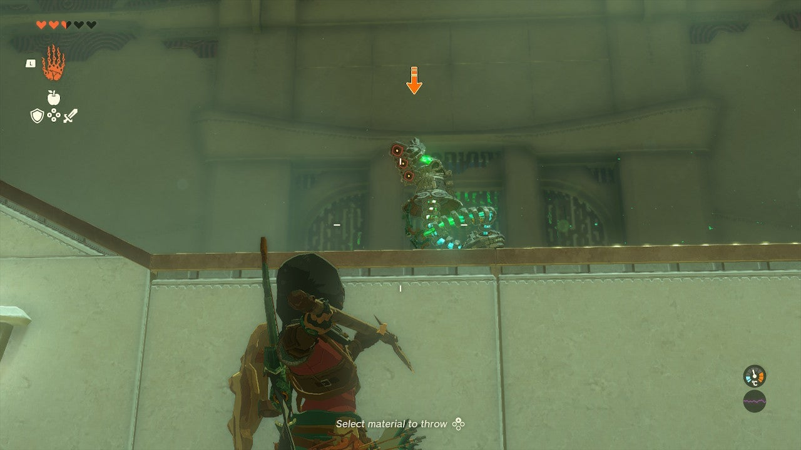
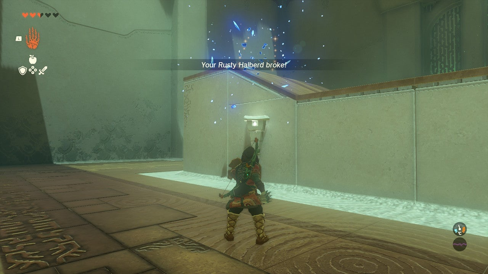

Teniten Shrine (Combat Training: Throwing) in The Legend of Zelda: Tears of the Kingdom is a shrine located in the Central Hyrule Region and is one of 152 shrines in TOTK (see all shrine locations). This page contains a guide for how to locate and enter the shrine, a walkthrough for the shrine itself, and puzzle solutions as well as treasure chest locations for the TotK Teniten shrine. 

### Treasure and Rewards

  * Zonaite Spear

## Teniten Shrine Location

Teniten Shrine is easy to see on the surface and is located in Central Hyrule south and a bit east of Lookout Landing. It is east of a small lake called Lake Kolomo. 

  * **Coordinates:** -0075, -115, 0021

## Teniten Shrine Walkthrough

This Combat Training shrine has a single construct on a platform that you cannot harm in any way other than following the tutorial. 

  * **Throw Weapon:** You are asked to throw your weapon at the enemy. There are free weapons on a rack nearby, but feel free to throw your lowest-value weapon. THIS WILL DESTROY YOUR WEAPON. Hold R to wind up your throw, hole LEFT TRIGGER to lock on, strafe left and right to avoid attacks, move in close and let go of R to toss your weapon.
  * **Throw Weapon (Enemy is Moving):** Pick up a Rusty Halberd from the rack. Lock on and wait for the enemy to stop moving and hold R. Let go to unleash your throw and finish the trial.

Now, search the enemy platform, there are ladders on the rear side, for the dropped weapons and Zonai Charge. Get everything before you leave! 

Teniten Shrine

## Treasure Location

The treasure for this shrine is in a chest right by the exit. Open the chest to find a Zonaite Spear. 

Congrats on solving the shrine and earning a Light of Blessing! Click or tap here to return to the rest of the Shrine Guides. You can also check out which shrines are nearby with our shrine map filter on our complete map of Hyrule.

### Up Next: Walkthrough

Previous

About IGN's Zelda TotK Guide Writers

Next

Walkthrough

### Top Guide Sections

  * Walkthrough
  * Zelda: Tears of The Kingdom Switch 2 Edition Guide
  * Zelda Notes Voice Memories
  * List of Side Quests and Side Adventures

### Was this guide helpful?

Leave feedback

Go to comments