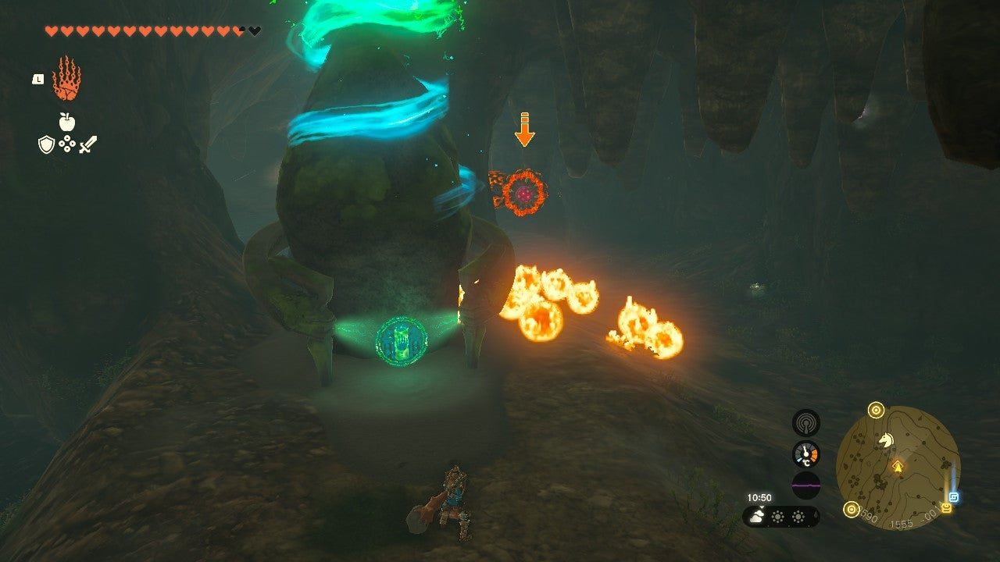
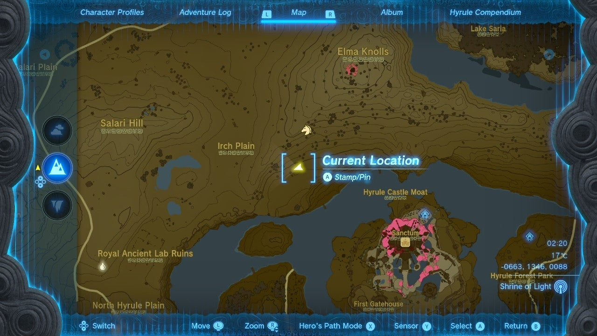
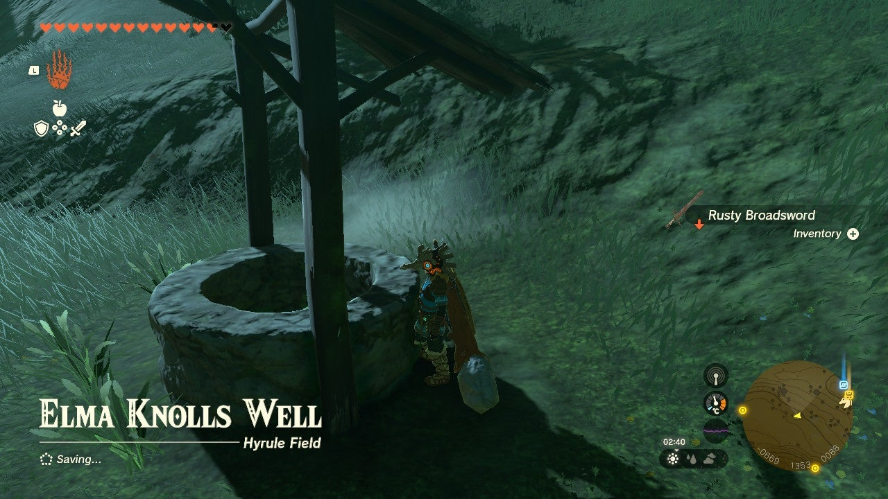
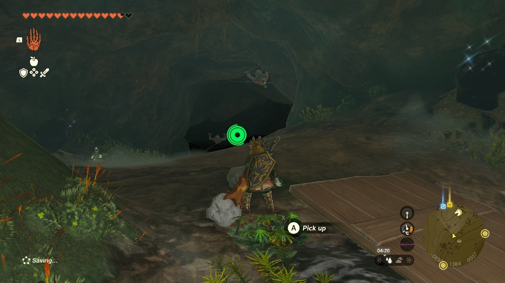
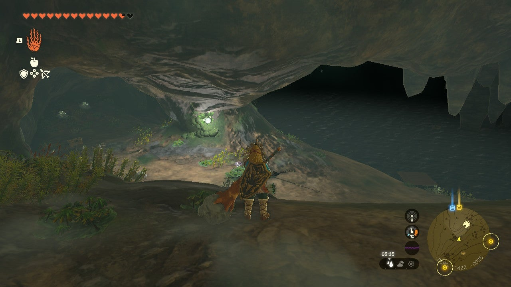
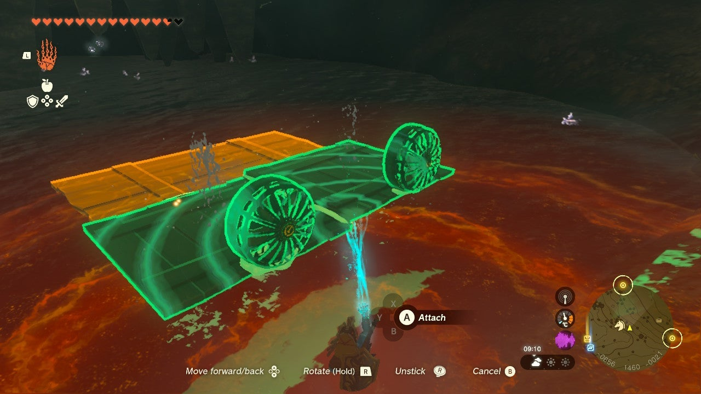
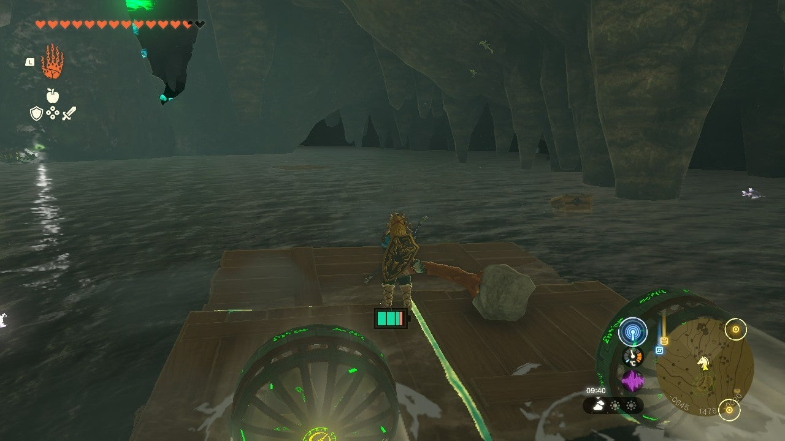
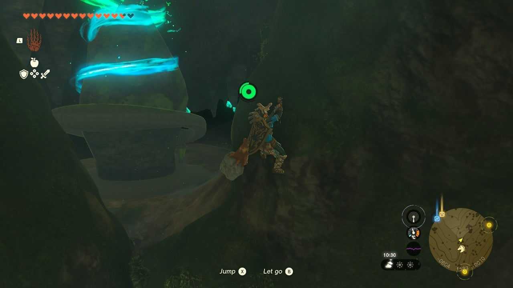
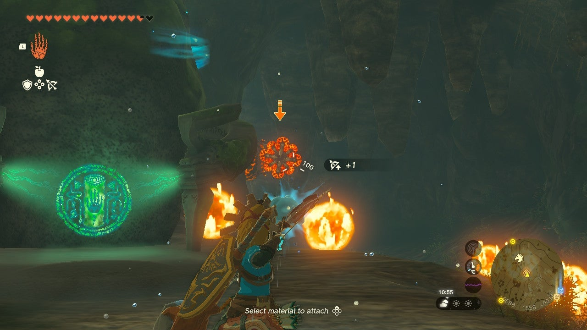
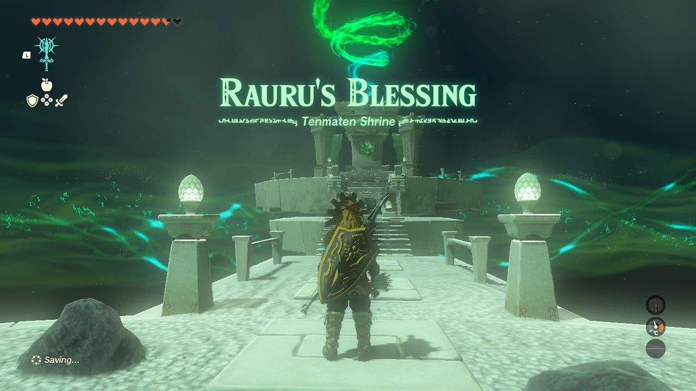

Tenmaten Shrine (Rauru's Blessing) in The Legend of Zelda: Tears of the Kingdom is a shrine located in the Hyrule Ridge region, hiding underground in a well. It is one of 152 shrines in TOTK (see all shrine locations). This page contains a guide for how to locate and enter the shrine, a walkthrough for the shrine itself, and puzzle solutions as well as treasure chest locations for the TotK Tenmaten shrine. 

## Tenmaten Shrine Treasure and Rewards

  * Large Zonai Charge

## Tenmaten Shrine Location - How to Reach The Elma Knolls Well

To get in, you'll need to get underground. Rather than looking for a cave, you're looking for a well. **The Elma Knolls Well** is southeast of the Irch Plain title on the map. You'll see the well next to some ruined wood stalls. Enter the well and you'll find a cavern with an even longer, darker drop. 

You can toss or shoot a brightbloom seed below to illuminate the dark path. You'll land in a water area with a shore to the north side of the room. Use more brightbloom to illuminate the dark (or use another illumination method!). Not far beyond you'll come across two Horriblin. Shoot them off the ceiling to stun them, allowing you to slay them easier. 

With the way clear, use more brightbloom to illuminate the rest of the dark cave. Even in the dark, you should see a Fire Like and the green-blue swirls of the shrine far off. You'll reveal a dark lake, filled with glowing cave fish. 

If you have a lot of stamina you can swim across, but your best bet will be using Zonai Fans attached to the wood slats around the area. If you don't have any, you can fling the wood planks out on the water and use them as a spot to regenerate stamina while swimming. 

Once you make it across, slay the **Fire Like** by shooting its weak point that emerges after its fire attack. With it stunned you can attack it as a whole. If you feel safe running past it, you can go ahead and approach the Tenmaten Shrine instead. 

  * Coordinates: -0593, 1551, -0014

## Inside Tenmaten Shrine

As a Rauru's Blessing shrine, you don't actually need to do anything. Collect the treasure from the treasure chest (Large Zonai Charge) and exit. 

Tenmaten Shrine

Congrats on solving the shrine and earning a Light of Blessing! Click or tap here to return to the rest of the Shrine Guides. You can also check out which shrines are nearby with our shrine map filter on our complete map of Hyrule.

### Up Next: Walkthrough

Previous

About IGN's Zelda TotK Guide Writers

Next

Walkthrough

### Top Guide Sections

  * Walkthrough
  * Zelda: Tears of The Kingdom Switch 2 Edition Guide
  * Zelda Notes Voice Memories
  * List of Side Quests and Side Adventures

### Was this guide helpful?

Leave feedback

### In This Guide

The Legend of Zelda: Tears of the KingdomNintendo EPD

Initial Release: May 12, 2023

Learn more

Go to comments