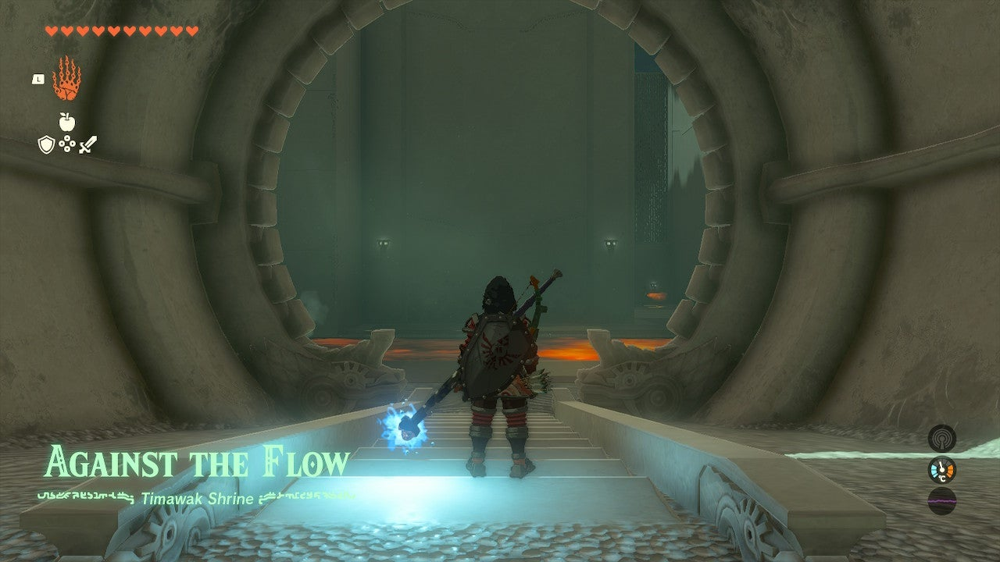

Timawak Shrine (Against the Flow) in The Legend of Zelda: Tears of the Kingdom is a shrine located in the **Death Mountain** Region. This page contains a guide for how to locate and enter the shrine, a walkthrough for the shrine itself, and puzzle solutions as well as treasure chest locations for the TotK Timawak shrine. 

### Treasure and Rewards

  * **Strong Zonaite Shield**

##  Location/How to Reach

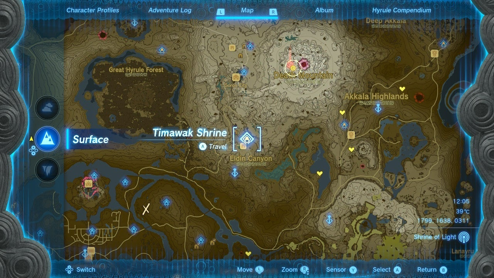

Timawak Shrine is at the southern foot of Death Mountain just north of **Goronbi Lake** , on a cliff that faces the lake. The main road leading from Central Hyrule to Death Mountain passes it – you can’t miss it. 

  * **Coordinates:** 1799, 1638, 0311

## Walkthrough and Puzzle Solutions

The first area of this Shrine contains a river of lava with flat stones floating past. You need to play a game of “Frogger” and leap across the stones to the far side. Wait for a safe line and go for it. 

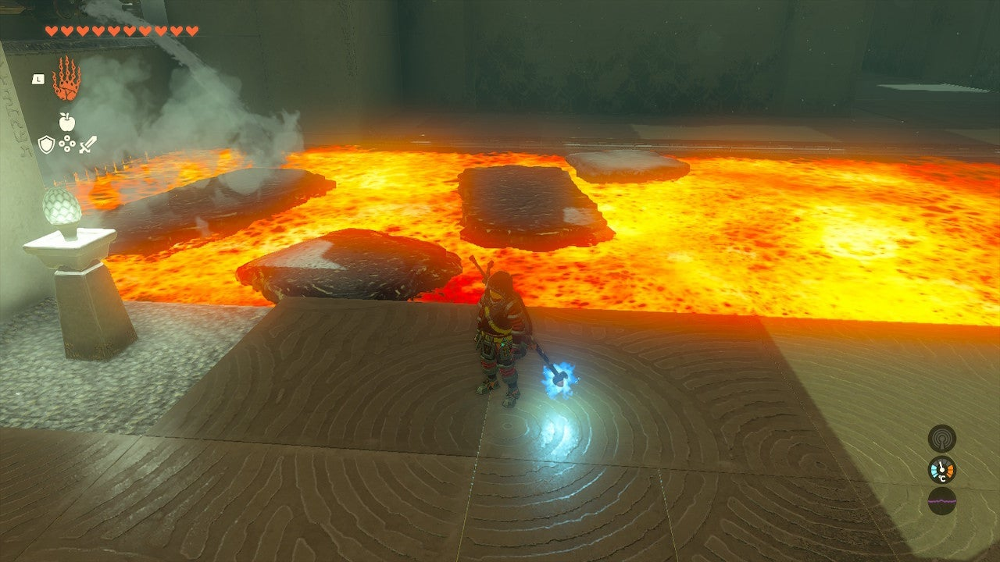

In the next area, kill the construct by rushing it. It’s an archer, so melee attacks up close completely overwhelm it. 

Here is a river of lava, floating stones, and a sphere – and a Treasure Chest in the distance. 

Equip Recall from the L menu and use it on one of the stones as soon as it reaches your feet. You can then ride this all the way to the sphere. 

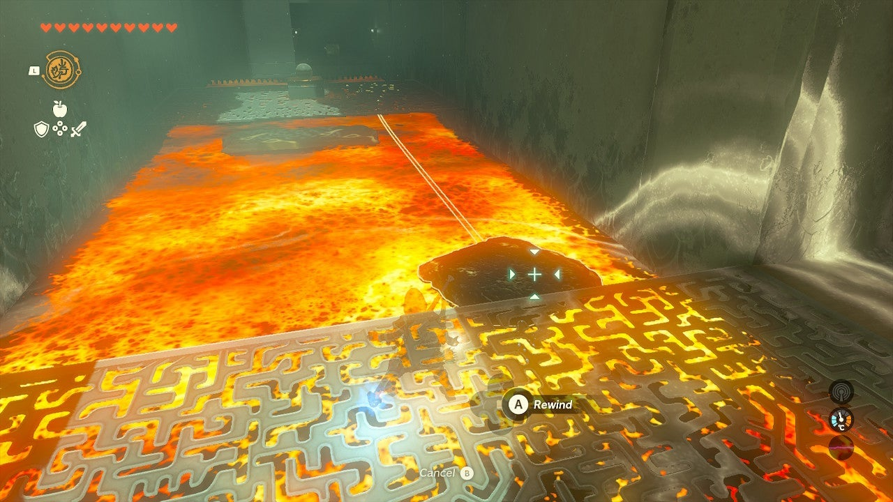

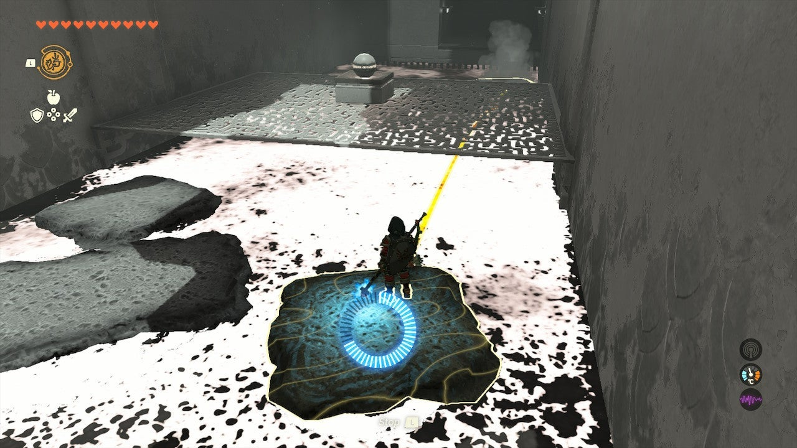

## Treasure Chest Location

At the sphere landing, you can continue on your reversed platform or use Recall on another in front of the chest landing ahead to get near it – but not all the way. 

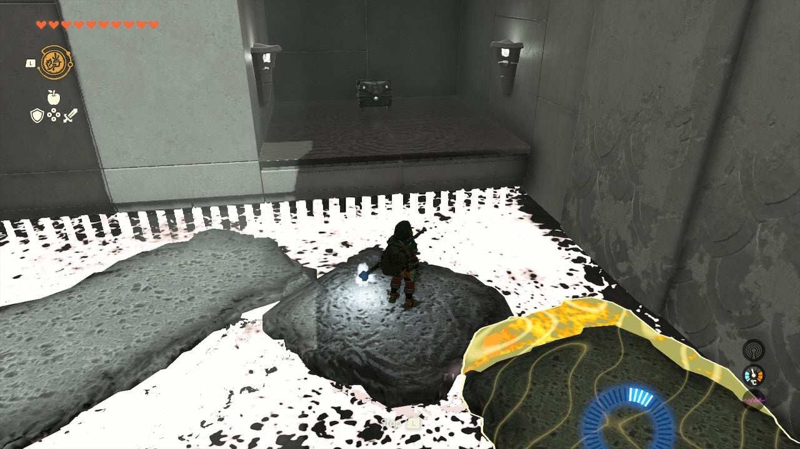

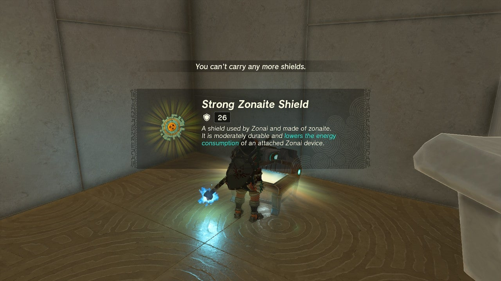

While in Recall mode and at the end of the rock platform’s line (represented by a yellow outline), you can now equip Ultrahand WHILE the Recall is active, and move another new stone platform into place to reach the chest. Inside is a **Strong Zonaite Shield**. 

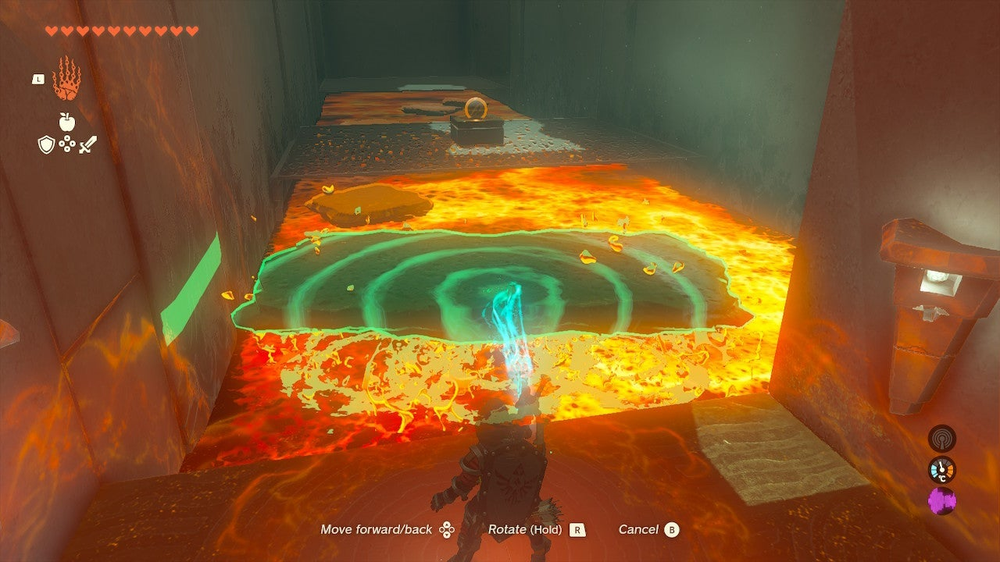

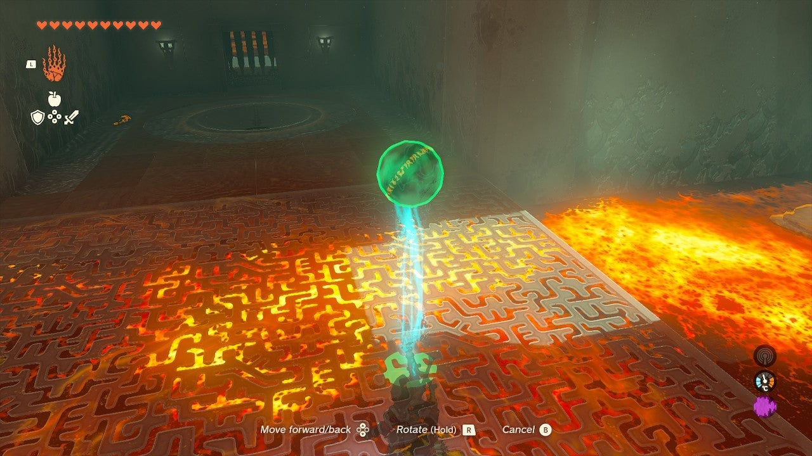

Use Ultrahand to grab a platform and put it at your feet to return to the sphere platform. 

Place the sphere, using Ultrahand, onto a lava platform, and use another to ride back to the bridge. Pick up and deposit the sphere in the target by the locked door, in the ground. 

The final room has a massive lava pool and an exit on the far side. Two fans lie here, but no stone platforms to attach them to… You’ll need to make one! 

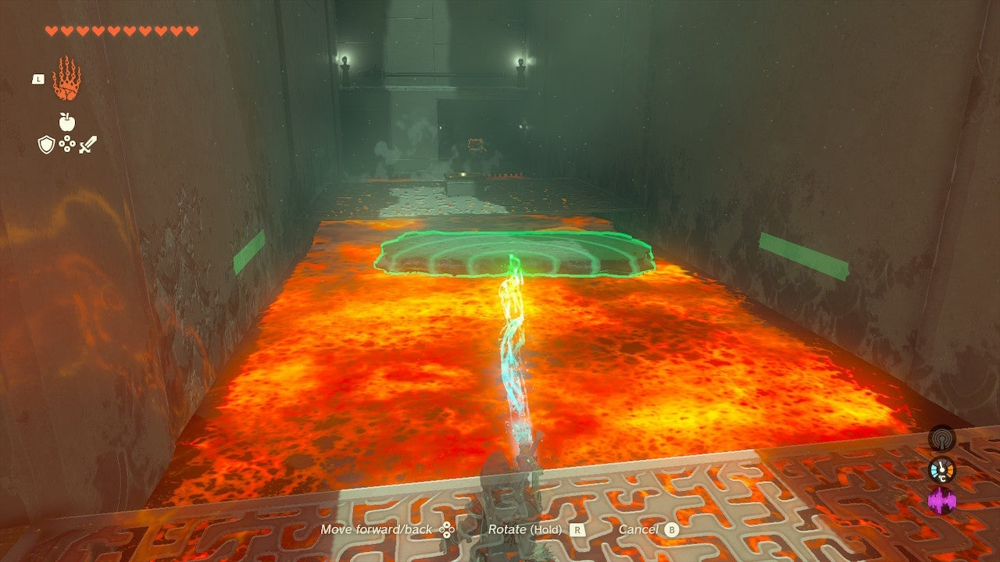

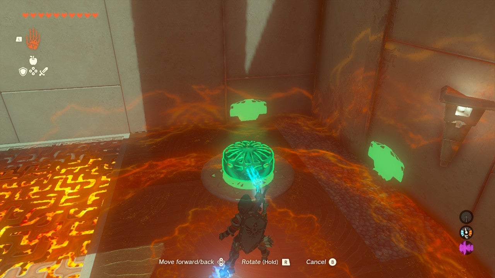

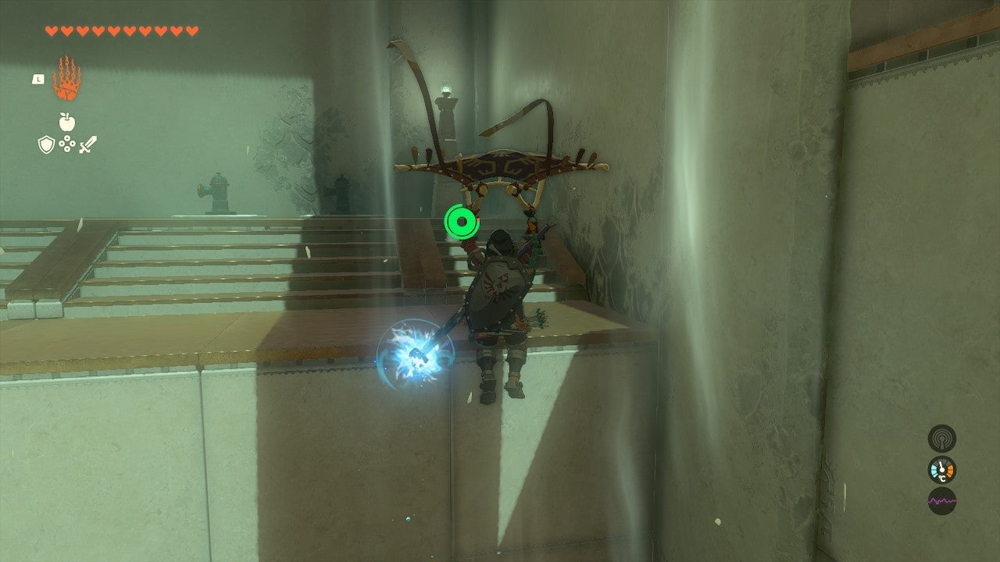

Look around you: You’ll see a ledge with some items on it – these are water faucets! Use a fan on the circle near the ledge and paraglide up the ledge. Grab a faucet and bring it down, setting it right at the lake’s shore. Whack it to turn it on. It will begin to form slabs of rock. 

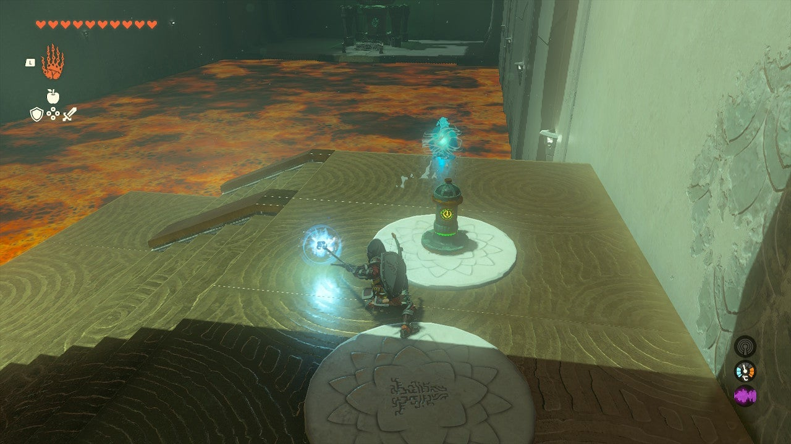

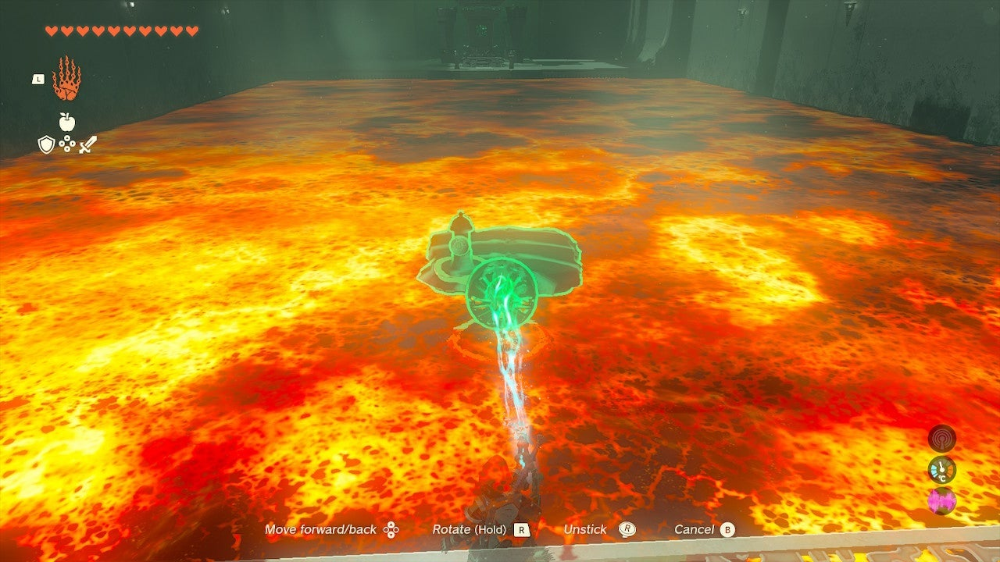

Grab a slab with Ultrahand and bring it ashore. Now, attach a fan to the rear of the slab, with the blades facing backwards. This is your lava boat. 

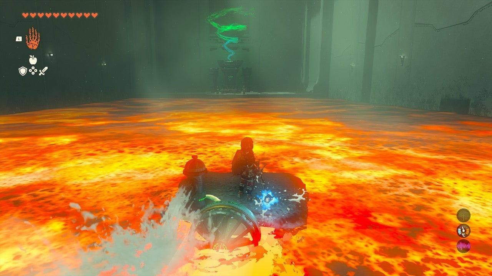

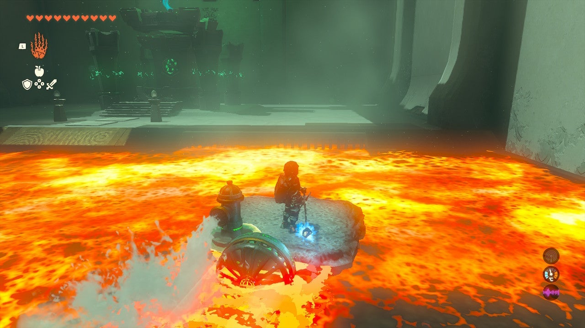

Place this a bit far up the lake as the flow will bring it towards you. Hop on the boat and hit the fan to cross the lake. 

Timawak Shrine

Congrats on solving the shrine and earning a Light of Blessing! Click or tap here to return to the rest of the Shrine Guides.

### Up Next: Walkthrough

Previous

About IGN's Zelda TotK Guide Writers

Next

Walkthrough

### Top Guide Sections

  * Walkthrough
  * Zelda: Tears of The Kingdom Switch 2 Edition Guide
  * Zelda Notes Voice Memories
  * List of Side Quests and Side Adventures

### Was this guide helpful?

Leave feedback

Go to comments