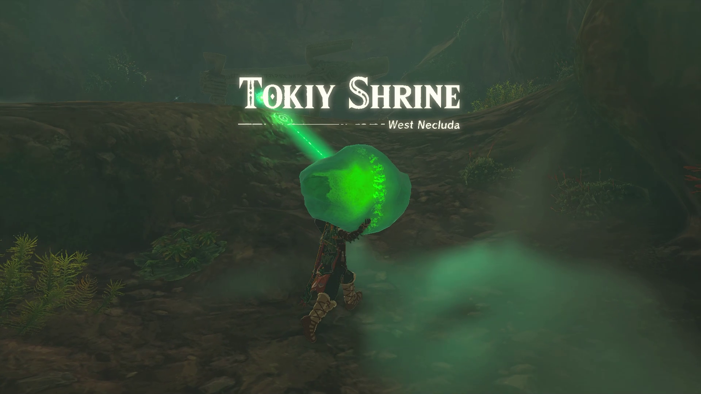
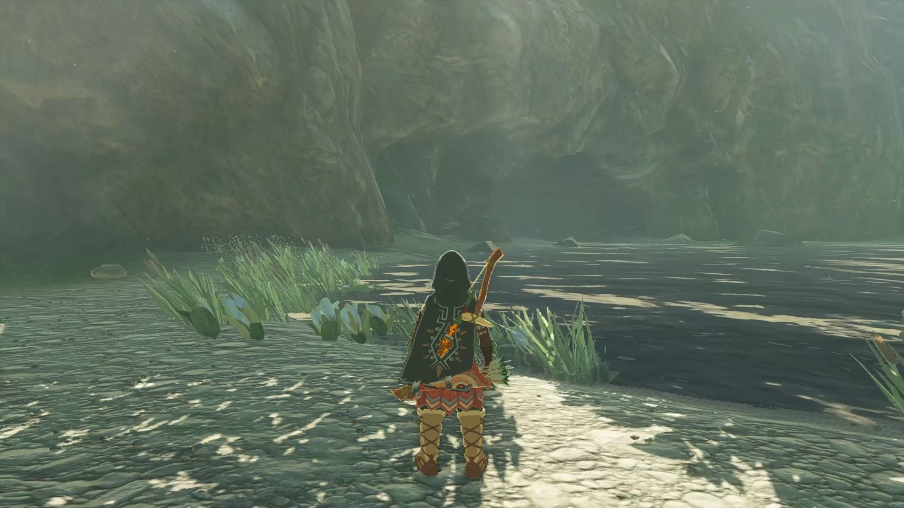
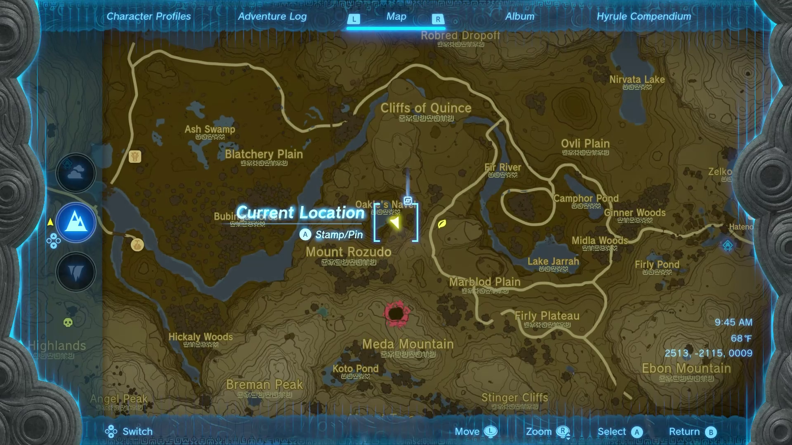
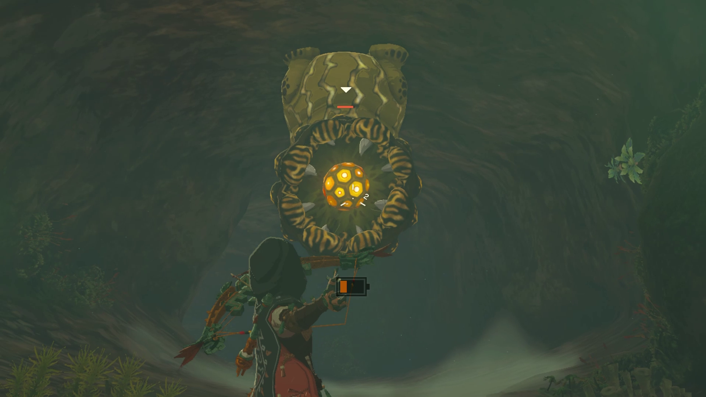
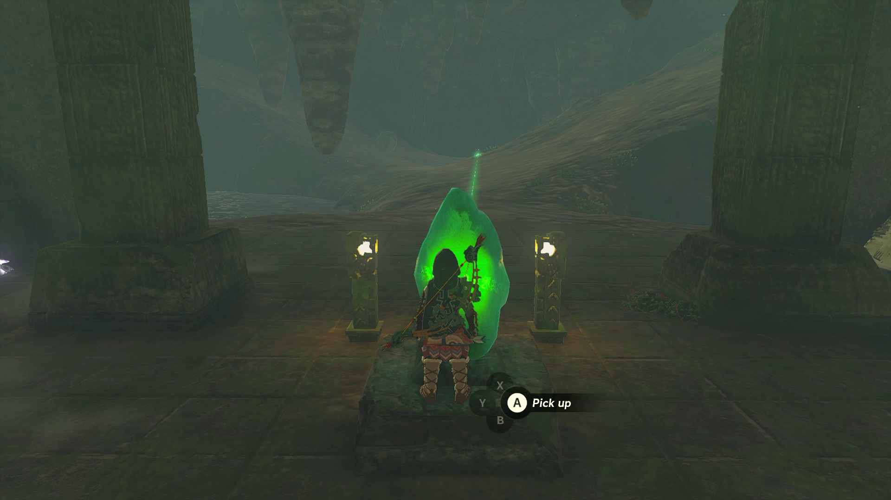
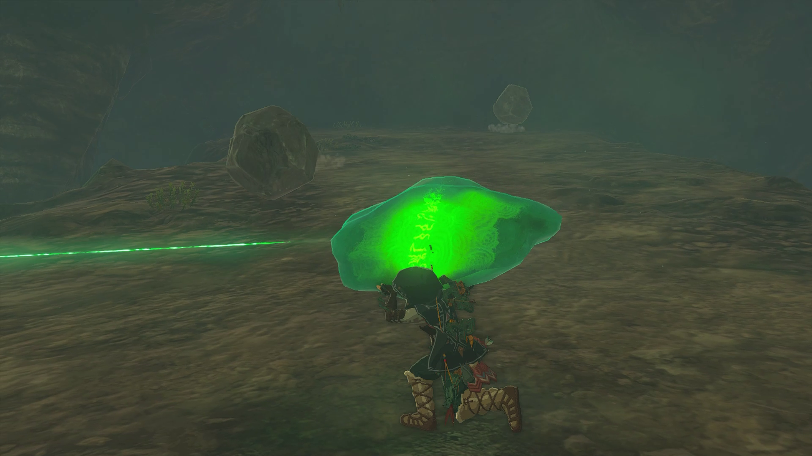
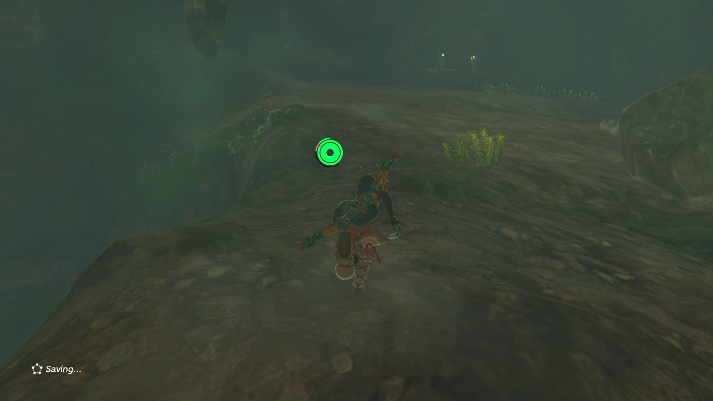
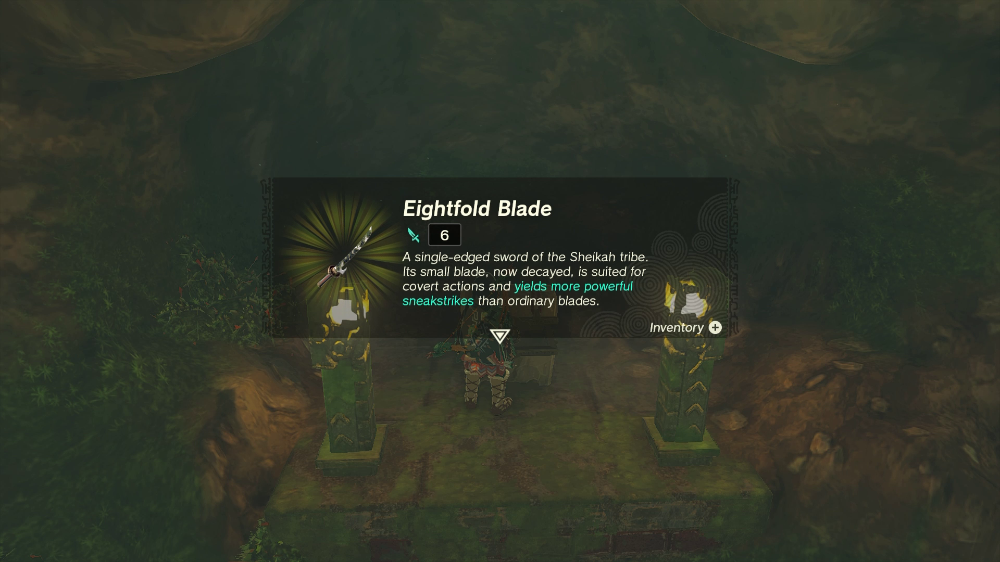
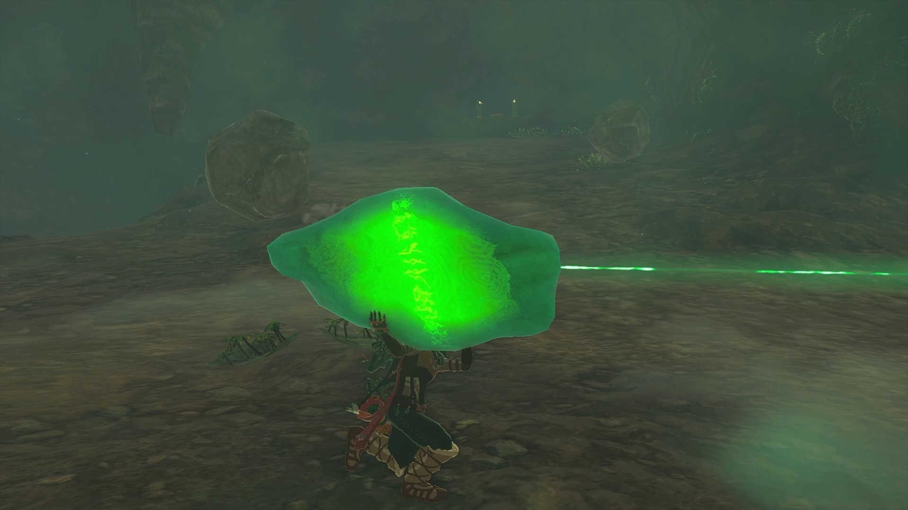
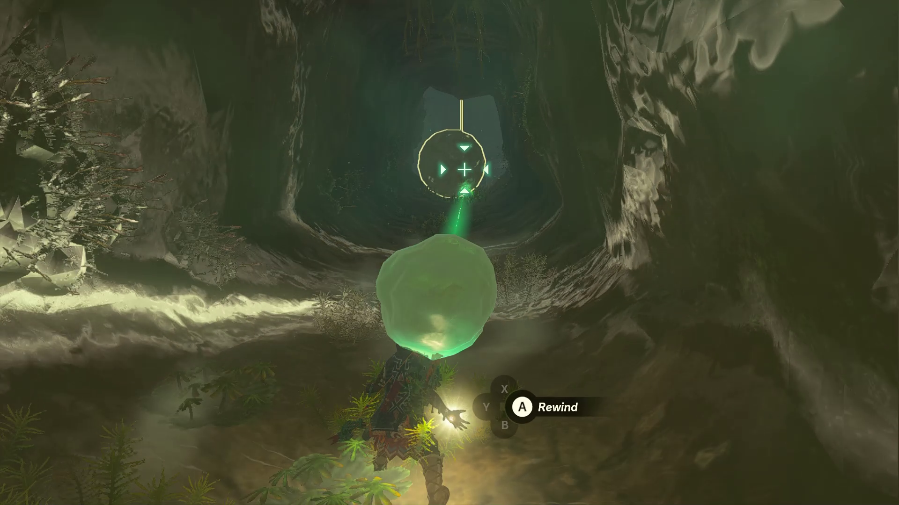

Tokiy Shrine (Rauru’s Blessing) in The Legend of Zelda: Tears of the Kingdom is located in the West Necluda region. As a Rauru's Blessing shrine, the challenge is getting into it. Tokiy Shrine is part of **The Oakle’s Navel Cave Crystal Shrine Quest**. 

***Coordinates: 2300, -2379, -0028**

###  Treasure and Rewards

  * Large Zonai Charge

## Location/How to Reach

The Tokiy Shrine is located in the Oakle’s Navel Cave in West Necluda. You must complete the Oakle’s Navel Cave Crystal Shrine Quest in order to unlock the shrine, but you have to reach the crystal first. 

Enter the cave on the southeast side of Oakle’s Navel, a small pond in the middle of a canyon on the far eastern side of West Necluda, just northeast of Mount Rozudo. 

Once you enter the cave, you’ll have to deal with an electric Like Like. Don’t get too close and dodge the lightning orbs it sends at you before hitting the ball that comes out of its mouth with an arrow. Once it drops, run in and smack it around until it’s dead. 

Continue on through the cave until you reach the crystal. 

## The Oakle’s Navel Cave Crystal Shrine Quest Walkthrough

Touching the crystal will start The Oakle’s Navel Cave Crystal Shrine Quest that you need to complete the shrine. Like the other crystal quests, a beam of light will point towards where you need to take the crystal. Note that if you just pick up the crystal with the Ultrahand, the quest won't commence and the path won't open -- so be sure to pick it up and carry it. It's also the only way to get to the Bubbulfrog in this cave. 

The main obstacle you’ll face while transporting the crystal to the shrine location is rocks. There are myriad ways to get through this shrine, but we found just carrying the crystal to be easy enough. Turn the camera so you’re looking at Link from a 90 degree angle and can see where the rocks are coming from. You’re then just basically playing Frogger while trying to dodge the rocks. 

There are two sections where rocks will be falling in this first chamber. After clearing the first section, set the crystal down and go up the ramp to your left to open a chest for an Eightfold Blade. 

Return to the crystal and repeat the same process you used to get past the first section of rocks. Note that the rocks will be coming from the other direction this time. 

After passing the rocks you’ll reach a ledge. Throw the crystal down and glide down behind it. Pick the crystal back up, continue into the tunnel, and take a right. A big rock that takes up the entire tunnel will come at you. Before you head up that way, put down the crystal in a safe spot and turn left instead, through the small waterlogged passage. At the end of it, you'll find the cave's Bubbulfrog! 

Return to the hill with the rolling boulder and wait for it to appear. Use Recall on it, pick the crystal back up, and continue along the path until you exit the tunnel into the final chamber. 

Take the crystal up to the shrine to unlock it. And that’s it! 

The Oakle's Navel Cave Crystal

Enter the shrine to receive a Large Zonai Charge and a Light of Blessing. 

Tokiy Shrine

Congrats on solving the shrine and earning a Light of Blessing! Click or tap here to return to the rest of the Shrine Guides. You can also check out which shrines are nearby with our shrine map filter on our complete map of Hyrule.

### Up Next: Walkthrough

Previous

About IGN's Zelda TotK Guide Writers

Next

Walkthrough

### Top Guide Sections

  * Walkthrough
  * Zelda: Tears of The Kingdom Switch 2 Edition Guide
  * Zelda Notes Voice Memories
  * List of Side Quests and Side Adventures

### Was this guide helpful?

Leave feedback

### In This Guide

The Legend of Zelda: Tears of the KingdomNintendo EPD

Initial Release: May 12, 2023

Learn more

Go to comments