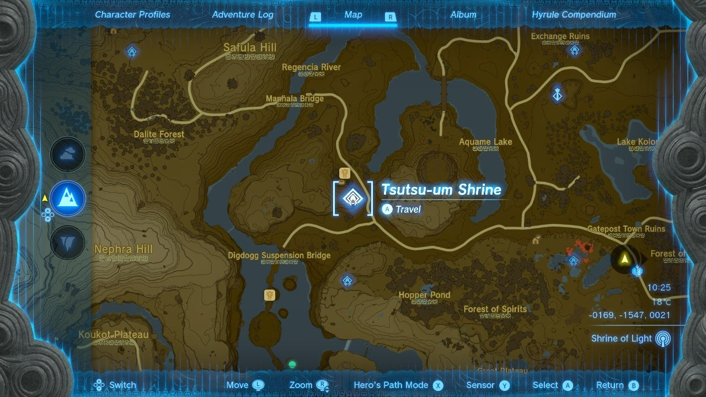
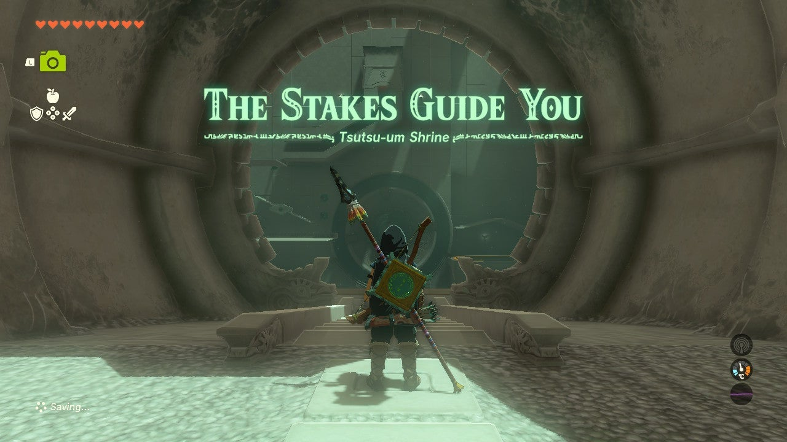
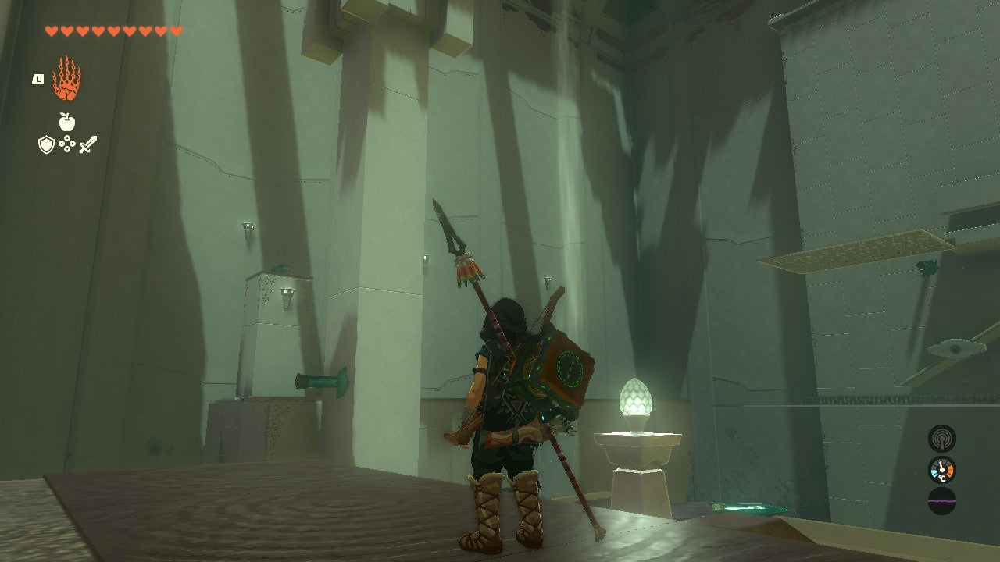
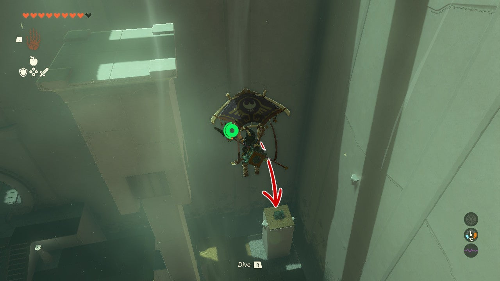
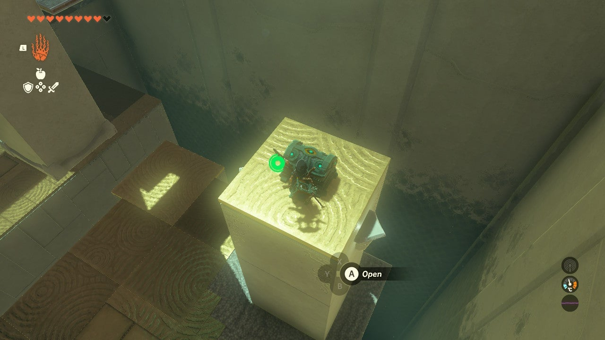
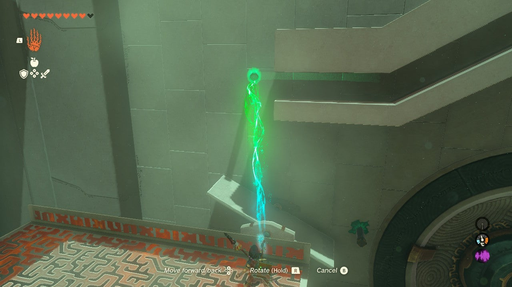
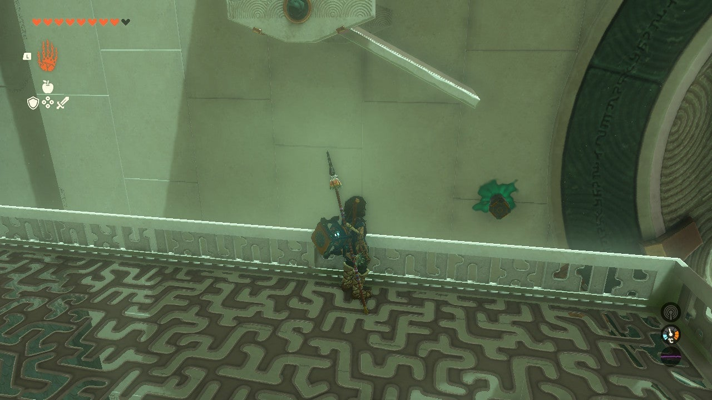
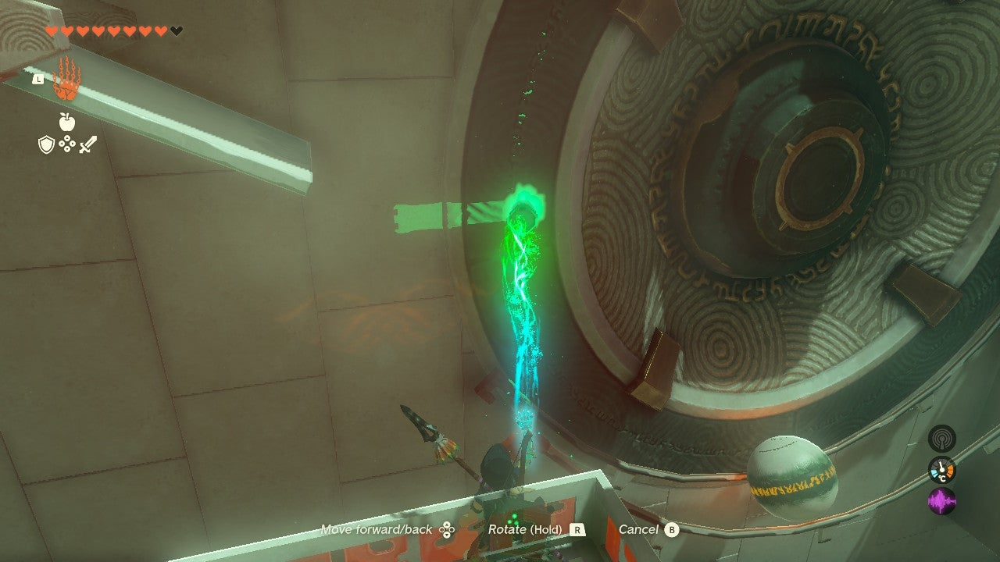
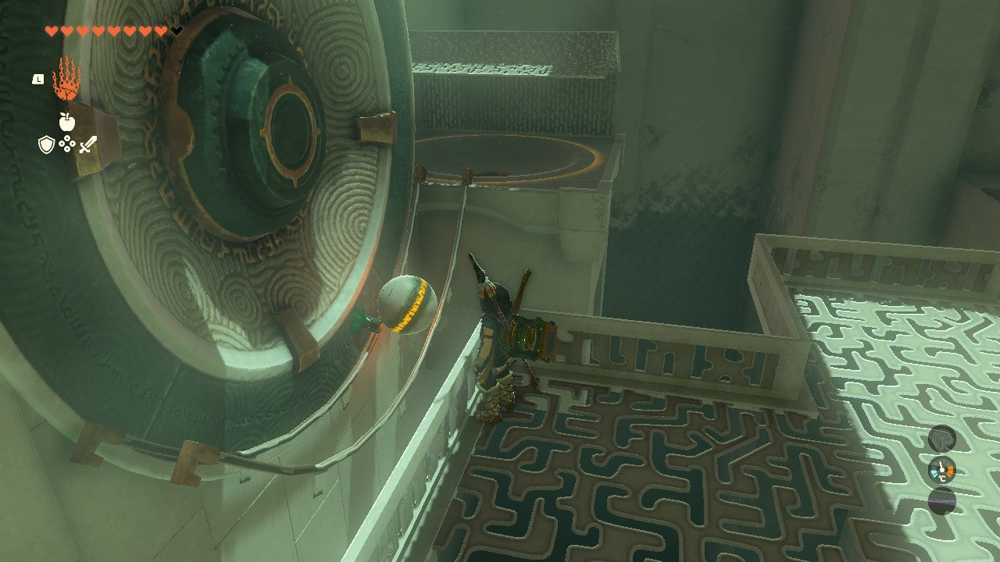

Tsutsu-um Shrine (The Stakes Guide You) in The Legend of Zelda: Tears of the Kingdom is a shrine located in the Central Hyrule Region and is one of 152 shrines in TOTK (see all shrine locations. This page contains a guide for how to locate and enter the shrine, a walkthrough for the shrine itself, and puzzle solutions as well as treasure chest locations for the TotK Tsutsu-um shrine. 

## Tsutsu-um Shrine Treasure and Rewards

  * Arrows x5

## Tsutsu-um Shrine Location/How to Reach

This shrine overlooks the **Outskirts Stable** on a hill to the south of the stable. 

  * Coordinates: -1423, -1349, 0068

## Tsutsu-um Shrine Walkthrough and Puzzle Solutions

This shrine challenges you in one large room with two sides to a large contraption. 

Straight ahead is the puzzle that'll open the exit (you'll need to get the constantly falling ball into its port on the lower right) and on the left are auxiliary tools and the shrine's treasure chest. Let's get that first. 

The opening platform has two metal plates and one stake. These stakes are special. They can stick structures into just about anything. **Fuse the two metal platforms together and attach the stake to their base.** Grab the longer metal platform with Ultrahand and look left toward the moving pillar. 

Wait till it moves all the way down and stops. When it does, you'll see a beam sticking out of it. Attach the metal platform you made onto it then hop on. Cross to the left structure and you can use the air current to glide up and over to the treasure chest. You'll get x5 Arrows. 

Run back to the current and glide up to the high white metal platform in front of the main puzzle structure. First, you'll need to get control of the ball. Use one of the stakes in the wall as a stopper by putting it in front of the spot where the ball falls out of its initial slide. 

Next, you'll need to make sure the ball is going the right way. Put another stake from the wall using Ultrahand under the moving white seesaw platform when the left side is in the air and the right is down. This will guide the ball toward the port, but it's not time to drop it yet. 

Now, you should have one more spike available to you. Put it a little below the right side of the white seesaw to act as a stopper for the ball when it drops. This will help push it to the metal track by the spinning wheel. 

**Note** : If you're having a hard time getting the above stake in the right place, you can use the metal platform from earlier here or just the spike from it to help give the ball a more secure path. 

Now, release the ball! It should fall down and land in the metal tracks. If it doesn't adjust as needed. Your goal should be to get it to stop on the tracks before the wheel. You can automate the trial by putting the stake that was previously blocking the ball just to the left of it so it slowly releases whenever it's ready to drop again. 

Once the ball is on the metal track take the spike nearest you put it about halfway on the grey part of the spinning wheel. 

This will gently push the ball to its port. 

With the ball successfully in the port the gate to the exit opens. 

Tsutsu-um Shrine

Congrats on solving the shrine and earning a Light of Blessing! Click or tap here to return to the rest of the Shrine Guides. You can also check out which shrines are nearby with our shrine map filter on our complete map of Hyrule.

### Up Next: Walkthrough

Previous

About IGN's Zelda TotK Guide Writers

Next

Walkthrough

### Top Guide Sections

  * Walkthrough
  * Zelda: Tears of The Kingdom Switch 2 Edition Guide
  * Zelda Notes Voice Memories
  * List of Side Quests and Side Adventures

### Was this guide helpful?

Leave feedback

Go to comments