Tukarok Shrine (Forward Force) in The Legend of Zelda: Tears of the Kingdom is a shrine located in the Central Hyrule Region and one of 152 shrines in TOTK (see all shrine locations). This page contains a guide for how to locate and enter the shrine, a walkthrough for the shrine itself, and puzzle solutions as well as treasure chest locations for the TotK Tukarok shrine. 

Be sure to check out these other guides to help you through the other Shrines and find troublesome collectables! 

  * Shrine filter on IGN's interactive map of Hyrule
  * All Shrine Locations and Solutions
  * List of Shrine Quests
  * Dragon Locations and Farming Guide
  * Korok Seed Locations

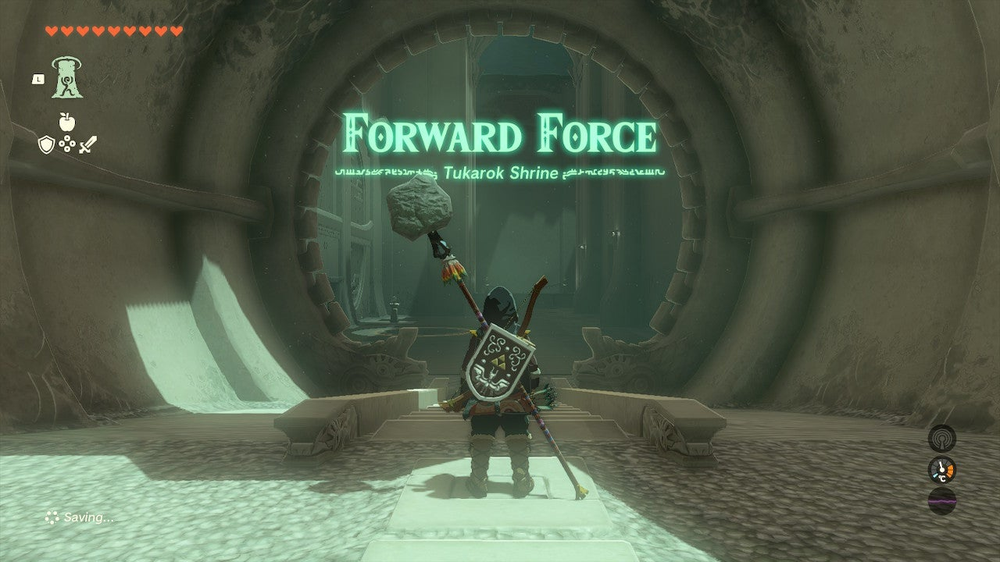

### Tukarok Shrine Treasure and Rewards

  * **Strong Zonaite Sword**

##  Tukarok Shrine Location/How to Reach

The Tukarok Shrine is just east of Lookout Landing across the Great River. It serves as the warp point for Wetland Stable and is on the surface in plain sight in a small grove by the stable. 

  * **Coordinates:** 0915, -0250, -0034

## Tukarok Shrine Walkthrough and Puzzle Solutions

The goal of this shrine is to get a large sphere into the “target,” a circular hole by the exit – which is actually right at the entrance. 

Begin by leaping off the large edge and paragliding to the sphere below. 

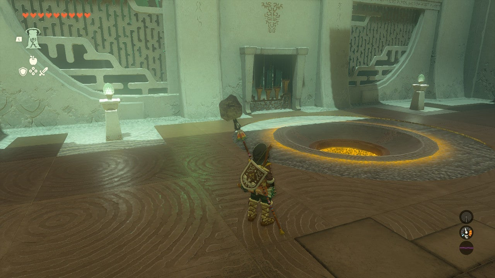

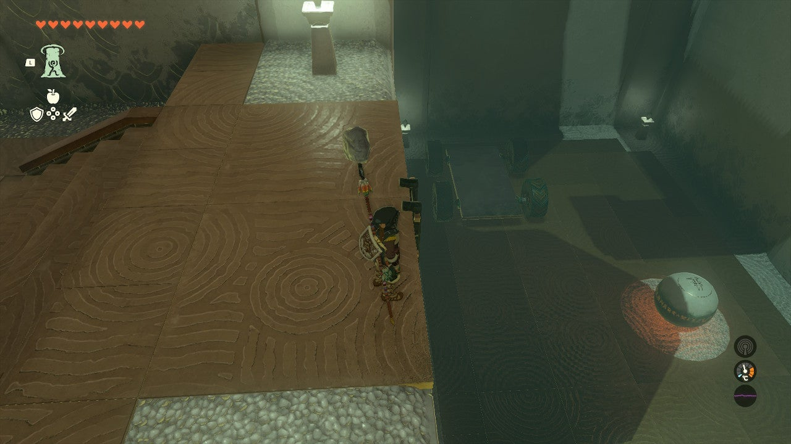

You will see a “car” here and the large sphere, and a pool of lava. Hit R to select Ultrahand and equip it. Use it to attach the sphere to the center of the car.Move the car over to the lava pool, making sure the arrows on the wheels point towards the lava.Get on the car and whack a wheel with a weapon. This will carry you across to the next puzzle. 

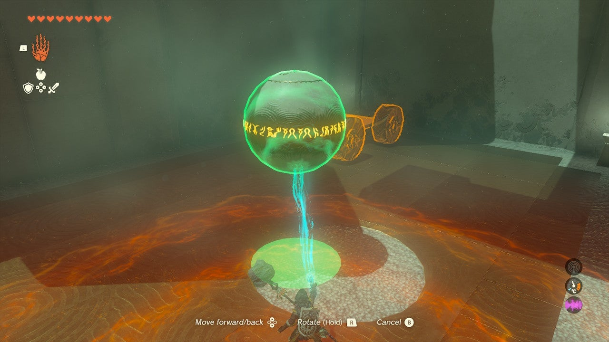

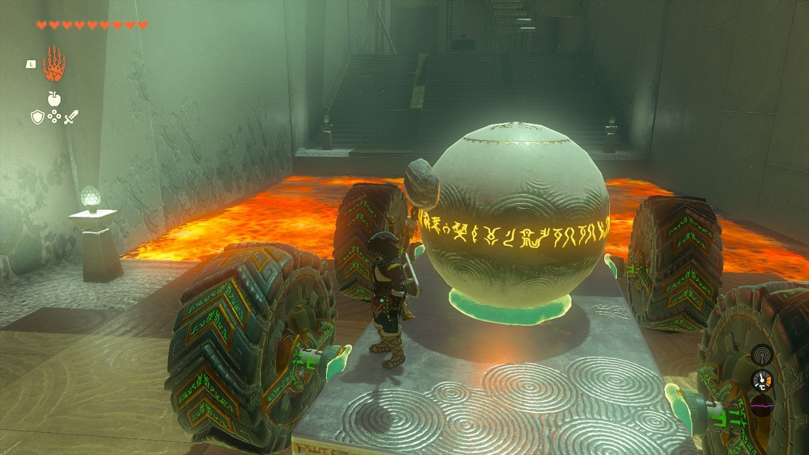

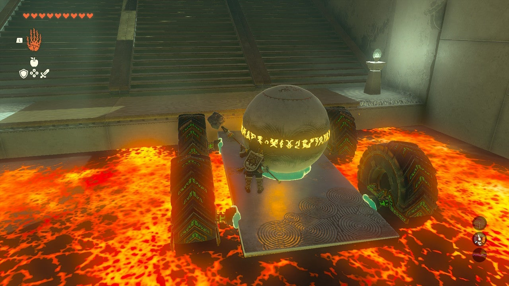

In the next area there’s a wheel, a block on a track, and a series of scaffolds. You can ignore this puzzle and simply set your “car” on the scaffolds and then attach the lone rectangular stone piece to the front of it. 

This allows you to reach your ride from above. Climb the ladder and grab the car with the rectangle attached with Ultrahand. 

You can now detach the sphere by grabbing it with Ultrahand and wiggling the RIGHT STICK. 

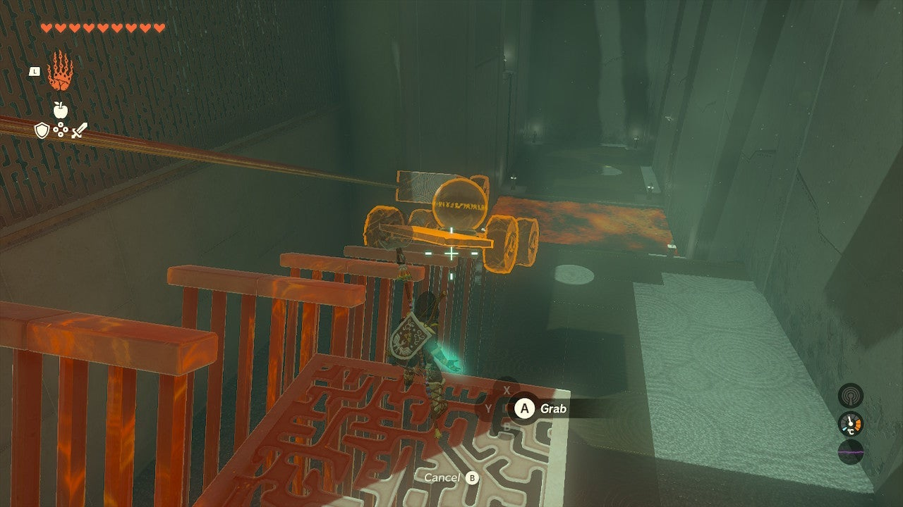

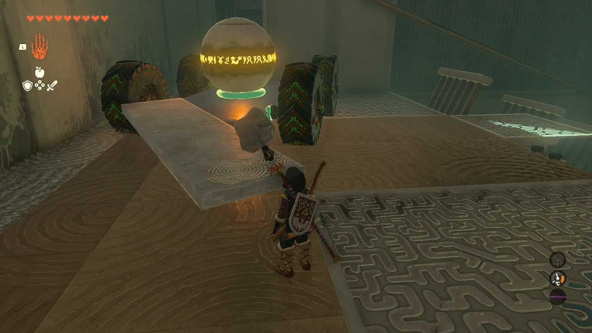

In the next area are several platforms with wheels attached floating in “lanes” in a large pool. You need to make one of these into a paddle boat. First, get some treasure! 

## Treasure Chest Location

Under the boat that’s second from the left is a treasure chest underwater in the large pool. Use Ultrahand to lift it from the shore and set it down on dry land. Inside is a **Strong Zonaite Sword**. 

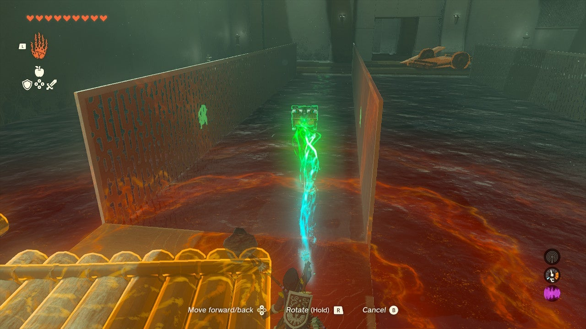

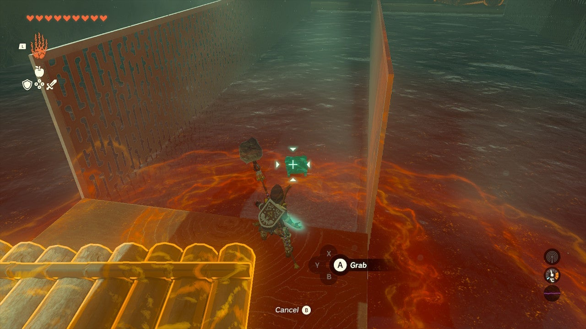

Look for the thinner boards on the shore. Two of these can be attached to the two wheels of the boat, perpendicularly, on the side, like lark sideways propellers. See the image. 

Attach the sphere to the center. 

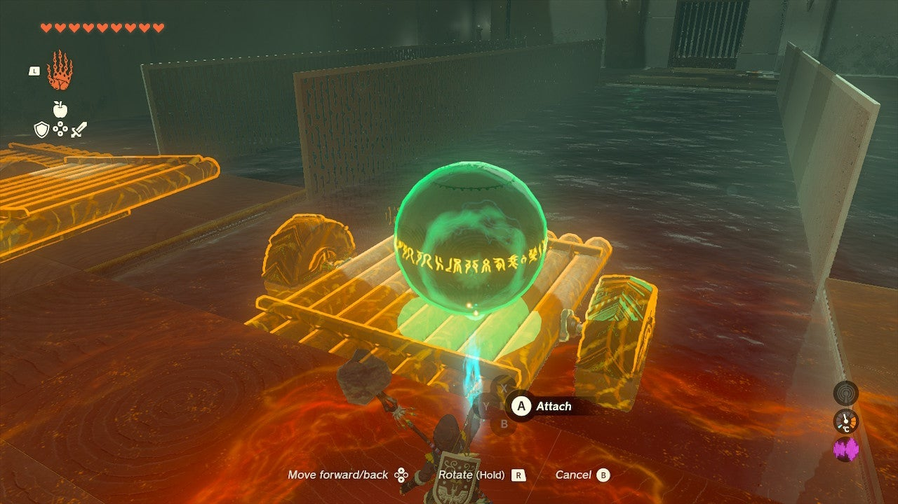

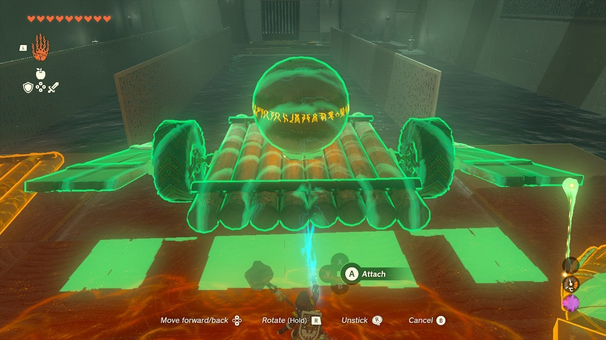

Attach them just so and activate the wheels. Ride the boat across and life the boat onto the switch to open the door. 

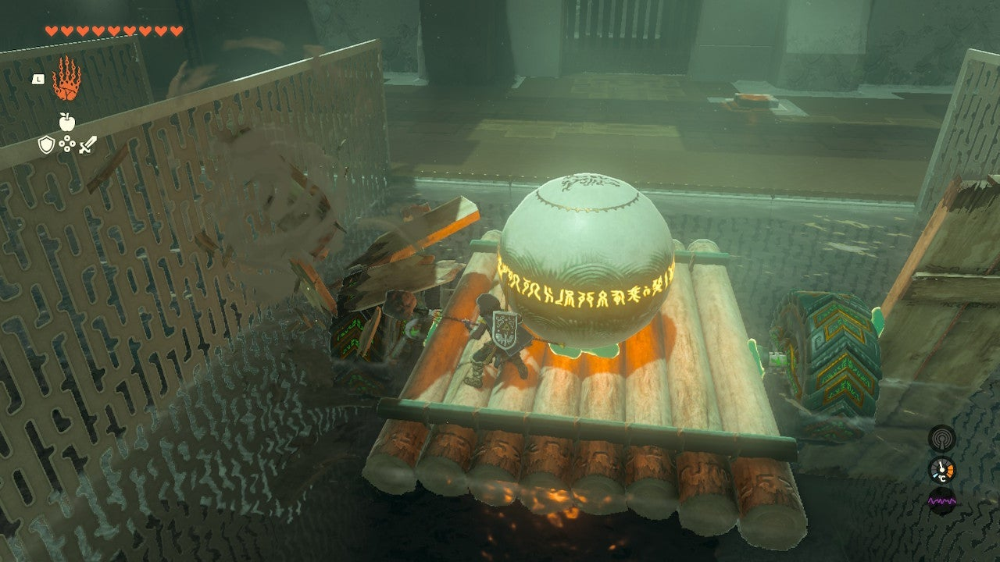

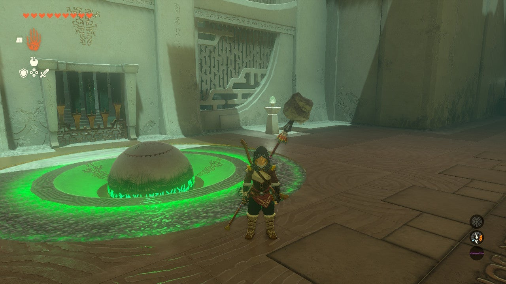

Lift the sphere to the target in the next room with Ultrahand to reveal the exit. 

Tukarok Shrine

Congrats on solving the shrine and earning a Light of Blessing! Click or tap here to return to the rest of the Shrine Guides. You can also check out which shrines are nearby with our shrine map filter on our complete map of Hyrule.

### Up Next: Walkthrough

Previous

About IGN's Zelda TotK Guide Writers

Next

Walkthrough

### Top Guide Sections

  * Walkthrough
  * Zelda: Tears of The Kingdom Switch 2 Edition Guide
  * Zelda Notes Voice Memories
  * List of Side Quests and Side Adventures

### Was this guide helpful?

Leave feedback

Go to comments