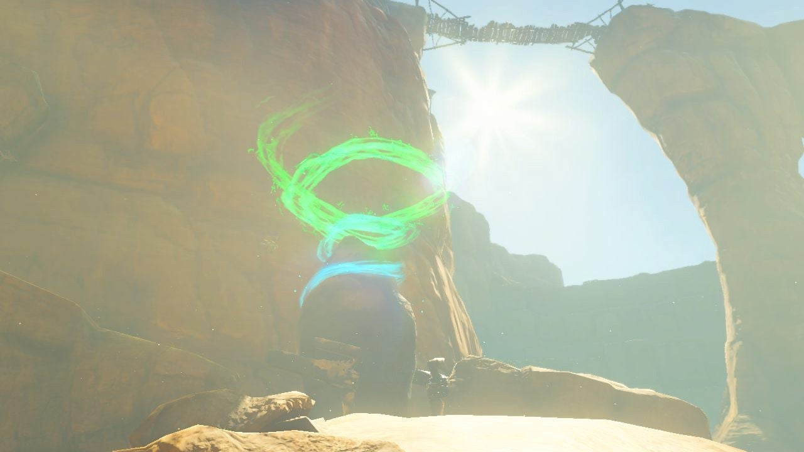

Turakamik Shrine (**Hidden Metal**) in Zelda: Tears of the Kingdom is a shrine located in the Gerudo Highlands region and is one of 152 shrines in TOTK (see all shrine locations). This page contains a guide for how to locate and enter the shrine, a walkthrough for the shrine itself, and puzzle solutions as well as treasure chest locations for the TotK Turakamik shrine. 

### Treasure and Rewards

  * Strong Zonaite Shield

## Turakamik Location

The Turakamik shrine sits above the road on a stone ledge in the Gerudo Canyon. It's just southwest of the Gerudo Canyon Skyview Tower. 

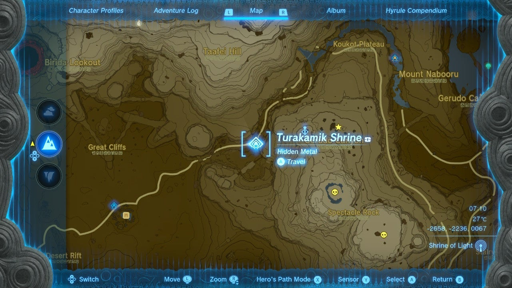

  * Coordinates: -2654, -2238, 0067

## Hidden Metal Walkthrough and Puzzle Solutions

The first puzzle of this shrine challenges you to power a large gear using the electrified iron ball on the left and the unpowered one hanging higher next to it. By getting them close, you'll create a system that allows the gear to move. However, once the powered ball drops, the gear will stop. All you need to do is use Ultrahand to connect the two iron balls to get the power going. 

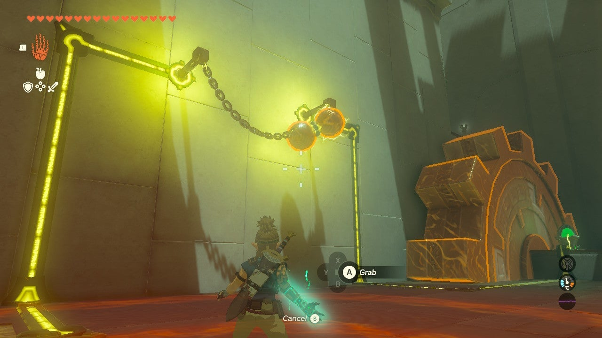

Hop on the gear and ride it to the next level. 

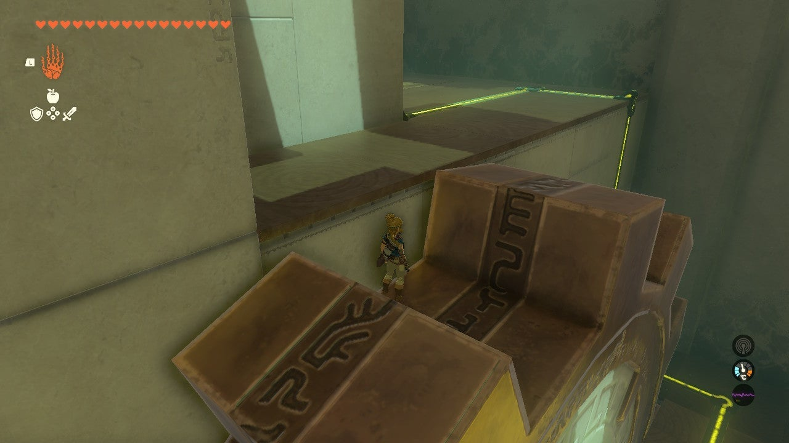

Here you'll find a similar puzzle to the one below, however, the iron balls are further apart. Select either of the two and use Ultrahand to pull it closer to the other. Hold it for a few seconds then release it. 

Now, use **Recall to put that ball back into the raised, close position**. Use Ultrahand on the other ball and attach it to the one suspended with the power of Recall. Attach them to solve this spot's puzzle. 

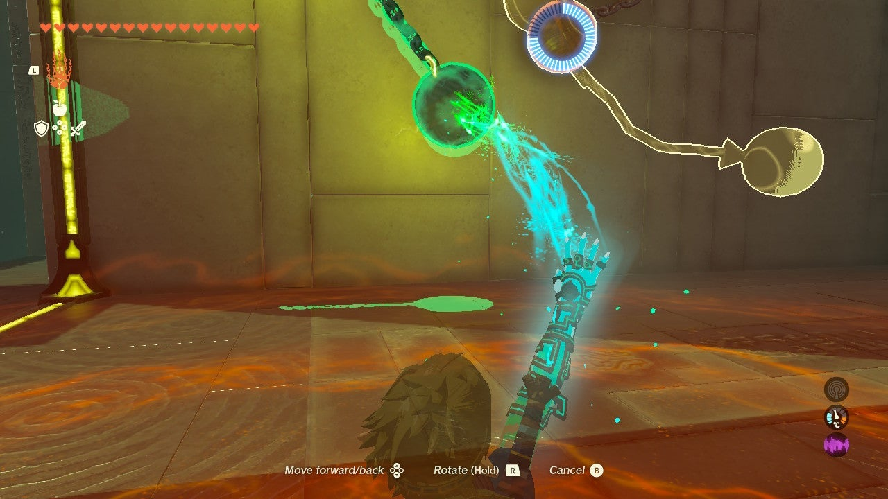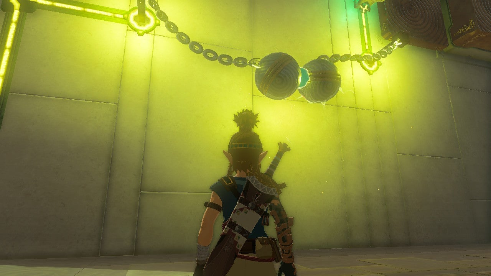

Now powered, two beams emerge alternating with two others. Use Ascend on the beam that emerges closest to the far wall, or any of them, and cross to the platform with the stairs. You're almost to the end! 

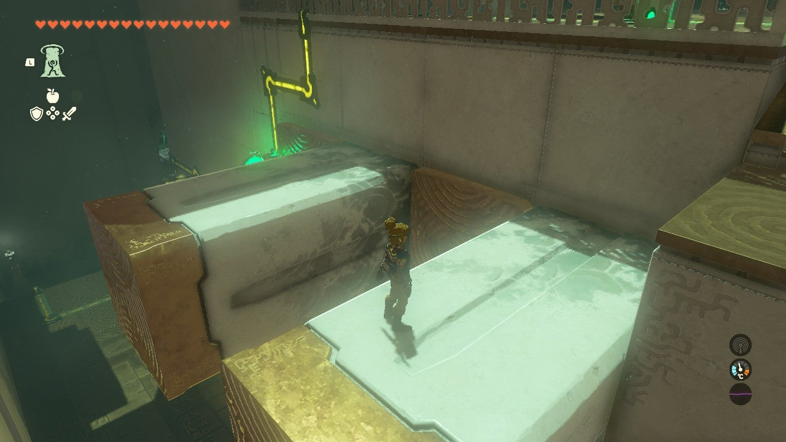

Let's get the treasure chest before worrying about the next puzzle. Turn your attention to the large gear. Use Recall on it to rewind it and step up. 

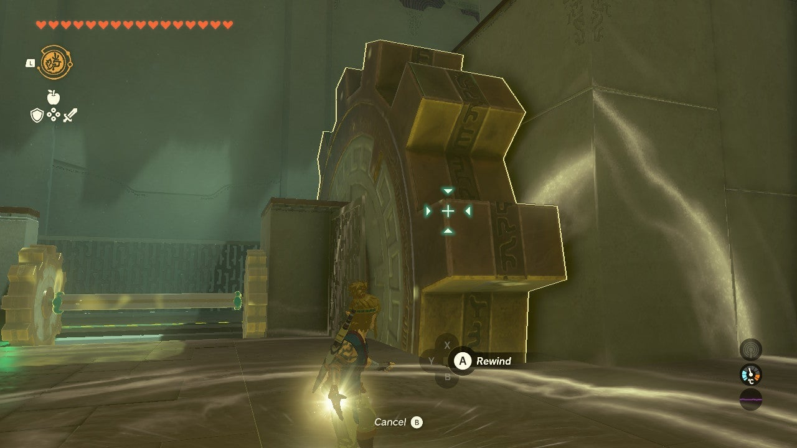

Ride it up to the platform where you can collect the **Strong Zonaite Shield** from the treasure chest. 

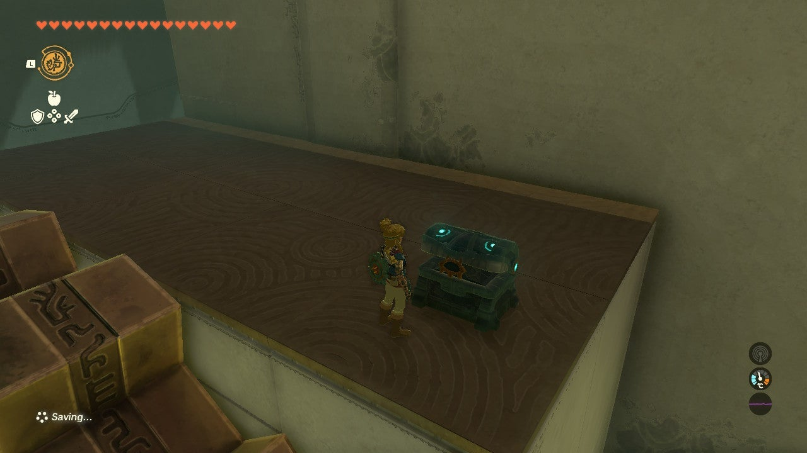

To exit the shrine, you'll need to power the gate. Use Ultrahand to take the metal bar from the gear contraption, stopping the big gear from turning. You don't need that anymore anyway! 

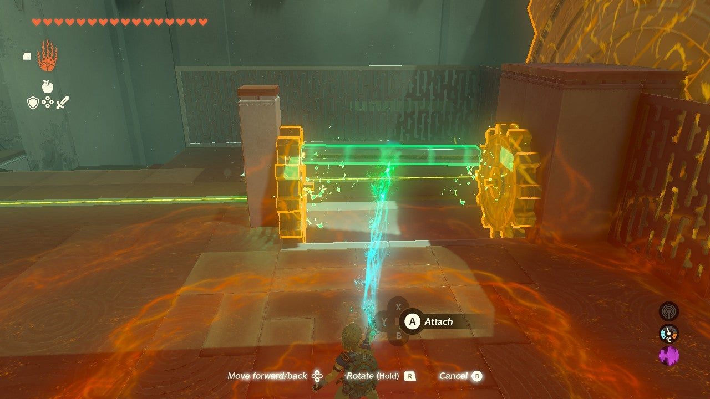

Attach the bar to the electrified ball. Then, use Ultrahand again and raise your creation and rest the bar on the two beams connected to the wall. The electricity with transfer and power the door. 

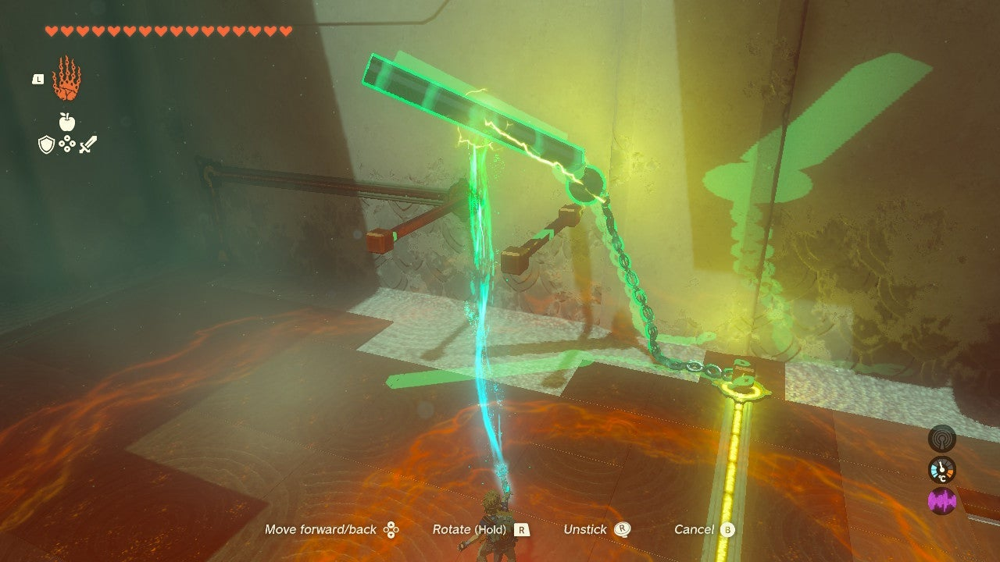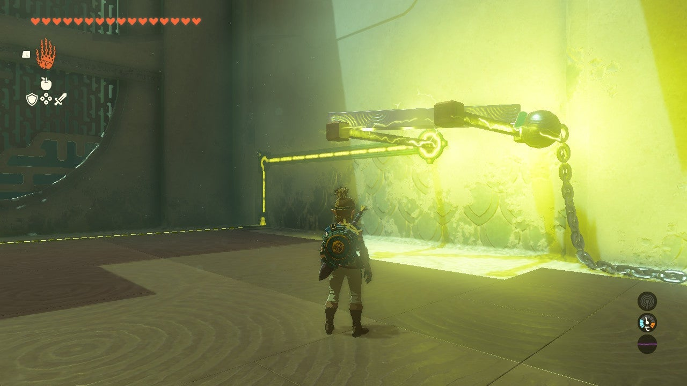

Proceed through the door and collect your Light of Blessing. 

Turakamik Shrine

Congrats on solving the shrine and earning a Light of Blessing! Click or tap here to return to the rest of the Shrine Guides. You can also check out which shrines are nearby with our shrine map filter on our complete map of Hyrule.

### Up Next: Walkthrough

Previous

About IGN's Zelda TotK Guide Writers

Next

Walkthrough

### Top Guide Sections

  * Walkthrough
  * Zelda: Tears of The Kingdom Switch 2 Edition Guide
  * Zelda Notes Voice Memories
  * List of Side Quests and Side Adventures

### Was this guide helpful?

Leave feedback

Go to comments