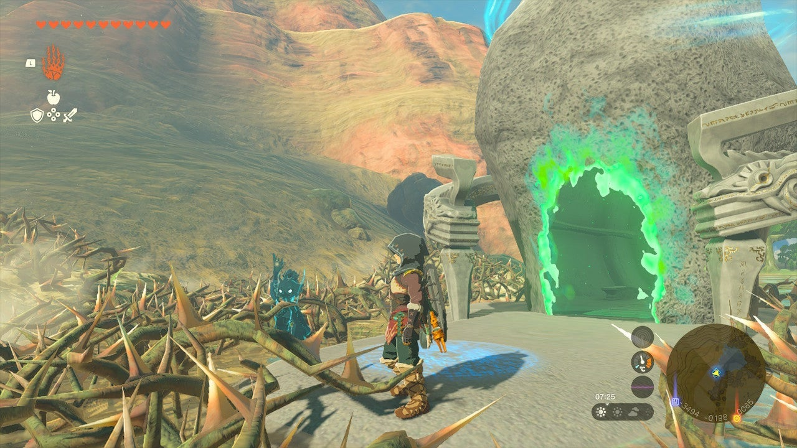

Turakawak Shrine (Stacking a Path) in The Legend of Zelda: Tears of the Kingdom is a shrine located in the Tabantha Frontier. This page contains a guide for how to locate and enter the shrine, a walkthrough for the shrine itself, and puzzle solutions as well as treasure chest locations for the TotK Turakawak shrine. 

### Treasure and Rewards

  * **Magic Rod**

##  Location/How to Reach

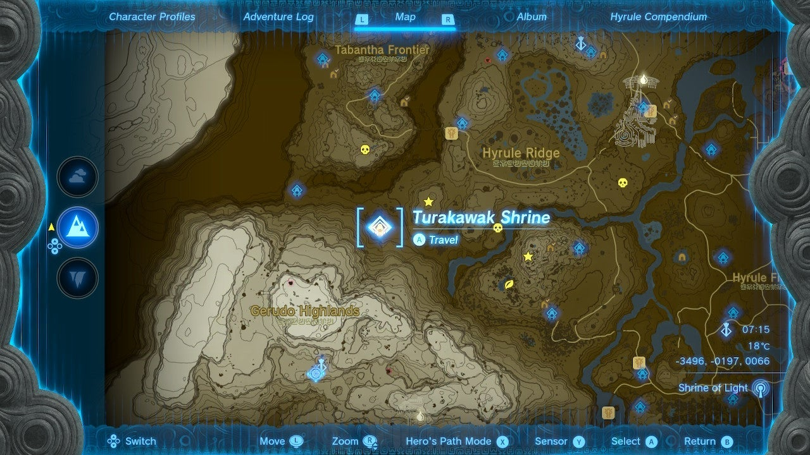

Turakawak Shrine is in the far south of the Tabantha Frontier, south of the bottom turn of Tanager Canyon, and by a small lake called Lake Illumeni. It is out in the pen and easy to spot, but it is surrounded by thorns you can either burn away or better yet, avoid entirety by paragliding in from the nearby cliffside. 

  * **Coordinates:** -3496, -0197, 0066

## Walkthrough and Puzzle Solutions

The block in the first room can be climbed. You need to move it to the edge of the ladder to reach the ladder. 

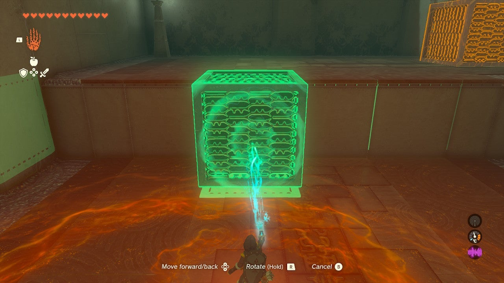

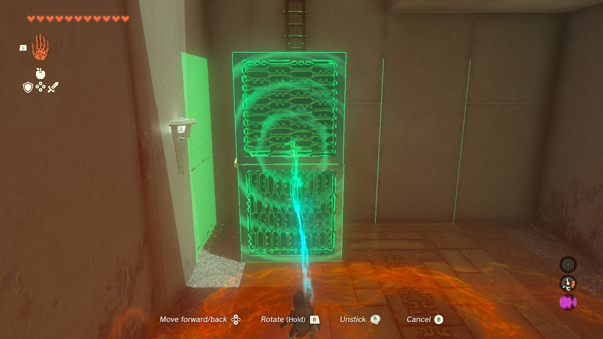

From here, lift the block onto the next block and use Ultrahand to glue them together in a vertical stack. Before climbing the ladder, you can get a treasure chest. 

## Treasure Chest Location

Look for a slot in the ceiling above the first area. Move under this and select Ascend from the L menu. Activate Ascend and you can break into the treasure chamber above. Inside the chest is a **Magic Rod**. 

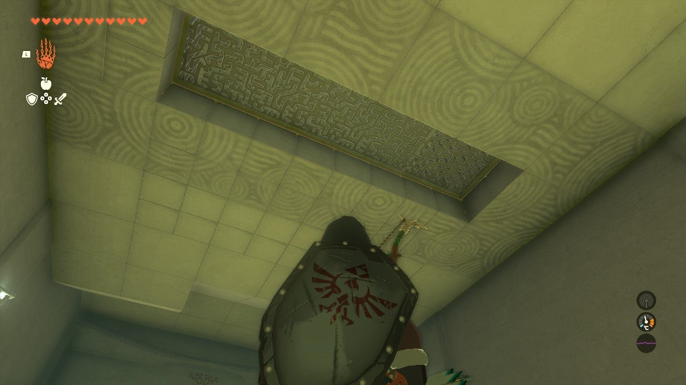

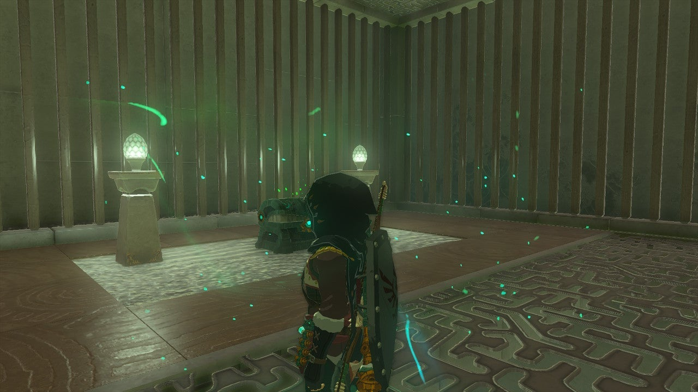

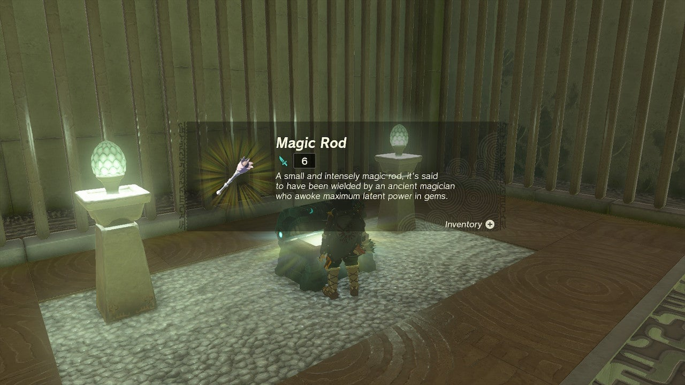

Ascend out of the chest chamber. 

**The final puzzle is a bit tricky in Turakawak Shrine:**

Retrieve your first two cubes from down below. Put them on their side. Use Ultrahand to fuse the third, non-climbable cube to the first two at the “top” of a vertical stack, but 50% on the top block and 50% off. 

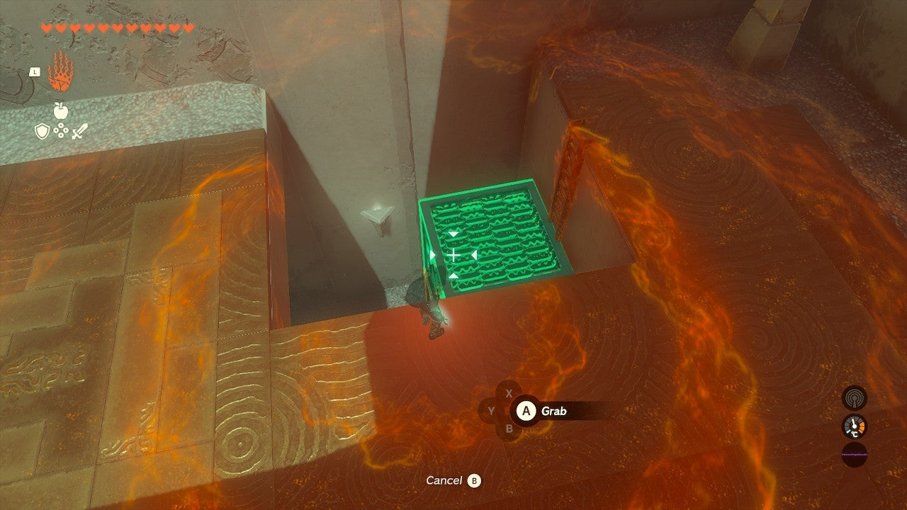

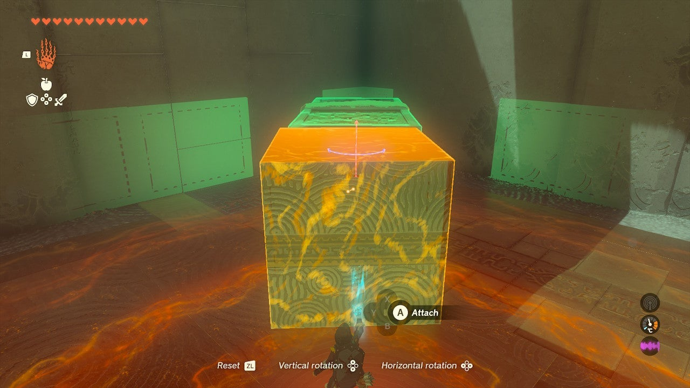

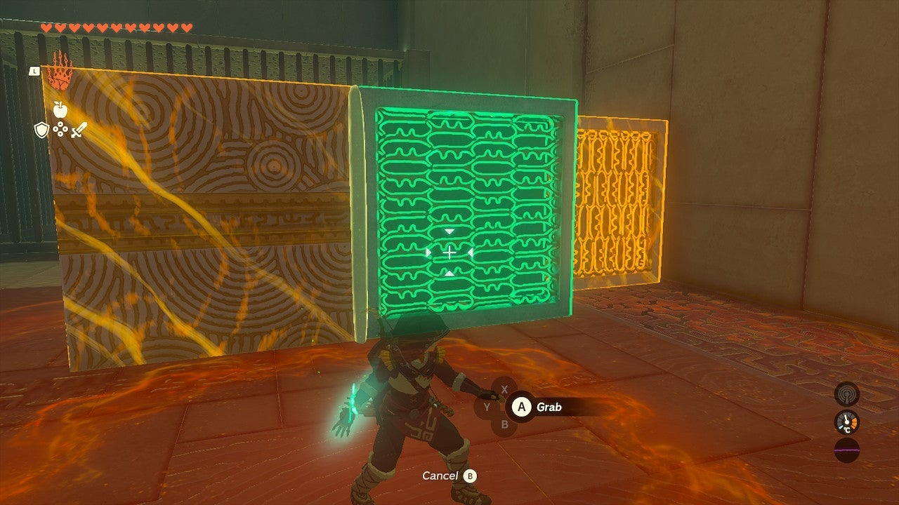

This will make an overhang you can use Ascend on. Place the stack with the unclimbable block at the top and lean it against the wall. Ascend vertically up through the top block to the exit. 

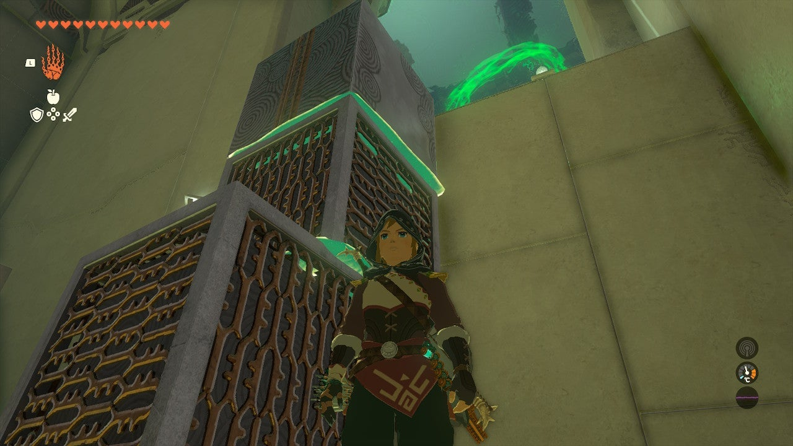

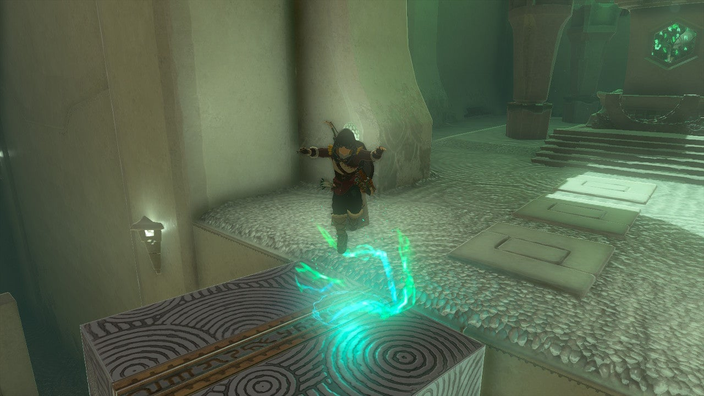

Turakawak Shrine

Congrats on solving the shrine and earning a Light of Blessing! Click or tap here to return to the rest of the Shrine Guides.

### Up Next: Walkthrough

Previous

About IGN's Zelda TotK Guide Writers

Next

Walkthrough

### Top Guide Sections

  * Walkthrough
  * Zelda: Tears of The Kingdom Switch 2 Edition Guide
  * Zelda Notes Voice Memories
  * List of Side Quests and Side Adventures

### Was this guide helpful?

Leave feedback

Go to comments