Ukoojisi Shrine (**Rauru’s Blessing**) in Zelda: Tears of the Kingdom is a shrine located in the Necluda Sky in the **West Necluda Sky Archipelago** and is one of 152 shrines in TOTK (see all shrine locations). It's only accessible after completing **The West Necluda Sky Crystal Shrine Quest** , which you'll find a guide to below. 

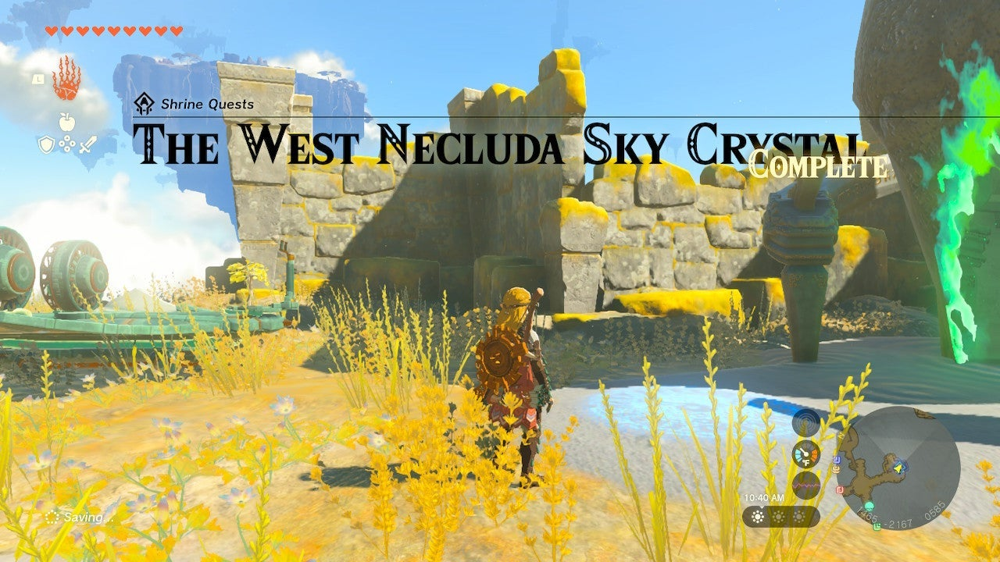

### Treasure and Rewards

  * Mighty Zonaite Shield

## Ukoojisi Shrine Location

From the Popla Foothills Skyview Tower, launch into the sky and float on your paraglider east and look for a few small stones leading to an island with a tower and pool on it. Land here in the West Necluda Sky Archipelago. 

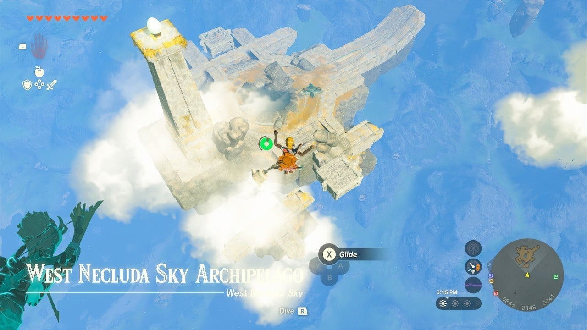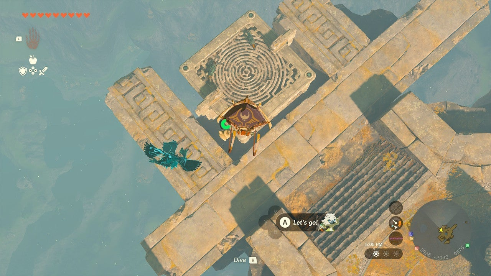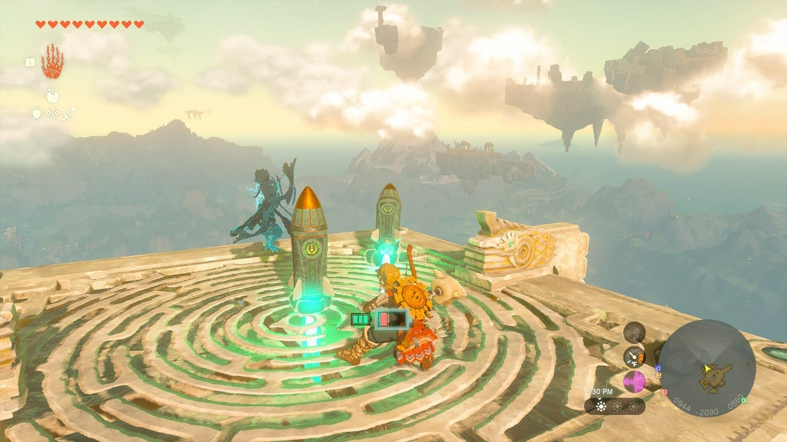

Kill the Construct with the rockets and head to its platform. Here you can find two rockets. These can easily get the platform enough height for you to glide to the next island over with the shrine on it. Try attaching a rocket to the center of the pad vertically, and one at a 45-degree angle towards the island in the east – this will get you nearer. 

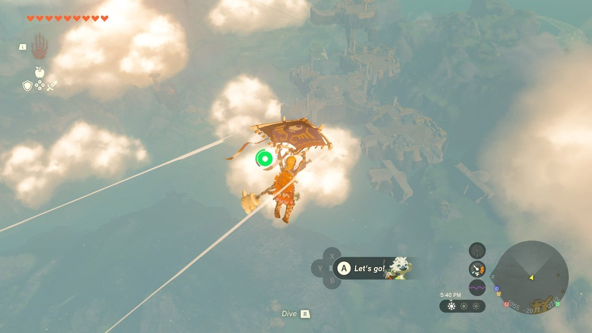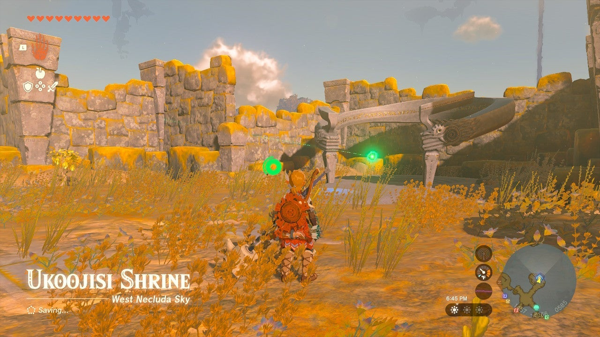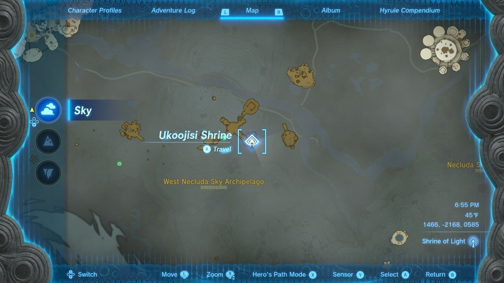

Land on this island and activate the Ukoojisi Shrine pad to begin The West Necluda Sky Crystal Shrine Quest. 

  * Coordinates: 1466, -2168, 0585

## The West Necluda Sky Crystal Shrine Quest Walkthrough

You will need a sharp weapon to cut vines before you leave on this journey! The West Necluda Sky Crystal is a green crystal on a rocky island a green laser from Ukoojisi Shrine points to. You can’t go directly there without high-tech equipment. Here’s the low-tech way: 

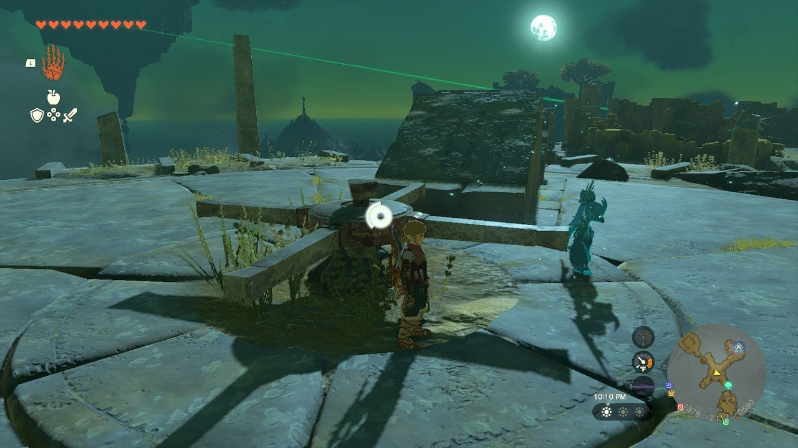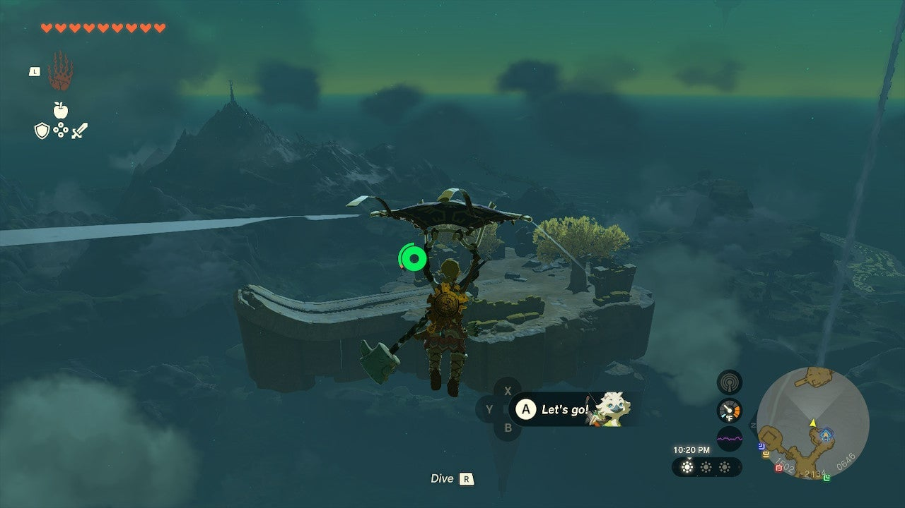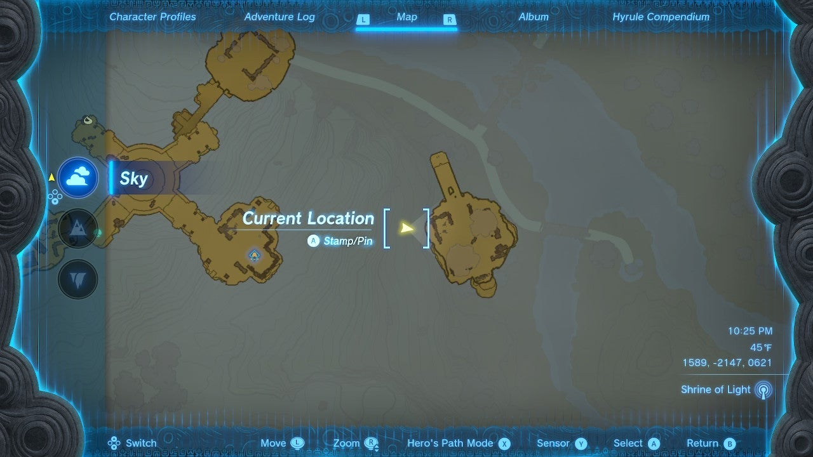

  
Go to the stone launcher with the wheel. Rotate the wheel to point east at an island with a swooped ramp. 

Here you can build a plane with a: 

  * Wing
  * Control Stick
  * At least two fans
  * At least two batteries
  * A rocket

The rocket will help you launch off the swooped ramp. Make sure your fans and rocket are aimed in the right direction. Save before you try your plane. If you have Autobuild it’s easy to recreate! 

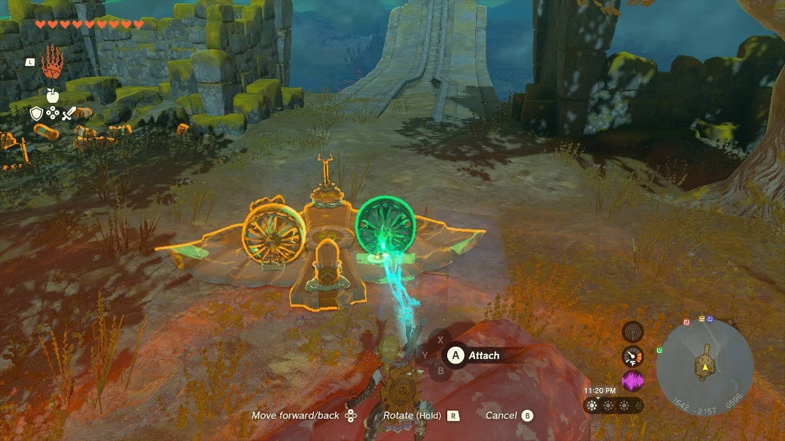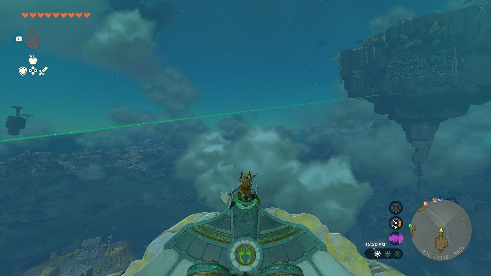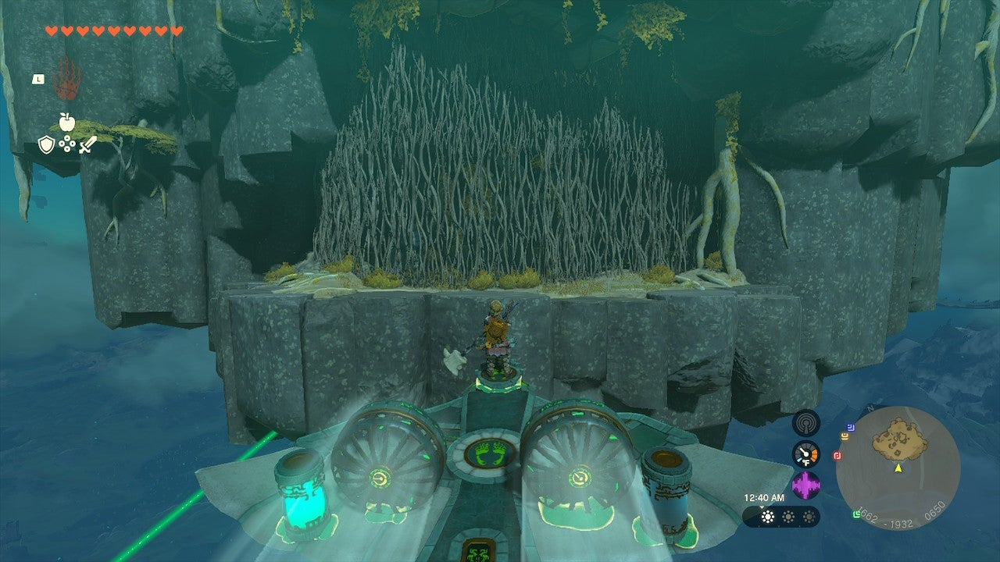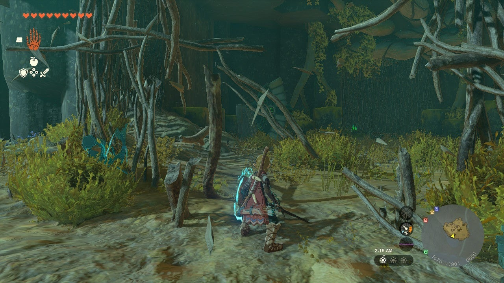

Put the ship on the swooped track and aim north toward the green laser’s destination. Pull DOWN on the analog stick to aim your nose upward and you should reach the vine wall on the island. Press B to cancel flying when you do. 

Now, use a sharp weapon to cut the vines. Inside you can find the green crystal behind more vines. 

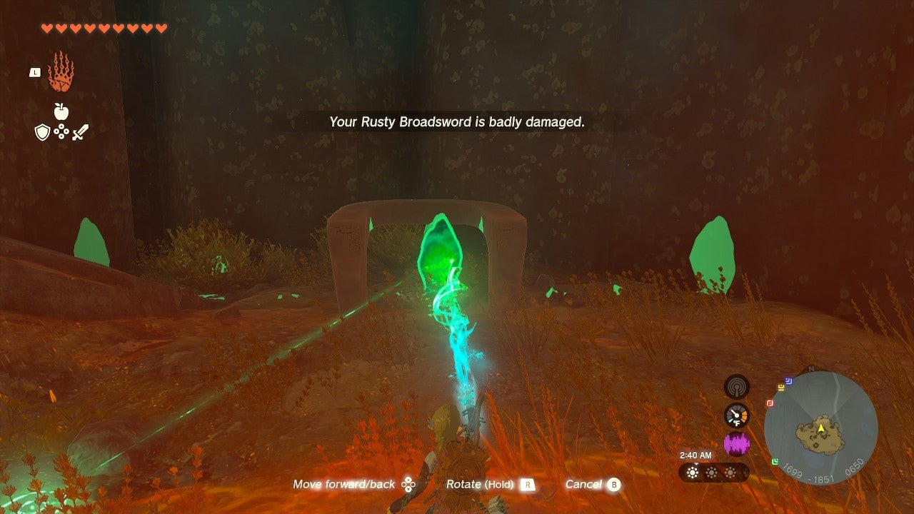

Here you can also find parts to make another plane. 

  * Wing
  * Control Stick
  * At least two fans
  * At least two batteries
  * A cart for the bottom
  * The green crystal (ATTACH THIS TO THE WING)

Since you have no swooped launcher, you can use the wheeled cart to attach to the bottom of your plane to take off easily. You can attach the green crystal to the rear of the plane. 

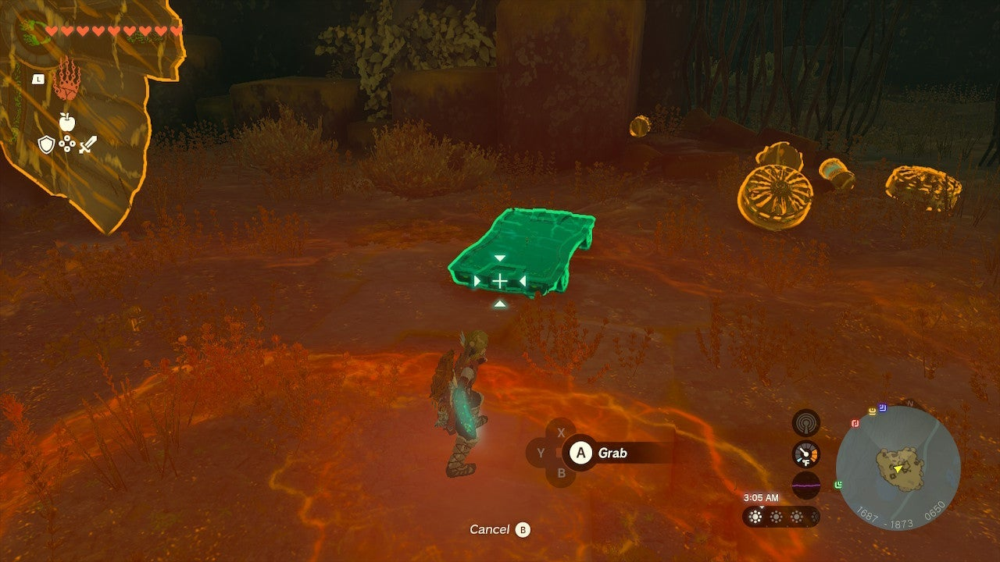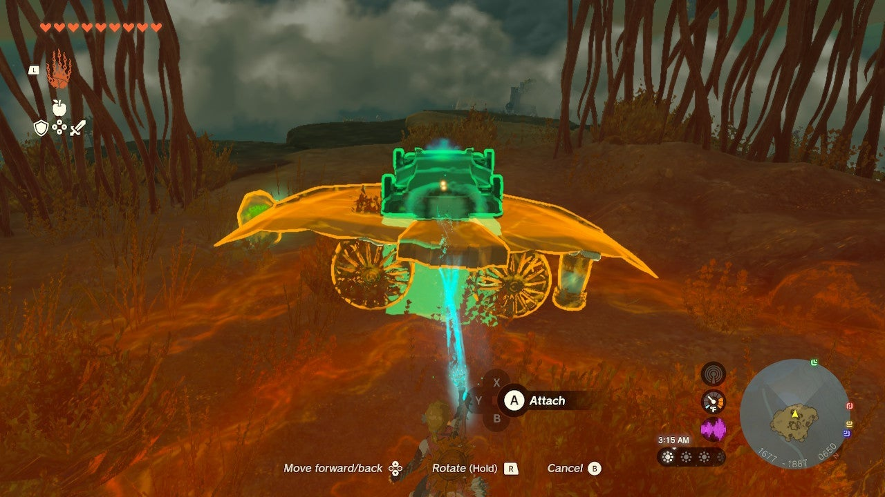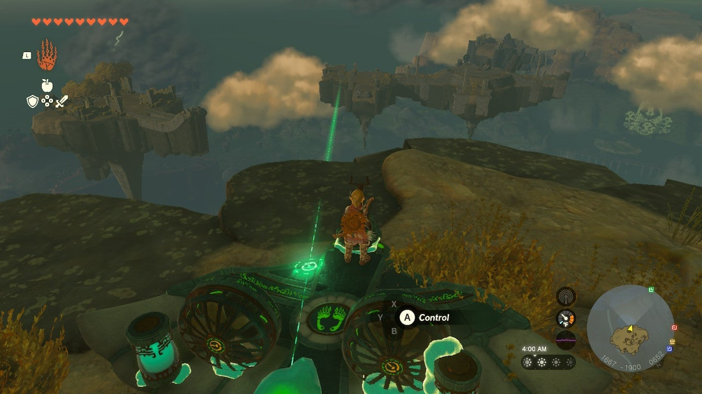

Aim right at the laser’s destination, the Shrine, and take the controls. Make sure you pilot your ship into the ground on the destination island before leaving the controls. 

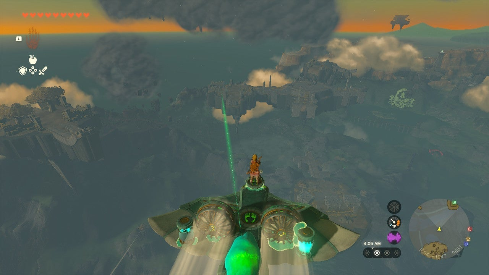

Now you can detach the green crystal and return it to the shrine to complete The West Necluda Sky Crystal Shrine Quest and enter the Shrine to claim your Mighty Zonaite Shield in the chest. 

The West Necluda Sky Crystal

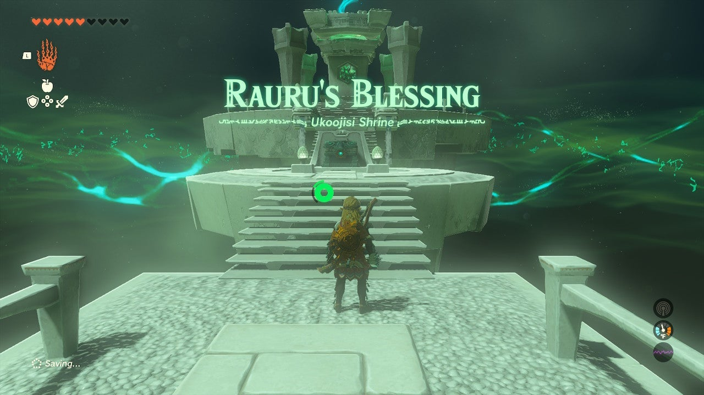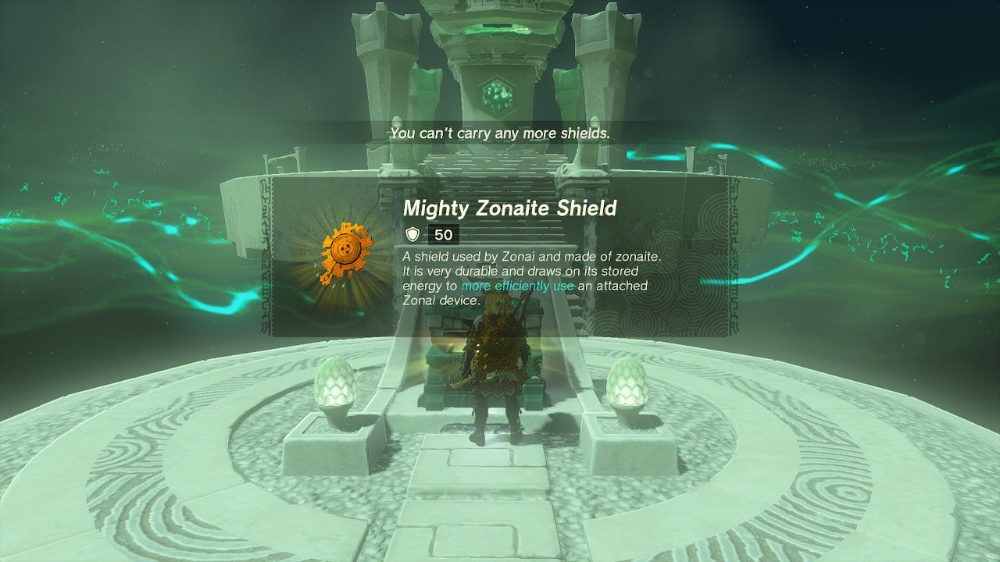

Ukoojisi Shrine

Congrats on solving the shrine and earning a Light of Blessing! Click or tap here to return to the rest of the Shrine Guides. You can also check out which shrines are nearby with our shrine map filter on our complete map of Hyrule.

### Up Next: Walkthrough

Previous

About IGN's Zelda TotK Guide Writers

Next

Walkthrough

### Top Guide Sections

  * Walkthrough
  * Zelda: Tears of The Kingdom Switch 2 Edition Guide
  * Zelda Notes Voice Memories
  * List of Side Quests and Side Adventures

### Was this guide helpful?

Leave feedback

Go to comments