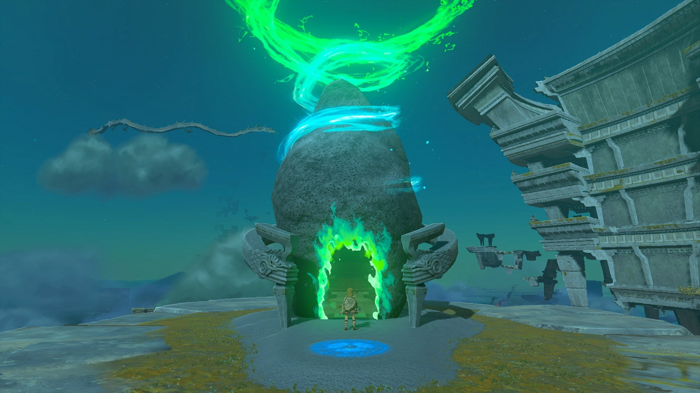
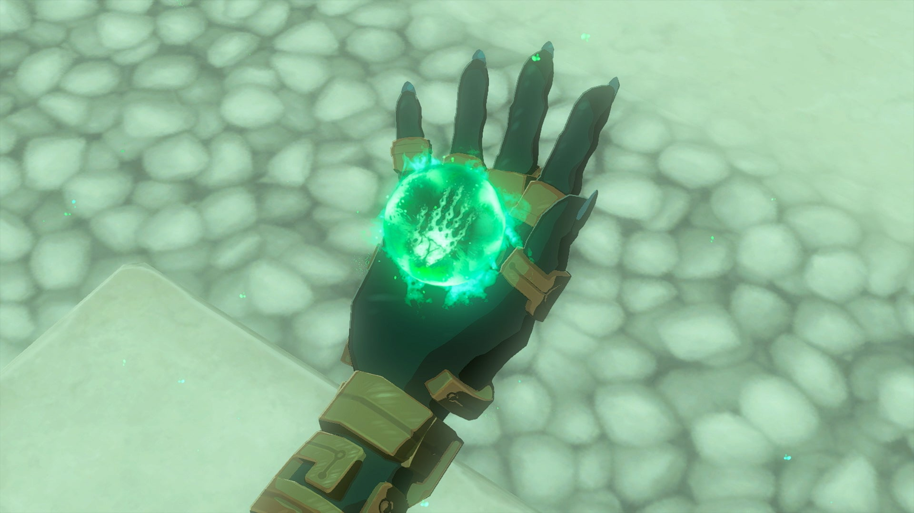
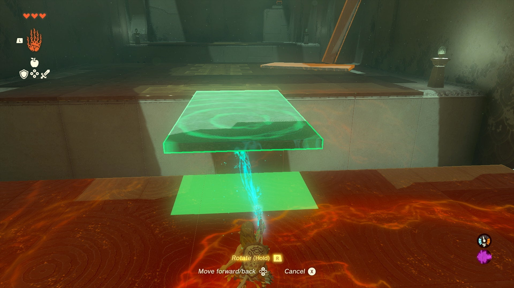
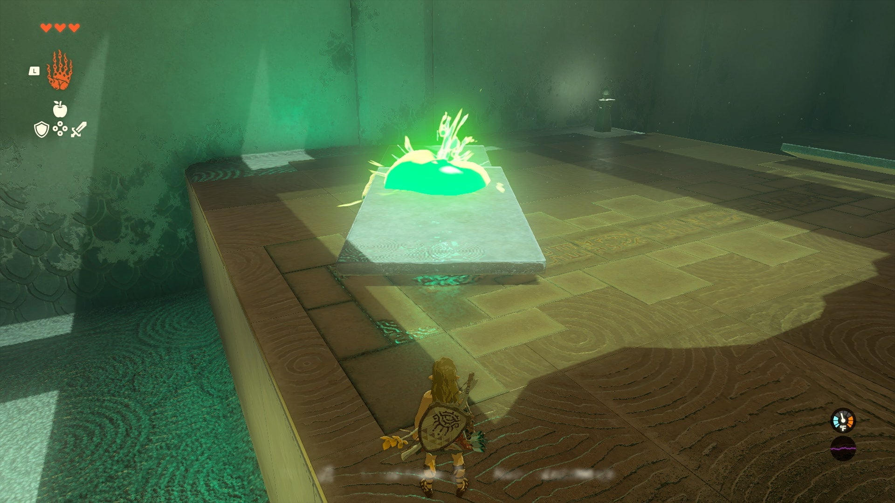
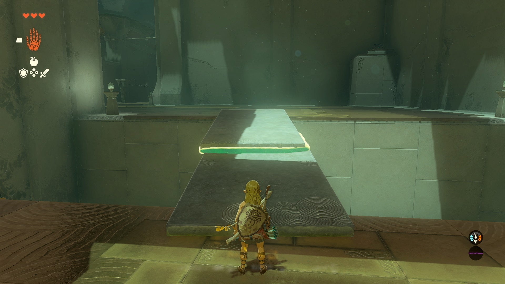
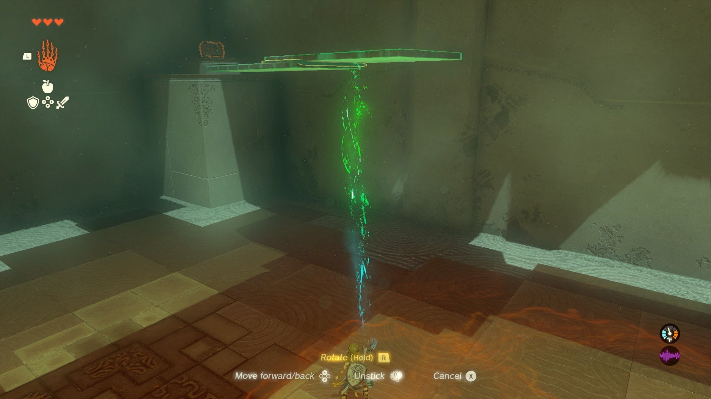
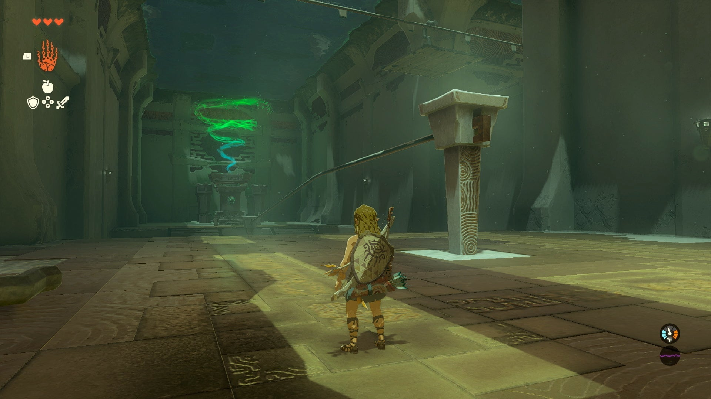
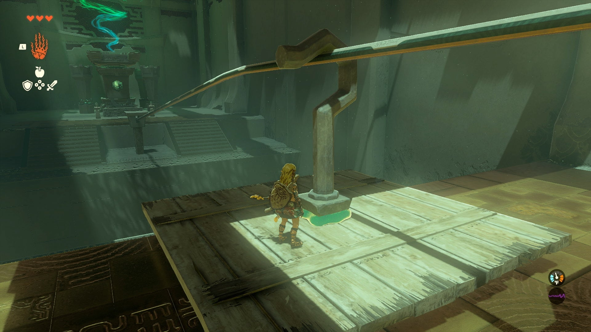
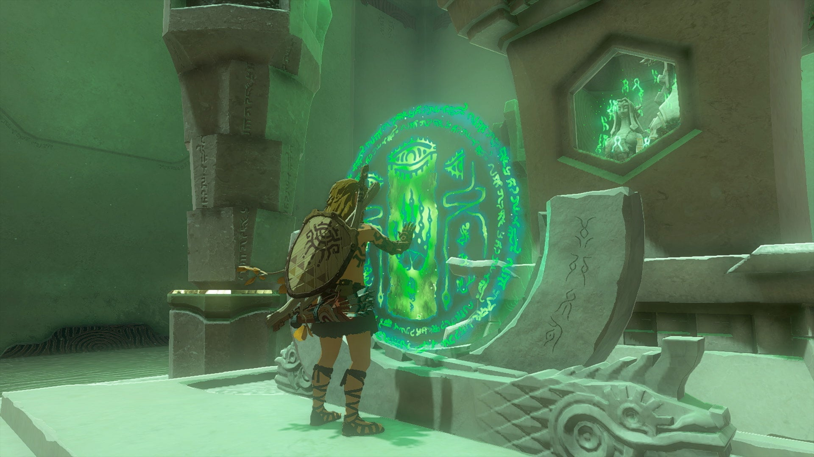
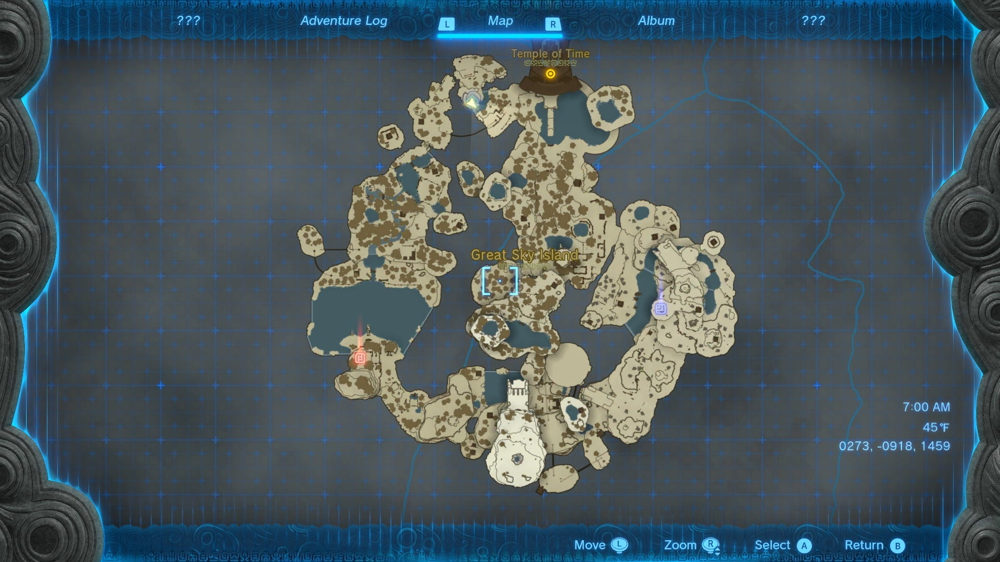

Ukouh Shrine (**The Ability to Create**) in The Legend of Zelda: Tears of the Kingdom is a shrine located in the **Great Sky Island** and is one of many shrines in TOTK (see all shrine locations). Below is a complete walkthrough of Ukuoh shrine, which is likely the first shrine you'll complete on your adventure in Hyrule. 

### Treasure and Rewards

  * **Ultrahand**
  * **Amber**

##  Ukouh Shrine Location

This Shrine can be reached via the Great Sky Island - Find Princess Zelda and The Closed Door quest. It's to the left of the temple a ways off on its own island area. 

  * Coordinates: 0274, -0913, 1460

## Ukouh Shrine Walkthrough

Inside the temple, the spirit of Rauru will clue you in on how these shrines work. If you’ve played Breath of the Wild, you should have a pretty good idea - you’ll need to solve a variety of puzzles to reach the inner shrine at the end and be rewarded with a Light of Blessing. To help you through, Rauru will activate the first of several abilities on Link’s new arm: **Ultrahand**. 

Ultrahand works very similar to the Magnesis ability from Breath of the Wild - with a few very important changes. It can be used on most any material that isn’t living or tied down to the ground. When holding an item with Ultrahand, you can not only levitate it around or pull it in or out with the D-Pad — you can also hold R to begin rotating the item horizontally or vertically. 

Try it out on the closest stone slab. Pick it up and lift it, then rotate it until it fits lengthwise over the small gap and place it down to create a bridge. 

The other main important aspect of Ultrahand can be found at the next puzzle: When placing any moveable materials close together, you can press A to attach them with a near indestructible green substance. This will allow you to create a string of objects fused to each other, in many inventive ways. 

Give it a shot by grabbing one slab, rotating it to lie flat, then attaching it at the bottom edge of the other flat slab to create an extended bridge. Now you can grab the combined slab and use it to create a longer bridge across the second gap. 

If you accidentally attach it at an awkward part, you need only use Ultrahand again and wiggle the right control stick to break it free, then re-attach it as needed. Look for where the green goop is ready to form to see where the attach point will be. 

Once you cross the second bridge, turn around and use Ultrahand to grab it, then look for a large high platform to the right with a chest. You can now rotate the bridge vertically and tilt it slightly forward, then place it up against the pillar to create a ramp you can climb up to the chest, which holds **Amber**. The material isn’t too important now, but will have a good sell value later. 

As a good rule of thumb to remember, every shrine will have one or more optional chests. You can easily see if all chests have been found by checking the map to see if there is a chest icon next to the name of the shrine!

When you reach the next section, a new puzzle awaits. A long railway leads across a gap to the inner shrine, but the square wooden plank nearby isn’t long enough to cover the gap. The answer to this riddle lies above, as you can spot a wooden plank on a metal hook gliding across the rail above. 

To make your own rail line, use Ultrahand to place the wooden plank flat on the ground. Then grab a metal hook and place it in the center of the plank and attach it. Grab the whole creation and slide the hook onto the rail, then let go and jump on board. 

It will slowly ride across the rail line to the other side with you in it, completing the final puzzle. If you fall off or don’t jump on in time, you should still be able to pull it back across the gap to try again. 

Interact with the inner shrine to get your reward - the Light of Blessing. This key item will play an important part in strengthening Link, but you’ll need a few more first. 

Ukouh Shrine

Congrats on solving the shrine and earning a Light of Blessing! Click or tap to return to see the rest of the TotK Shrine Locations and Puzzle Solution Guides or check out the other shrine guides for the area: 

  * In-isa Shrine
  * Gutanbac Shrine
  * Nachoyah Shrine

### Up Next: Walkthrough

Previous

About IGN's Zelda TotK Guide Writers

Next

Walkthrough

### Top Guide Sections

  * Walkthrough
  * Zelda: Tears of The Kingdom Switch 2 Edition Guide
  * Zelda Notes Voice Memories
  * List of Side Quests and Side Adventures

### Was this guide helpful?

Leave feedback

Go to comments