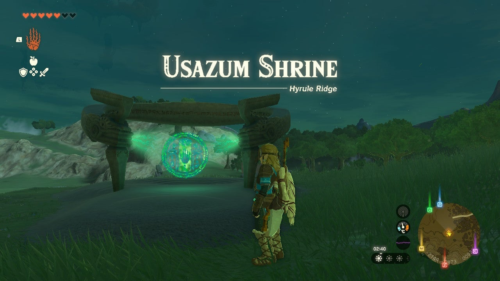
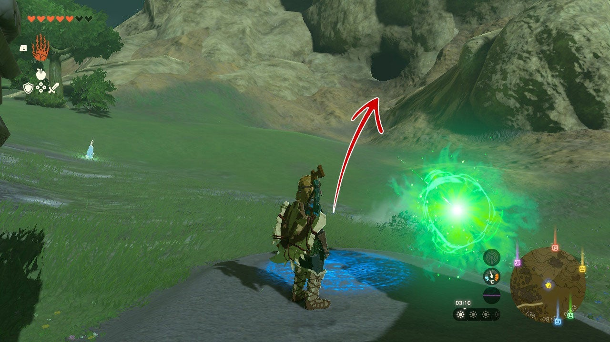
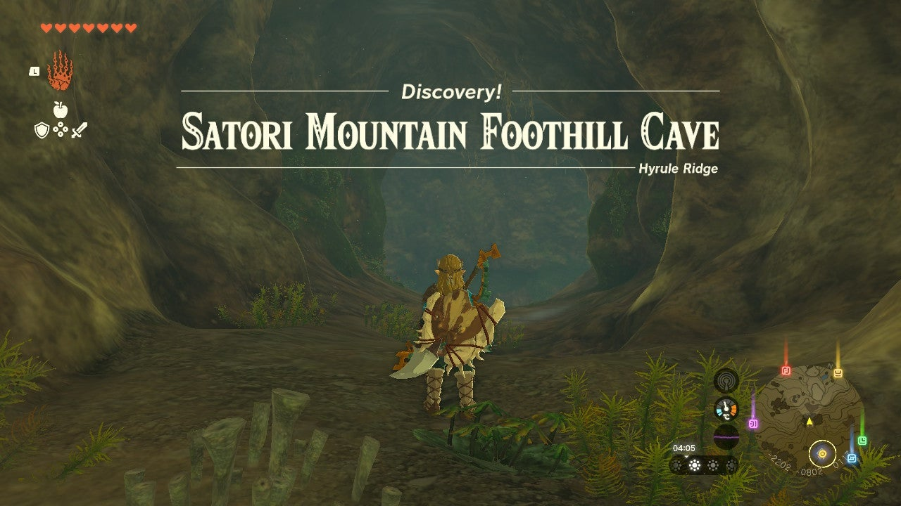
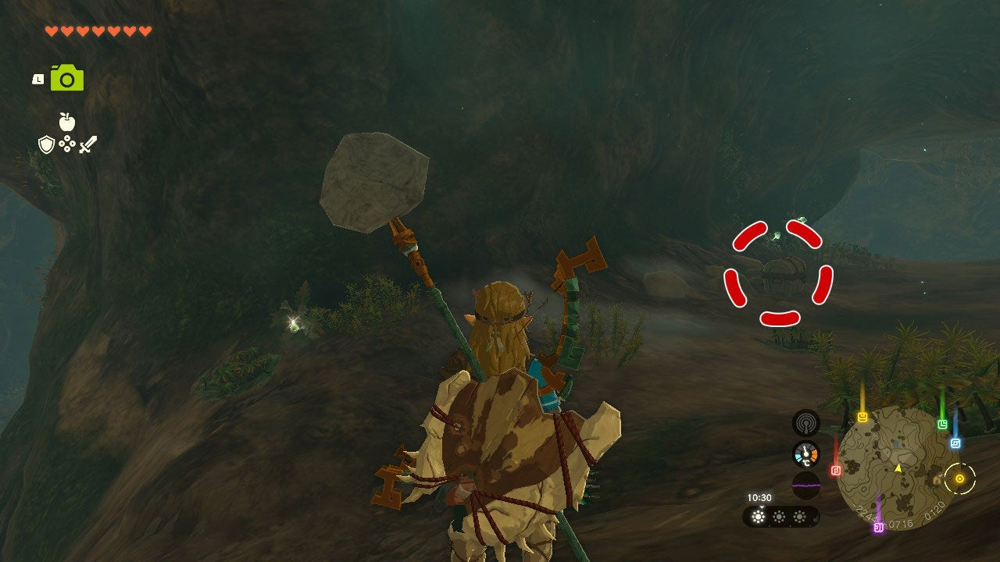
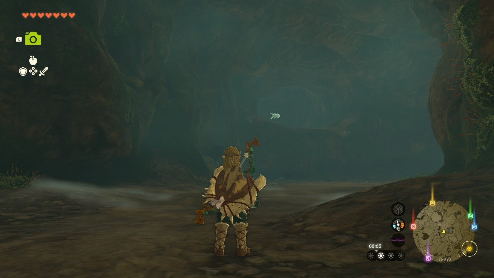
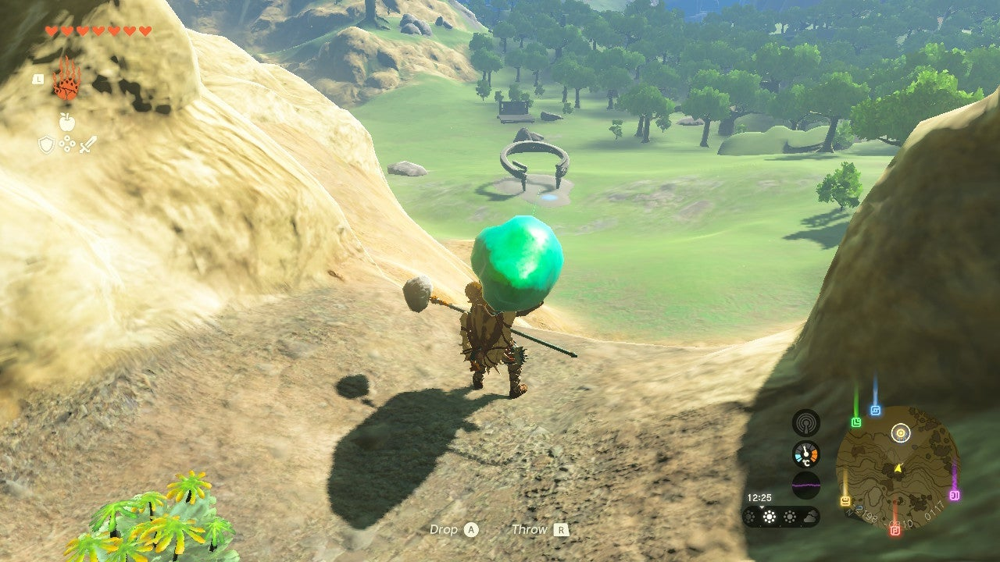
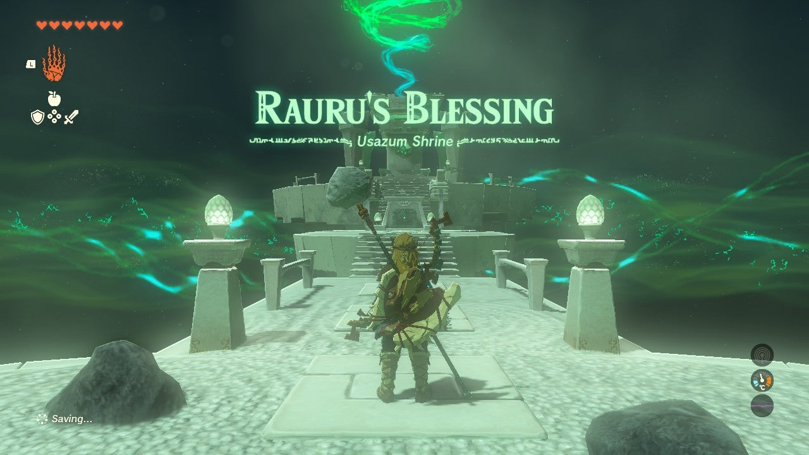

Usazum Shrine (Rauru's Blessing) in The Legend of Zelda: Tears of the Kingdom is a shrine located in the Hyrule Ridge. This page contains a guide for how to locate and complete The Satori Mountain Crystal shrine quest, a walkthrough for the shrine itself, and puzzle solutions as well as treasure chest locations for the TotK Usazum shrine. 

### Treasure and Rewards

  * Strong Zonaite Spear

## Finding Usazum Shrine

Since the shrine is absent, you'll see the partial shrine ring empty on the field west of Safula Hill and north of the Dalite Forest. 

  * Coordinates: -2138, 0874, 0093

## The Satori Mountain Crystal Shrine Quest

Like other Crystal shrine quests, you're tasked with retrieving a crystal and presenting it at the shrine. A light emits from the shrine, pointing the way to the crystal. Turn around and you'll immediately see a dark hole in the base of Satori Mountain and potentially a Blupee not far as well. 

If you engage the Blupee it'll run toward the cave entrance. 

### Satori Mountain Foothill Cave

Enter the cave and as it opens, you'll likely see the crystal's ray bobbing. That's because this cave is actually a big circle and unfortunately the shrine crystal is around the neck of a Hinox. If you don't have arrows this is the time to go and get them. 

Tips for beating a Hinox: 

  * Its main weakness is its eye. If you hit it with an arrow it'll knock the Hinox back and it'll sit for a few seconds.
  * After enough times of getting its eye attacked the Hinox will try blocking its eye from arrow attacks.
  * If you don't have enough stamina to keep running away, there's a hole that runs through the middle of the cave. Look up and you should see it about midway in the rock that splits the cave. Climb up and attack from there! There's a treasure chest with a Tap to Reveal too.

Before you leave with the crystal, take a look at the northernmost corner of the cave. If you climb up and into the alcove you'll find a **Bubbulfrog**. 

Take the crystal back to the shrine spot when you're ready to get access to the shrine. 

The Satori Mountain Crystal

## Inside Usazum Shrine

The main challenge for the Usazum Shrine was defeating the Hinox. Once you arrive inside the shrine you're bestowed with Rauru's Blessing, meaning all you need to do here is walk forward, collect the treasure (Strong Zonaite Spear), and be on your way with a new Light of Blessing. 

Usazum Shrine

Congrats on solving the shrine and earning a Light of Blessing! Click or tap here to return to the rest of the Shrine Guides.

### Up Next: Walkthrough

Previous

About IGN's Zelda TotK Guide Writers

Next

Walkthrough

### Top Guide Sections

  * Walkthrough
  * Zelda: Tears of The Kingdom Switch 2 Edition Guide
  * Zelda Notes Voice Memories
  * List of Side Quests and Side Adventures

### Was this guide helpful?

Leave feedback

### In This Guide

The Legend of Zelda: Tears of the KingdomNintendo EPD

Initial Release: May 12, 2023

Learn more

Go to comments