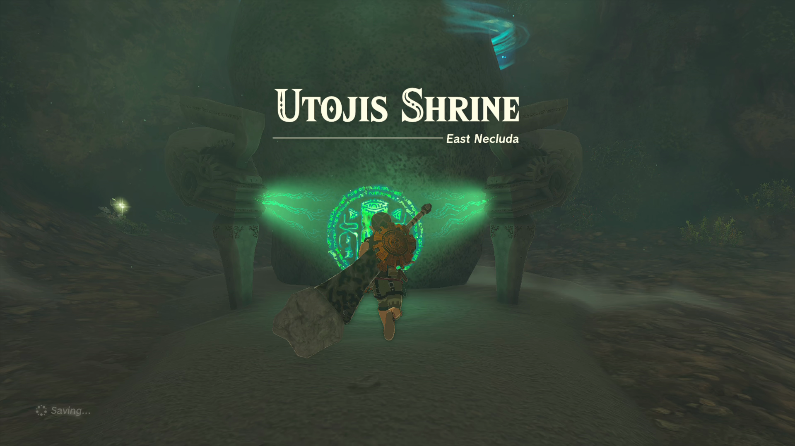
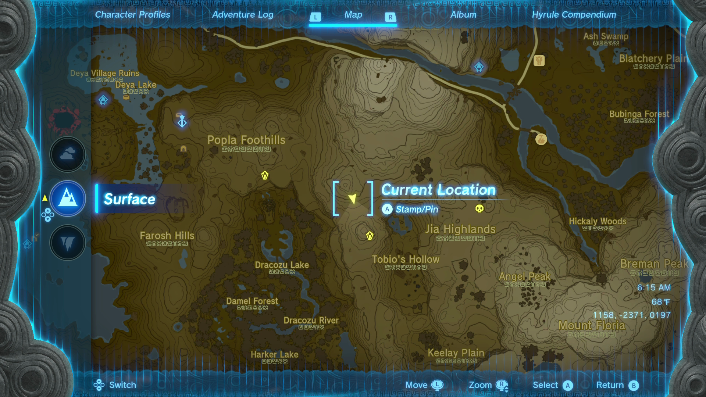
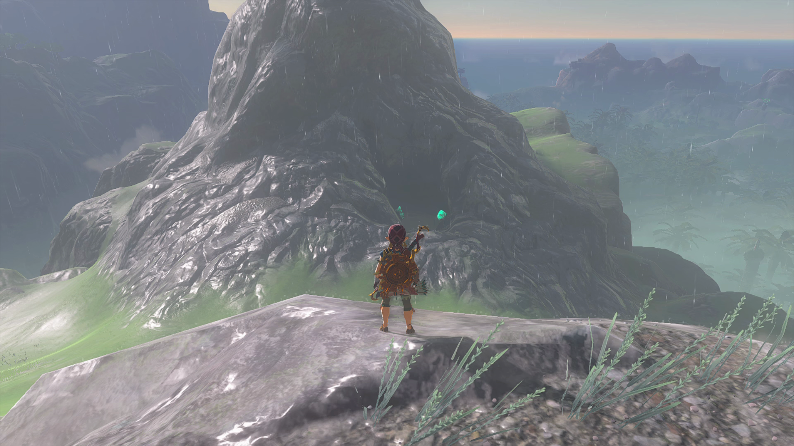
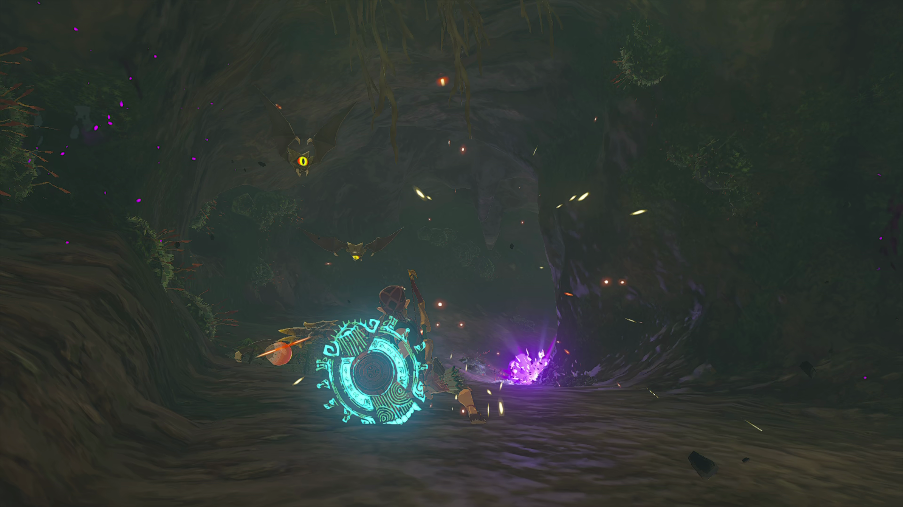
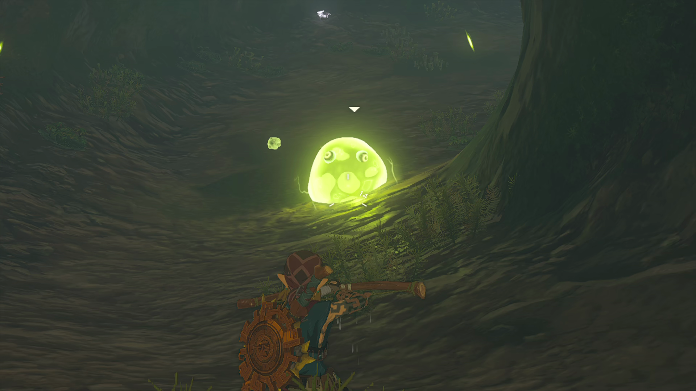
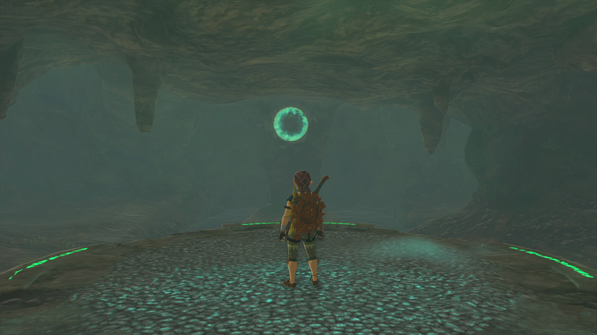
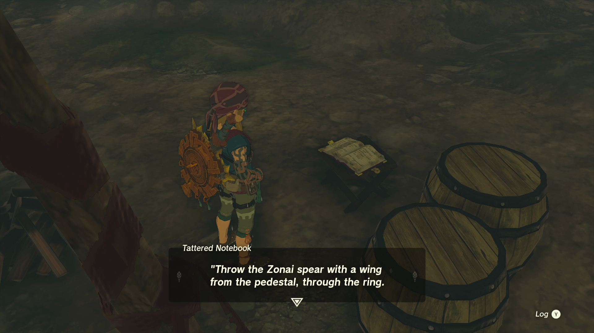
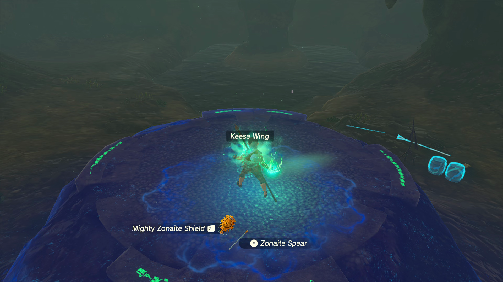
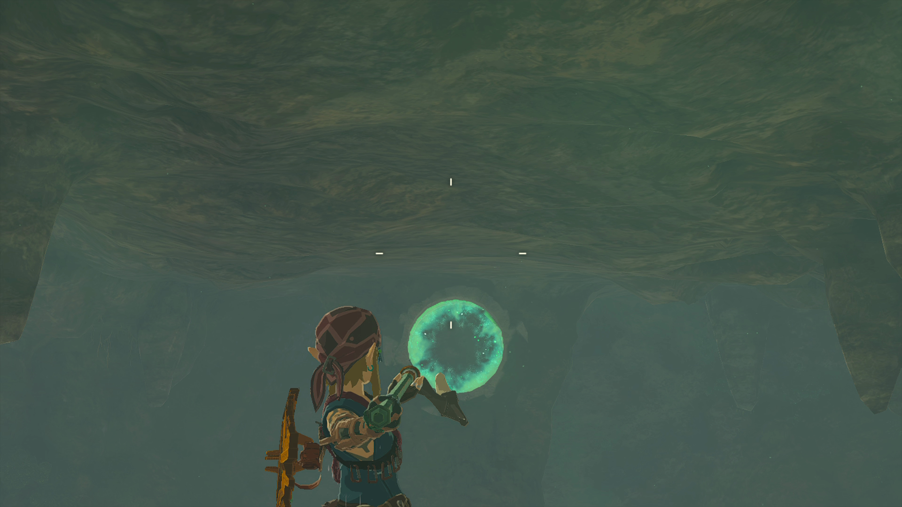

Utojis Shrine (Rauru’s Blessing) in The Legend of Zelda: Tears of the Kingdom is a shrine located in the East Necluda region and is one of 152 shrines in TOTK (see all shrine locations). This page contains a guide for how to locate and enter the shrine, a walkthrough for the shrine itself, and puzzle solutions as well as treasure chest locations for the TotK Utojis shrine. Utojis Shrine is part of the **Legend of the Soaring Spear** Shrine Quest. 

## Utojis Shrine Treasure and Rewards

  * Large Zonai Charge

## Utojis Shrine Location/How to Reach

The Utojis Shrine is located in Tobio’s Hollow Cave in the East Necluda Region, just southeast of the the Popla Foothills Skyview Tower, and west of the Jia Highlands. 

  * Coordinates: 1217, -2541, 0096

## Legend of the Soaring Spear Shrine Quest Walkthrough

Approach the crystal or the Shrine entrance to start Legend of the Soaring Spear. The Tobio’s Hollow Cave entrance is a little bit north of the shrine itself, tucked away against the north-facing side of the hill. 

Upon entering, make sure you kill the approaching keese and pick up the Keese Wings that they drop, as you’ll need these to complete the shrine. 

You’ll also face Electric ChuChus who will shock you if you get too close, so use arrows or a thrown weapon to take them out before they approach. 

Continue along the cave path until you reach an open room. You’ll see some scattered weapons next to an old campsite, a pedestal, and a stone pillar with a perfect circle cut out of it. 

Go to the open book next to the campsite and read it– it will tell you how to solve the Shrine Puzzle. 

Pick up one of the Zonaite Spears laying on the ground and get on top of the pedestal, which will activate and start glowing. The ring on the other end of the lake will glow as well. Just as the book said, you’ll have to fuse one of the Zonaite Spears with a Keese Wing. 

Throw it through the ring while standing on the pedestal. Aim a little bit above the ring to allow for the weapon to arc over that distance. 

After getting a Fused Zonai Spear through the ring, the Utojis Shrine will activate to your left. 

Legend of the Soaring Spear

Since it’s a Rauru’s Blessing Shrine, all you need to do is collect the treasure (a Large Zonai Charge) and receive the Light of Blessing. 

Utojis Shrine

Congrats on solving the shrine and earning a Light of Blessing! Click or tap here to return to the rest of the Shrine Guides. You can also check out which shrines are nearby with our shrine map filter on our complete map of Hyrule.

### Up Next: Walkthrough

Previous

About IGN's Zelda TotK Guide Writers

Next

Walkthrough

### Top Guide Sections

  * Walkthrough
  * Zelda: Tears of The Kingdom Switch 2 Edition Guide
  * Zelda Notes Voice Memories
  * List of Side Quests and Side Adventures

### Was this guide helpful?

Leave feedback

### In This Guide

The Legend of Zelda: Tears of the KingdomNintendo EPD

Initial Release: May 12, 2023

Learn more

Go to comments