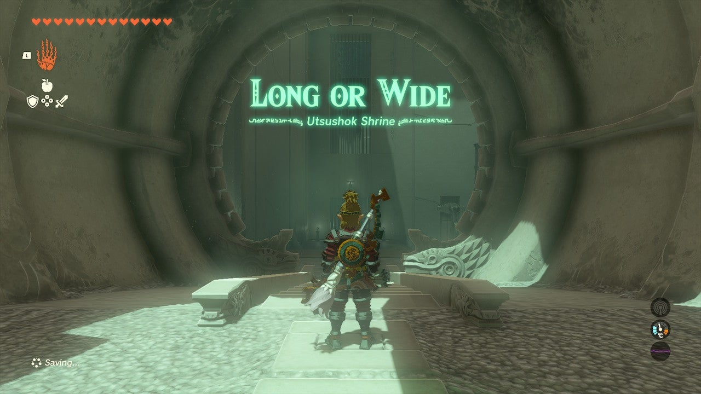

Utsushok Shrine (Long or Wide) in The Legend of Zelda: Tears of the Kingdom is a shrine located in the Faron Region and one of 152 shrines in TOTK (see all shrine locations). This page contains a guide for how to locate and enter the shrine, a walkthrough for the shrine itself, and puzzle solutions as well as treasure chest locations for the TotK Utsushok Shrine. 

### Utsushok Shrine Treasure and Rewards

  * ****Sneaky Elixir****

##  Utsushok Shrine Location/How to Reach

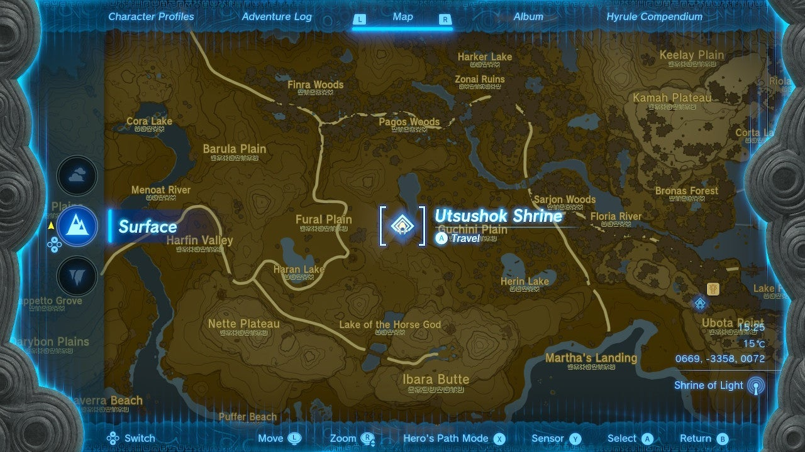

Utsushok Shrine can be seen from the Popla Foothills Skyview Tower. It sits on a grassy hill in plain sight south of the tower. 

  * **Coordinates:** 0668, -3358, 0072

## Utsushok Shrine Walkthrough and Puzzle Solutions

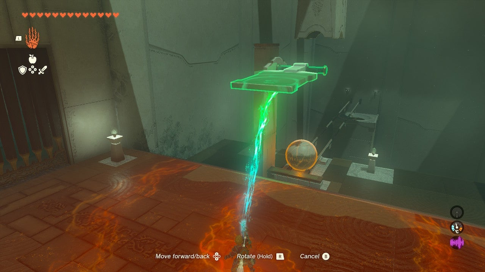

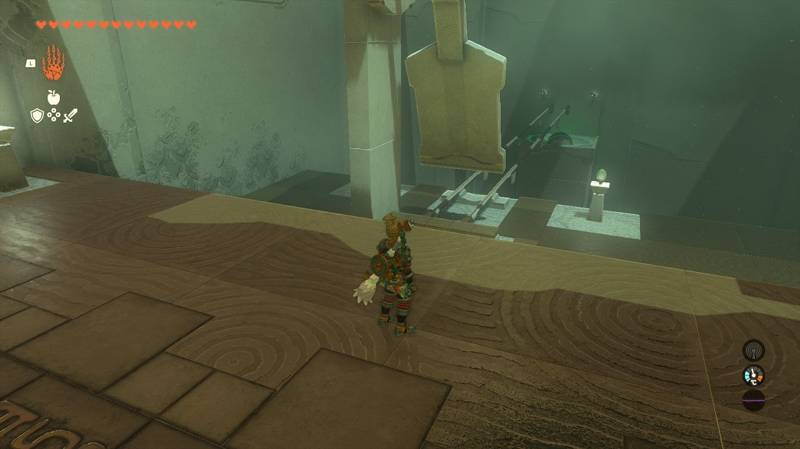

The Utsoshok Shrine contains a series of balls and “putters” kind of like golf. The first putter is hanging above the ball – pick it up with Ultrahand and lift it high above, then disconnect Ultrahand to send it swinging into the ball. 

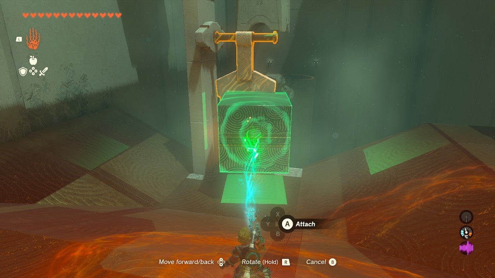

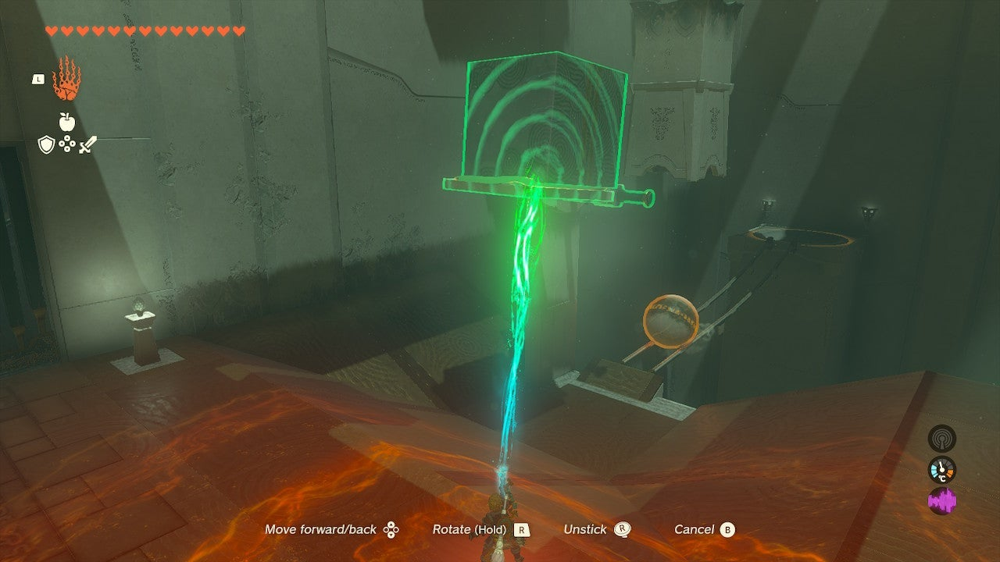

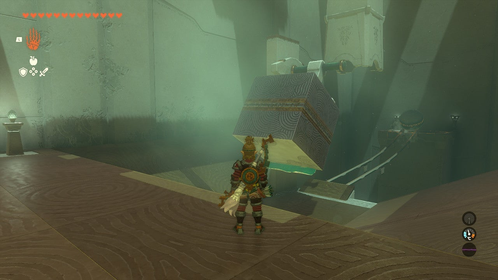

Now, in the next room, there’s a ramp with some incline to it and you essentially need to do the same thing – but grab the large block first and stick it to the back of the putter to add weight. The combination putter will smack the ball into the distant hole. 

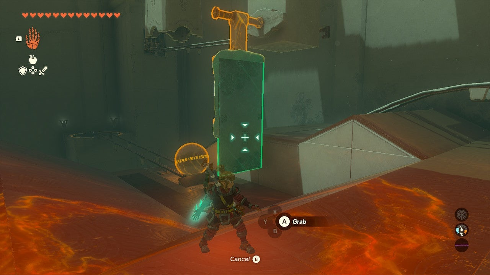

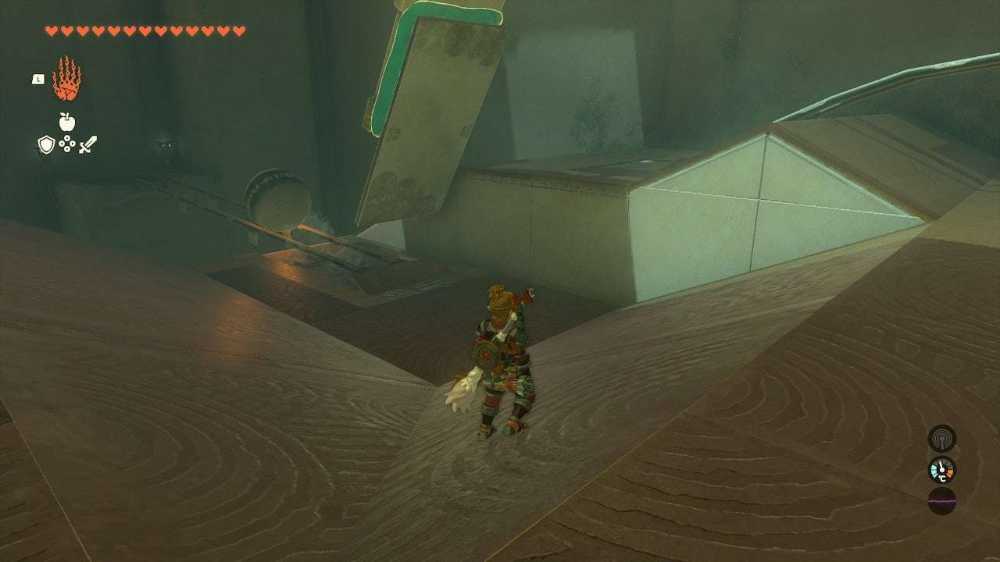

The next ball’s putter is too short. Take the nearby panel and paste it using Ultrahand to the back of the putter, lengthwise, but measure your paste to be just a but higher than the ground. Lift and drop the putter and it should smack the ball into the hole, revealing a mine cart. 

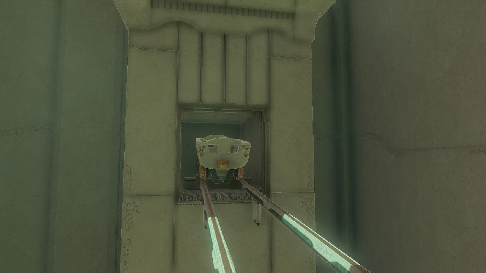

You need to extend your putter in a different way to hit the minecart. So remove the slab you attached earlier and attach it rotated 180 degrees and sticking out to the mine cart resting on the tracks. 

Get in the minecart. Look around you – a chest in on a high ledge nearby on your way to the exit. You need to prepare for it. 

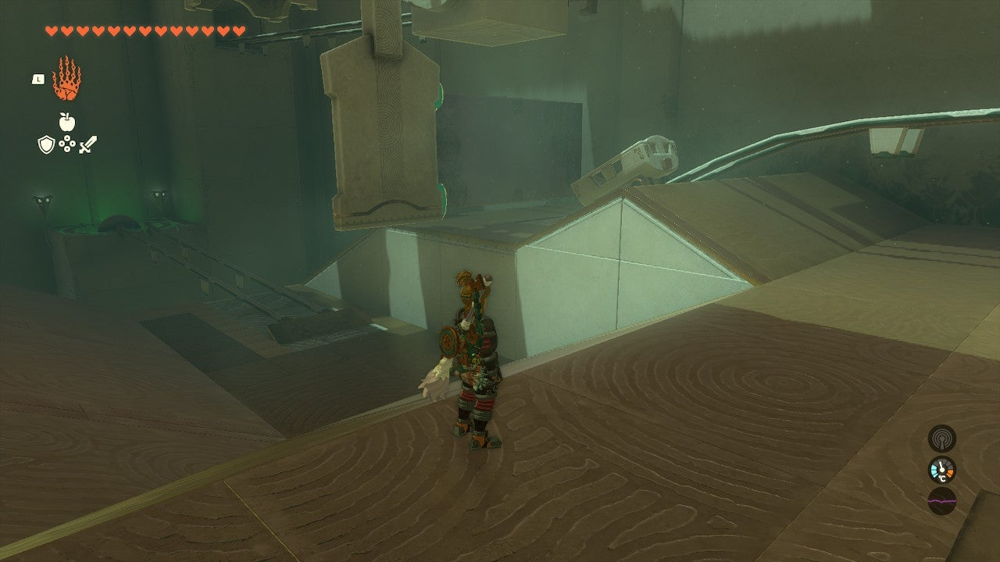

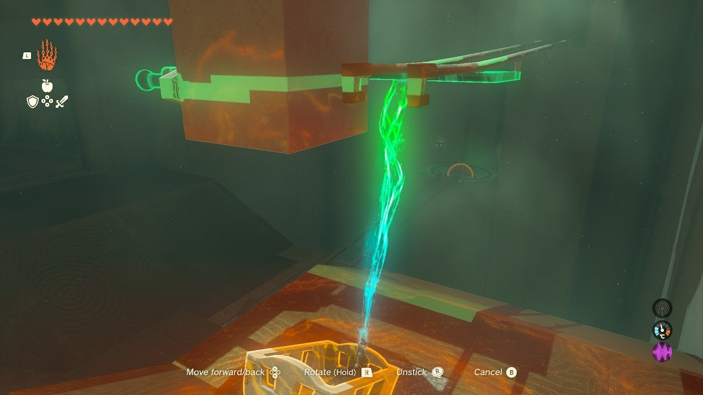

## Treasure Chest Location

The chest is on a high ledge above the minecart tracks. You’ll speed by it pretty past and need to have Ultrahand ready to grab it mid-trip. 

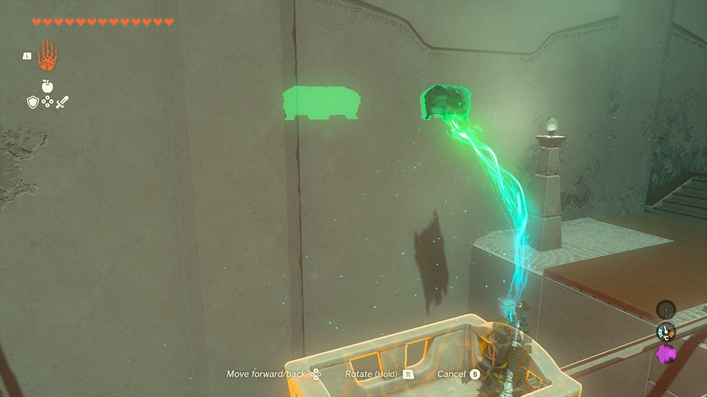

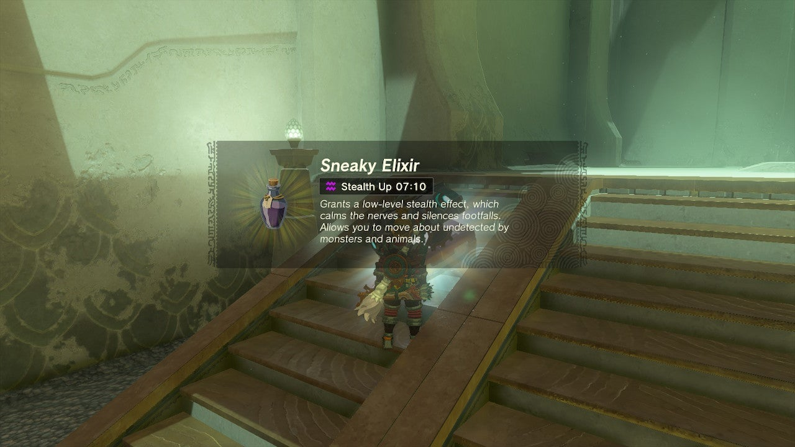

Get in the cart and lift the putter and drop it so it hits the cart. Flip around and line up your Ultrahand. As soon as the chest turns green, hit the Ultrahand button to grab it and bring it to the exit. Inside is a **Sneaky Elixir**. 

Utsushok Shrine

Congrats on solving the shrine and earning a Light of Blessing! Click or tap here to return to the rest of the Shrine Guides. You can also check out which shrines are nearby with our shrine map filter on our complete map of Hyrule.

### Up Next: Walkthrough

Previous

About IGN's Zelda TotK Guide Writers

Next

Walkthrough

### Top Guide Sections

  * Walkthrough
  * Zelda: Tears of The Kingdom Switch 2 Edition Guide
  * Zelda Notes Voice Memories
  * List of Side Quests and Side Adventures

### Was this guide helpful?

Leave feedback

Go to comments