Wao-os Shrine (Lever Power) in The Legend of Zelda: Tears of the Kingdom is a shrine located in the Hebra Mountains Region, under the Passer Hill area, and is one of 152 shrines in TOTK (see all shrine locations). This page contains a guide for how to find and enter the shrine, a walkthrough for the shrine itself, and puzzle solutions as well as treasure chest locations for the TotK Wao-os shrine. Wao-os Shrine is related to the **The White Bird's Guidance** Shrine Quest. You do not have to complete this Shrine Quest to find the Shrine, it simply provides hints to how to find the cave the Wao-os Shrine resides inside. 

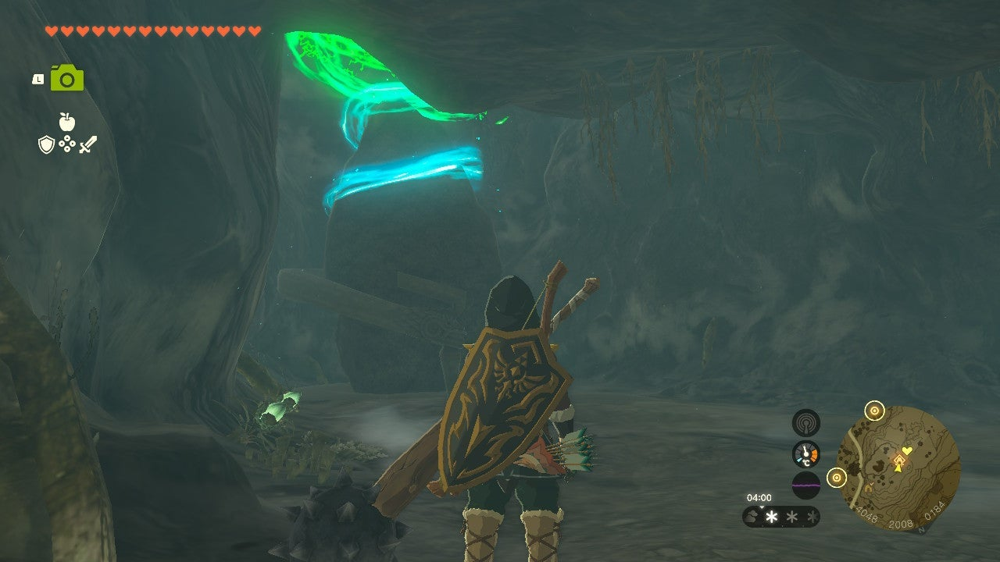

## Wao-os Shrine Treasure and Rewards

  * Spicy Elixir

## Wao-os Shrine Location/How to Reach

Wao-os shrine is under the**Passer Hill area** and its cave entrance is above the road west of Lake Totori, **hidden on a dark ledge**. This is much easier to find if you visit the cherry blossom tree shrine on Passer Hill. The coordinates for the cave entrance are -3951, 2033, 0201. 

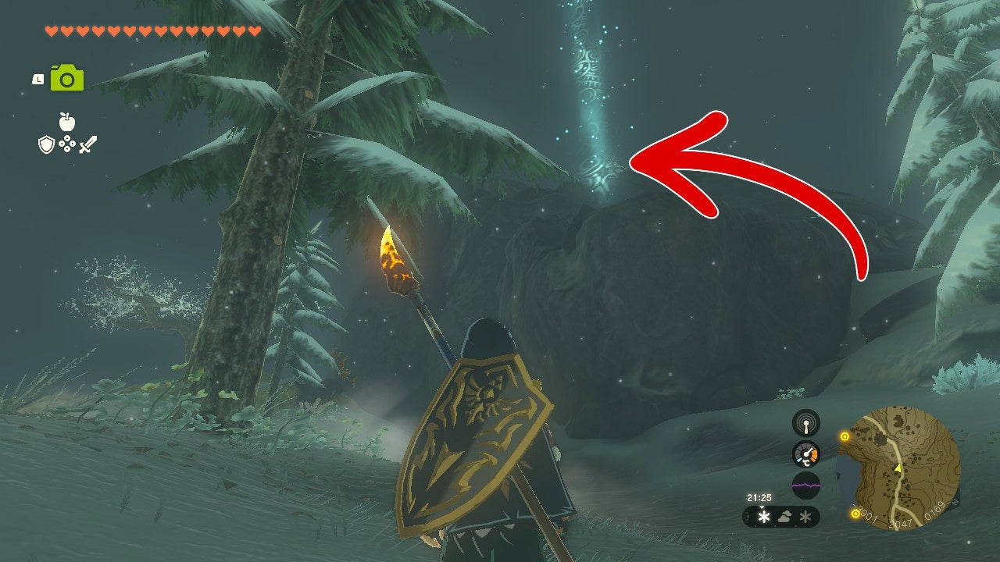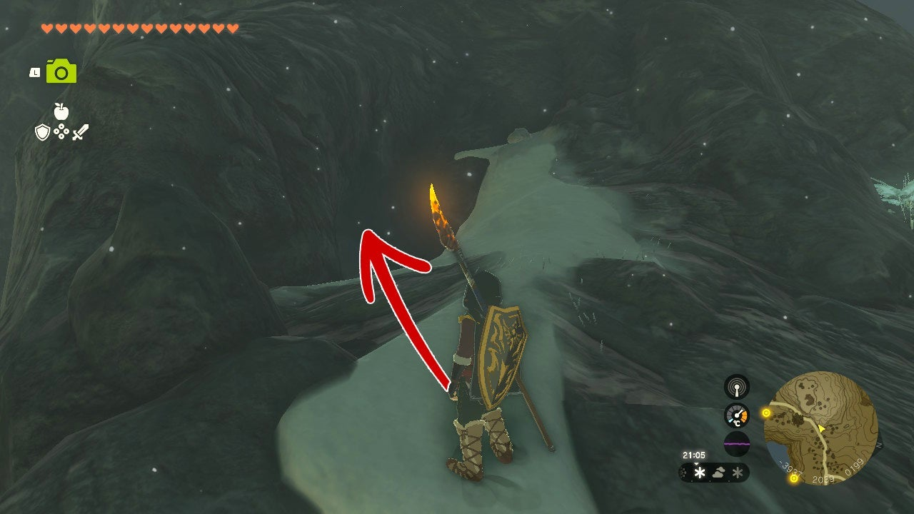

Climb or run up the hill to the cave entrance and enter to discover **West Lake Totori Cave.** This is one of the rare cave entrances without a Blupee in front of it. 

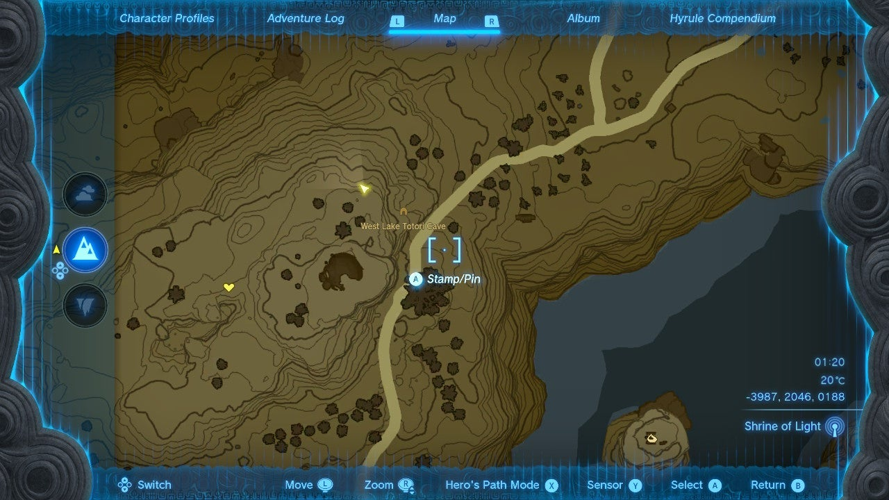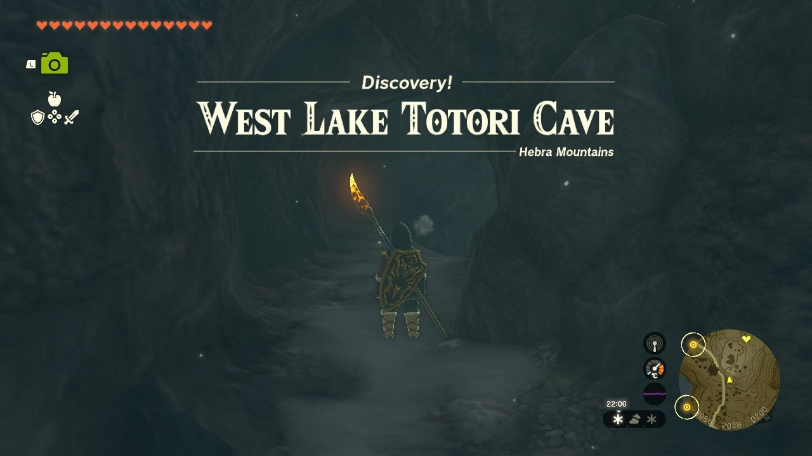

Drop down from the entry tunnel into a cavern with a pond. Here you can collect some Sticky Lizard, Chillfin Trout, Glowing Cave Fish, Brightcap, and Chilishroom. Climb up the cavern's natural ramp on the left to proceed. 

### West Lake Totori Cave Bubbulfrog Location

Before completely exiting to the next big cavern, stop when the ceiling gets higher and you see a regular ore deposit. Look right (or northward) and up to see an opening in the wall. 

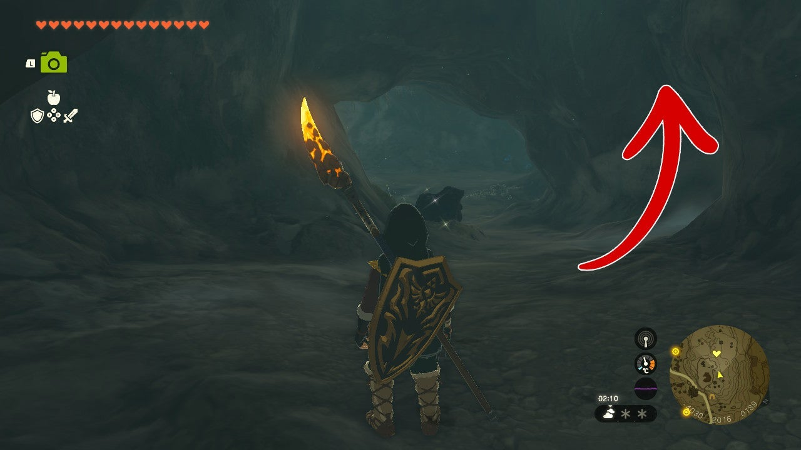

Climb up and you'll find a hidden cavern that's home to a Bubbulfrog and some mushrooms. Shoot the Bubbulfrog down with an arrow and collect the Bubbul Gem. 

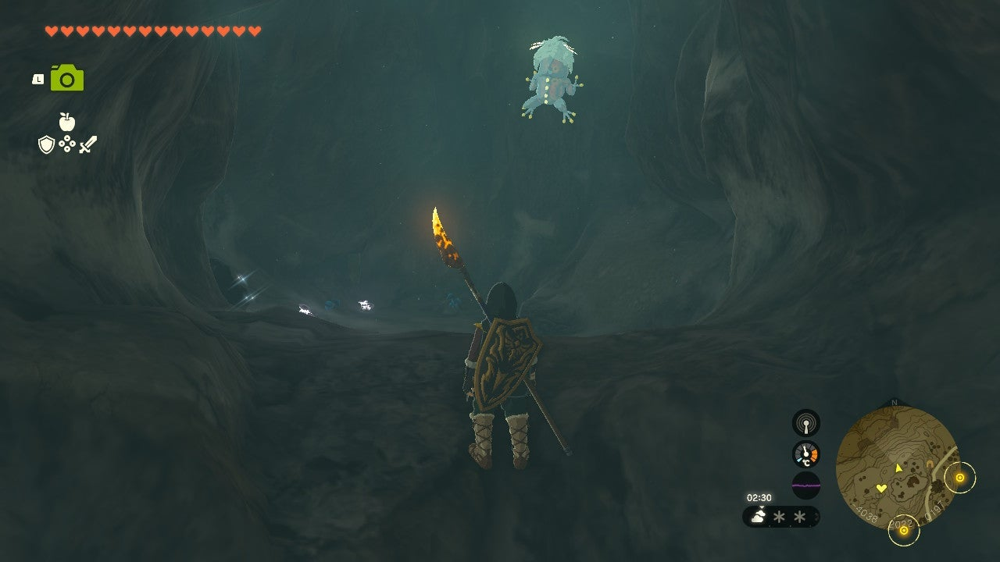

Just past the ore is the shrine. 

  * Coordinates: -4059, 1990, 0183

## The White Bird's Guidance Shrine Quest Walkthrough

While you can find the cave with Wao-os Shrine inside without completing this quest, to complete it for your 100% attempt, you must first clear the storm by beating The Wind Temple and then find and talk to Laissa in Rito Village. Laissa is an adult Rito that is on a platform looking out over the canyon on the northern side of the village. 

Laissa tells you about the tip of the shadow of Vah Medo's perch in the morning. If you use Ascend to climb to the top of the stone tower with a bird beak of sorts atop Rito Village, you can set a fire (drop WOOD and FLINT and hit it with a sword or metal weapon) and WAIT until MORNING. 

The tip of the shadow of the stone tower above Rito Village will pass towards a small patch of snow after 6:00 am that looks like a small songbird with a clearly defined body and eye. (Fun fact: the "eye" of the bird is stone with a Korok beneath!) Mark this bird with a marker on your map and head over to it to find the cave and follow the instructions above to find the Wao-os Shrine. 

Finding the Wao-os Shrine will complete The White Bird's Guidance Shrine Quest. 

The White Bird's Guidance

## Wao-os Shrine Walkthrough and Puzzle Solutions

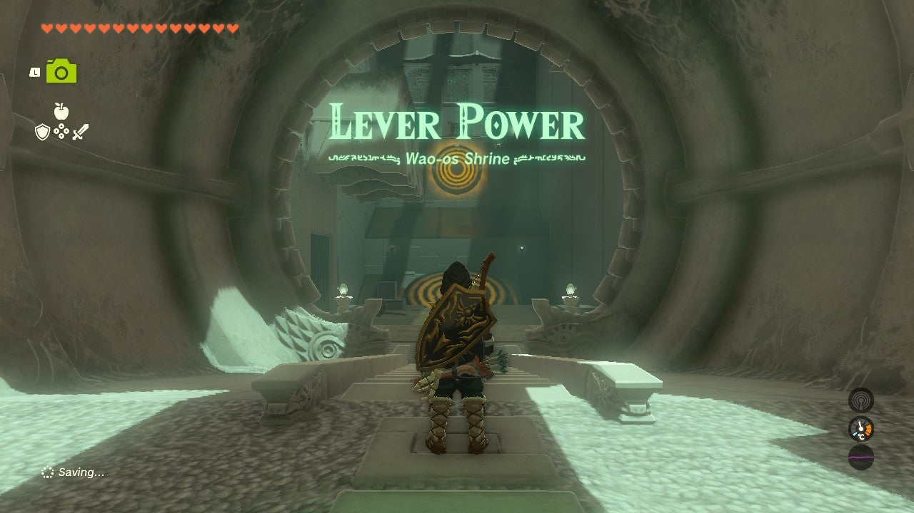

Time to fling some iron! Use Ultrahand to put the iron ball into the bowl and fuse them, like shown below. 

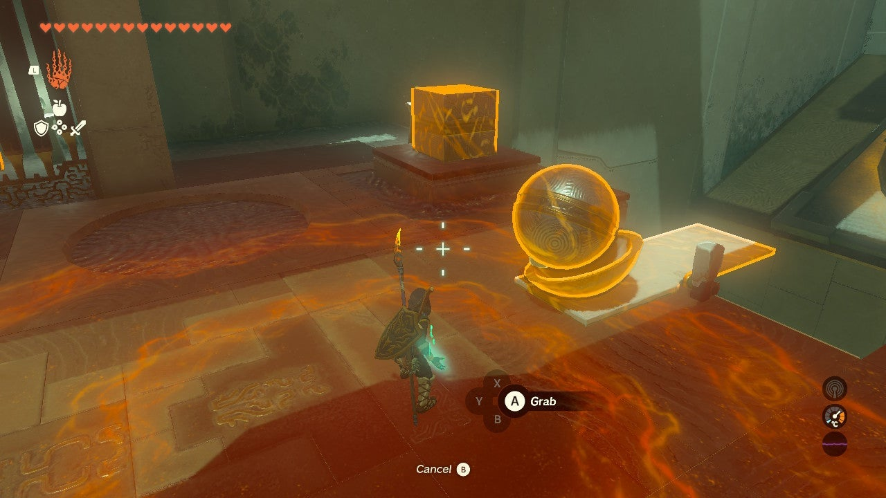

Then, put then on the ground side of white slab seesaw. Next, pick up iron box and lift it high above the half of the white slab hanging over the chasm. Drop the box and the bowl and ball combo will fling to the other side, hitting the big target. 

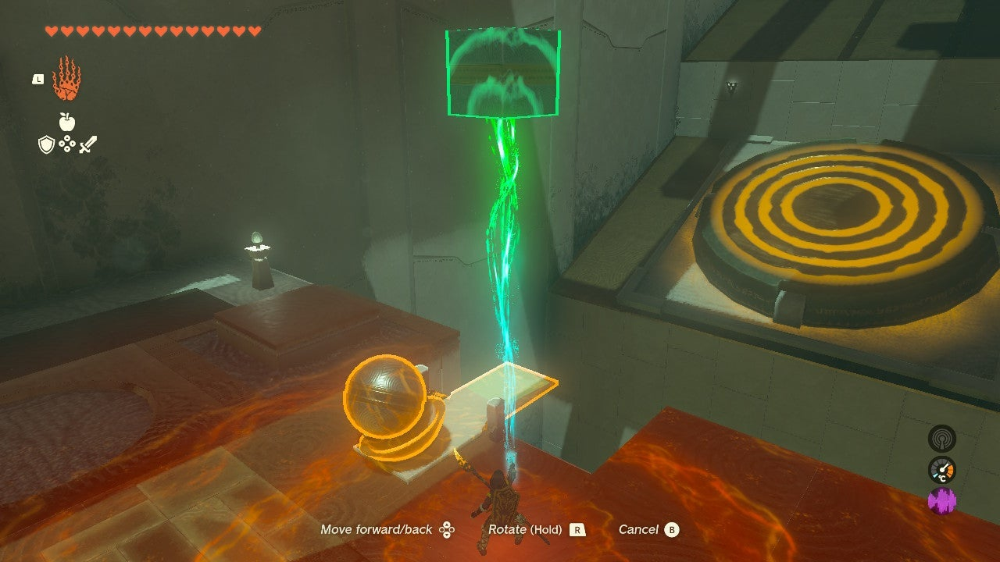

A gate opens that allows you access to a wooden platform. Attach it to the ground side of the white slab seesaw so that it covers only the ground half. 

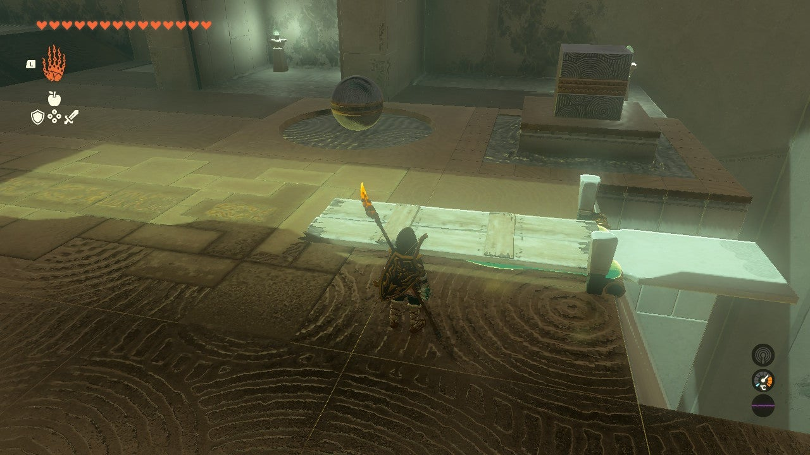

### How to Get the Wao-os Shrine Treasure

It's time for Link to get some air. With the wooden plank attached, stand on its end. Then, use Ultrahand to pick up the box again. Raise it up high over the other half of the white slab and drop it to get flung into the air. Once you're up high, use the glider to turn back toward the entrance and glide down to the treasure chest's platform. 

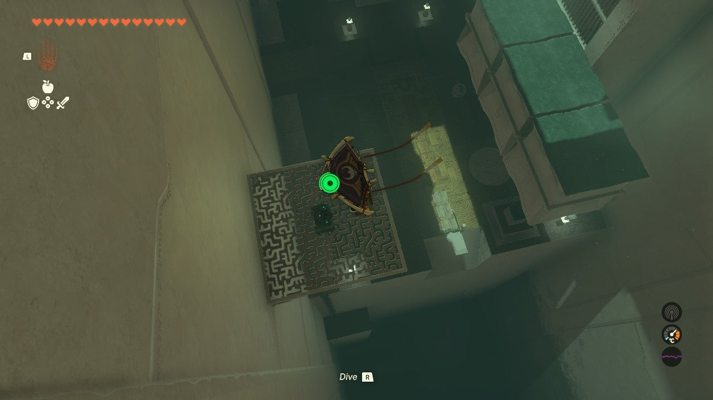

You'll get a Spicy Elixir. Return back to the main platform to finish the puzzle. If a piece gets stuck this method is also a handy way to glide across and throw a piece into the chasm. 

Leave the wood platform where it's at, but this time, attach the bowl to the wood platform on its forward horizontal plank, so that the bowl is almost at the middle of the extended structure. 

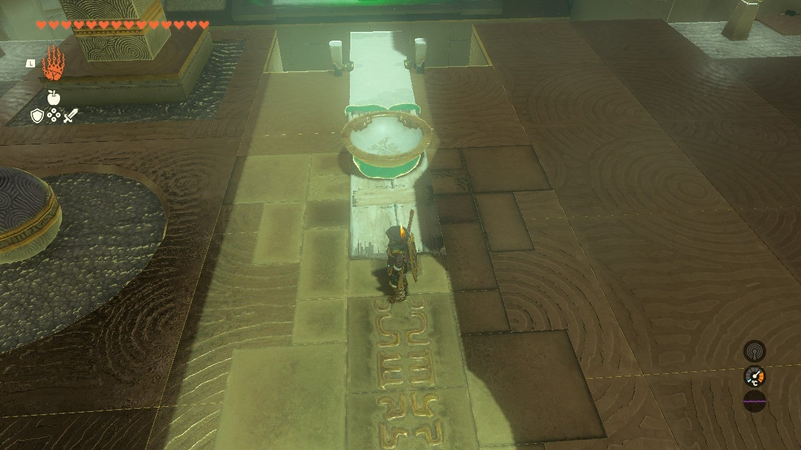

Then, put the iron ball (don't attach) into the bowl. Use the iron box to fling the ball forward and it should hit the higher target, opening the way out. If the ball gets high enough but isn't hititng the target, ensure that the bowl is attached directly in the center of the extended platform. 

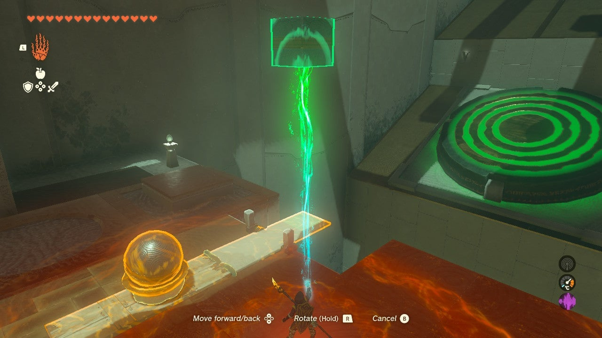

With the way out open you can stand on the wood platform and fling yourself across the gap. Just remember to use your glider! With that done you'll get that familiar and pleasant piano line and can exit. 

Wao-os Shrine

Congrats on solving the shrine and earning a Light of Blessing! Click or tap here to return to the rest of the Shrine Guides. You can also check out which shrines are nearby with our shrine map filter on our complete map of Hyrule.

### Up Next: Walkthrough

Previous

About IGN's Zelda TotK Guide Writers

Next

Walkthrough

### Top Guide Sections

  * Walkthrough
  * Zelda: Tears of The Kingdom Switch 2 Edition Guide
  * Zelda Notes Voice Memories
  * List of Side Quests and Side Adventures

### Was this guide helpful?

Leave feedback

### In This Guide

The Legend of Zelda: Tears of the KingdomNintendo EPD

Initial Release: May 12, 2023

Learn more

Go to comments