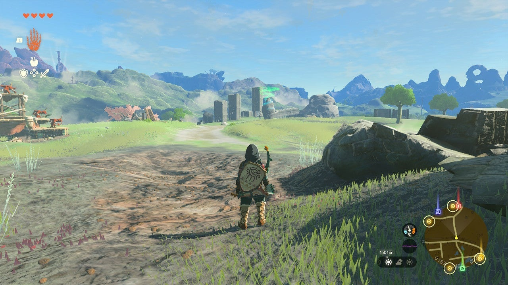
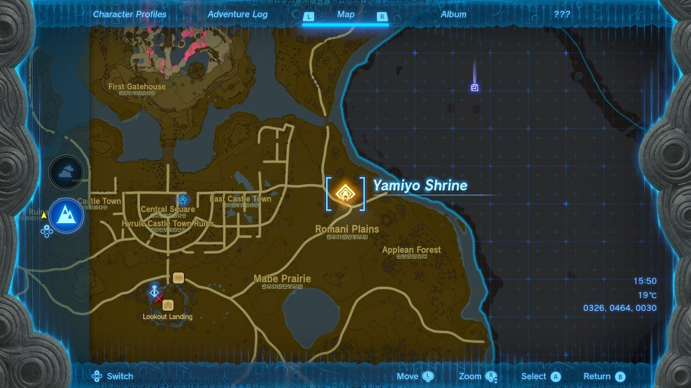
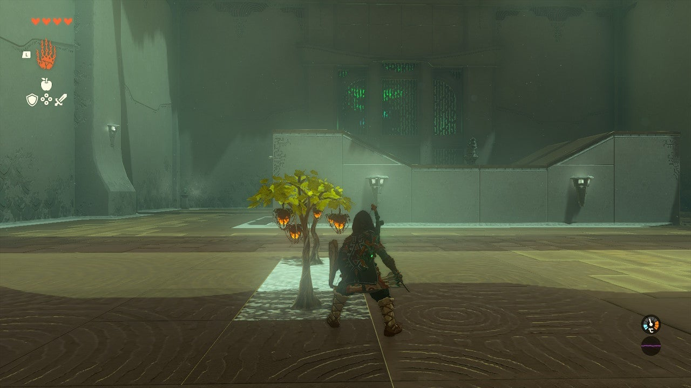
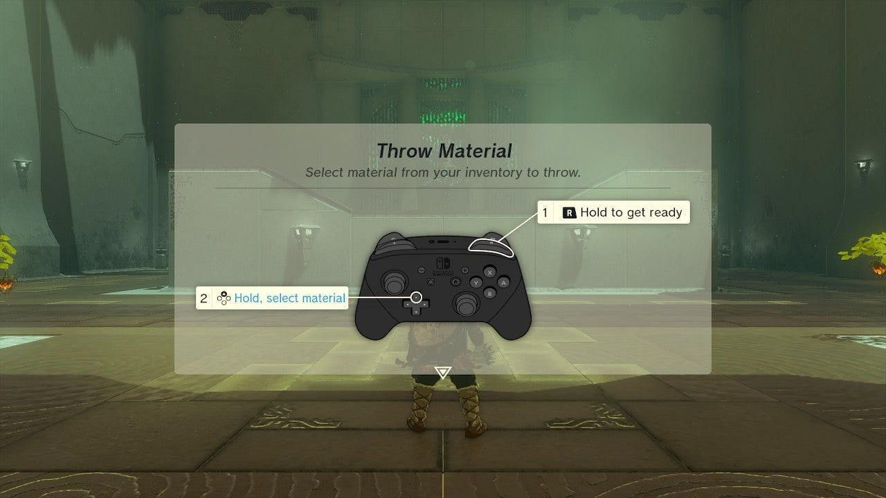
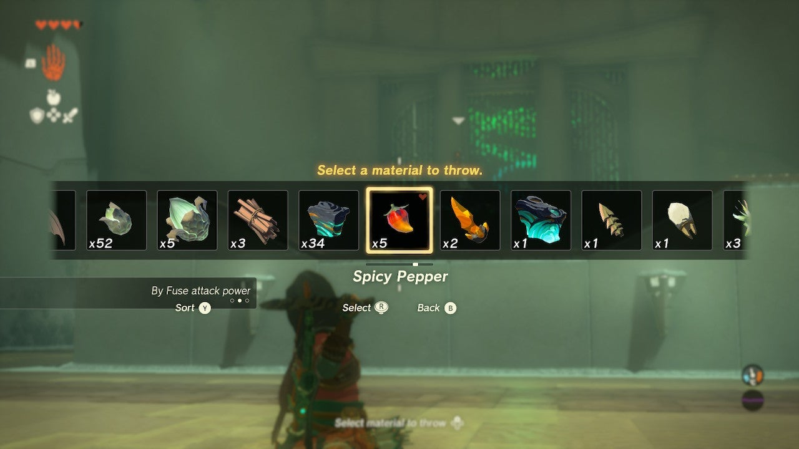
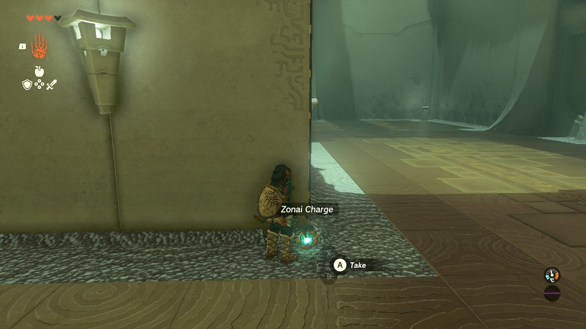
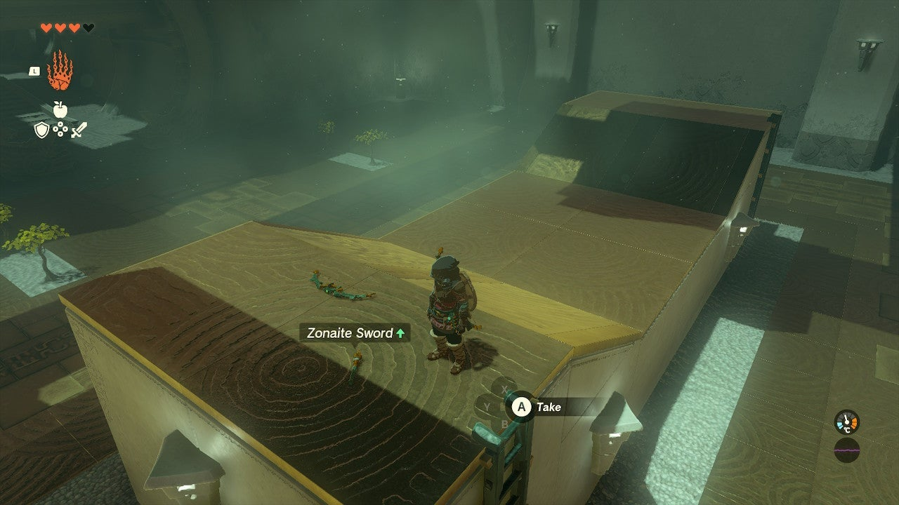

Yamiyo Shrine (Combat Training: Throwing) in The Legend of Zelda: Tears of the Kingdom is a shrine located in the Central Hyrule Region. This page contains a guide for how to locate and enter the shrine, a walkthrough for the shrine itself, and puzzle solutions as well as treasure chest locations for the TotK Yamiyo shrine. 

### Treasure and Rewards

  * ******Bomb Flower****x3**

##  Location/How to Reach

Yamiyo Shrine can be found in the Romani Plains in Central Hyrule, due east of Hyrule Castle Town Ruins and north east of Lookout Landing and the Lookout Landing Skyview Tower. 

  * **Coordinates:** 0332, 0470, 0029

## Walkthrough and Puzzle Solutions

Your goal here is to defeat the construct in the center of the arena on the platform. You must use the Throw Material command to do so. Approach the bushes with the Fire Fruit. 

### How to Throw Material

  * **Throw Material:** Grab the fruits. Now, hit the R BUTTON. Link will wind up to throw his weapon, but DON’T LET GO! Instead hit UP on the D-PAD and you can select the Fire Fruit from the menu. Let go and, with that in hand, you can aim and let the fruit go. You can lock on to the enemy with the RIGHT TRIGGER to ensure you don’t miss, as well, and this allows you to strafe to avoid its attacks.

  * **Throw Material (Enemy Is Moving):** The trial then asks you to throw the fruit again at the construct, but this time you must do it when it stops moving. When it stops, move in close and throw the fruit to kill the construct.

Now, search the enemy platform, there are ladders on the rear side, for the dropped weapons and Zonai Charge. 

## Treasure Location

The treasure for this shrine is in a chest right by the exit. Open the chest to find a **Bomb Flower x 3**. 

Exit the shrine. 

Yamiyo Shrine

Congrats on solving the shrine and earning a Light of Blessing! Click or tap here to return to the rest of the Shrine Guides.

### Up Next: Walkthrough

Previous

About IGN's Zelda TotK Guide Writers

Next

Walkthrough

### Top Guide Sections

  * Walkthrough
  * Zelda: Tears of The Kingdom Switch 2 Edition Guide
  * Zelda Notes Voice Memories
  * List of Side Quests and Side Adventures

### Was this guide helpful?

Leave feedback

Go to comments