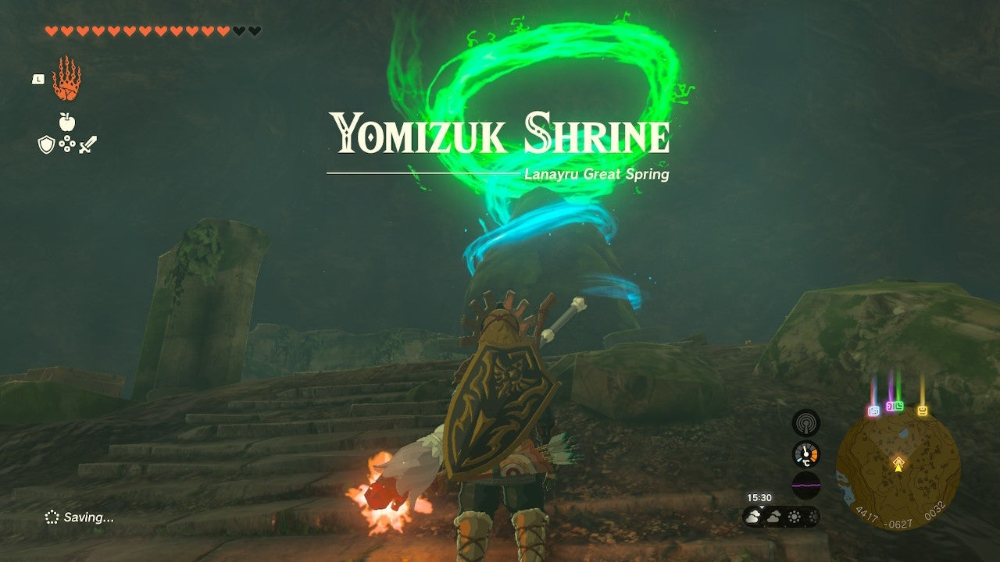
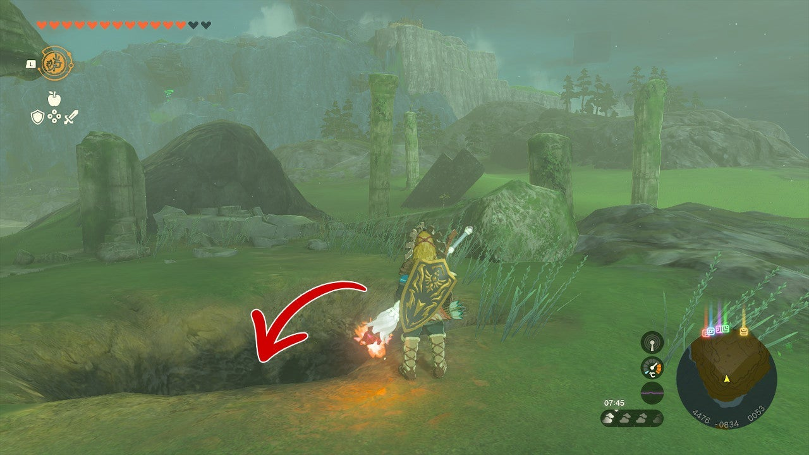
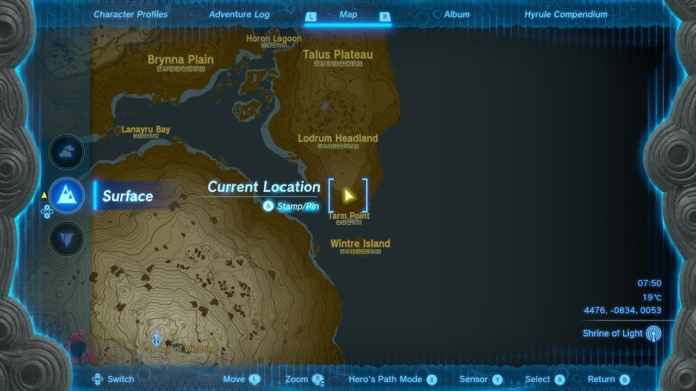
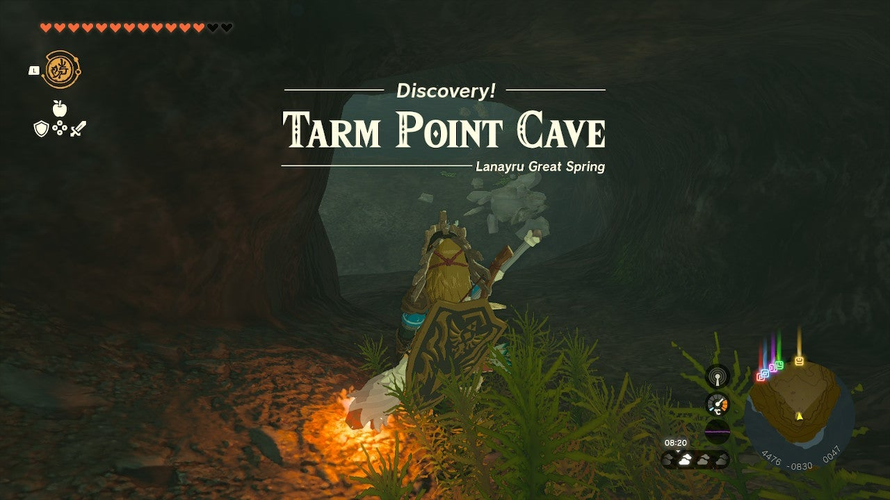
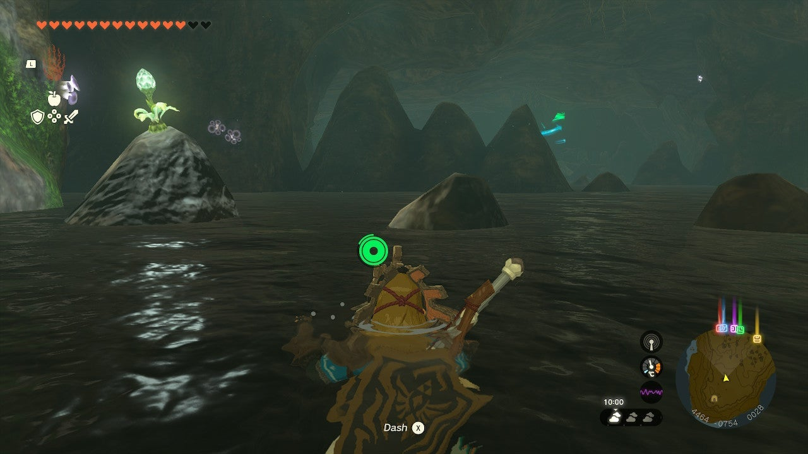
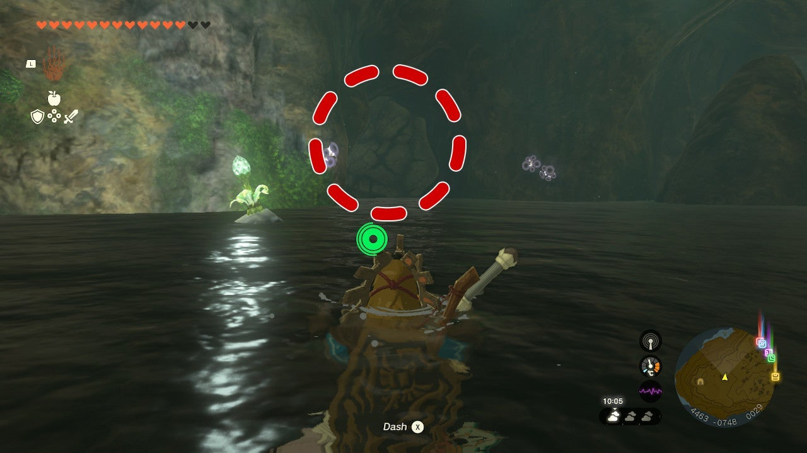
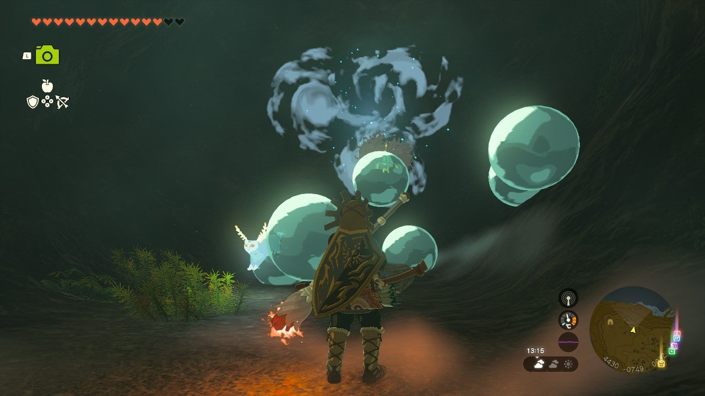
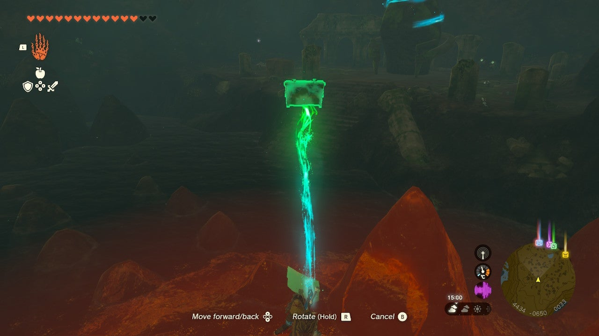
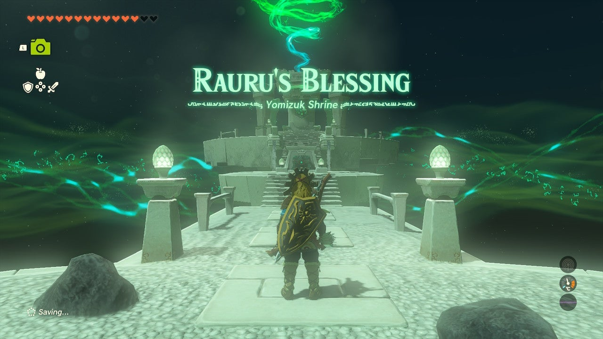

Yomizuk Shrine (Rauru's Blessing) in The Legend of Zelda: Tears of the Kingdom is a shrine located in the Lanayru Great Springs area, **under the Lodrum Headland**. It's one of the many shrines located underground. This page contains a guide for how to locate and enter the shrine, a walkthrough for the shrine itself, and puzzle solutions as well as treasure chest locations for the TotK Yomizuk shrine. 

### Treasure and Rewards

  * Bubbul Gem
  * Diamond

## Location/How to Reach

On the south edge of the Talus Plateau are some ruined columns. You should see a Blupee nearby too. Run to it and it'll lead you to a hole in the ground. Enter to discover the **Tarm Point Cave**. 

Inside you'll see water rising and falling with plenty of rocks. Your challenge here is to make it to the end of the cavern, somehow. You can approach this a few ways: 

  * The first and **easiest way is to swim**! Use the stalagmites as a spot to recover stamina as you need it. You can also climb to the top then glide forward to get some faster movement out of the water.

  * The second way is to use Autobuild to build a raft with a sail. We'd recommend saving your Zonai fan and instead use a**Korok Frond** from the front of the cave to propel yourself forward and guide the raft around the stalagmites.

Regardless of how you choose to approach, don't miss the grey rock wall on the left side of the cave, just after the first big set of stalagmites. You can go hit it with a rock weapon, or destroy the wall with a bomb flower arrow (there's are bomb flowers along the water's edge at the front and back of the cave). **Inside is this cave's Bubbulfrog**! Shoot it down with an arrow and continue making your way to the end of the cave. 

Toward the end you'll come across a wooden treasure chest in the water. You can climb to the top of a stalagmite and use Ultrahand to lift it toward the shore. 

Once on the shore, you can pull it out of the water to collect its contents and then activate the shrine. 

  * **Coordinates** : 4412, -0610, 0034

## Walkthrough and Puzzle Solutions

After making it through the waterway, the Yomizuk shrine has chosen to reward you with a Rauru's Blessing. Collect the treasure from the treasure chest (Diamond) and leave with your Light of Blessing. 

Yomizuk Shrine

Congrats on solving the shrine and earning a Light of Blessing! Click or tap here to return to the rest of the Shrine Guides. You can also check out which shrines are nearby with our shrine map filter on our complete map of Hyrule.

### Up Next: Walkthrough

Previous

About IGN's Zelda TotK Guide Writers

Next

Walkthrough

### Top Guide Sections

  * Walkthrough
  * Zelda: Tears of The Kingdom Switch 2 Edition Guide
  * Zelda Notes Voice Memories
  * List of Side Quests and Side Adventures

### Was this guide helpful?

Leave feedback

Go to comments