Zakusu Shrine (Proving Grounds: Ascension) in The Legend of Zelda: Tears of the Kingdom is a shrine located in the Mount Lanayru region, but it is **only accessible after you do The High Spring and Light Rings side quest.** It is one of 152 shrines in TOTK (see all shrine locations). The shrine is not actually indicated by the Shrine of Light Sensor either. This page contains a guide for how to locate and enter the TotK Zakusu shrine and how to complete the shrine challenge. Zakusu Shrine is related to **The High Spring and the Light Rings** Shrine Quest. 

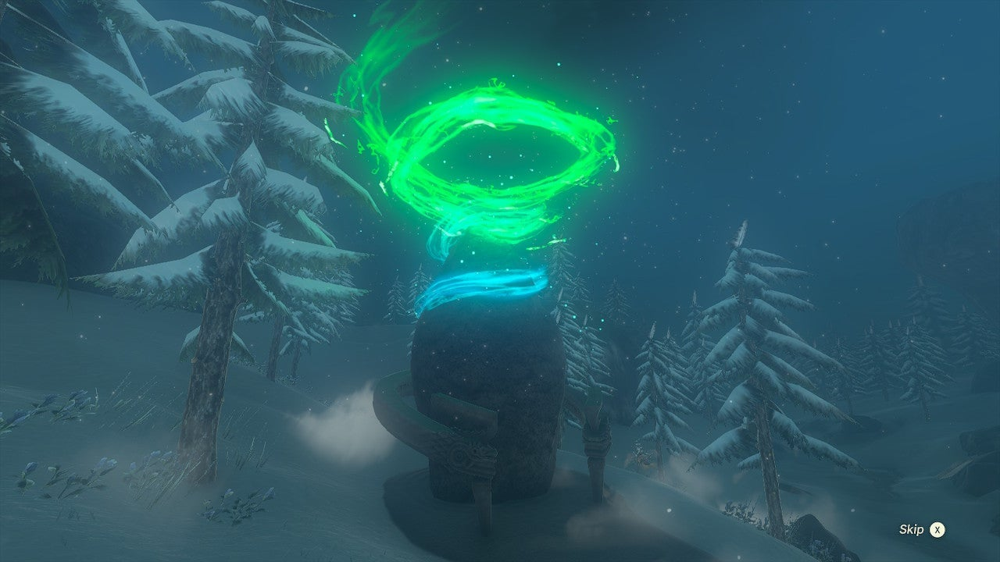

## Zakusu Shrine Treasure and Rewards

  * Soldier Spear

## Zakusu Shrine Location/How to Reach

In order to get to this shrine you must complete The High Spring and Light Rings side quest given by **Nazbi** , a treasure hunter camping outside Spring of Wisdom right below the Mount Lanayru Skyview Tower. 

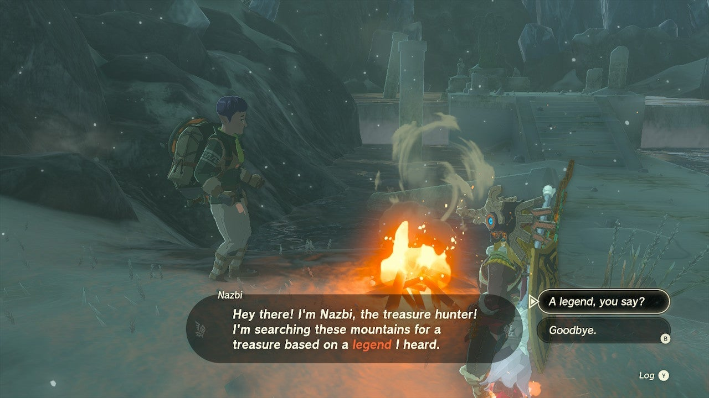

Start the quest by talking to Nazbi. He instructs you to do the following to unveil the treasure: "Skim across snow, from the spring high in the heavens to the mountain below. Pass through the rings of light to see the Light of Blessing." 

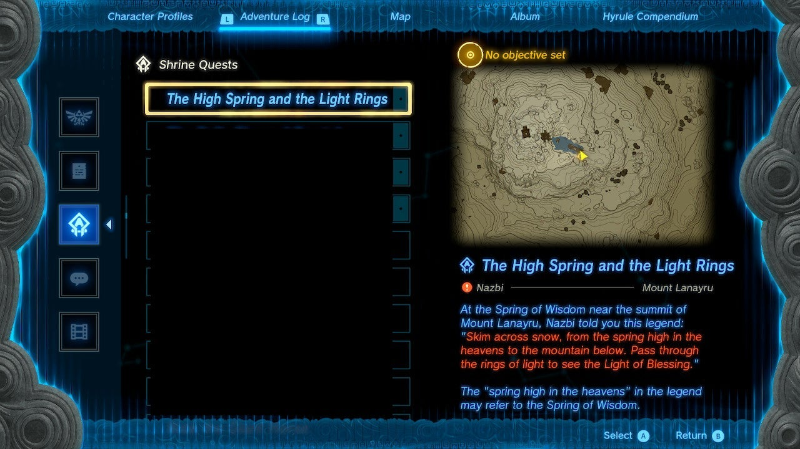

## The High Spring and the Light Rings Shrine Quest

Go the the Lanayru Skyview Tower at the top of the mountain. Take it up to the sky and you'll find yourself in the **South Lanayru Sky Archipelago.** Dive and glide down to the southern most sky island, the one with a ring of water. 

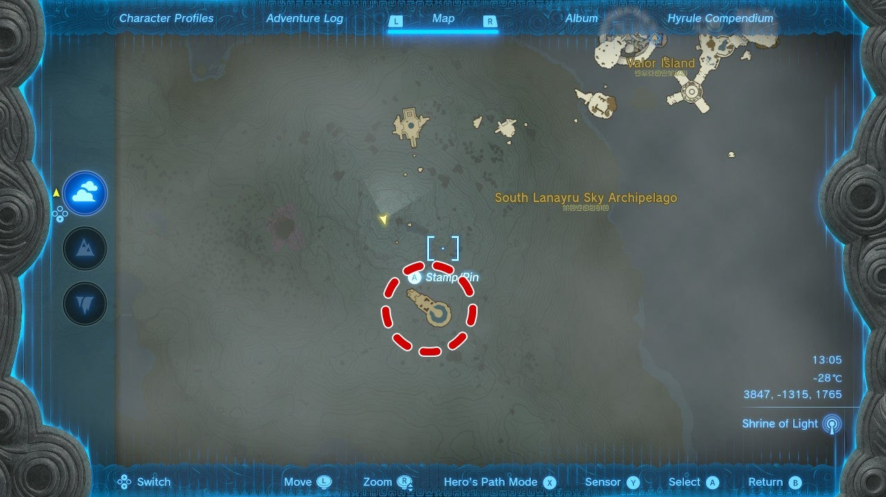

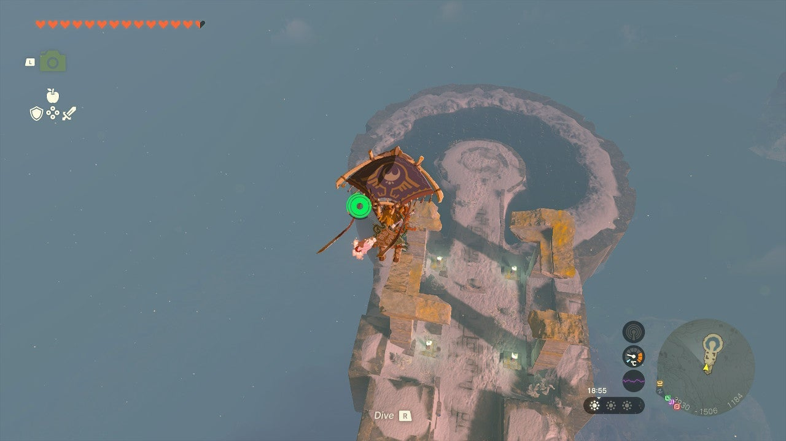

Upon landing walk toward the water and the shrine activation glyph appears. Walk around to stand before it (there's a ledge on the water side to stand on). Examine it and a green ring of light appears! 

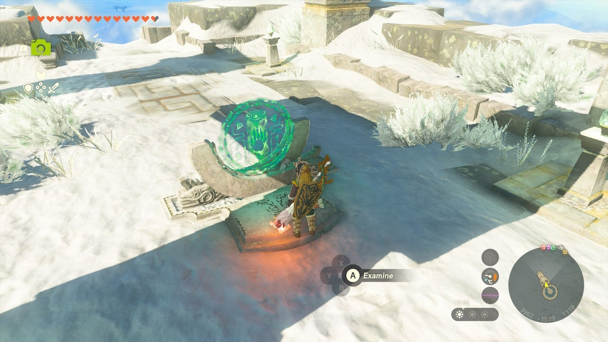

The next part requires Shield Surfing.**To Shield Surf, hold up the shield by pressing ZL. Then, jump and quickly press A**. If you don't have a sturdy shield, look to the left of the shrine glyph and you'll see two Zonaite Shields and a Sled Sheild. 

Pull out your shield and surf down the first slope. Link falls down on the shield, but this will cancel if you press B or dive. Make sure you glide a bit toward the end to get a softer landing or Link can lose some or all of his hearts. Did we learn from experience? Yes, but now you don't have to! Just be sure to get enough momentum at the end of the drop so that there's still some speed for the shield surfing. The rings are on a timer, so if you don't get down fast enough, the ring will disappear and you'll need to restart. 

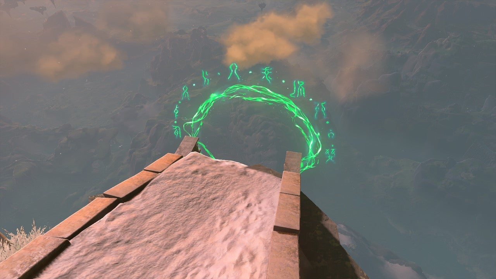

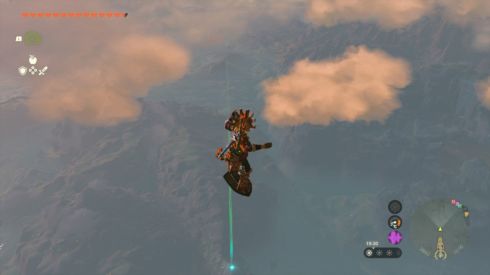

If you miss the ring either due to time or just because you missed it, you'll need to start over from the sky, including reactivating the glyph. The ring will not disappear if you get off your sheild. 

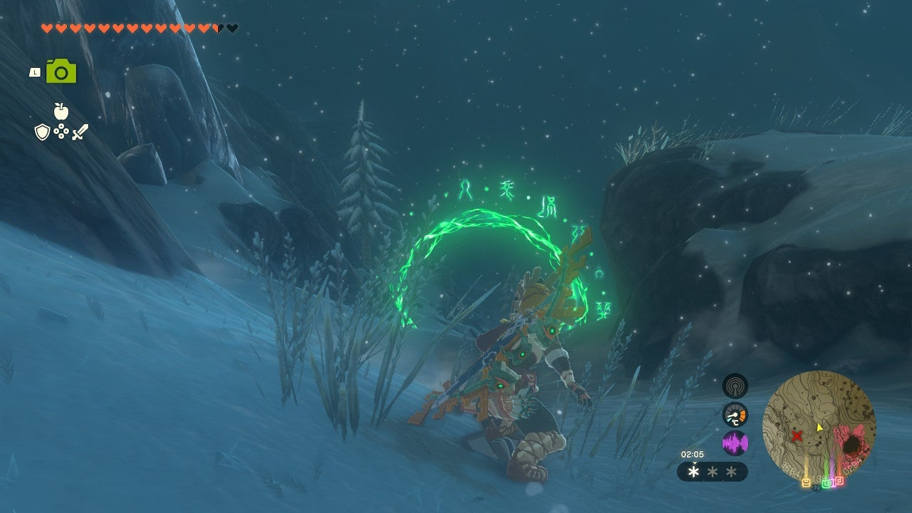

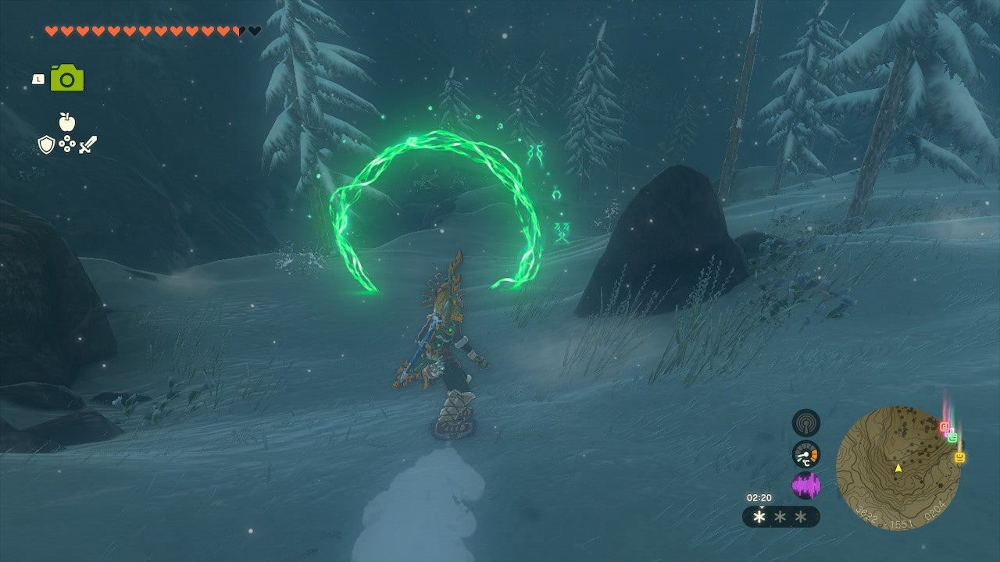

Once you've successfully surfed through all the green rings, you'll see the shrine rise from the ground. The High Spring and the Light Rings will also show as complete! 

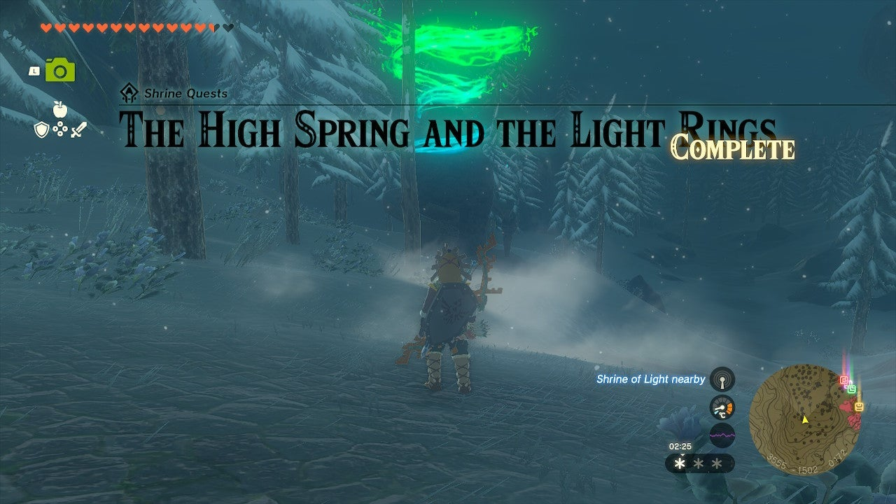

  * Coordinates: 3527, -1482, 0168

The High Spring and the Light Rings

## Zakusu Shrine Walkthrough and Puzzle Solutions

Zakusu shrine isn't done challenging you yet. First it made you prove yourself worthy of accessing the shrine, and now you've gotta fight for the Light of Blessing. As a Proving Grounds shrine, all your items are stripped away. Forward and left you'll find a Long Stick, a Wooden Stick, an Old Wooden Shield, an Old Wooden Bow, and x5 Arrows. 

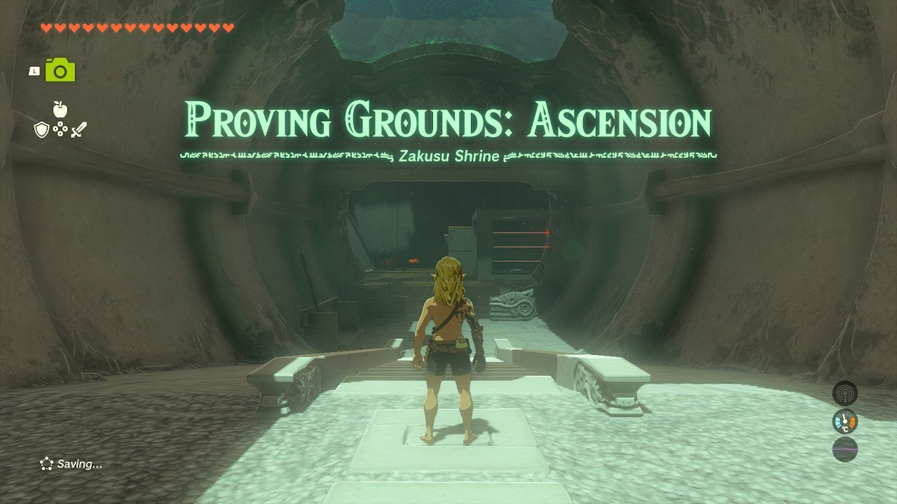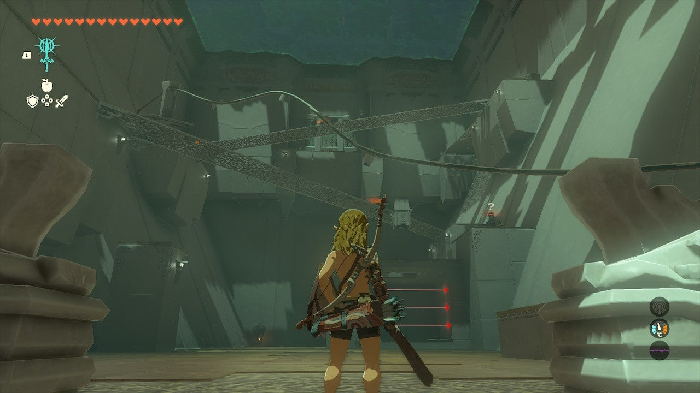

A good way to start this room is by sneaking to the back and eliminating the soldier there. Others may notice, but due to the soldier's positioning the others may also lose intrest not long after. Slaying this construct will allow you to get to the hot air balloon structure, Torch, and another Wooden Stick. 

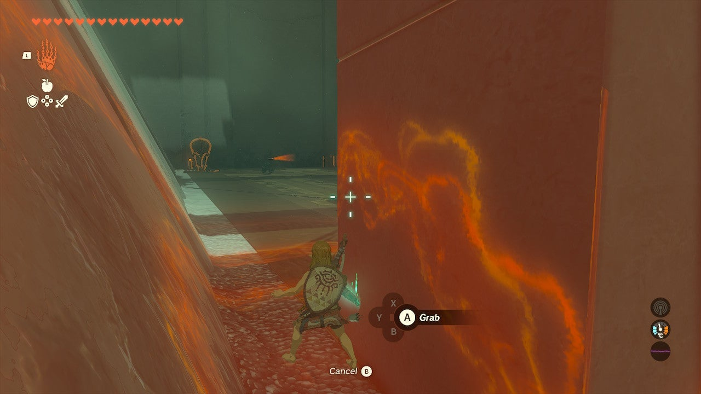

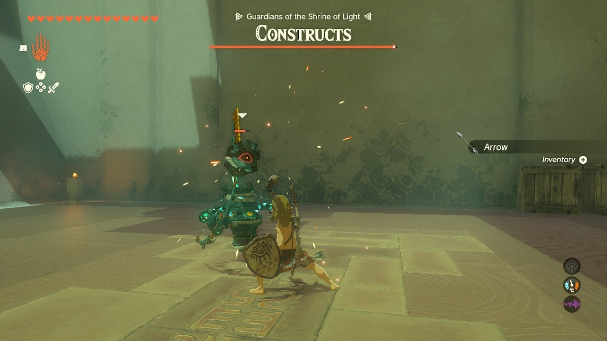

Now, you can ascend to the top by taking the rockets with Ultrahand (or use them for other devious means, like combining them with a stick and throwing the fusion!), but otherwise you can actually use Ascend to get through this room. You can also attach the candles to the hot air balloon to get up as well. The balloon is best used after you've cleared some of the archers on the lower levels so that you don't get spotted immediately. 

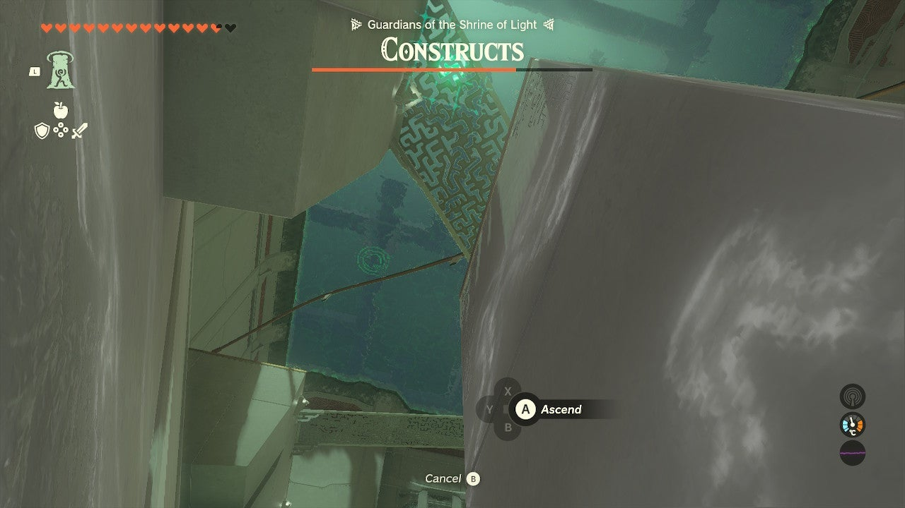

Next, go back to the lone tower structure near the entryway and use Ascend on the bridge, Carefully fight the Zonai Soldier there. Try to back up toward the door, but watch out for the moving platform! If you're lucky itll hit the Zonai Soldier, knocking it off the bridge and doing a ton of damage! The soldier is carrying a Spiky Bat with a damage of 13. Don't forget to use the Soldier Construct II Horn for fusion. Fusing it with a wooden stick will give you a weapon of 12 damage. 

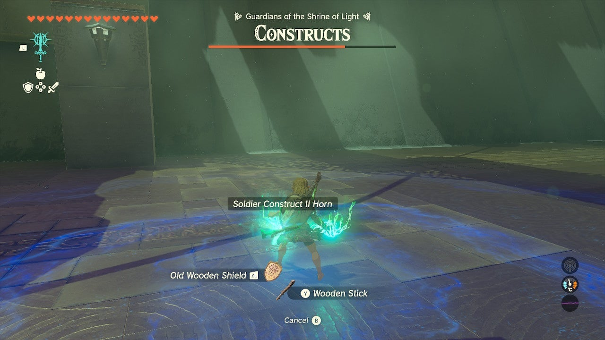

Once that one's down, you can deal with the Zonai Soldier that's been watching the entryway if you haven't already. Then you can collect the three Fire Fruit near it! 

The top floor is where you're going to see the most trouble. There are three more enemies up there, including one intimidating Zonai Soldeir Construct II that has its own flame thrower and another that's shooting shock arrows. If you have one of the hot air balloons available, you can put a candle on it then ride it up to the ceiling. Then, you can snipe the remaining enemies. The balloon can get in the way of your aim, though. You can also hop down and use a fancy slow-motion shot in the air to land critical hits on them. 

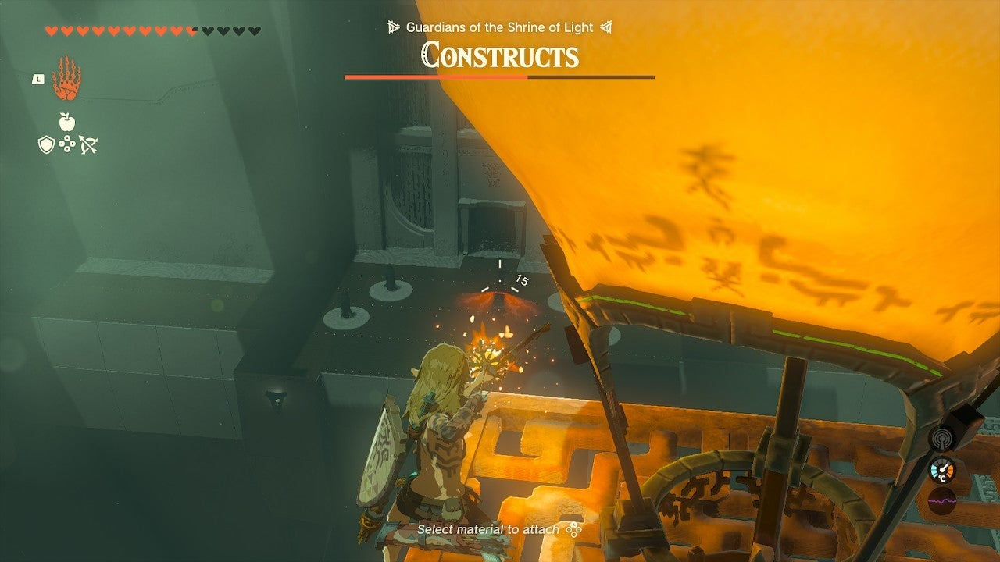

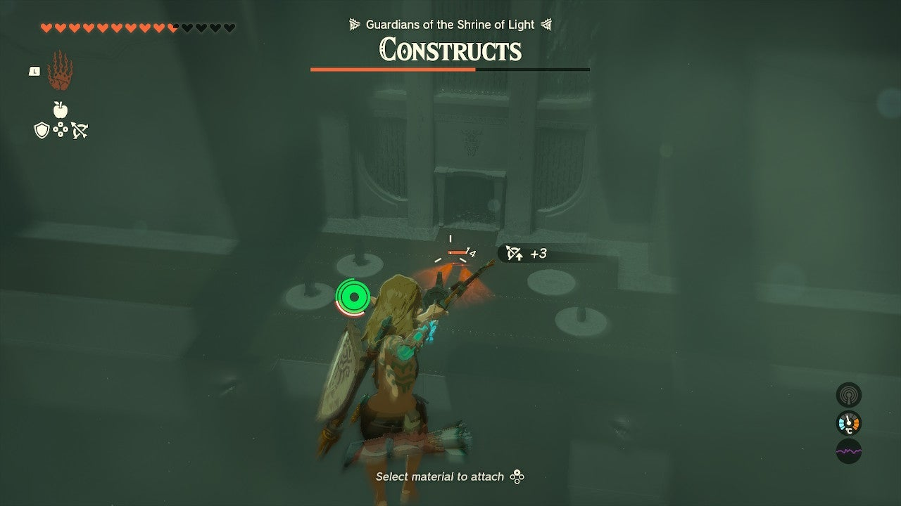

The top level also has some conveniently placed spikes on the ground. You can fuse those with your sticks too! Other appealing Zonai Devices are at the door with the two guards, like more rockets and a Flame Emitter. There are plenty of tools for you to play with in destroying the final Zonai Soldeirs! 

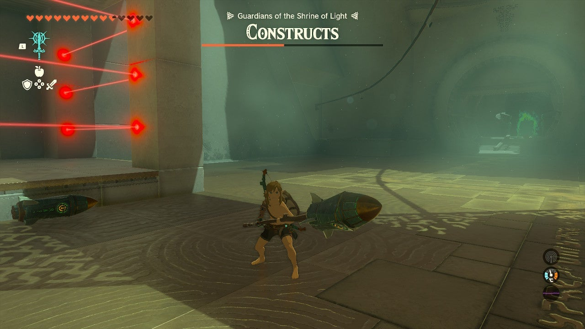

Once all Zonai Soldeirs are defeated the gate will open. Claim the shrine's treasure (Soldier III Spear) along with the Light of Blessing. 

Zakusu Shrine

Congrats on solving the shrine and earning a Light of Blessing! Click or tap here to return to the rest of the Shrine Guides. You can also check out which shrines are nearby with our shrine map filter on our complete map of Hyrule.

### Up Next: Walkthrough

Previous

About IGN's Zelda TotK Guide Writers

Next

Walkthrough

### Top Guide Sections

  * Walkthrough
  * Zelda: Tears of The Kingdom Switch 2 Edition Guide
  * Zelda Notes Voice Memories
  * List of Side Quests and Side Adventures

### Was this guide helpful?

Leave feedback

### In This Guide

The Legend of Zelda: Tears of the KingdomNintendo EPD

Initial Release: May 12, 2023

Learn more

Go to comments