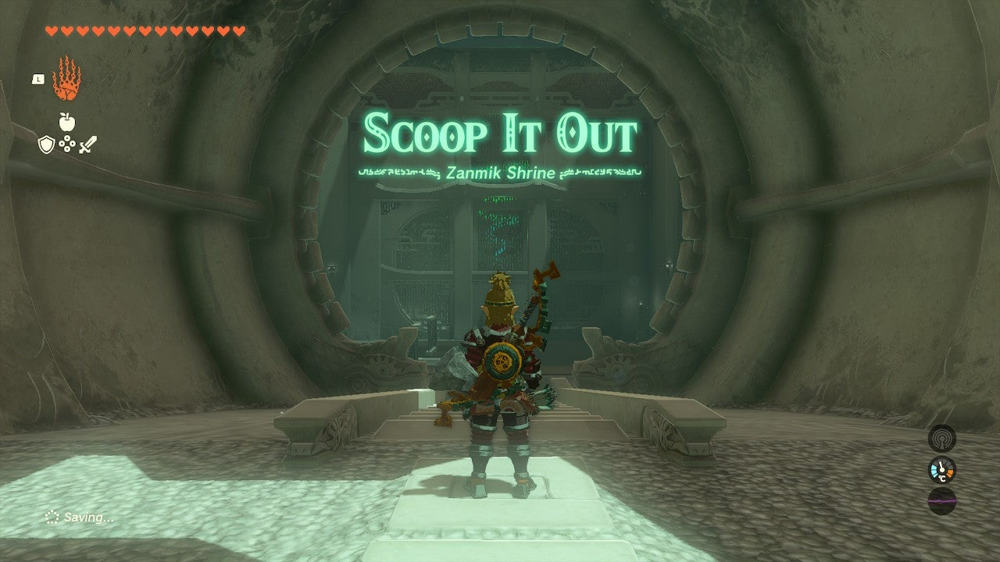
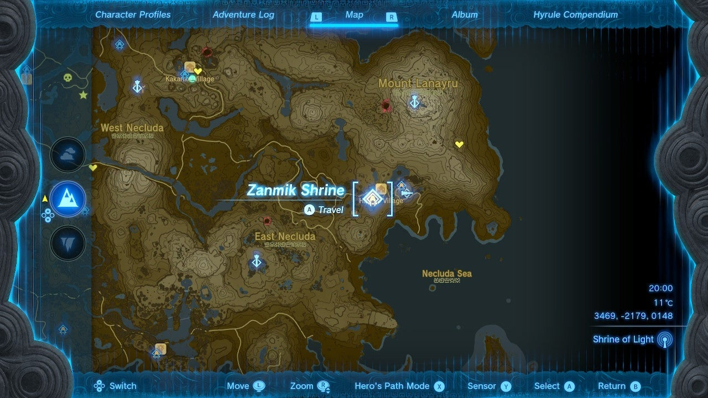
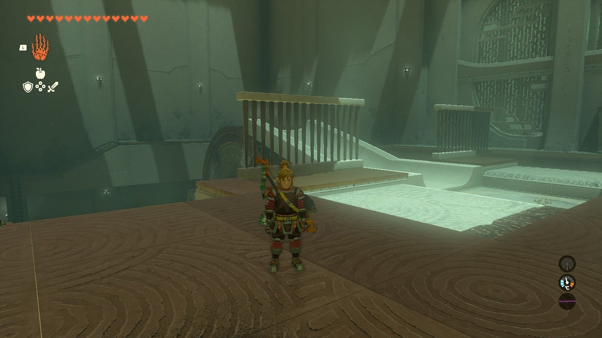
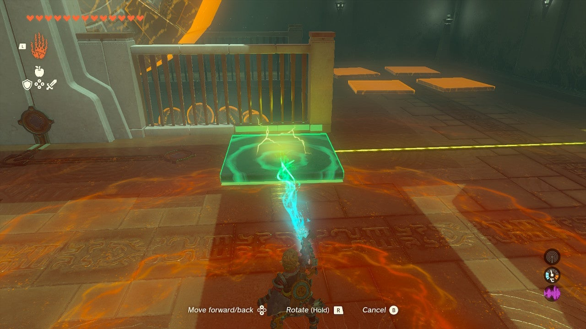
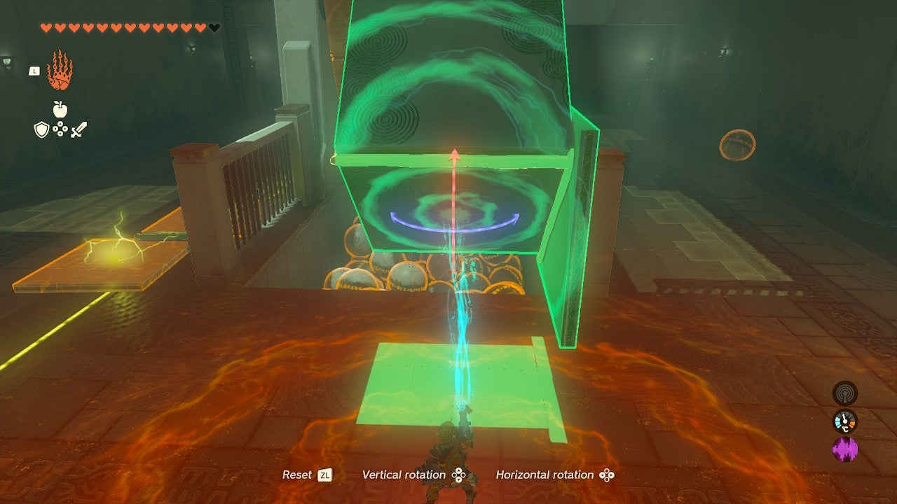
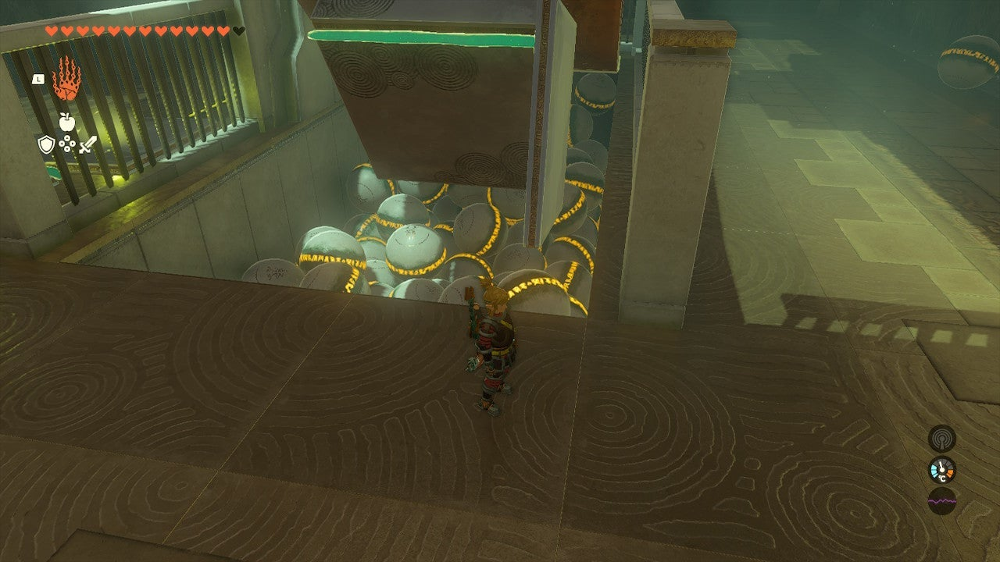
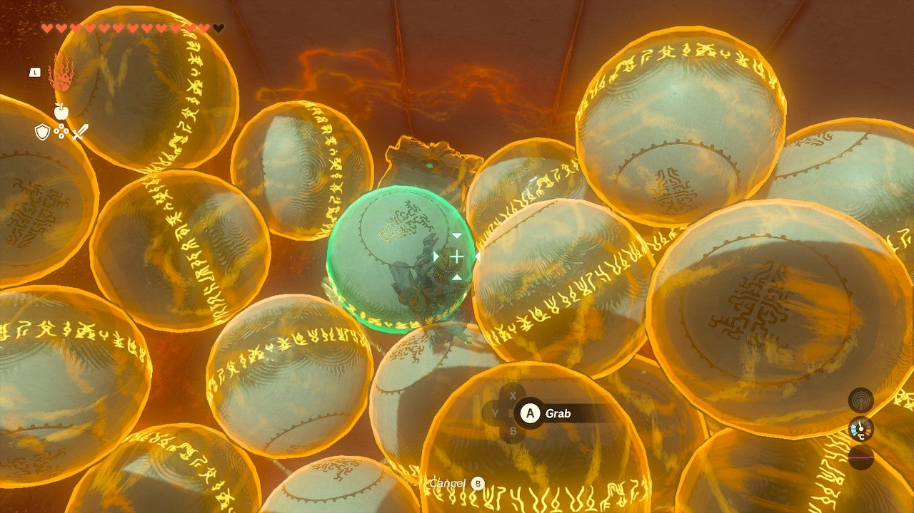
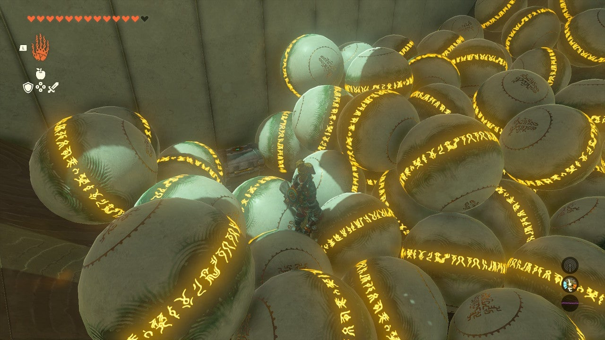
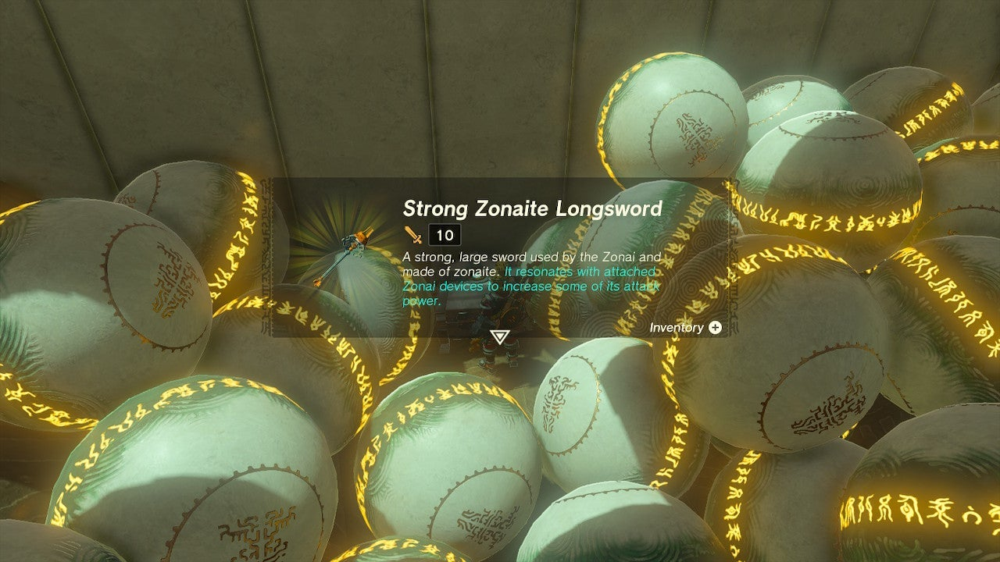

Zanmik Shrine (Scoop It Out) in The Legend of Zelda: Tears of the Kingdom is a shrine located in the **East Necluda region** and is one of 152 shrines in TOTK (see all shrine locations). This page contains a guide for how to locate and enter the shrine, a walkthrough for the shrine itself, and puzzle solutions as well as treasure chest locations for the TotK Zanmik shrine. 

## Zanmik Shrine Treasure and Rewards

  * Strong Zonite Longsword

## Zanmik Shrine Location/How to Reach

Zanmik Shrine is located on a hill south of **Hataeno Village** on the surface, in plain sight. It serves as the warp point for Hataeno Village. 

  * **Coordinates:** 3469, -2179, 0148

## Zanmik Shrine Walkthrough and Puzzle Solutions

In this room, there’s a wheel and ball pit. The balls, well, just one, need to come up to the target circle by the exit. You need to lift them using the wheel. 

To do this, you’ll first need to power the wheel. Go beneath it and drag two panels with Ultrahand to complete the missing parts of the yellow electric circuit track. 

Connecting these will start the wheel rotating clockwise. 

Now, add some fins to the wheel. You can either make a multi-sided scoop, or you can simply weld a ball to a fin that you add to the wheel with Ultrahand. 

Either way, a single ball will rotate up and over the wheel in a scoop or attached to it, and you need to Ascend up to receive it with Ultrahand and detach it or pick it up and put it in the target. 

Don’t leave yet! 

## Treasure Chest Location

The chest is buried beneath the balls in the pit kind of nearest to the electrical line. To clear balls, you can keep adding “fins” to the wheel to push them away, or just manually dig it out. Inside is a Strong Zonite Longsword. 

Zanmik Shrine

Congrats on solving the shrine and earning a Light of Blessing! Click or tap here to return to the rest of the Shrine Guides. You can also check out which shrines are nearby with our shrine map filter on our complete map of Hyrule.

### Up Next: Walkthrough

Previous

About IGN's Zelda TotK Guide Writers

Next

Walkthrough

### Top Guide Sections

  * Walkthrough
  * Zelda: Tears of The Kingdom Switch 2 Edition Guide
  * Zelda Notes Voice Memories
  * List of Side Quests and Side Adventures

### Was this guide helpful?

Leave feedback

Go to comments