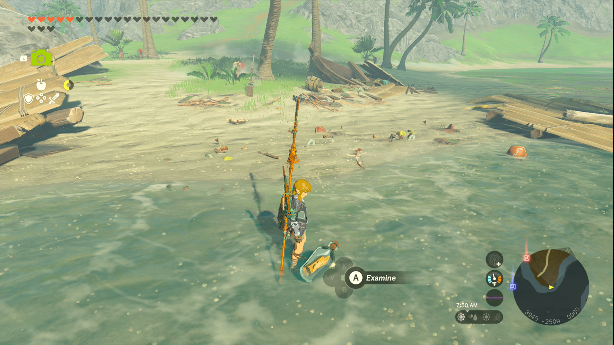
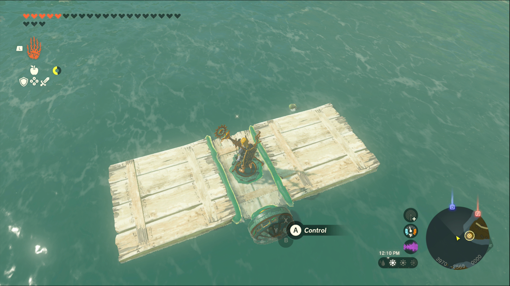
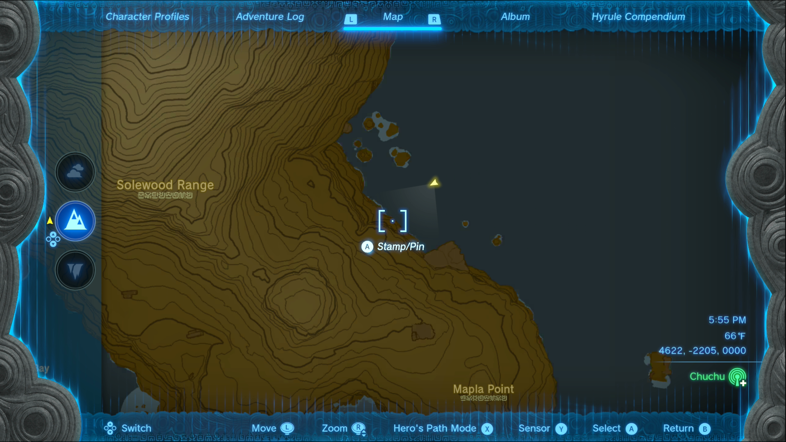
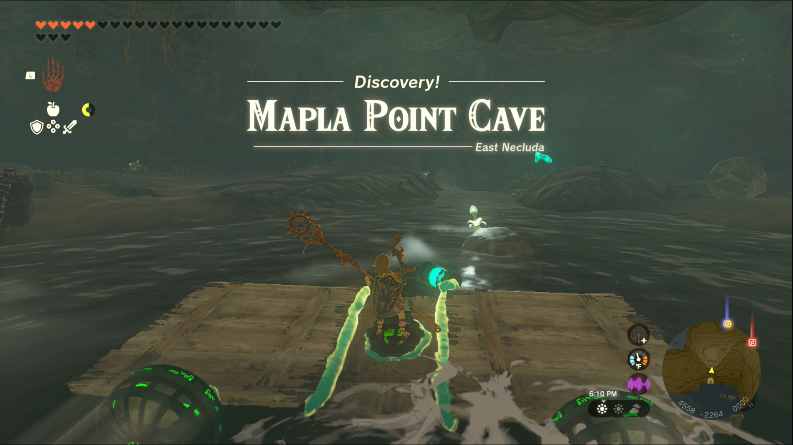
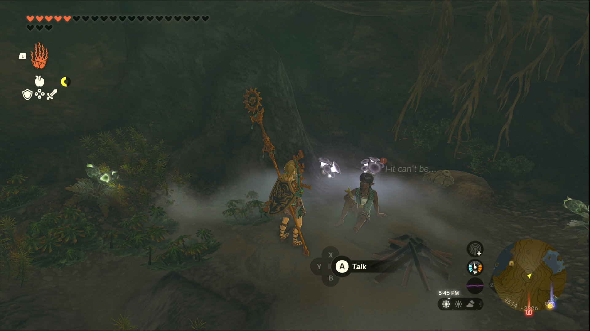

A Bottled Cry for Help is one of the Side Quests you’ll discover in the Mount Lanayru region. Side Quests are quests in The Legend of Zelda: Tears of the Kingdom that are relatively short or simple chores that can earn you small rewards or services. 

## A Bottled Cry for Help

To start the Side Quest “A Bottled Cry for Help” you need to head to the shore southeast of the Hateno Ancient Tech Lab, near Hateno Bay. Following the path toward the beach will take you exactly to the correct place. 

Among the wrecked boats on the coast you’ll see a message in a bottle. Pick it up to start the quest, where you need to free someone trapped in a cave. As the letter mentions, you’ll have to follow a trail of Brightbloom Seeds back to the cave entrance. 

You should build a raft out of the devices lying around the beach, since you’ll be following the seeds along the water. The currents are somewhat visible on the surface of the water, so they shouldn’t be too troublesome to follow, but if you’d like to know where you should head directly, the cave is located just east of Solewood Range. 

Once inside, you need to move the boulder blocking the far passage in the cave. 

Then head inside to speak to Chumin, the writer of the message in a bottle you found, to receive a 100 Rupee reward. 

This cave also contains a lot of Ore, so be sure to smash it all up to get gems and valuable stones. 

A Bottled Cry for Help

See the complete List of Side Quests and Side Adventures

### Up Next: Walkthrough

Previous

About IGN's Zelda TotK Guide Writers

Next

Walkthrough

### Top Guide Sections

  * Walkthrough
  * Zelda: Tears of The Kingdom Switch 2 Edition Guide
  * Zelda Notes Voice Memories
  * List of Side Quests and Side Adventures

### Was this guide helpful?

Leave feedback

### In This Guide

The Legend of Zelda: Tears of the KingdomNintendo EPD

Initial Release: May 12, 2023

Learn more

Go to comments