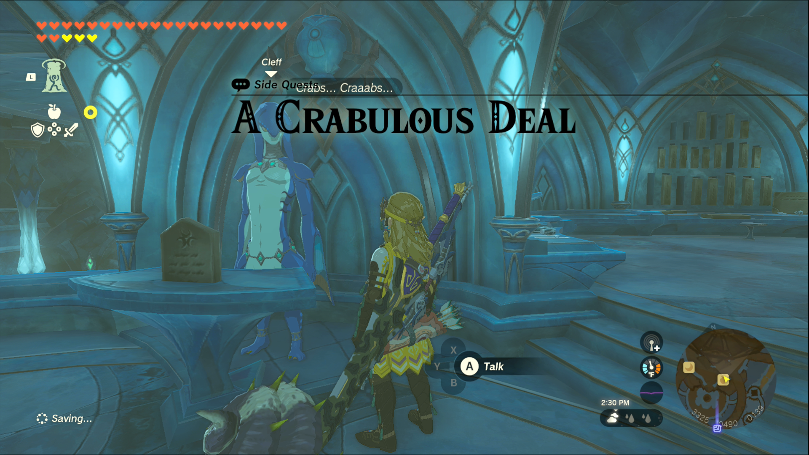
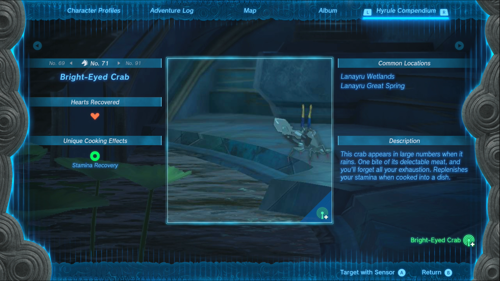

Crabulous Deal is one of the Side Quests you’ll discover in the Lanayru Great Spring region. Side Quests are quests in The Legend of Zelda: Tears of the Kingdom that are relatively short or simple chores that can earn you small rewards or services. 

## Crabulous Deal

To start the Side Quest “Crabulous Deal” you first need to complete the Main Quest “Sidon of the Zora.” 

Then go to The Coral Reef, the general store in Zora’s Domain, and speak to Cleff, the owner. He’ll ask you for 10 Bright-Eyed Crabs, which can be found all around Zora’s Domain and in the Lanayru Wetlands. 

If you have the Purah Pad’s Sensor+ upgrade, take a picture of the first Bright-Eyed Crab you see, this will make it easier to track more of them. Once you have 10, head back to Cleff and turn them in to receive a Sapphire. From now on, you can turn in any Bright-Eyed Crabs to Cleff for rewards. 

A Crabulous Deal

See the complete List of Side Quests and Side Adventures

### Up Next: Walkthrough

Previous

About IGN's Zelda TotK Guide Writers

Next

Walkthrough

### Top Guide Sections

  * Walkthrough
  * Zelda: Tears of The Kingdom Switch 2 Edition Guide
  * Zelda Notes Voice Memories
  * List of Side Quests and Side Adventures

### Was this guide helpful?

Leave feedback

Go to comments