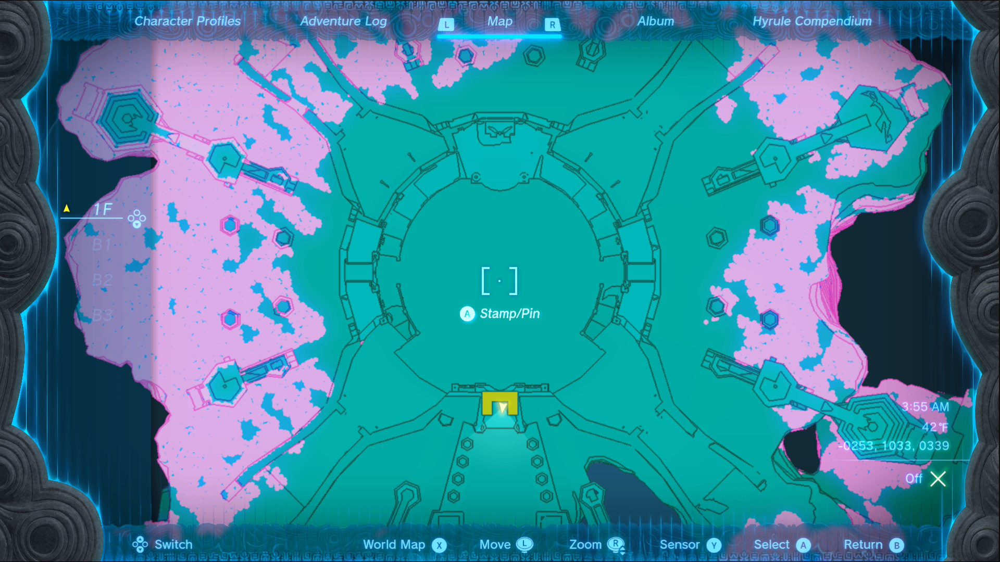
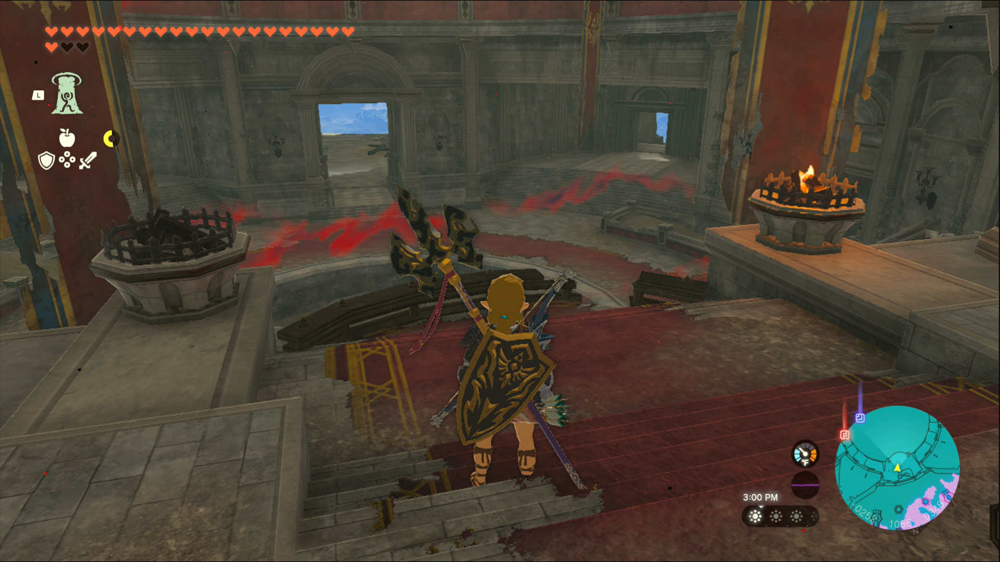
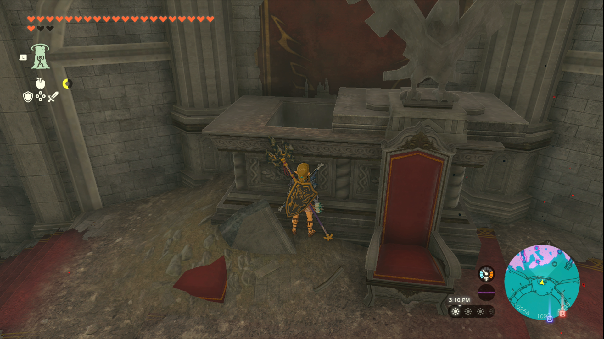

A New Champion’s Tunic is one of the Side Quests you’ll discover in the Mount Lanayru region. Side Quests are quests in The Legend of Zelda: Tears of the Kingdom that are relatively short or simple chores that can earn you small rewards or services. 

## A New Champion’s Tunic

To start the Side Quest “A New Champion’s Tunic” you need to head to Zelda’s House in Hateno Village. Check around the back of the house for a well, and jump inside. Once you’re in the well, read Zelda’s journal on the desk; she’ll mention making Link a new and improved Champion’s Tunic. 

She also wrote that she hid it in the throne room at Hyrule Castle, with a clue about the torches being a key to finding the tunic. 

With that news, head to Hyrule Castle, up to the throne room near the top of the castle. 

The throne room is also called the Sanctum, and it’s a large round room with a pair of thrones on the north side. Head up to the thrones and light the two torches in front of them to make the statue behind the thrones move to the side. 

Jump up to collect your new and improved Champion’s Tunic! 

A New Champion's Tunic

See the complete List of Side Quests and Side Adventures

### Up Next: Walkthrough

Previous

About IGN's Zelda TotK Guide Writers

Next

Walkthrough

### Top Guide Sections

  * Walkthrough
  * Zelda: Tears of The Kingdom Switch 2 Edition Guide
  * Zelda Notes Voice Memories
  * List of Side Quests and Side Adventures

### Was this guide helpful?

Leave feedback

### In This Guide

The Legend of Zelda: Tears of the KingdomNintendo EPD

Initial Release: May 12, 2023

Learn more

Go to comments