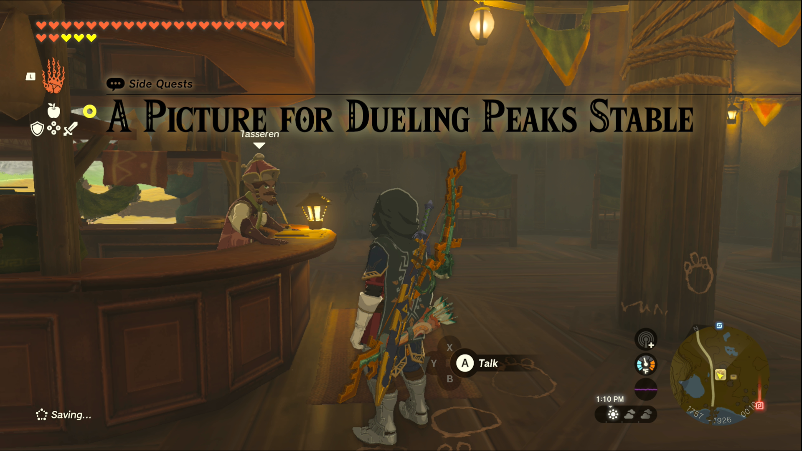
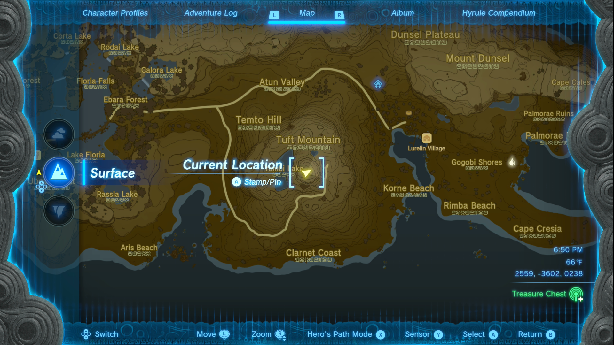
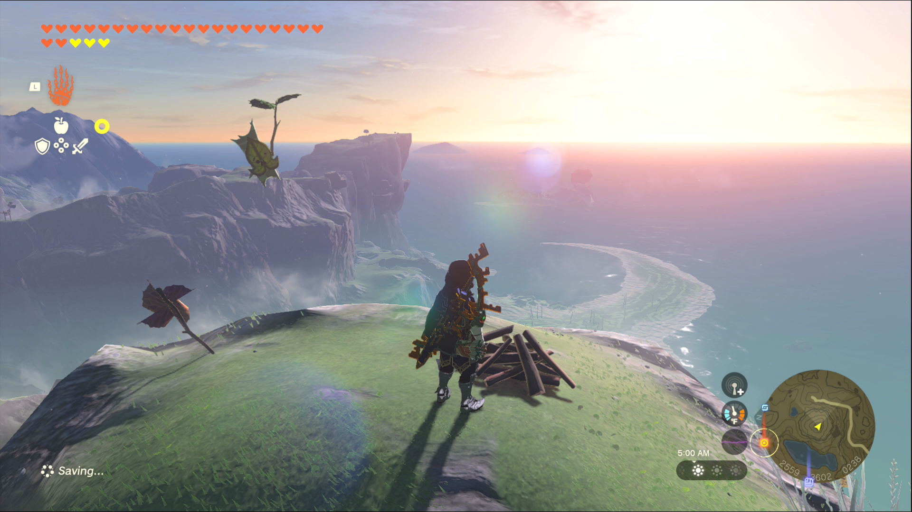
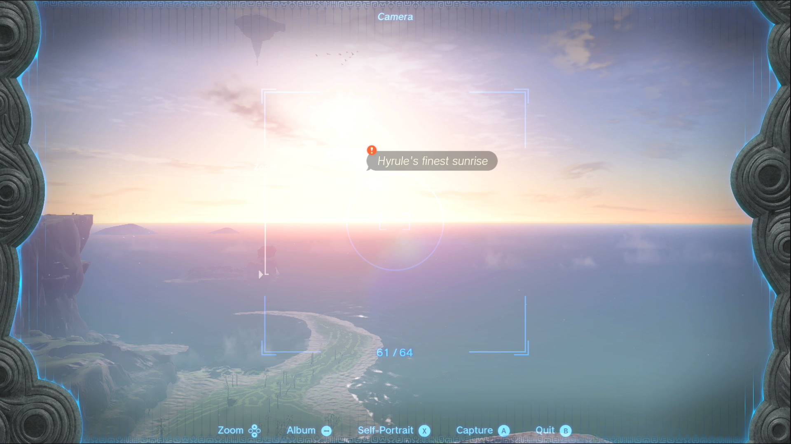

A Picture for Dueling Peaks Stable is one of the Side Quests you’ll discover in the West Necluda Region. Side Quests are quests in The Legend of Zelda: Tears of the Kingdom that are relatively short or simple chores that can earn you small rewards or services. 

## A Picture for Dueling Peaks Stable

To start the Side Quest “A Picture for Dueling Peaks Stable” you need to visit the Dueling Peaks Stable, located just east of Dueling Peaks. 

Head inside and check the large empty frame on the right, the owner will request that you take a picture of a beautiful sunrise. Luckily he gives you some pretty specific conditions for getting the perfect picture. 

You’ll need to head south, near Lurelin Village, and climb Tuft Mountain. Once you’re at the summit, you’ll need to take a picture as the sun rises. 

If the weather permits, you can set up a campfire and rest until morning. This ensures you’ll be awake at 5 am, the perfect time to take a picture, so pull out your camera and snap away. Make sure the sunrise has the quest tag on it, like in our screenshot below. 

Once you get the picture, return to the Dueling Peaks Stable and check the empty picture frame again to show your picture to Tasseren. As a reward for your efforts, he’ll give you a Pony Point and a Hasty Apple Pie, which increases your movement speed temporarily. 

A Picture for Dueling Peaks Stable

See the complete List of Side Quests and Side Adventures

### Up Next: Walkthrough

Previous

About IGN's Zelda TotK Guide Writers

Next

Walkthrough

### Top Guide Sections

  * Walkthrough
  * Zelda: Tears of The Kingdom Switch 2 Edition Guide
  * Zelda Notes Voice Memories
  * List of Side Quests and Side Adventures

### Was this guide helpful?

Leave feedback

### In This Guide

The Legend of Zelda: Tears of the KingdomNintendo EPD

Initial Release: May 12, 2023

Learn more

Go to comments