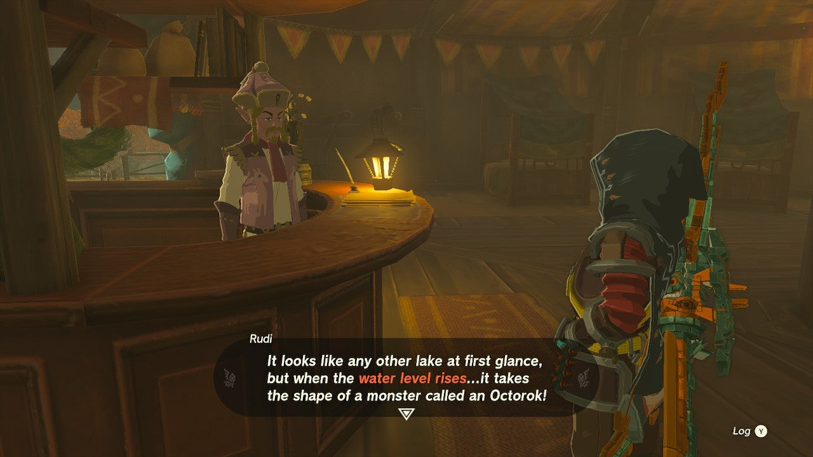
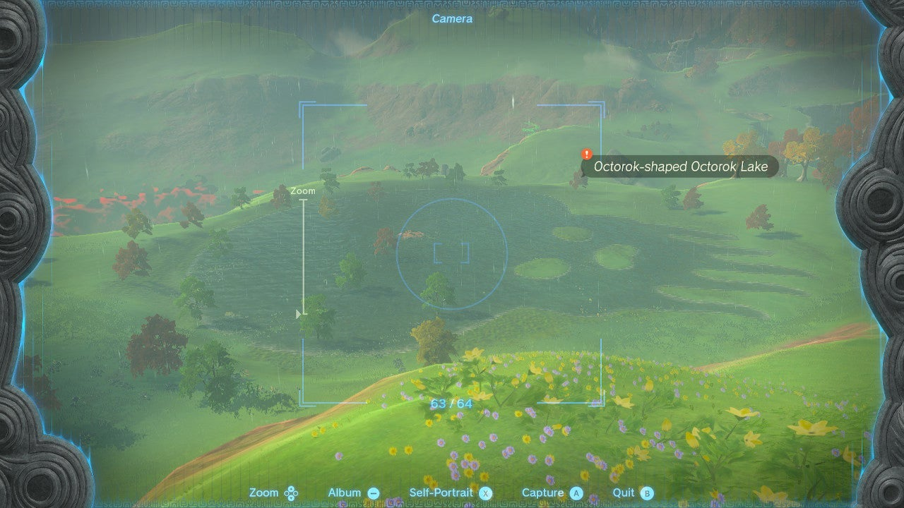

Time to put that camera to use again! In the Legend of Zelda: Tears of the Kingdom side quest called A Picture for East Akkala Stable, you need to venture out and snap a picture of Octorok Lake at the right time of day. 

Here's how to get the right photo in **A Picture for East Akkala Stable**. 

## A Picture for East Akkala Stable Walkthrough

Visit East Akkala Stable at the crossroads in the northeastern corner of Akkala. Go inside and interact with the empty picture frame to start the quest. The stable owner, Rudi, will explain his request for **a picture of Octorok Lake** \- but beware that the lake needs to be in the shape of an Octorok. 

Octorok Lake only takes on the shape of its namesake monster **when the water has risen** , so you need to wait until it rains before you can take a picture. Starting from East Akkala Stable, travel south until you see the lake in front of you. Check the **weather report** in the lower right corner of the screen, and wait until it starts raining. You may want to create a campfire (use wood and flint) to skip the time. 

As soon as Octorok Lake takes the correct shape, you will see a red quest marker when you aim the Camera. Return to East Akkala Stable with the picture, interact with the empty frame again, and complete the quest. 

Rudi will give you a **Pony Point** and a **Meat and Rice Bowl** as a reward. 

A Picture for East Akkala Stable

See the complete List of Side Quests and Side Adventures

### Up Next: Walkthrough

Previous

About IGN's Zelda TotK Guide Writers

Next

Walkthrough

### Top Guide Sections

  * Walkthrough
  * Zelda: Tears of The Kingdom Switch 2 Edition Guide
  * Zelda Notes Voice Memories
  * List of Side Quests and Side Adventures

### Was this guide helpful?

Leave feedback

### In This Guide

The Legend of Zelda: Tears of the KingdomNintendo EPD

Initial Release: May 12, 2023

Learn more

Go to comments