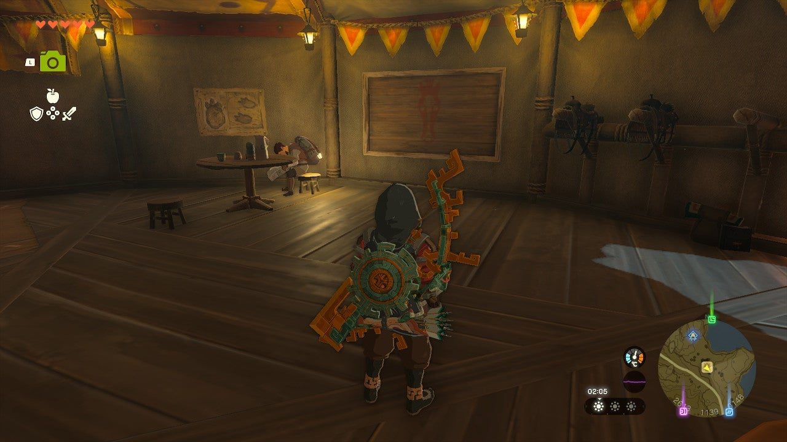
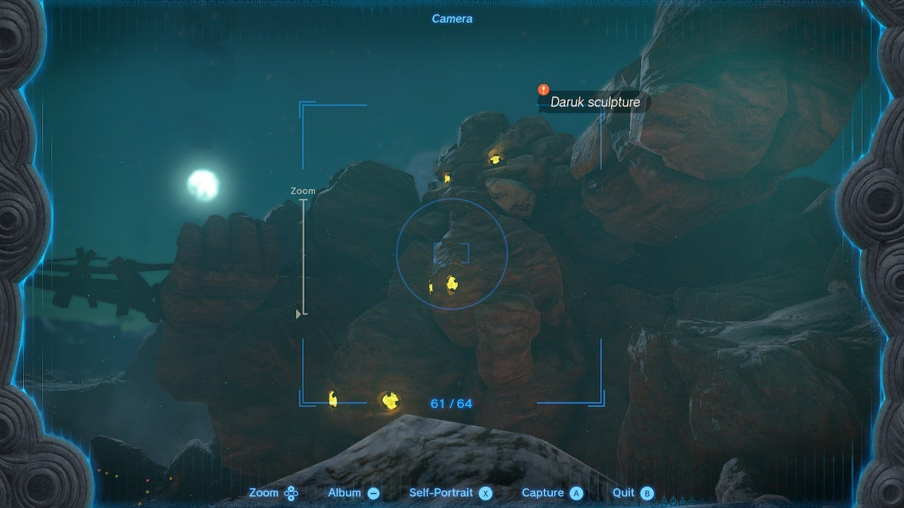

While traveling through the Eldin region, be sure to pick up A Picture for Foothill Stable, which starts at the stable of the same name. This creative side quest is quite simple but fun, and will reward you with a free Pony Point. 

Here's how to complete **A Picture for Foothill Stable** in The Legend of Zelda: Tears of the Kingdom. 

## A Picture for Foothill Stable Walkthrough

To pick up this side quest, visit **Foothill Stable** in the southern part of Eldin. It's located on the road between Lake Ferona and Cephla Lake. Enter the stable and interact with the **empty picture frame** , which will spark a dialogue scene between Link and the stable's owner, Ozunda. 

To create a painting for the empty frame, Ozunda needs to see a **picture of the Daruk sculpture** that overlooks Goron City. The next step, therefore, is to travel to Goron City and snap a picture of the massive stone Goron statue using your Camera. 

If you fast-travel to the Marakuguc Shrine in Goron City, you can see the Daruk sculpture to your right (no need to walk anywhere). Return to Foothill Stable and interact with the empty frame again to complete this side quest. 

Ozunda will reward you with one **Pony Point** and a **Fireproof Elixir**. Note that Ozunda copies the exact image, so feel free to change the lighting and perspective - you can replace the picture at any time, as long as the new one also captures the Daruk Sculpture. 

A Picture for Foothill Stable

See the complete List of Side Quests and Side Adventures

### Up Next: Walkthrough

Previous

About IGN's Zelda TotK Guide Writers

Next

Walkthrough

### Top Guide Sections

  * Walkthrough
  * Zelda: Tears of The Kingdom Switch 2 Edition Guide
  * Zelda Notes Voice Memories
  * List of Side Quests and Side Adventures

### Was this guide helpful?

Leave feedback

### In This Guide

The Legend of Zelda: Tears of the KingdomNintendo EPD

Initial Release: May 12, 2023

Learn more

Go to comments