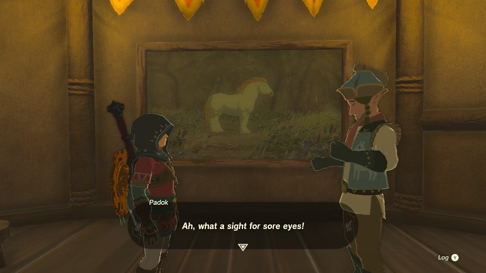

**A Picture for Highland Stable** is one of many Side Quests in Zelda: Tears of the Kingdom that requires Link to fetch an image for the stable in question. This side quest begins at Highland Stable in Faron Grasslands. 

  * **Quest Giver** : Padok
  * **Prerequisite** : None
  * **Reward** : Tap to Reveal

Approach the empty frame in the stable when you're ready to begin the quest. , the stable owner, approaches seeing your interest. Like the other stables, he's prepared the frame but needs assistance getting a photo for painting reference. Here's what he needs: 

_"I was thinking, I heard this rumor the other day about this rare horse...this**giant white stallion.** Sounds impressive, doesn't it? I mean, a white horse is pretty rare, but a giant one? And it lives nearby, they say!"_

If you've already completed the shrine quest called Ride the Giant Horse, and found the white stallion, you can call it out from the stable and take a photo of it to present to Padok. Otherwise, continue reading to see where to find it! 

### Finding the Giant White Stallion

The Giant White Stallion is found in a small canyon on the eastern side of the Horse God Bridge. You'll find two travelers in search of the stallion just before you reach the horse 

You only need a photo of it to satisfy this side quest, but it can't hurt to add it to your stable now! If you do plan on taming the massive horse, we recommend having **plenty** of stamina elixirs ready to go. It took us about**five full stamina circles** to tame the gigantic horse. 

Return to the stable and interact with the empty frame again now that you have your photo. 

Padok will reward you with one Pony Point and an Energizing Honey Crepe, the stable specialty! 

A Picture for Highland Stable

See the complete List of Side Quests and Side Adventures

### Up Next: Walkthrough

Previous

About IGN's Zelda TotK Guide Writers

Next

Walkthrough

### Top Guide Sections

  * Walkthrough
  * Zelda: Tears of The Kingdom Switch 2 Edition Guide
  * Zelda Notes Voice Memories
  * List of Side Quests and Side Adventures

### Was this guide helpful?

Leave feedback

### In This Guide

The Legend of Zelda: Tears of the KingdomNintendo EPD

Initial Release: May 12, 2023

Learn more

Go to comments