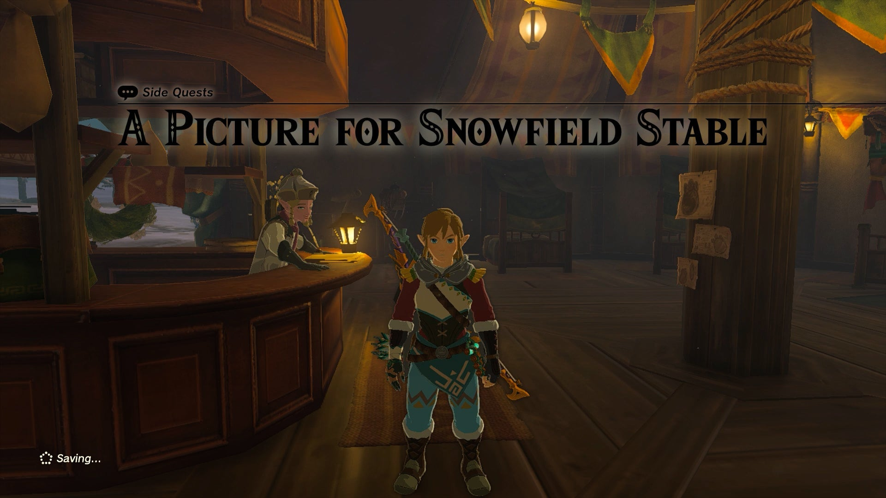
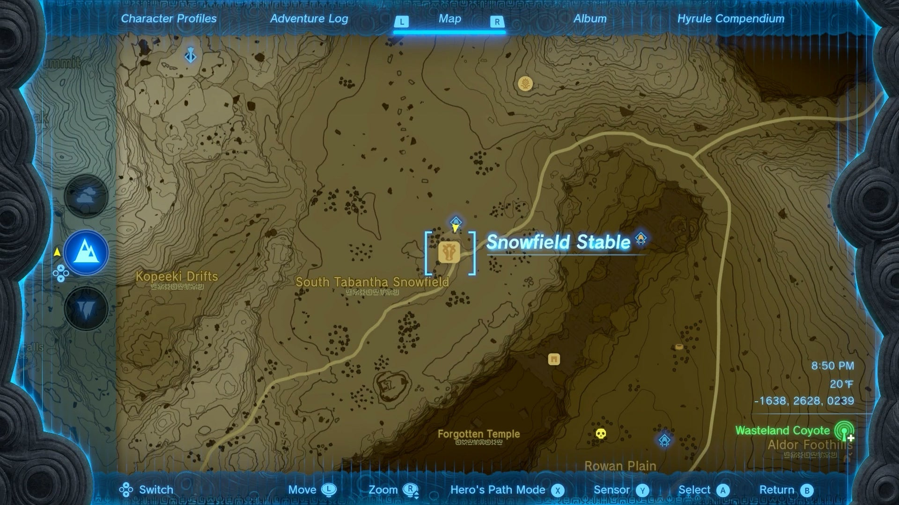
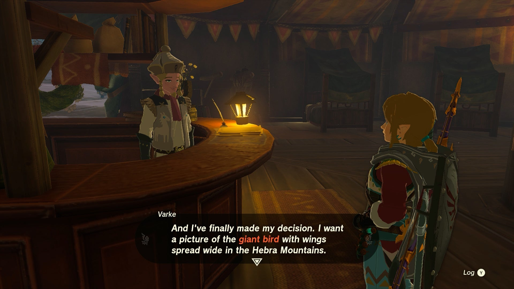
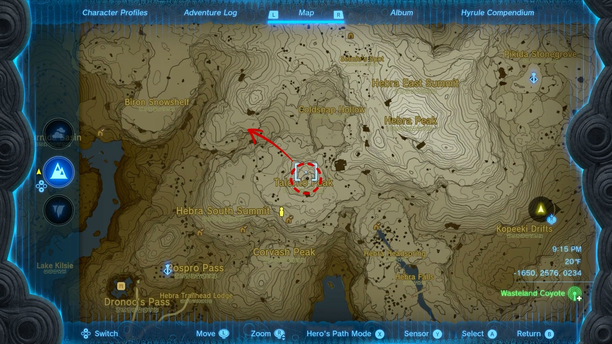
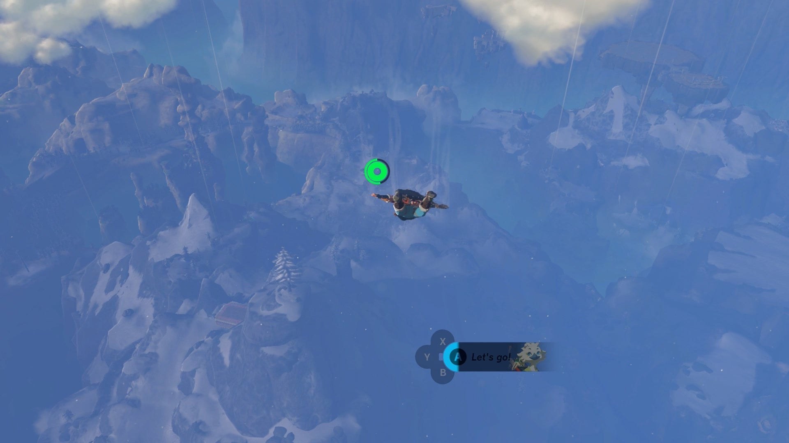
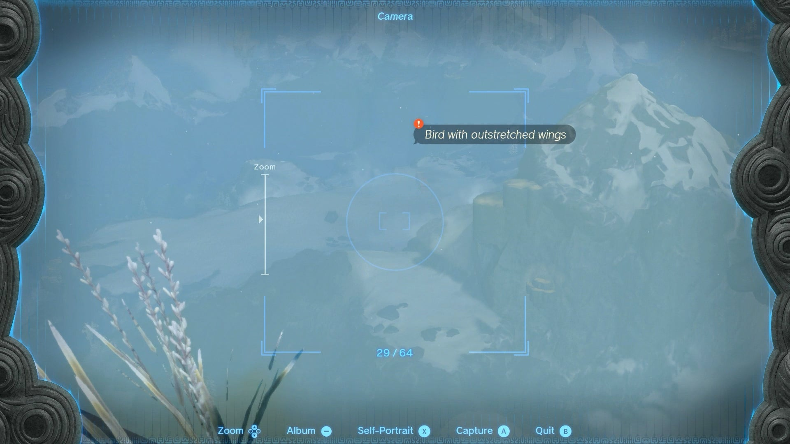
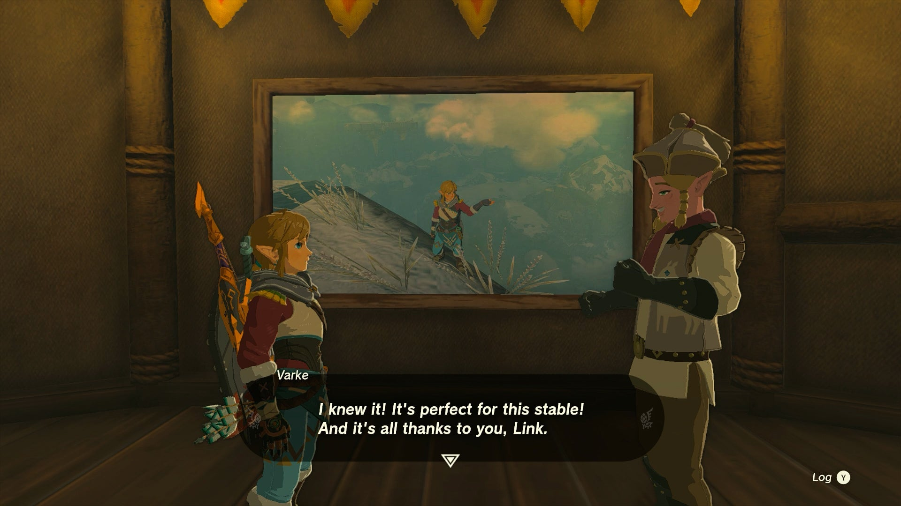

**A Picture for Snowfield Stable** is one of many Side Quests in Zelda: Tears of the Kingdom that requires Link to fetch an image for the stable in question. This side quest begins at Snowfield Stable in the Hebra Mountains. 

  * **Quest Giver** : Varke
  * **Prerequisite** : Complete Camera Work in the Depths to get the Camera, complete Tulin of Rito Village questline to clear the storm in the Hebra Region
  * **Reward** : 1 Pony Point, 1 Chilled Meat Stew

Once you've gotten the Camera function from Robbie, and cleared the Regional Phenomena haunting the Hebra Mountains, head to the east of the mountains and Rito Village to find Snowfield Stable along the frigid roads. 

The area will be very cold, even after clearing the Regional Phenomena, so be sure to bring warm clothing or chill-resistant food for the trip! 

Inside, you'll find a blank frame on the wall, and interacting with it will prompt Varke the Stablemaster to remark that he'd really like a picture of a mountain landscape that looks like a bird. It's located by the Talonto Peak, which is a bit of a trek from Snowfield Stable. 

Once you've accepted the quest, the easiest way to reach it is either ejecting yourself from the Rospro Pass Skyview Tower, or simply teleporting up to the Wind Temple and jumping over the side. 

Talonto Peak is easy enough to spot - it's the high mountain peak with the single large pine on it, and it's also where you first teamed up with Tulin during the Regional Phenomena. There may be a few Ice Chuchu or Ice Talus to fight off, but the area around it should be fairly safe. 

Once you arrive at the pine, look off to the Northwest, towards the Biron Snowshelf. Just in front of it, you should be able to spot a plateau that looks a bit like a bird's wingspan, with the tailfeathers to the south. Pulling out your Camera ability will mark it with a red !, letting you know where to snap the photo. 

Upon returning to Snowfield Stable, interact with the frame again, and let Varke know you have a photo worthy to paint onto the wall. He'll transfer the photo you took onto the frame, and reward you with a Pony Point towards your Stable Rewards, plus a free meal to keep the cold at bay! 

A Picture for Snowfield Stable

See the complete List of Side Quests and Side Adventures

### Up Next: Walkthrough

Previous

About IGN's Zelda TotK Guide Writers

Next

Walkthrough

### Top Guide Sections

  * Walkthrough
  * Zelda: Tears of The Kingdom Switch 2 Edition Guide
  * Zelda Notes Voice Memories
  * List of Side Quests and Side Adventures

### Was this guide helpful?

Leave feedback

### In This Guide

The Legend of Zelda: Tears of the KingdomNintendo EPD

Initial Release: May 12, 2023

Learn more

Go to comments