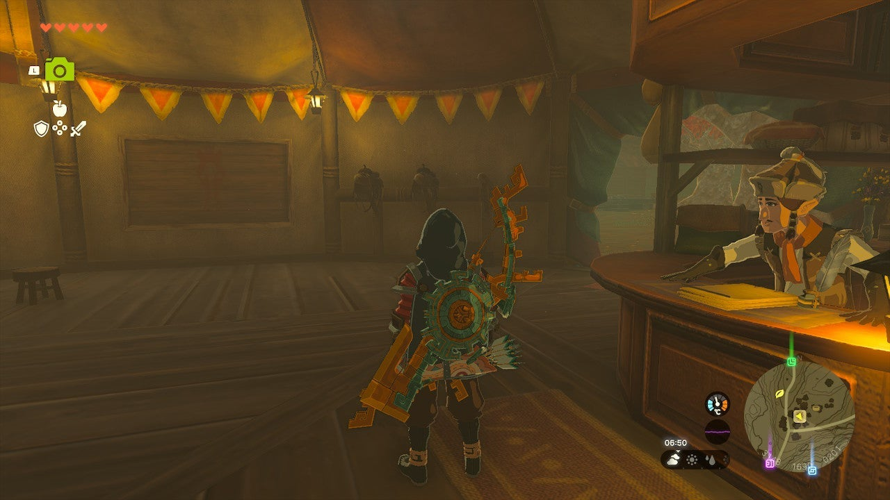
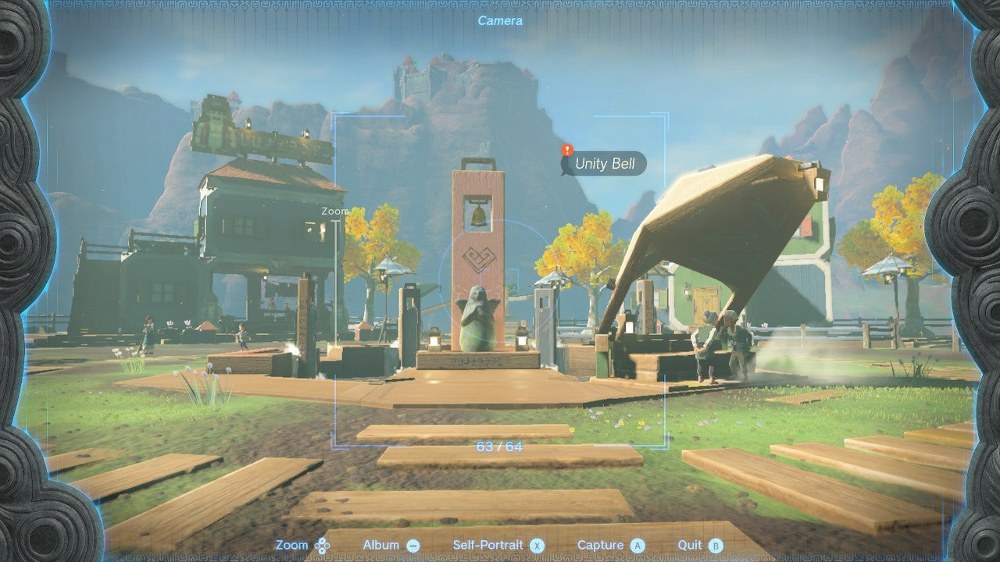

Let's decorate the South Akkala Stable with a beautiful painting of Tarrey Town, shall we? A Picture for South Akkala Stable is a Tears of the Kingdom side quest that tasks you with taking a specific picture. If you manage to do so, you'll receive a Pony Point and a free dish. 

Here's how to snap the correct photograph in **A Picture for South Akkala Stable**. 

## A Picture for South Akkala Stable Walkthrough

To start this side quest, enter the South Akkala Stable southwest of Akkala's Ulri Mountains Skyview Tower. Interact with the empty wooden picture frame inside, then listen to stable owner Dmitri's request for a **picture of the Unity Bell** in Tarrey Town. 

You'll find **Tarrey Town** a bit further east of the South Akkala Stable, in the middle of Lake Akkala. The Unity Bell refers to the decorative bell set on a stone pillar, right in the middle of the town. Use your Camera to snap a picture and return to the South Akkala Stable, where you need to interact with the empty frame again to complete the quest. 

As a reward, Dmitri will give you a **Pony Point** and **Prime Meat Stew**. Remember, you can replace the picture anytime you want, as long as it contains the Unity Bell. 

A Picture for South Akkala Stable

See the complete List of Side Quests and Side Adventures

### Up Next: Walkthrough

Previous

About IGN's Zelda TotK Guide Writers

Next

Walkthrough

### Top Guide Sections

  * Walkthrough
  * Zelda: Tears of The Kingdom Switch 2 Edition Guide
  * Zelda Notes Voice Memories
  * List of Side Quests and Side Adventures

### Was this guide helpful?

Leave feedback

Go to comments