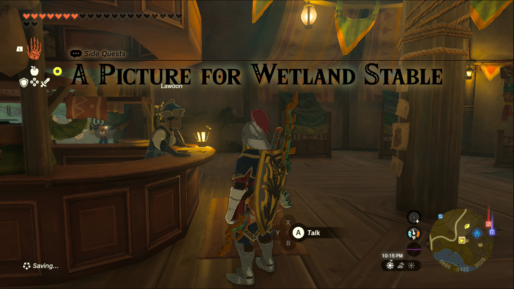
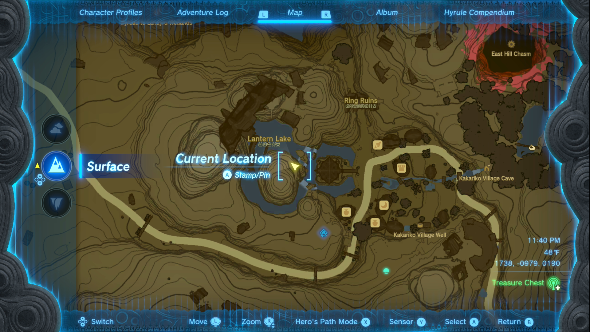
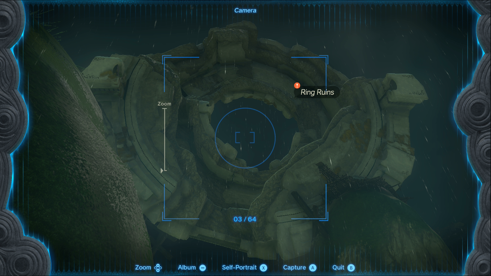

A Picture for Wetland Stable is one of the Side Quests you’ll discover in the West Necluda Region. Side Quests are quests in The Legend of Zelda: Tears of the Kingdom that are relatively short or simple chores that can earn you small rewards or services. 

## A Picture for Wetland Stable

To start the Side Quest “A Picture for Wetland Stable” you need to visit the Wetland Stable, located west of Lanayru Wetlands, between it and Hyrule Field. 

Head inside and check the large empty frame on the right, the owner will request that you take a picture of the ring ruins in Kakariko Village. He specifically wants a picture that shows the ring-like structure of the ruins. 

You’ll need to head southeast, to Kakariko Village, and climb the hills just northwest of the shrine. Once you’ve made it, take all the pictures you want, because you’ll be able to pick which one you share with Lawdon. The most important thing is to be sure the ruins have the quest tag on them, like in our screenshot below. 

Once you get the picture, return to the Wetland Stable and check the empty picture frame again to show your picture to Lawdon. As a reward for your efforts, he’ll give you a Pony Point and an Electro Elixir, which grants some resistance to electricity. 

A Picture for Wetland Stable

See the complete List of Side Quests and Side Adventures

### Up Next: Walkthrough

Previous

About IGN's Zelda TotK Guide Writers

Next

Walkthrough

### Top Guide Sections

  * Walkthrough
  * Zelda: Tears of The Kingdom Switch 2 Edition Guide
  * Zelda Notes Voice Memories
  * List of Side Quests and Side Adventures

### Was this guide helpful?

Leave feedback

Go to comments